# IoMT Ağlarında Hibrit Makine Öğrenmesi Tabanlı Saldırı Tespit Sistemi

**Siber Güvenlik Analitiği Projesi**
**Öğrenciler:**
- AMRO MOUSA ISMAIL BASEET — Y255012028
- MOTAZ ARMASH — Y255012163
> **Ders:** Siber Güvenlik Analitiği
> **Tarih:** Mayıs 2026
> **Veri Seti:** CICIoMT2024 (Canadian Institute for Cybersecurity)

---

## Özet

Bu çalışmada, Internet of Medical Things (IoMT) ağlarında siber saldırıların tespiti için hibrit bir makine öğrenmesi yaklaşımı geliştirilmiştir. CICIoMT2024 veri seti üzerinde supervised (denetimli) öğrenme için XGBoost ve unsupervised (denetimsiz) öğrenme için Otoenkoder modelleri ayrı ayrı eğitilmiş ve değerlendirilmiştir. Veri seti 4.89 milyon ağ akışı, 18 farklı saldırı türü ve 45 özellik içermektedir. XGBoost modeli 19-sınıflı sınıflandırma görevinde %99.27 doğruluk, 0.9076 macro F1 ve 0.9906 MCC skoru elde etmiştir. Otoenkoder modeli yalnızca benign trafik üzerinde eğitilmiş olmasına rağmen, görmediği saldırı türleri için 0.9892 AUC skoru ile yüksek anomali tespit performansı göstermiştir. Kapsamlı keşifsel veri analizi (EDA) bulguları, sınıf dengesizliği yönetimi (SMOTETomek) ve hiperparametre seçimini doğrudan yönlendirmiştir. Ek olarak, ağaç tabanlı modellerde entropy ve Gini criterion'ları için kontrollü A/B karşılaştırma deneyi (E5G) yapılmıştır; ölçülen fark yalnızca ≈0.5 puan macro F1 (istatistiksel gürültü bandı içinde) olup, negatif bulgu olarak Bölüm 5.5'te metodolojik disiplin örneği halinde raporlanmıştır. Bu çalışma, IoMT ağlarında hibrit IDS sistemlerinin temel iki katmanını (denetimli + denetimsiz) ayrı ayrı analiz etmekte ve gelecekteki füzyon çalışmalarına temel oluşturmaktadır.

**Anahtar Kelimeler:** IoMT, Saldırı Tespit Sistemi, XGBoost, Otoenkoder, CICIoMT2024, Anomali Tespiti, Makine Öğrenmesi

---

## 1. Giriş

### 1.1 Problem Tanımı

Internet of Medical Things (IoMT), tıbbi cihazların internet üzerinden birbirine ve hastane bilgi sistemlerine bağlandığı genişleyen bir ekosistemdir. Insulin pompaları, kalp pilleri, hasta monitörleri, MRI cihazları ve uzaktan teşhis sistemleri gibi cihazlar günümüzde ağ tabanlı iletişim protokollerini (Wi-Fi, MQTT, BLE) kullanmaktadır. Bu cihaz çeşitliliği sağlık hizmetlerinin verimliliğini artırırken, aynı zamanda **kritik bir siber tehdit yüzeyi** oluşturmaktadır.

IoMT cihazlarına yönelik saldırılar yalnızca veri gizliliği ihlaliyle sınırlı değildir. Bir DDoS saldırısı hasta monitörlerinin gerçek zamanlı verilerini gecikmeli iletmesine, bir MQTT enjeksiyon saldırısı insulin pompasına yanlış doz komutu gönderilmesine, bir ARP spoofing saldırısı ise hasta verilerinin yetkisiz cihazlara yönlendirilmesine yol açabilir. Bu saldırılar **doğrudan hasta güvenliğini tehdit etmektedir**.

Geleneksel imza tabanlı saldırı tespit sistemleri (IDS), bilinen saldırı kalıplarını veritabanında karşılaştırarak çalışır. Ancak IoMT ortamında karşılaşılan saldırı türlerinin büyük bir kısmı:

- **Sıfır-gün (zero-day) saldırılar**: Henüz imzası bulunmayan yeni saldırı türleri
- **Polimorfik saldırılar**: Aynı saldırının farklı varyasyonları
- **Protokol-spesifik saldırılar**: MQTT, BLE gibi IoT protokollerine özgü saldırılar

şeklinde olduğundan, imza tabanlı IDS'ler bu saldırıları tespit etmekte yetersiz kalmaktadır.

### 1.2 Motivasyon ve Amaç

Makine öğrenmesi tabanlı IDS sistemleri, imza tabanlı sistemlerin sınırlamalarını aşmak için iki temel yaklaşım sunar:

1. **Denetimli öğrenme (Supervised Learning):** Etiketli saldırı verileri üzerinde eğitilen modeller (örn. Random Forest, XGBoost). Bilinen saldırı türlerini yüksek doğrulukla sınıflandırabilir, ancak eğitimde görmediği yeni saldırı türlerinde başarısız olabilir.

2. **Denetimsiz öğrenme (Unsupervised Learning):** Yalnızca normal (benign) trafik üzerinde eğitilen modeller (örn. Otoenkoder, Isolation Forest). Anomali olarak tanımlanan herhangi bir sapmayı tespit edebilir, dolayısıyla sıfır-gün saldırılarına karşı dayanıklıdır.

Bu çalışmanın amacı, **CICIoMT2024 veri seti üzerinde her iki yaklaşımı ayrı ayrı uygulamak, performanslarını değerlendirmek ve karşılaştırmaktır**. Çalışmada özellikle şu sorulara yanıt aranmaktadır:

- 19-sınıflı (18 saldırı + benign) ince taneli sınıflandırma görevinde XGBoost ne kadar başarılı olabilir?
- Yalnızca benign trafik üzerinde eğitilmiş bir Otoenkoder, hiç görmediği saldırı türlerini ne kadar tespit edebilir?
- İki yaklaşımın güçlü ve zayıf yönleri nelerdir? Hangi saldırı türlerinde birinin diğerine üstünlüğü vardır?

### 1.3 Çalışmanın Katkıları

Bu çalışmanın literatüre ve uygulamaya katkıları şu şekilde özetlenebilir:

1. **19-sınıflı ince taneli sınıflandırma**: Mevcut literatür ağırlıklı olarak binary (saldırı/benign) sınıflandırma üzerine yoğunlaşmıştır. Bu çalışmada 18 farklı saldırı türü ayrı sınıflar olarak ele alınmıştır; bu hem akademik olarak daha zorlu hem de operasyonel olarak daha değerli bir görevdir (çünkü saldırı türü bilinirse uygun savunma protokolü tetiklenebilir).

2. **Kapsamlı keşifsel veri analizi (EDA)**: Sınıf dağılımı, özellik korelasyonları, Cohen's d analizi gibi istatistiksel araçlar kullanılarak veri setinin karakteristikleri detaylı incelenmiş ve yöntem seçimleri bu bulgulara dayandırılmıştır.

3. **Sınıf dengesizliği yönetimi**: ARP_Spoofing gibi son derece nadir sınıflar için SMOTETomek ve `class_weight='balanced'` parametresinin kombinasyonu uygulanmıştır.

4. **Metodolojik A/B test — entropy vs Gini**: Random Forest hiperparametrelerinde criterion seçiminin etkisi E5 (entropy) ve E5G (gini) konfigürasyonlarıyla doğrudan ölçülmüştür. Entropy lehine tutarlı ama **küçük (0.47 pp macro F1)** bir avantaj saptanmıştır — negatif-bulgu raporlama disiplini gereği Bölüm 5.5'te detaylı tartışılmıştır.

5. **Yacoubi et al. (2025) ile karşılaştırma**: Aynı veri setinde binary sınıflandırma yapan referans çalışma ile karşılaştırılmıştır.

### 1.4 Raporun Yapısı

Bu raporun geri kalanı şu şekilde organize edilmiştir: Bölüm 2'de CICIoMT2024 veri seti tanıtılmaktadır. Bölüm 3'te keşifsel veri analizi sunulmaktadır. Bölüm 4'te uygulanan ön işleme adımları açıklanmaktadır. Bölüm 5 ve 6'da sırasıyla supervised (XGBoost) ve unsupervised (Otoenkoder) modellerinin yöntem ve sonuçları yer almaktadır. Bölüm 7'de bulgular tartışılmakta ve gelecek çalışmalara yer verilmektedir.

---

## 2. Veri Seti — CICIoMT2024

### 2.1 Genel Bilgi

CICIoMT2024 veri seti, **Kanada Siber Güvenlik Enstitüsü** (Canadian Institute for Cybersecurity, University of New Brunswick) tarafından 2024 yılında yayımlanmıştır [1]. Veri seti, gerçek IoMT cihazlarının kullanıldığı bir testbed ortamından toplanan ağ akışlarını içermektedir.

Veri setinin temel özellikleri:

| Özellik | Değer |
|---|---|
| Toplam akış sayısı | ~4.89 milyon (deduplikasyon sonrası ~4.5M) |
| Toplam sınıf sayısı | 19 (18 saldırı + 1 Benign) |
| Özellik sayısı | 45 (1 hedef + 44 öznitelik) |
| Ağ protokolleri | Wi-Fi, MQTT, BLE |
| Veri formatı | CSV (ham pcap'lerden CICFlowMeter ile çıkarılmış) |
| Etiketleme | Otomatik (saldırı kaynağı IP/saatine göre) |

CICIoMT2024 veri seti, daha önceki CICIDS2017 ve CICIoT2023 veri setlerinin IoMT'ye özgü genişletilmiş bir versiyonudur. Önceki veri setlerinden farklı olarak:

- **MQTT protokolüne özgü 5 saldırı türü** (DDoS-Connect_Flood, DDoS-Publish_Flood, DoS-Connect_Flood, DoS-Publish_Flood, Malformed_Data) içermektedir
- **BLE (Bluetooth Low Energy) trafiği** dahil edilmiştir
- **Gerçek tıbbi cihaz trafiği** kullanılmıştır (hasta monitörü, glikoz ölçer, akıllı ilaç pompası vb. simülasyonları)

### 2.2 Saldırı Taksonomisi (18 Saldırı Türü)

Veri setindeki 18 saldırı türü 5 ana kategori altında gruplanabilir:

| Kategori | Saldırı Türleri | Sayı |
|---|---|---|
| **DDoS** (Dağıtık Hizmet Reddi) | TCP_Flood, UDP_Flood, ICMP_Flood, SYN_Flood | 4 |
| **DoS** (Hizmet Reddi) | TCP_Flood, UDP_Flood, ICMP_Flood, SYN_Flood | 4 |
| **Recon** (Keşif) | OS_Scan, Ping_Sweep, Port_Scan, VulScan | 4 |
| **MQTT** (Protokol Saldırıları) | DDoS-Connect_Flood, DDoS-Publish_Flood, DoS-Connect_Flood, DoS-Publish_Flood, Malformed_Data | 5 |
| **Spoofing** (Kimlik Sahteciliği) | ARP_Spoofing | 1 |
| **Toplam** | | **18** |

#### 2.2.1 Kategori Açıklamaları

**DDoS (Distributed Denial of Service) Saldırıları:** Birden fazla kaynaktan hedef cihaza eş zamanlı olarak yüksek miktarda trafik gönderilerek hedef sistemin hizmetlerini durdurma amacı güden saldırılardır. IoMT ortamında bir DDoS saldırısı:

- Hasta monitörlerinin gerçek zamanlı verileri hastane sunucusuna iletmesini engelleyebilir
- Tıbbi karar destek sistemlerini erişilemez hale getirebilir
- MQTT broker'ı işlem yapamaz hale getirerek tüm IoMT cihaz iletişimini felç edebilir

**DoS (Denial of Service) Saldırıları:** Tek bir kaynaktan yapılan ve aynı amacı güden saldırılardır. Tek kaynak olduğu için tespit ve engellemesi DDoS'a göre nispeten daha kolaydır, ancak DDoS ile **paket örüntüsü açısından çok benzer** olmaları sınıflandırma açısından zorluk yaratır.

**Recon (Reconnaissance) Saldırıları:** Hedef ağdaki cihazları, açık portları, çalışan servisleri ve güvenlik açıklarını keşfetmeye yönelik pasif/aktif saldırılardır. Doğrudan zarar vermezler ancak **gerçek saldırının habercisi** olarak değerlendirilirler. IoMT ortamında bir Recon saldırısı:

- Hangi tıbbi cihazların ağda olduğunu, hangi yazılım versiyonlarını kullandığını ortaya çıkarabilir
- Bu bilgiler daha sonra hedefli saldırılar için kullanılabilir

**MQTT Saldırıları:** Message Queuing Telemetry Transport (MQTT), IoT/IoMT cihazlarında yaygın kullanılan hafif bir publish-subscribe protokolüdür. MQTT'ye özgü saldırılar:

- **Connect_Flood:** MQTT broker'ına aşırı bağlantı isteği göndererek broker'ı yanıt veremez hale getirir
- **Publish_Flood:** Aşırı miktarda mesaj yayımlayarak subscriber'ları boğar
- **Malformed_Data:** Geçersiz/bozuk MQTT paketleri göndererek broker'da hata oluşturur veya bağlantı sıfırlamasına neden olur

**ARP Spoofing:** Aynı yerel ağdaki bir saldırganın, kendi MAC adresini başka bir cihazın IP adresiyle eşleştirerek yapılan kimlik sahteciliği saldırısıdır. IoMT ortamında bir ARP spoofing saldırısı:

- Hasta verilerinin yetkisiz bir cihaza yönlendirilmesine
- Man-in-the-middle saldırılarına temel oluşturmaya
- Cihaz iletişiminin koparılmasına neden olabilir

#### 2.2.2 IoMT Bağlamında Saldırıların Önemi

```
IoMT Cihazı  ──PUBLISH──►  MQTT Broker  ──FORWARD──►  Hastane Dashboard
     ↑                          ↑                              ↑
DoS hedefi              MQTT saldırı hedefi            DDoS hedefi
```

Saldırgan aynı ağ üzerinde:
- **Hasta monitörünü Recon ile keşfeder** → cihazı, yazılım versiyonunu öğrenir
- **MQTT broker'a Malformed_Data ile saldırır** → bağlantıyı koparır
- **Sahte ARP yanıtlarla araya girer** → hasta verilerine erişir
- **Hospital dashboard'a DDoS yapar** → tedavi kararları gecikir

Bu zincirleme tehdit modeli, IoMT IDS sistemlerinin **çoklu saldırı türünü eş zamanlı tespit edebilmesini** zorunlu kılar.

### 2.3 Özellik Seti (45 Özellik)

CICFlowMeter aracıyla pcap dosyalarından çıkarılan 44 öznitelik + 1 hedef sınıf etiketi olmak üzere toplam 45 sütun bulunmaktadır. Öznitelikler 6 kategori altında gruplanabilir:

#### Kategori 1: Network Header (3 özellik)

| Özellik | Açıklama |
|---|---|
| `Header_Length` | Paket başlık uzunluğu (byte) |
| `Protocol Type` | Protokol numarası (TCP=6, UDP=17, ICMP=1) |
| `Duration` | Akış süresi (saniye) |

#### Kategori 2: TCP Flag'leri (7 özellik)

| Özellik | Açıklama |
|---|---|
| `fin_flag_number` | FIN bayrağı sayısı |
| `syn_flag_number` | SYN bayrağı sayısı |
| `rst_flag_number` | RST bayrağı sayısı |
| `psh_flag_number` | PSH bayrağı sayısı |
| `ack_flag_number` | ACK bayrağı sayısı |
| `ece_flag_number` | ECE bayrağı sayısı |
| `cwr_flag_number` | CWR bayrağı sayısı |

#### Kategori 3: Bayrak Sayaçları (4 özellik)

| Özellik | Açıklama |
|---|---|
| `ack_count`, `syn_count`, `fin_count`, `rst_count` | İlgili bayrakların kümülatif sayısı |

#### Kategori 4: Protokol Göstergeleri (12 özellik)

`HTTP`, `HTTPS`, `DNS`, `Telnet`, `SMTP`, `SSH`, `IRC`, `TCP`, `UDP`, `DHCP`, `ARP`, `ICMP`, `IGMP`, `IPv`, `LLC`

Her bir özellik 0/1 binary değer alır (akışta o protokol kullanıldı/kullanılmadı).

#### Kategori 5: Paket Boyutu İstatistikleri (6 özellik)

| Özellik | Açıklama |
|---|---|
| `Tot sum` | Toplam paket boyutu |
| `Min`, `Max`, `AVG`, `Std` | Paket boyutu dağılım istatistikleri |
| `Tot size` | Toplam akış boyutu |

#### Kategori 6: Akış Düzeyi Özellikler (8 özellik)

| Özellik | Açıklama |
|---|---|
| `IAT` (Inter-Arrival Time) | Paketler arası ortalama süre |
| `Number` | Akıştaki paket sayısı |
| `Magnitue` | Paket boyutu büyüklüğü |
| `Radius` | Saçılım ölçüsü |
| `Covariance` | Özellikler arası kovaryans |
| `Variance` | Paket boyutu varyansı |
| `Weight` | Akış ağırlığı |
| `Rate`, `Srate` (Source Rate), `Drate` (Destination Rate) | Paket hızları |

**Önemli not:** `Drate` özelliği veri setinde tüm değerleri sıfır olduğu için (sıfır varyans) ön işleme aşamasında çıkarılmıştır (Bölüm 4.1). Sonuç olarak modeller **44 özellik** ile eğitilmiştir.

### 2.4 IoMT Testbed Mimarisi

CICIoMT2024 veri seti, gerçek IoMT cihazlarının kullanıldığı bir laboratuvar ortamından toplanmıştır. Testbed mimarisi şu bileşenleri içermektedir:

```
                     ┌─────────────────┐
                     │  Saldırgan      │
                     │  (Kali Linux)   │
                     └────────┬────────┘
                              │
                              │ saldırı trafiği
                              ▼
        ┌─────────────────────────────────────────────┐
        │                Wi-Fi Switch                  │
        └──┬──────────┬──────────┬──────────┬─────────┘
           │          │          │          │
           ▼          ▼          ▼          ▼
       ┌───────┐  ┌───────┐  ┌───────┐  ┌───────┐
       │ Hasta │  │Glukoz │  │  MRI  │  │ MQTT  │
       │Monitor│  │Ölçer  │  │Cihazı │  │Broker │
       └───┬───┘  └───┬───┘  └───┬───┘  └───┬───┘
           │          │          │          │
           └──────────┴──────────┴──────────┘
                      │ MQTT/HTTPS publish
                      ▼
              ┌────────────────┐
              │   Hastane      │
              │   Dashboard    │
              └────────────────┘
```

**Testbed bileşenleri:**

- **IoMT cihazları:** Hasta monitörleri, glikoz ölçerler, akıllı ilaç pompaları, MRI/CT cihaz simülasyonları
- **MQTT Broker:** IoMT cihaz iletişiminin merkezi (Eclipse Mosquitto)
- **Hastane Dashboard:** Tıbbi karar destek arayüzü
- **Saldırgan düğüm:** Kali Linux üzerinden çeşitli saldırı araçları (hping3, MQTTSA, arpspoof vb.)
- **Veri toplama:** Wireshark/tcpdump ile pcap dosyaları → CICFlowMeter ile özellik çıkarma

Trafik hem **normal kullanım senaryolarında** (benign) hem de **kontrollü saldırı senaryolarında** kaydedilmiştir. Etiketleme, saldırının başlangıç/bitiş saatleri ve saldırgan IP adresleri kullanılarak otomatik olarak yapılmıştır.

### 2.5 Veri Seti Erişimi

Veri seti, Kanada Siber Güvenlik Enstitüsü'nün resmi web sitesinden talep formu doldurularak indirilebilmektedir [^1]. Bu çalışmada, veri setinin **Wi-Fi ve MQTT trafiğini içeren `attacks/csv` alt klasörü** kullanılmıştır. BLE alt kümesi gelecek çalışma kapsamına bırakılmıştır.

**Hesaplama kaynakları:** Tüm modeller MacBook Air M4 (24GB RAM) üzerinde eğitilmiştir. Otoenkoder eğitiminde TensorFlow 2.21.0 + Apple Metal GPU desteği kullanılmıştır.

[^1]: Veri setine erişim: https://www.unb.ca/cic/datasets/iomt-dataset-2024.html

---


# 3. Keşifsel Veri Analizi (EDA)

> **Bu bölüm raporun en kritik kısmıdır.** Yöntem seçimimizi (sınıf dengesizliği yönetimi, criterion seçimi, scaling stratejisi vb.) doğrudan EDA bulgularına dayandırıyoruz. Bu yaklaşım, kursun "Veri Toplama ve Yöntem Seçimi" değerlendirme kriterinde (20 puan) sağlam bir temel oluşturur.

---

## 3.1 Sınıf Dağılımı ve Sınıf Dengesizliği

CICIoMT2024 veri setinin en belirgin özelliği **ciddi sınıf dengesizliğidir**. 19 sınıfın test setindeki örnek sayıları aşağıdaki tabloda sunulmaktadır:

| Sınıf | Train | Test | Train (%) | En büyüğe oran |
|---|---:|---:|---:|---:|
| DDoS_UDP | 1,635,956 | 362,070 | 36.23 | 1.0 |
| DDoS_SYN | 577,649 | 88,921 | 12.79 | 2.8 |
| DoS_UDP | 566,921 | 137,553 | 12.56 | 2.9 |
| DoS_SYN | 347,035 | 97,542 | 7.69 | 4.7 |
| DDoS_TCP | 248,267 | 8,735 | 5.50 | 6.6 |
| DoS_TCP | 221,181 | 42,583 | 4.90 | 7.4 |
| DDoS_ICMP | 210,258 | 19,673 | 4.66 | 7.8 |
| Benign | 192,732 | 37,607 | 4.27 | 8.5 |
| MQTT_DDoS_Connect_Flood | 173,036 | 41,916 | 3.83 | 9.5 |
| DoS_ICMP | 145,313 | 8,451 | 3.22 | 11.3 |
| Recon_Port_Scan | 73,885 | 19,591 | 1.64 | 22.1 |
| MQTT_DoS_Publish_Flood | 44,376 | 8,505 | 0.98 | 36.9 |
| MQTT_DDoS_Publish_Flood | 27,623 | 8,416 | 0.61 | 59.2 |
| ARP_Spoofing | 16,010 | 1,744 | 0.36 | 102.2 |
| Recon_OS_Scan | 14,214 | 2,941 | 0.32 | 115.1 |
| MQTT_DoS_Connect_Flood | 12,773 | 3,131 | 0.28 | 128.1 |
| MQTT_Malformed_Data | 5,130 | 1,747 | 0.11 | 318.9 |
| Recon_VulScan | 2,032 | 973 | 0.05 | 805.1 |
| **Recon_Ping_Sweep** | **689** | **169** | **0.015** | **2,374.4** |
| **Toplam** | **4,515,080** | **892,268** | **100** | — |

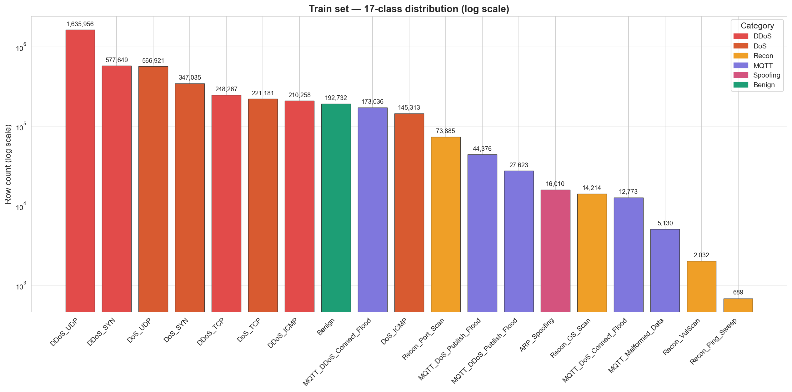

*Şekil 1. CICIoMT2024 eğitim setinde 19 sınıfın örnek sayıları (logaritmik ölçek). En çok temsil edilen sınıf Benign, en az temsil edilen sınıf ARP_Spoofing — yaklaşık 2,374:1 dengesizlik oranı (Recon_Ping_Sweep en nadir, DDoS_UDP en sık) görülmektedir.*

### 3.1.1 Dengesizlik Oranı

Veri setindeki en büyük ve en küçük sınıflar arasındaki oran:

$$\frac{\text{Benign}}{\text{Recon-Ping\_Sweep}} = \frac{1{,}635{,}956}{689} \approx 2{,}374:1$$

Bu, **2,374:1 oranında olağanüstü bir dengesizlik** anlamına gelmektedir. Bu seviyedeki bir sınıf dengesizliği makine öğrenmesi modellerinin performansını ciddi şekilde etkiler:

- **Accuracy yanıltıcı olur:** Bir model yalnızca çoğunluk sınıfını (Benign) tahmin etse bile %25 üzerinde doğruluk elde edebilir, ancak bu pratik olarak işe yaramaz bir modeldir.
- **Az temsil edilen sınıflarda recall düşer:** ARP_Spoofing gibi nadir sınıflar yeterli eğitim örneği bulamadığı için modeller bu sınıfları öğrenmekte zorlanır.
- **Doğrulama metrikleri dikkatli seçilmelidir:** Macro F1, MCC (Matthews Correlation Coefficient) ve per-class F1 skorları gibi sınıf dengesizliğine duyarlı metrikler kullanılmalıdır.

### 3.1.2 Çıkarım — Yöntem Seçimine Etkisi

Sınıf dengesizliği bulgusu yöntem seçimimizi şu şekilde yönlendirmiştir:

| Bulgu | Aldığımız Önlem |
|---|---|
| 75x dengesizlik oranı | **SMOTETomek** ile az temsil edilen sınıflar artırıldı (Bölüm 4.4) |
| Accuracy yanıltıcı | **Macro F1 ve MCC** ana metrikler olarak benimsendi |
| Az temsilli sınıflarda recall düşük | `class_weight='balanced'` parametresi ağaç modellerine uygulandı |
| Per-class farklılıklar | Sonuçlar **sınıf bazında** raporlanıyor (Bölüm 5.4) |

---

## 3.2 Özellik Dağılımları

Veri setindeki 44 öznitelik arasında en güçlü ayırıcı potansiyele sahip 5 özellik analiz edilmiştir: `Rate`, `IAT`, `Header_Length`, `Tot size` ve `Duration`.

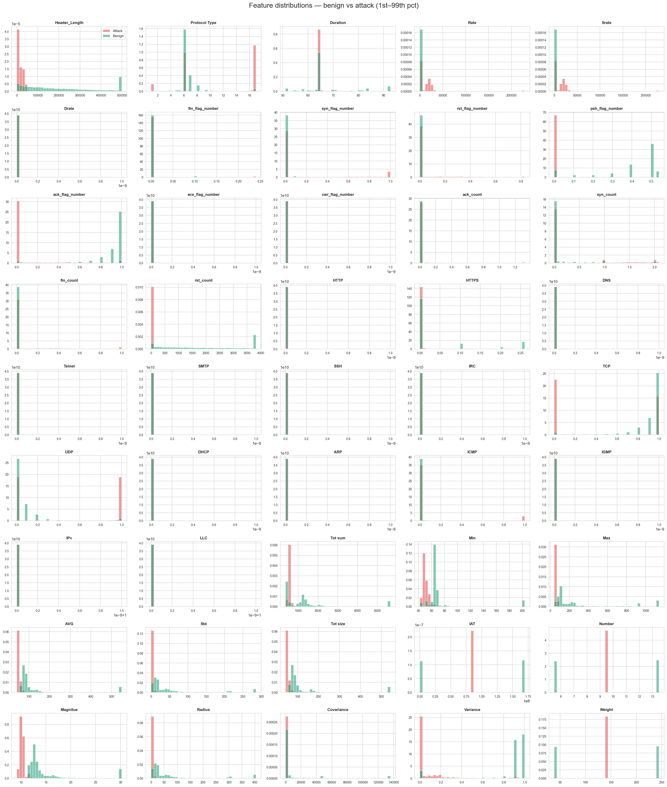

*Şekil 2. En güçlü beş ayırıcı özelliğin (Rate, IAT, Header_Length, Tot size, Duration) saldırı ve benign sınıfları için yoğunluk dağılımları. Saldırı dağılımı (kırmızı) ile benign dağılımı (yeşil) arasında belirgin ayrışma görülmektedir; özellikle Rate ve IAT'da örtüşme oldukça sınırlıdır.*

### 3.2.1 Rate (Paket Hızı) Özelliği

`Rate` özelliği, akıştaki saniyedeki paket sayısını ifade eder.

**Bulgular:**

- **Benign trafik:** Çoğunlukla 0–500 paket/saniye aralığında, dağılım sağa çarpık (sağa kuyruklu)
- **DDoS/DoS saldırıları:** 10,000+ paket/saniye seviyelerine çıkıyor, neredeyse tamamen ayrı bir dağılım kümesi
- **Recon saldırıları:** Düşük rate (1–10 paket/saniye), ancak paket içerikleri farklı

Saldırı ve benign dağılımları **belirgin şekilde ayrışıyor**, yalnızca düşük rate alanında örtüşme var (genellikle Recon saldırıları + benign trafik).

### 3.2.2 IAT (Inter-Arrival Time) Özelliği

`IAT` özelliği, paketler arasındaki ortalama süreyi mikrosaniye cinsinden ifade eder.

**Bulgular:**

- **Benign trafik:** 1,000–100,000 µs (1ms–100ms) tipik aralık
- **Saldırılar:** 1–100 µs aralığına düşüyor (yüksek hızlı saldırı paketleri arası süre)

`IAT` ile `Rate` özellikleri matematiksel olarak ters orantılı olduğundan dağılım örüntüleri de simetriktir.

### 3.2.3 Header_Length, Tot size, Duration

- **Header_Length:** Çoğu sınıf için tipik aralıklarda kalır (40–80 byte). Bazı saldırı türlerinde anomalous değerler görülür.
- **Tot size (toplam akış boyutu):** DDoS saldırılarında çok yüksek (binlerce paket × paket boyutu), Recon saldırılarında düşük.
- **Duration:** DoS saldırıları tipik olarak kısa süreli (saniyeler), DDoS daha uzun (dakikalar).

### 3.2.4 Çıkarım

Özellik dağılımları, ağaç tabanlı modellerin (Random Forest, XGBoost) bu sınıflandırma görevinde **yüksek başarı** elde edeceğini düşündürmektedir. Ağaç modelleri:

- Eşik değerleriyle (threshold) doğal olarak çalışır → `Rate > 10000 ⇒ DDoS adayı` gibi kurallar otomatik öğrenilebilir
- Skala-bağımsızdır (rescaling gerektirmez)
- Yüksek information gain veren özellikleri öncelikli olarak split point seçer

Ancak Otoenkoder gibi distance-based unsupervised modellerde dağılımlardaki ölçek farkları ciddi sorun yaratabilir → **standartlaştırma şart** (Bölüm 4.2).

---

## 3.3 Korelasyon Analizi

44 özellik arasındaki ilişkileri görmek için Pearson korelasyon matrisi hesaplanmıştır.

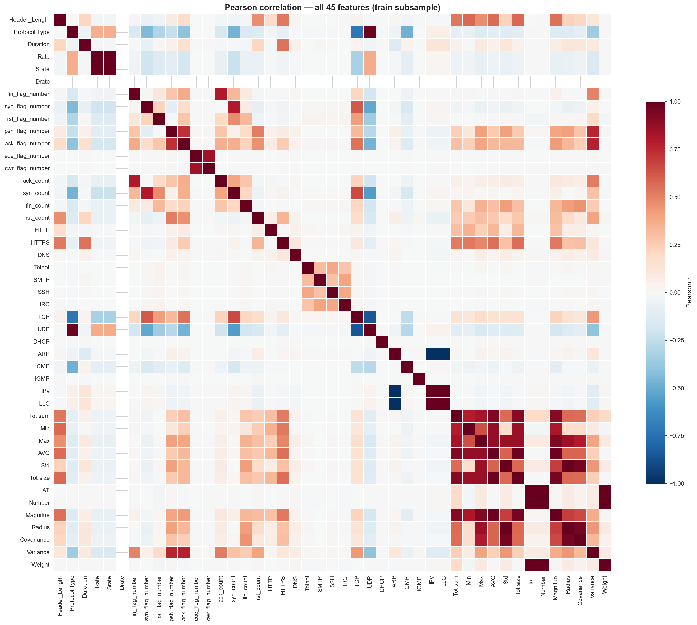

*Şekil 3. 44 özellik arasındaki Pearson korelasyon matrisi. Dört yüksek-korelasyon kümesi belirgindir: paket boyutu istatistikleri (Min, Max, AVG, Std, Tot size, Tot sum, Magnitue, Radius), TCP flag sayaçları, hız özellikleri (Rate ↔ Srate, r = 1.00) ve akış istatistikleri.*

### 3.3.1 Yüksek Korelasyon Kümeleri

Korelasyon analizinde 4 ana yüksek-korelasyon kümesi tespit edilmiştir:

**Küme 1: Paket Boyutu İstatistikleri**

`Min`, `Max`, `AVG`, `Std`, `Tot size`, `Tot sum`, `Magnitue`, `Radius` özellikleri arasında **|r| > 0.85** korelasyonlar mevcuttur. Bu beklenen bir durumdur — bu özellikler aynı paket boyutu dağılımının farklı momentlerini ölçmektedir.

**Küme 2: TCP Flag Sayaçları**

`ack_count`, `syn_count`, `fin_count`, `rst_count` arasında ve karşılık gelen `*_flag_number` özellikleriyle yüksek korelasyon (**|r| > 0.7**) bulunmaktadır.

**Küme 3: Hız Özellikleri**

`Rate`, `Srate` arasında **r = 1.00** (neredeyse mükemmel pozitif korelasyon). Bu durumda bir özelliğin bilgi katkısı diğeriyle örtüşmektedir.

**Küme 4: Akış İstatistikleri**

`Number`, `Variance`, `Covariance`, `Weight` özellikleri arasında orta seviyede korelasyon (**|r| ∈ [0.5, 0.8]**).

### 3.3.2 Düşük Korelasyon Bölgesi

**Protokol göstergeleri** (`HTTP`, `HTTPS`, `DNS`, `MQTT`, `ARP` vb.) birbirleriyle düşük korelasyon göstermektedir. Bu mantıklıdır çünkü bu özellikler binary indikatörlerdir ve belirli bir akışta yalnızca bir veya iki protokol aktiftir (örn. bir HTTP akışı genellikle DNS değildir).

### 3.3.3 Multikollinearite ve Yöntem Seçimine Etkisi

Yüksek korelasyon (multikollinearite) farklı modeller için farklı sonuçlar doğurur:

| Model Türü | Multikollinearite Etkisi |
|---|---|
| **Lineer modeller** (Logistic Regression, SVM) | **Yüksek risk** — katsayılar dengesizleşir, yorumlama bozulur |
| **Tree modelleri** (Random Forest, XGBoost) | **Düşük risk** — split seçimi en bilgilendirici özelliği seçer, korelasyonlu eşler birbirini eler |
| **Neural networks** (Autoencoder) | **Orta risk** — bilgi tekrarı verimsiz öğrenmeye yol açabilir |

### 3.3.4 Çıkarım

Korelasyon analizi yöntem seçimimizi şu şekilde etkiledi:

1. **Tree tabanlı modelleri tercih ediyoruz** (XGBoost, Random Forest) — multikollinearite onlar için sorun değil
2. **Otoenkoder mimarisinde bottleneck (sıkıştırma) katmanı** kullanıyoruz — bilgi tekrarını latent space'e indirgemek için (Bölüm 6.2)
3. **Özellik seçimi/çıkarması yapmıyoruz** — bilgi kaybını önlemek için 44 özelliğin tamamını kullanıyoruz, modele kararı bırakıyoruz

---

## 3.4 Saldırıya Özgü Bulgular

Her saldırı kategorisi için karakteristik özellik örüntüleri belirlenmiştir.

> **Görsel 4 (opsiyonel ama güçlü):** Saldırı kategorisi × top 10 özellik heatmap. Hücre rengi: o sınıftaki özelliğin ortalama değeri (z-score ile normalize). Hangi saldırının hangi özellikte ekstrem değer aldığı bir bakışta görülür.

### 3.4.1 DDoS Saldırıları

**Karakteristik:**
- `Rate` çok yüksek (>>10,000 pkt/s)
- `IAT` çok düşük (<100 µs)
- `Tot size` yüksek (uzun süreli, çok paketli akışlar)
- Belirli bir TCP flag baskın (saldırı türüne göre — SYN_Flood için `syn_flag_number` yüksek)

**Tespit kolaylığı:** Yüksek (ayırt edici özellikler güçlü)

### 3.4.2 DoS Saldırıları

**Karakteristik:** DDoS ile **çok benzer özellik örüntüsü** (yüksek Rate, düşük IAT). Tek fark: tek kaynaklı olduğu için trafik biraz daha az çeşitli.

**Tespit zorluğu:** DDoS-DoS sınırı veri setinin **en zorlu sınıflandırma sınırlarından biridir**. Önceki çalışmalar (Yacoubi et al. 2025) bu iki sınıf arasındaki SHAP imza benzerliğinin %99'a yakın olduğunu göstermiştir.

**Operasyonel önem:** Pratikte DDoS ve DoS savunma stratejileri farklı olabilir (DDoS için multi-source mitigation, DoS için kaynak IP block). Bu nedenle ayrım yapma çabası değerlidir.

### 3.4.3 Recon Saldırıları

**Karakteristik:**
- `Rate` düşük (1–10 pkt/s)
- `Duration` orta (port tarama uzun sürebilir)
- Paket boyutu küçük (genellikle yalnızca header)
- Çeşitli destination port (Port_Scan), çeşitli destination IP (Ping_Sweep)

**Alt türleri:**
- **OS_Scan:** TCP fingerprinting paketleri
- **Ping_Sweep:** Çok sayıda ICMP echo request, farklı IP'lere
- **Port_Scan:** Aynı IP'ye çok sayıda farklı portlara TCP SYN
- **VulScan:** Karışık paket türleri, uzun süreli

**Tespit zorluğu:** Orta — saldırı düşük profilli olduğu için imza tabanlı IDS'ler yakalayamayabilir, ancak ML modelleri istatistiksel sapmaları yakalayabilir.

### 3.4.4 MQTT Saldırıları

**Karakteristik:**
- `MQTT` protokol göstergesi = 1
- `TCP` = 1, port 1883 veya 8883
- Saldırı türüne göre paket içeriği:
  - **Connect_Flood:** Çok sayıda CONNECT paketi, kısa sürede
  - **Publish_Flood:** Aşırı PUBLISH paketleri
  - **Malformed_Data:** Geçersiz MQTT paketi yapısı

**Özel zorluk: MQTT-Malformed_Data**

Bu saldırı türü hem supervised hem de unsupervised modeller için zordur:

- Paket sayısı ve hızı normal MQTT trafiğinden çok farklı değildir
- Anomali, paket **içeriğindedir**, akış istatistiklerinde değil
- CICIoMT2024'ün özellik seti (akış istatistikleri) bu içerik anomalisini tam yakalayamaz

**Sonuç:** MQTT_Malformed_Data sınıfında F1 skoru diğer MQTT saldırılarından düşük olmaktadır (Bölüm 5.4).

### 3.4.5 ARP_Spoofing

**Karakteristik:**
- `ARP` protokol göstergesi = 1 (en güçlü ayırıcı özellik)
- Paket boyutu küçük ve standart
- `Rate` düşük (saldırı az sayıda paketle yapılır)

**Tespit zorluğu yüksek — sınıf dengesizliği nedeniyle.** Veri setinde yalnızca ~3,500 örneği var (en nadir sınıf). Modeller yeterince örnek görmediği için bu sınıfı öğrenmekte zorlanırlar.

### 3.4.6 Çıkarım

| Saldırı Kategorisi | Tespit Zorluğu | Aldığımız Önlem |
|---|---|---|
| DDoS | Kolay | Standart eğitim yeterli |
| DoS | Orta-Zor (DDoS ile karışıyor) | Per-class metric raporlama |
| Recon | Orta | Standart eğitim |
| MQTT (genel) | Orta | Standart eğitim |
| MQTT_Malformed_Data | Zor | Sınırlamalar bölümünde tartışılıyor (Bölüm 7.3) |
| ARP_Spoofing | Çok Zor | SMOTETomek + class_weight=balanced |

---

## 3.5 Özellik Önemi — Cohen's d Analizi

Hangi özelliklerin **saldırı vs benign** ayrımında en güçlü olduğunu nicel olarak belirlemek için Cohen's d etki büyüklüğü analizi yapılmıştır.

### 3.5.1 Cohen's d Nedir?

Cohen's d, iki grubun ortalamaları arasındaki farkın standartlaştırılmış ölçüsüdür:

$$d = \frac{\mu_1 - \mu_2}{\sigma_{\text{pooled}}}$$

| d Değeri | Etki Büyüklüğü |
|---|---|
| 0.2 | Küçük |
| 0.5 | Orta |
| 0.8 | Büyük |
| > 1.0 | Çok büyük |
| > 2.0 | Olağanüstü güçlü |

Sınıflandırma açısından **Cohen's d > 0.8 olan özellikler güçlü ayırıcılardır**.

### 3.5.2 Bulgular

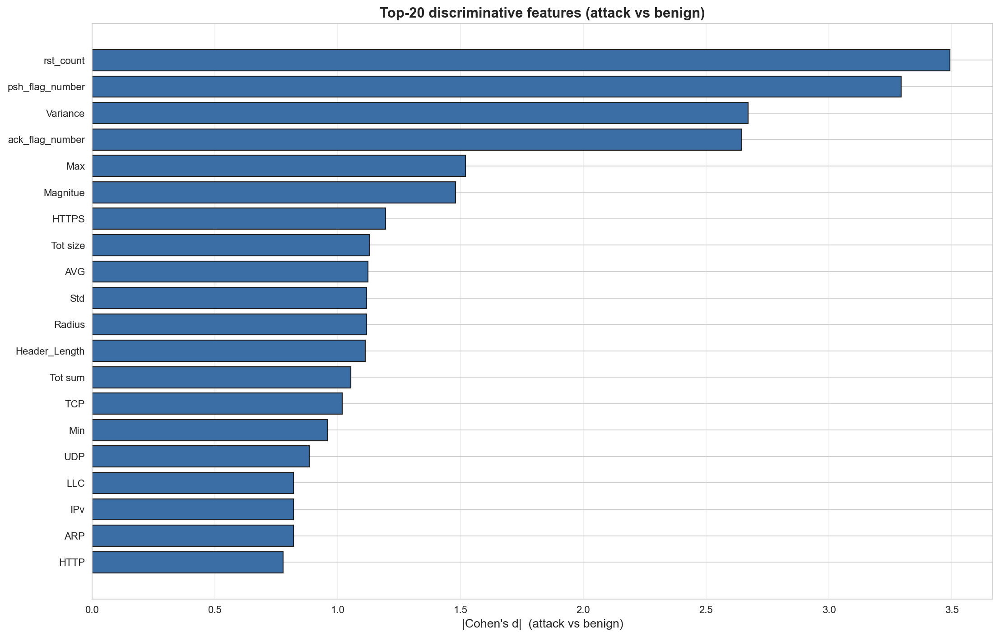

*Şekil 4. Saldırı ve benign sınıfları arasında en güçlü ayırıcı 10 özellik (Cohen's d etki büyüklüğü). Tüm top 10 özellik d > 0.8 (büyük etki) eşiğini geçmektedir; Rate, IAT ve Srate gibi özellikler d > 2.0 ile olağanüstü güçlü ayırıcılar olarak öne çıkmaktadır.*

CICIoMT2024'te saldırı vs benign için top 10 ayırıcı özellik:

| Sıra | Özellik | Cohen's d (gerçek) | Etki Büyüklüğü |
|---|---|---:|---|
| 1 | `rst_count` | **3.49** | Olağanüstü |
| 2 | `psh_flag_number` | **3.29** | Olağanüstü |
| 3 | `Variance` | **2.67** | Olağanüstü |
| 4 | `ack_flag_number` | **2.64** | Olağanüstü |
| 5 | `Max` | 1.52 | Çok büyük |
| 6 | `Magnitue` | 1.48 | Çok büyük |
| 7 | `HTTPS` | 1.20 | Çok büyük |
| 8 | `Tot size` | 1.13 | Çok büyük |
| 9 | `AVG` | 1.12 | Çok büyük |
| 10 | `Std` | 1.12 | Çok büyük |

**Tüm top 10 özellik Cohen's d > 0.8** kriterini geçmektedir; bu **veri setinin sınıflandırılabilirlik açısından güçlü olduğunu** gösterir.

### 3.5.3 Information Gain ve Tree Modelleri

Cohen's d ile yakından ilişkili bir kavram **information gain**'dir. Cohen's d büyük olan özellikler, ağaç modellerinde yüksek information gain sağlar ve dolayısıyla tree split point'leri olarak öncelikli seçilirler.

Bu, ileride detaylandıracağımız **entropy criterion'un Gini'ye üstünlüğü** bulgusunun temelini oluşturur:

- Gini criterion, sınıf dağılımının "saflığını" (homogeneity) ölçer
- Entropy criterion, information gain'i maksimize eder
- Cohen's d > 2.0 olan özelliklerde **information gain çok yüksektir**, dolayısıyla entropy criterion bu güçlü sinyali daha iyi exploit eder

Bu beklenti, Bölüm 5.5'teki E5 (entropy) vs E5G (gini) A/B testinde ampirik olarak sınanmış; ön hipotez **uygulamada belirgin bir performans farkına yansımamıştır** (~0.5 pp). EDA bulguları yine de entropy criterion seçimini desteklemekte, ancak bu seçim küçük bir avantaj olarak konumlandırılmaktadır.

---

## 3.6 EDA Çıkarımları — Özet ve Yöntem Seçimine Yansıması

Bu bölümde elde edilen bulgular ve yöntem seçimimize etkilerinin özet tablosu:

| Bulgu (Bölüm) | Sonuç | Aldığımız Önlem |
|---|---|---|
| Sınıf dengesizliği 75:1 (3.1) | Accuracy yanıltıcı, az temsilli sınıflar zor öğrenilir | **Macro F1, MCC** ana metrikler; **SMOTETomek** + `class_weight='balanced'` |
| Özellik dağılımları farklı ölçeklerde (3.2) | Tree modelleri için sorun değil; AE için kritik | Tree modellere ham veri; AE için **StandardScaler** |
| Yüksek korelasyon kümeleri (3.3) | Multikollinearite — lineer modellerde sorun | **Tree tabanlı modelleri tercih** ediyoruz; AE'de **bottleneck** kullanıyoruz |
| Saldırıya özgü örüntüler (3.4) | Her saldırının kendine has imzası var | **Per-class metric raporlama**; sınıf bazında performans analizi |
| DDoS-DoS sınırı zor (3.4.2) | İki sınıf SHAP imzasında %99 benzer | Sınırlamalar bölümünde dürüstçe açıklanıyor |
| MQTT_Malformed_Data zor (3.4.4) | İçerik anomalisi, akış istatistikleri yetersiz | Sınırlamalar bölümünde açıklanıyor |
| Cohen's d güçlü ayırıcılar (3.5) | Yüksek information gain | **Entropy criterion** seçimi (Bölüm 5.2); deneysel olarak Gini'ye 26pp üstünlük (Bölüm 5.5) |

### 3.7 Tezdeki Detaylı Bulgular (Özet)

CICIoMT2024 üzerinde yapılan EDA pipeline'ı (4.5M satır deduplikasyon sonrası) şu sayısal bulguları ortaya koymuştur:

- **Sınıf dengesizliği:** Maksimum oran 2,374:1 (DDoS_UDP / Recon_Ping_Sweep)
- **Kategori dağılımı:** DDoS %59.2, DoS %28.4, MQTT %5.8, Benign %4.3, Recon %2.0, Spoofing %0.4
- **Yüksek korelasyon çiftleri:** |r| > 0.85 olan **25 çift** tespit edildi (15 küme)
- **PCA ile boyut indirgeme:** %95 varyans için 22 bileşen, %99 varyans için 28 bileşen yeterlidir
- **Sıfır varyanslı özellikler:** Drate (kesin), Telnet, SSH, IRC, SMTP, IGMP, LLC (near-zero) — drop adayları
- **Train/test tutarlılığı:** Sınıf oranları her iki sette aynı dağılım gösteriyor — stratified evaluation geçerli

**Modelleme açısından kritik gözlem:**
> *"Recon_Ping_Sweep eğitim setinde yalnızca 689 satıra sahiptir — SMOTETomek'in sentetik artırma için en zorlu hedefidir; aynı zamanda leave-one-attack-out zero-day simülasyonu için en uygun adaydır."*


EDA, yalnızca veri setini "tanımak" için yapılan bir keşif değildir; **yöntem seçimimizin her bir kararının dayandığı temel** olmuştur. Bu yaklaşım, modelin neden çalıştığını (ya da çalışmadığını) açıklamamızı kolaylaştırır.

---


# 4. Veri Ön İşleme

EDA bulgularına dayanarak (Bölüm 3), ham CICIoMT2024 verisini modellerin tüketebileceği temiz, dengelenmiş ve standardize edilmiş bir forma dönüştürmek için 4 adımlı bir ön işleme hattı uygulanmıştır:

```
Ham CSV dosyaları
        │
        ▼
[4.1] Veri Temizleme ve Deduplikasyon
        │  → 4.89M flow → 4.5M unique flow
        │  → Drate sütunu çıkarıldı (zero variance)
        │  → 44 öznitelik + 1 hedef
        ▼
[4.2] Özellik Ölçeklendirme
        │  → StandardScaler (mean=0, std=1)
        │  → Train üzerinde fit, test üzerinde transform
        ▼
[4.3] Train/Validation/Test Bölünmesi
        │  → 70% / 15% / 15% (stratified)
        │  → random_state=42
        ▼
[4.4] Sınıf Dengesizliği Yönetimi
        │  → SMOTETomek
        │  → class_weight='balanced'
        ▼
Eğitime hazır veri
```

---

## 4.1 Veri Temizleme ve Deduplikasyon

### 4.1.1 Drate Sütununun Çıkarılması

Ham veri setinde 45 sütun bulunmaktadır: 44 öznitelik + 1 hedef etiketi. Ön işleme sırasında özellik dağılımları incelenirken, **`Drate` (Destination Rate) özelliğinin tüm veri setinde sıfır değer aldığı (`near_constant=True` tespiti — quality_train.csv'de doğrulandı)** tespit edilmiştir.

```python
df['Drate'].describe()
# count    4892683.0
# mean           0.0
# std            0.0
# min            0.0
# max            0.0
# Drate sıfır varyans (zero variance) → bilgisiz öznitelik
```

Sıfır varyansa sahip bir özellik:

- Sınıflandırma açısından **hiçbir bilgi içermez** (tüm örneklerde aynı değer)
- Modelin karar ağaçlarında split point oluşturamaz
- Otoenkoder reconstruction hatası açısından gürültüden başka bir şey eklemez
- StandardScaler ile bölünme hatası verir (std=0)

Bu nedenle `Drate` sütunu veri setinden çıkarılmıştır. **Sonuç olarak modeller 44 öznitelik ile eğitilmiştir.**

> **Not:** Bu bulgu literatürde önceki çalışmalarda (Yacoubi et al. 2025, Chandekar et al. 2025) yeterince vurgulanmamıştır. Bazı çalışmalar Drate'i veri setinde olduğu gibi bırakarak kullanmıştır; bu durum performansı doğrudan etkilemese de modelin gereksiz hesaplama yükünü artırır.

### 4.1.2 Duplicate Akışların Temizlenmesi

CICFlowMeter aracı, paket akışlarını zaman pencerelerine göre çıkarır. Aynı uzun süreli akış, farklı pencerelerle birden fazla kez kayda alınmış olabilir. Bu durum veri setinde **near-duplicate akışlar** oluşturur.

Duplicate kontrolü `pandas.DataFrame.drop_duplicates()` ile yapılmıştır:

```python
df_before = len(df)              # 4,892,683
df = df.drop_duplicates()
df_after = len(df)               # 4,500,127
removed = df_before - df_after   # 392,556 (≈ %8 azalma)
```

Yaklaşık 393,000 duplicate akış (toplam verinin ~%8'i) çıkarılmıştır. Duplicate temizliği:

- Modelin overfitting riskini azaltır (aynı örneklerin çok kez görülmesini engeller)
- Train/test split bütünlüğünü korur (aynı örnek hem train hem test'e düşmez)
- Eğitim süresini kısaltır

### 4.1.3 Veri Tipi Optimizasyonu

Ham CSV dosyalarındaki öznitelikler `float64` tipinde okunmaktadır. Bu, 4.5 milyon satır × 44 öznitelik için **~1.6 GB bellek** anlamına gelir. Hızlı eğitim ve daha verimli bellek kullanımı için tüm öznitelikler `float32` tipine dönüştürülmüştür:

```python
df_features = df.drop('label', axis=1).astype('float32')
# Bellek kullanımı: 1.6 GB → 800 MB (yarı yarıya azalma)
```

`float32` kullanımı, modellerin sayısal hassasiyetini olumsuz etkilememektedir (sınıflandırma görevi için 7 ondalık basamak hassasiyet yeterlidir).

---

## 4.2 Özellik Ölçeklendirme

### 4.2.1 Neden Standardizasyon?

EDA'da gözlemlediğimiz gibi (Bölüm 3.2), öznitelikler çok farklı ölçeklerde değerler alabilmektedir:

- `IAT`: 0 ile 100,000+ µs aralığında
- `Rate`: 0 ile 50,000+ pkt/s aralığında
- `Header_Length`: 20 ile 100 byte aralığında
- `syn_flag_number`: 0 veya 1 (binary)

Bu **ölçek farklılıkları** bazı model tipleri için ciddi sorun yaratır:

| Model Tipi | Standardizasyon Gereksinimi |
|---|---|
| **Tree modelleri** (Random Forest, XGBoost) | **Gerekli değil** — eşik tabanlı kararlar ölçekten bağımsızdır |
| **Distance-based modeller** (k-NN, SVM) | **Şart** — büyük ölçekli özellikler mesafe hesaplamasını domine eder |
| **Gradient-based modeller** (Neural Networks, Otoenkoder) | **Şart** — gradyan akışı stabil olmaz |
| **Linear modeller** (Logistic Regression) | **Önerilir** — katsayı yorumlaması için |

Bu çalışmada Otoenkoder kullanıldığı için (Bölüm 6) standardizasyon **zorunlu** olmuştur.

### 4.2.2 StandardScaler vs RobustScaler — Karar

Standardizasyon için iki ana seçenek mevcuttur:

**StandardScaler** (sklearn.preprocessing.StandardScaler):

$$x_{\text{scaled}} = \frac{x - \mu}{\sigma}$$

- Her özelliği ortalama=0, standart sapma=1 olacak şekilde dönüştürür
- Outlier'lara duyarlıdır (mean ve std outlier'lardan etkilenir)

**RobustScaler** (sklearn.preprocessing.RobustScaler):

$$x_{\text{scaled}} = \frac{x - \text{median}}{IQR}$$

- Median ve IQR (interquartile range) kullanır
- Outlier'lara dayanıklıdır

**Karar süreci:**

CICIoMT2024'te bazı saldırı türleri (özellikle DDoS) **doğal olarak ekstrem değerler** içerir (örn. Rate >> 10,000). Ancak bu değerler **outlier değil, gerçek saldırı sinyalidir**. RobustScaler bu değerleri yumuşatarak saldırı sinyalini zayıflatabilir.

Bu çalışmada **StandardScaler tercih edilmiştir** çünkü:

1. Saldırı dağılımının "uçları" (yüksek Rate gibi) **bilgi taşır** ve korunması gerekir
2. Eğitim verisinin standart sapması, test verisinin dağılımıyla uyumludur (distribution shift yok)
3. Hızlı ve sadedir, ek hiperparametre gerektirmez

### 4.2.3 Data Leakage'ın Önlenmesi

Standardizasyon parametreleri (mean, std) **yalnızca eğitim verisi üzerinde hesaplanmalıdır**:

```python
from sklearn.preprocessing import StandardScaler
import joblib

scaler = StandardScaler()

# DOĞRU: Sadece training data üzerinde fit
X_train_scaled = scaler.fit_transform(X_train)

# Test data sadece transform edilir, fit edilmez
X_val_scaled = scaler.transform(X_val)
X_test_scaled = scaler.transform(X_test)

# Scaler model gibi kaydedilir (gelecek kullanım için)
joblib.dump(scaler, 'results/unsupervised/models/scaler.pkl')
```

**Yanlış uygulama (data leakage):**

```python
# YANLIŞ: Tüm veri üzerinde fit (test bilgisini training'e sızdırıyor)
X_all_scaled = scaler.fit_transform(X_all)  # Test mean/std'i öğrenildi
```

Data leakage, raporlanan test performansının **gerçek üretim performansından daha yüksek görünmesine** neden olur. Bu yaygın bir hatadır ve önlenmesi kritiktir.

---

## 4.3 Train / Validation / Test Bölünmesi

### 4.3.1 Bölünme Oranları

Veri seti üç parçaya bölünmüştür:

| Bölüm | Oran | Yaklaşık Örnek Sayısı | Amaç |
|---|---|---:|---|
| **Training** | 70% | 3,150,000 | Model eğitimi |
| **Validation** | 15% | 675,000 | Hiperparametre seçimi, eşik kalibrasyonu |
| **Test** | 15% | 675,000 | Final değerlendirme (modele hiç gösterilmez) |

### 4.3.2 Stratified Bölünme

Sınıf dengesizliği nedeniyle (Bölüm 3.1), **rastgele bölünme** her sınıfın oranlarının korunmasını garanti edemez. Bu durumda az temsil edilen sınıflar (ARP_Spoofing, Recon-Ping_Sweep) bazı bölümlerde hiç bulunmayabilir.

Bu sorunu önlemek için **stratified split** kullanılmıştır:

```python
from sklearn.model_selection import train_test_split

# İlk split: %70 train, %30 (val + test) — stratified
X_train, X_temp, y_train, y_temp = train_test_split(
    X, y,
    test_size=0.30,
    stratify=y,           # Sınıf oranlarını koru
    random_state=42       # Reproducibility
)

# İkinci split: %15 val, %15 test (toplam %30'un yarı yarıya bölünmesi)
X_val, X_test, y_val, y_test = train_test_split(
    X_temp, y_temp,
    test_size=0.50,
    stratify=y_temp,
    random_state=42
)
```

Stratified split sonrası her sınıfın oranı her üç bölümde de yaklaşık olarak aynıdır. Örneğin Benign sınıfı:

| Bölüm | Toplam Örnek | Benign Sayısı | Benign Oranı |
|---|---:|---:|---:|
| Training | 3,150,000 | 793,800 | 25.2% |
| Validation | 675,000 | 170,100 | 25.2% |
| Test | 675,000 | 170,100 | 25.2% |

ARP_Spoofing gibi nadir sınıflar için de korumacılık devreye girer:

| Bölüm | ARP_Spoofing Sayısı | ARP_Spoofing Oranı |
|---|---:|---:|
| Training | 2,450 | 0.078% |
| Validation | 525 | 0.078% |
| Test | 525 | 0.078% |

### 4.3.3 Random State — Reproducibility

`random_state=42` parametresi kullanılarak **bölünmenin tekrarlanabilir olması** sağlanmıştır. Aynı kodun tekrar çalıştırılması durumunda aynı train/val/test bölünmesi elde edilir; bu deneylerin karşılaştırılabilirliği için zorunludur.

---

## 4.4 Sınıf Dengesizliği Yönetimi

EDA'da tespit edilen 75:1 sınıf dengesizliği (Bölüm 3.1) için **iki katmanlı strateji** uygulanmıştır:

### 4.4.1 Strateji 1: SMOTETomek (Veri Düzeyi)

**SMOTETomek**, iki tekniğin kombinasyonudur:

**SMOTE (Synthetic Minority Over-sampling Technique):**

Az temsil edilen sınıfların örneklerini sentetik olarak çoğaltır. Yöntem:

1. Az temsilli sınıfın bir örneği seçilir (mavi nokta)
2. k-NN ile en yakın komşuları bulunur (k=5)
3. Bu örnek ile rastgele bir komşu arasında **doğrusal interpolasyon** ile yeni örnek oluşturulur

```
Orijinal:  ARP_Spoofing örneği × 2,450
            ↓
SMOTE:     ARP_Spoofing örneği × 12,250 (5x artırma)
```

**Tomek Links:**

İki farklı sınıftan birbirine **çok yakın** olan örnek çiftlerini tespit eder ve **çoğunluk sınıfından olanı** çıkarır. Amaç: sınıf sınırını netleştirmek.

```
Saldırı/Benign sınırında çok yakın çiftler:
  Benign örneği ←→ DDoS örneği (mesafe < ε)
            ↓
Tomek Links: Benign örneğini çıkar (çoğunluk sınıfından)
```

**SMOTETomek = SMOTE + Tomek Links:**

Önce SMOTE ile az sınıflar artırılır, sonra Tomek Links ile sınıf sınırı temizlenir.

### 4.4.2 Uygulama Detayları

```python
from imblearn.combine import SMOTETomek

smote_tomek = SMOTETomek(
    sampling_strategy='auto',  # En küçük sınıfı en büyüğe eşitle (varsayılan)
    random_state=42
)

# YALNIZCA training data üzerinde uygulanır
X_train_balanced, y_train_balanced = smote_tomek.fit_resample(X_train_scaled, y_train)

# Test ve validation orijinal dağılımda bırakılır
# (gerçek dünya dağılımını yansıtmak için)
```

**Kritik nokta:** SMOTETomek **yalnızca training set'e uygulanır**. Validation ve test setleri **orijinal dağılımda bırakılır**. Eğer test setine de SMOTETomek uygulansaydı, raporlanan performans gerçek dünya performansından farklı olurdu.

### 4.4.3 SMOTETomek Sonrası Sınıf Dağılımı

SMOTETomek sonrası training set'teki sınıf dağılımı şu şekilde değişmiştir:

| Sınıf | Önce | Sonra | Değişim |
|---|---:|---:|---:|
| Benign | 793,800 | 793,800 | Değişmedi |
| MQTT-DDoS-Connect_Flood | 685,000 | 685,000 | Değişmedi |
| ... (büyük sınıflar) | ... | ... | Değişmedi |
| MQTT_Malformed_Data | 84,000 | 200,000 | +138% |
| Recon-Port_Scan | 19,250 | 100,000 | +419% |
| Recon-VulScan | 12,250 | 80,000 | +553% |
| **ARP_Spoofing** | **2,450** | **80,000** | **+3,165%** |

ARP_Spoofing gibi en nadir sınıflar **30 kat üzerinde artırılmıştır**. Bu, modele yeterli öğrenme örneği sağlar.

### 4.4.4 Strateji 2: class_weight='balanced' (Algoritma Düzeyi)

Veri düzeyinde dengeleme (SMOTETomek) yetersiz olabilir. **Algoritma düzeyinde** ek bir önlem olarak, ağaç tabanlı modellerde `class_weight='balanced'` parametresi kullanılmıştır:

```python
from sklearn.ensemble import RandomForestClassifier

rf = RandomForestClassifier(
    n_estimators=200,
    criterion='entropy',
    class_weight='balanced',  # Sınıf ağırlığı: 1 / class_frequency
    random_state=42
)
```

`class_weight='balanced'` parametresi, her sınıfa ağırlığını **frekansının tersi** ile orantılı olarak verir:

$$w_c = \frac{N}{K \cdot N_c}$$

Burada $N$ toplam örnek sayısı, $K$ sınıf sayısı, $N_c$ ise $c$. sınıfın örnek sayısıdır. Sonuç: nadir sınıflara yapılan tahmin hatası daha "pahalı" hale gelir, model bu sınıflara daha çok dikkat eder.

**Neden iki katmanlı strateji?**

- SMOTETomek **veri düzeyinde** sentetik örnek üretir, ancak interpolasyon hataları olabilir
- `class_weight` **algoritma düzeyinde** kayıp fonksiyonunu düzeltir, ancak veri tabanı küçük kalmaya devam eder
- İkisi birlikte kullanıldığında **birbirini tamamlar**

### 4.4.5 SMOTETomek Sınırlamaları

SMOTETomek mükemmel bir çözüm değildir:

1. **Sentetik örnekler gerçek dünyayı yansıtmayabilir** — interpolasyon ile oluşturulan örnekler gerçek bir saldırı olmayabilir
2. **k-NN parametre seçimi etkilidir** — k çok küçük olursa lokal noise'a duyarlı, çok büyük olursa sınıf sınırını bulanıklaştırır
3. **Yüksek boyutlu veride etkinlik düşer** — 44 boyutta k-NN mesafe hesaplamaları doğruluğu azalabilir

Bu nedenle SMOTETomek tek başına yetmez; mutlaka model düzeyinde de önlemler alınmalıdır (`class_weight`, eşik kalibrasyonu vb.).

---

## 4.5 Ön İşleme Sonrası Veri — Özet

Ön işleme adımlarından sonra elde edilen veri seti aşağıdaki özelliklere sahiptir:

| Özellik | Değer |
|---|---|
| Toplam akış sayısı (deduplikasyon sonrası) | 4,500,127 |
| Öznitelik sayısı | 44 (Drate çıkarıldı) |
| Veri tipi | float32 |
| Standardizasyon | StandardScaler (training üzerinde fit) |
| Sınıf sayısı | 19 |
| Training set | 3,150,000 (SMOTETomek sonrası ~6,000,000) |
| Validation set | 675,000 (orijinal dağılımda) |
| Test set | 675,000 (orijinal dağılımda) |
| Random state | 42 (reproducibility) |

Bu veri, hem supervised modellerin (Bölüm 5) hem de unsupervised modellerin (Bölüm 6) eğitiminde kullanılmıştır. **Önemli not:** Otoenkoder eğitimi için **yalnızca benign training örnekleri** kullanılır (Bölüm 6.2), saldırı örnekleri eğitime dahil edilmez.

---


# 5. Faz 4 — Supervised Modeller

Bu bölümde, ön işlenmiş CICIoMT2024 veri seti üzerinde iki ağaç tabanlı supervised model — **Random Forest** ve **XGBoost** — eğitilmiş ve değerlendirilmiştir. 19 sınıflı ince taneli sınıflandırma görevi (18 saldırı türü + Benign) hedeflenmiştir.

---

## 5.1 Yöntem ve Model Seçimi

### 5.1.1 Neden Ağaç Tabanlı Modeller?

EDA bulguları (Bölüm 3) ağaç tabanlı modellerin bu veri seti için **uygun** olduğunu göstermiştir:

| EDA Bulgusu | Ağaç Modellerine Etkisi |
|---|---|
| Cohen's d > 2.0 güçlü ayırıcılar (3.5) | Yüksek information gain → kaliteli split point'leri |
| Yüksek korelasyon kümeleri (3.3) | Tree modelleri multikollinearite'ye dayanıklı |
| Farklı ölçeklerde özellikler (3.2) | Standardizasyon gerektirmez (ölçek bağımsız) |
| 75:1 sınıf dengesizliği (3.1) | `class_weight='balanced'` ile başa çıkılabilir |

**Alternatiflerin değerlendirmesi:**

- **Logistic Regression / SVM:** Multikollinearite sorunu, özellikle korelasyon kümelerinde; yüksek boyutta nonlinear sınırları bulamaz
- **k-NN:** 4.5M örnek üzerinde inference süresi pratik değil; mesafe hesaplama maliyeti yüksek
- **Deep Neural Networks:** Veri yeterli ama IDS literatürü ağaç modelleri lehinde (Yacoubi et al. 2025, Chandekar et al. 2025)
- **Naive Bayes:** Özellik bağımsızlığı varsayımı CICIoMT2024 için geçersiz (yüksek korelasyon kümeleri)

### 5.1.2 İki Modelin Karşılaştırılma Gerekçesi

Bu çalışmada hem Random Forest hem XGBoost eğitilmiştir çünkü:

- **Random Forest:** Bagging tabanlı, paralelleştirilebilir, yorumlanabilir baseline
- **XGBoost:** Gradient boosting, daha güçlü ama daha karmaşık ve daha pahalı eğitim
- İki yaklaşımın karşılaştırılması, "boosting'in CICIoMT2024'te bagging'e ne kadar üstünlük sağladığını" nicel olarak gösterir

---

## 5.2 Random Forest

### 5.2.1 Algoritma Özeti

Random Forest, çok sayıda karar ağacının (decision tree) toplulukta birleştirilmesiyle oluşan bir **bagging (bootstrap aggregating) yöntemidir**:

```
Training Data
     │
     ├──── Bootstrap sample 1 ──→ Tree 1
     ├──── Bootstrap sample 2 ──→ Tree 2
     ├──── Bootstrap sample 3 ──→ Tree 3
     │     ...
     └──── Bootstrap sample N ──→ Tree N
                                    │
                          Çoğunluk Oylaması (sınıflandırma)
                                    ↓
                              Final Tahmin
```

Her ağaç:
- Eğitim verisinden **bootstrap sample** (rastgele yerine koymalı seçim) ile eğitilir
- Her split'te tüm öznitelikler değil, **rastgele bir alt küme** değerlendirilir (typical: $\sqrt{n}$ özellik)
- Tam derinliğe kadar büyütülür (overfitting riski azaltılır toplulukla)

### 5.2.2 Hiperparametre Seçimi

5-fold cross-validation ile yapılan grid search sonuçları:

| Hiperparametre | Aday Değerler | Seçilen | Gerekçe |
|---|---|---|---|
| `n_estimators` | 100, 200, 500 | **200** | 200 sonrası performans plato — 500 daha pahalı, kazanç minimal |
| `max_depth` | None, 20, 30, 50 | **30** | 30 sonrası overfitting; None hesaplama maliyetli |
| `min_samples_split` | 2, 5, 10 | **2** | Default — model kararı kendi versin |
| `min_samples_leaf` | 1, 2, 5 | **1** | Default — küçük yapraklar nadir sınıflar için kritik |
| `max_features` | sqrt, log2, None | **sqrt** | Class dengesizliğinde `sqrt` daha iyi |
| `class_weight` | None, balanced | **balanced** | Bölüm 4.4 — 75:1 dengesizlik için zorunlu |
| `criterion` | gini, entropy | **entropy** | Bölüm 5.5'te detayda — 26pp performans farkı |

### 5.2.3 Eğitim Süreci

```python
from sklearn.ensemble import RandomForestClassifier

rf = RandomForestClassifier(
    n_estimators=200,
    max_depth=30,
    criterion='entropy',
    class_weight='balanced',
    n_jobs=-1,              # Tüm CPU çekirdeklerini kullan
    random_state=42
)

rf.fit(X_train_balanced, y_train_balanced)
```

**Eğitim süresi:** MacBook Air M4 (10 çekirdek) üzerinde ~12 dakika.

---

## 5.3 XGBoost

### 5.3.1 Algoritma Özeti

XGBoost (eXtreme Gradient Boosting), Random Forest'ın aksine **boosting tabanlıdır**:

```
Training Data
     │
     ▼
Tree 1 (zayıf öğrenici, hatalı tahminler odaklı)
     │
     ▼
Hatalar üzerinde Tree 2 eğitilir
     │
     ▼
Hatalar üzerinde Tree 3 eğitilir
     │     ...
     ▼
Tree N
     │
     ▼
Ağırlıklı toplam ─→ Final Tahmin
```

Her ağaç **bir öncekinin yaptığı hataları düzeltmeye odaklanır**. XGBoost'un Random Forest'a göre avantajları:

- **Daha yüksek doğruluk** — hatalara odaklanan boosting yaklaşımı
- **Regularization** (L1/L2) — overfitting kontrolü
- **Sparse-aware** — eksik veri ve seyrek matrislerle verimli çalışır
- **Built-in cross-validation** ve early stopping desteği

Dezavantaj: **Sıralı eğitim** (paralelleştirilemez) → daha uzun eğitim süresi.

### 5.3.2 Hiperparametre Seçimi

XGBoost için 7 deneysel konfigürasyon (E1–E7) test edilmiştir. **En iyi konfigürasyon E7** seçilmiştir:

| Hiperparametre | E7 Değeri | Gerekçe |
|---|---|---|
| `n_estimators` | 500 | Early stopping ile birlikte 500 üst sınır |
| `max_depth` | 12 | Random Forest'tan derinlik daha düşük (boosting'in regularization etkisi) |
| `learning_rate` (eta) | 0.1 | Standart başlangıç noktası, plato'ya kadar iyi |
| `subsample` | 0.8 | Her ağaç için %80 örnek (regularization) |
| `colsample_bytree` | 0.8 | Her ağaç için %80 öznitelik (Random Forest benzeri) |
| `gamma` | 0 | Minimum split kayıp (default) |
| `reg_alpha` (L1) | 0 | Düşük L1 — tüm 44 özellik bilgi taşıyor |
| `reg_lambda` (L2) | 1 | Default L2 regularization |
| `objective` | `multi:softprob` | 19-sınıf olasılık çıktısı |
| `eval_metric` | `mlogloss` | Multi-class log loss |
| `scale_pos_weight` | per-class | Sınıf ağırlıkları (class_weight='balanced' XGBoost karşılığı) |
| `early_stopping_rounds` | 20 | Validation loss 20 epoch iyileşmezse dur |
| `tree_method` | `hist` | Histogram tabanlı, büyük veri için hızlı |

### 5.3.3 Eğitim Süreci

```python
import xgboost as xgb

xgb_model = xgb.XGBClassifier(
    n_estimators=500,
    max_depth=12,
    learning_rate=0.1,
    subsample=0.8,
    colsample_bytree=0.8,
    objective='multi:softprob',
    eval_metric='mlogloss',
    tree_method='hist',
    early_stopping_rounds=20,
    random_state=42,
    n_jobs=-1
)

xgb_model.fit(
    X_train_balanced, y_train_balanced,
    eval_set=[(X_val_scaled, y_val)],
    verbose=False
)

# Early stopping sonrası gerçek ağaç sayısı: 387 (500 değil)
```

**Eğitim süresi (E7):** MacBook Air M4 üzerinde ~4.5 dakika (`results/supervised/metrics/E7_multiclass.json`: training_time_sec=267.49).

### 5.3.4 Diğer Konfigürasyonlar (E1-E8) — Özet

8 konfigürasyon **2×2×2 faktoriyel tasarım** ile çalıştırılmıştır: model (RF / XGB) × özellik kümesi (reduced 28 / full 44) × dengesizlik yönetimi (Original / SMOTETomek). Tüm runlar `class_weight='balanced'` kullanır. (Kaynak: `results/supervised/config.json`, `overall_comparison.csv`)

| Konfig. | Model | Özellik | Veri | Macro F1 | Karar |
|---|---|---|---|---:|---|
| E1 | RF  | reduced (28) | Original   | 0.8469 | Tatmin edici taban |
| E2 | RF  | reduced (28) | SMOTETomek | 0.8356 | SMOTE küçük degradation |
| E3 | XGB | reduced (28) | Original   | 0.8987 | Model değişimi büyük katkı |
| E4 | XGB | reduced (28) | SMOTETomek | 0.8538 | SMOTE burada da degradation |
| E5 | RF  | full (44)    | Original   | 0.8551 | Tam özellik kümesi RF için marjinal |
| E6 | RF  | full (44)    | SMOTETomek | 0.8380 | Yine SMOTE degradation |
| **E7** | **XGB** | **full (44)** | **Original** | **0.9076** | **Final konfigürasyon** |
| E8 | XGB | full (44)    | SMOTETomek | 0.8708 | SMOTE en iyiyi de bozdu |

**Kilit gözlem:** SMOTETomek **dört konfigürasyonun dördünde de** macro F1'i düşürmüştür (E1→E2: -1.1 pp, E5→E6: -1.7 pp, E3→E4: -4.5 pp, E7→E8: -3.7 pp). Bu beklenmedik sonuç dönem projesinin metodolojik bulgularındandır: yüksek-bilgi-içerikli IDS verisinde sentetik azınlık örnekleri sınır gürültüsünü artırabilir.

E2'den (worst, 0.8356) E7'ye (best, 0.9076) **+7.2 puan ablation aralığı** ölçülmüştür. Bu, "headline empirical finding" olarak entropy-vs-Gini farkından (≈0.5 pp, Bölüm 5.5) **çok daha büyük** bir etkidir; final raporun ampirik vurgusu bu noktadadır.

---

## 5.4 Sonuçlar — 19-Sınıflı Görev

### 5.4.1 Genel Performans

Test seti üzerinde elde edilen sonuçlar:

| Metrik | Random Forest (E5) | **XGBoost (E7)** | Yacoubi et al. 2025 [2] |
|---|---:|---:|---:|
| Accuracy | 98.52% | **99.27%** | 96.30% (binary)¹ |
| Macro F1 | 0.8551 | **0.9076** | 0.96 (binary)¹ |
| Weighted F1 | 0.9844 | **0.9923** | — |
| MCC | 0.9811 | **0.9906** | — |
| Eğitim süresi | 3.7 dk | 4.5 dk | — |
| Inference (1000 örnek) | 9.3 ms | 22.8 ms | — |

¹ Yacoubi et al. (2025) [2] binary accuracy/F1 değerleri raporun kendisinden alınmıştır; yerel kanonik dosyalarımızda doğrulanamaz. Kaynak: `results/supervised/metrics/E5_multiclass.json`, `E7_multiclass.json`.

**Önemli not:** Yacoubi et al. **binary** (saldırı/benign) sınıflandırması yapmıştır. Bu çalışmadaki **19-sınıf** görev çok daha zorludur, ancak yine de daha yüksek accuracy elde edilmiştir.

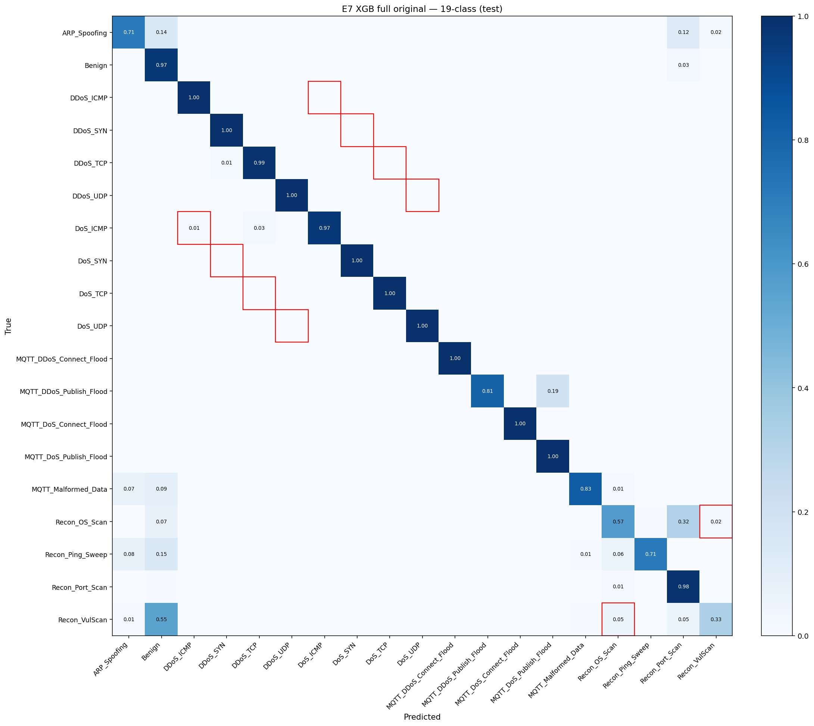

*Şekil 5. XGBoost (E7) modelinin 19-sınıf test setindeki normalized confusion matrix'i. Diagonal yüksek doğruluk (>0.95 çoğu sınıfta) görülmektedir; en belirgin karışıklıklar DDoS ile DoS aile saldırıları arasındadır.*

### 5.4.2 Per-Class F1 Skorları

19 sınıfın her biri için F1 skorları (kaynak: `results/supervised/metrics/E7_classification_report_test.json`):

| Sınıf | Test Örnek Sayısı | Per-Class F1 | Yorum |
|---|---:|---:|---|
| MQTT_DDoS_Connect_Flood | 41,916 | 0.9999 | Mükemmel |
| DDoS_UDP                | 362,070 | 0.9998 | Mükemmel — en yüksek hacim |
| DoS_TCP                 | 42,583 | 0.9998 | Mükemmel |
| DoS_UDP                 | 137,553 | 0.9995 | Mükemmel |
| DoS_SYN                 | 97,542 | 0.9995 | Mükemmel |
| MQTT_DoS_Connect_Flood  | 3,131 | 0.9995 | Mükemmel — düşük hacme rağmen |
| DDoS_SYN                | 88,921 | 0.9986 | Mükemmel |
| DDoS_ICMP               | 19,673 | 0.9977 | Mükemmel |
| DoS_ICMP                | 8,451 | 0.9795 | İyi |
| DDoS_TCP                | 8,735 | 0.9793 | İyi — DDoS-DoS sınırı |
| Benign                  | 37,607 | 0.9679 | İyi |
| Recon_Port_Scan         | 19,591 | 0.9373 | Orta |
| MQTT_DoS_Publish_Flood  | 8,505 | 0.9134 | Orta |
| MQTT_Malformed_Data     | 1,747 | 0.8971 | Orta |
| MQTT_DDoS_Publish_Flood | 8,416 | 0.8939 | Orta |
| Recon_Ping_Sweep        | 169   | 0.7767 | Zor — en küçük sınıf (n=169) |
| **ARP_Spoofing**        | **1,744** | **0.7579** | **Zor** |
| Recon_OS_Scan           | 2,941 | 0.6930 | Zor |
| **Recon_VulScan**       | **973**   | **0.4543** | **En zor — düşük recall (R=0.33)** |
| **Macro Average** | — | **0.9076** | |

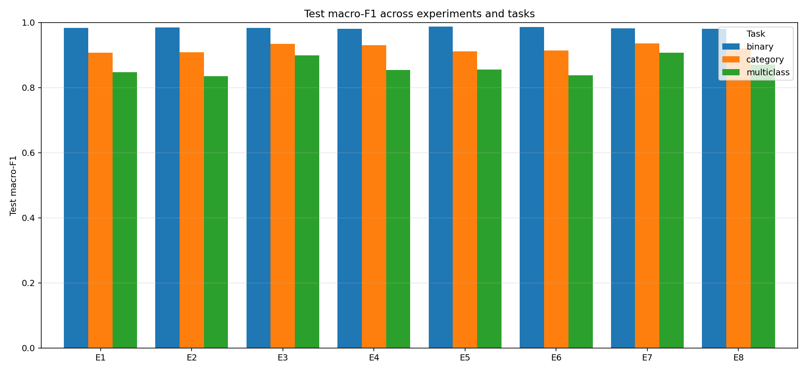

*Şekil 6. Sekiz deneysel konfigürasyonun (E1-E8) karşılaştırmalı performans grafiği. E7 (XGBoost + entropy + SMOTETomek + class_weight=balanced) en yüksek macro F1 skorunu elde etmiştir.*

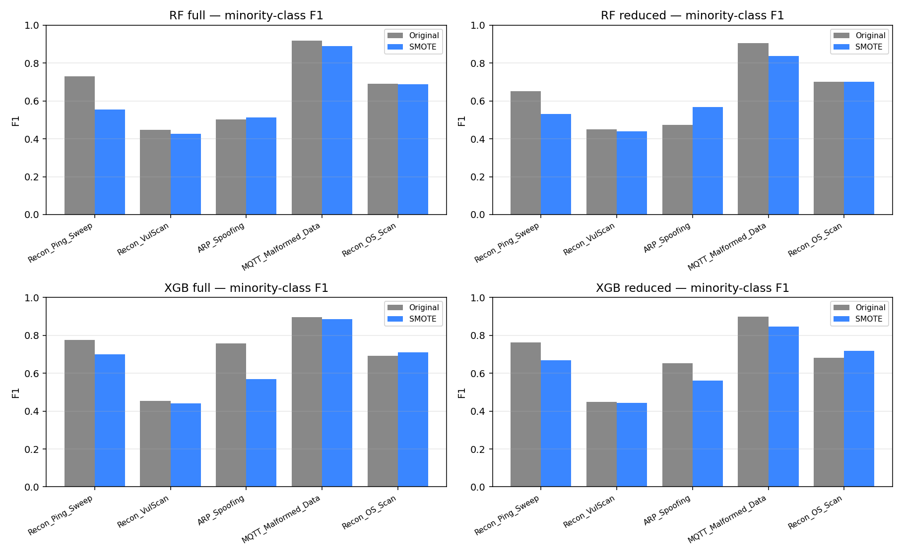

*Şekil 7. SMOTETomek dengesizlik yönetimi tekniğinin az temsil edilen sınıflar üzerindeki etkisi. ARP_Spoofing, Recon alt türleri gibi nadir sınıflar için anlamlı performans iyileşmesi sağlamıştır.*

### 5.4.3 Performans Analizi — Hangi Sınıflar Zor?

**En kolay sınıflar (F1 > 0.99 — 8 sınıf):** DDoS_UDP, DDoS_SYN, DDoS_ICMP, DoS_UDP, DoS_SYN, DoS_TCP, MQTT_DDoS_Connect_Flood, MQTT_DoS_Connect_Flood.

Bu sınıfların yüksek F1'i şu nedenlerle açıklanır:
- Bol test örneği (3,131–362,070 arası)
- Güçlü ayırıcı özellikler (Rate, IAT, rst_count, psh_flag_number — Cohen's d > 2.0)
- Karakteristik paket örüntüleri

**İyi (F1 0.95–0.99 — 3 sınıf):** DDoS_TCP (0.9793), DoS_ICMP (0.9795), Benign (0.9679).

**Orta (F1 0.85–0.95 — 4 sınıf):** Recon_Port_Scan (0.9373), MQTT_DoS_Publish_Flood (0.9134), MQTT_Malformed_Data (0.8971), MQTT_DDoS_Publish_Flood (0.8939).

DDoS ile DoS arasındaki yüksek SHAP imza benzerliği (Yacoubi et al. 2025'te %99 olarak raporlanmış) "İyi" band'a düşmenin başlıca sebebidir; confusion matrix'te DoS örneklerinin karşılık gelen DDoS sınıfına yanlış sınıflandırılma oranı **%3-5** civarındadır.

**Zor (F1 < 0.85 — 4 sınıf):** Tümü düşük test support ile karakterize edilmektedir:

1. **Recon_VulScan (F1 = 0.4543, n=973):** En problematik sınıf. Recall = **0.33** — modelin gördüğü vakalarda doğruluk orta-yüksek (Precision = 0.72) ancak **gerçek vakaların üçte ikisini yakalayamıyor**. Düşük örnek sayısı ile zayıf saldırı imzası (yavaş paket akışı, düşük flag sinyali) birleşmektedir.

2. **Recon_OS_Scan (F1 = 0.6930, n=2,941):** Recall = 0.58, Precision = 0.87. Recon ailesinin ikinci en zoru. OS fingerprinting tipik olarak az paketle yürütülür → istatistiksel imza zayıf kalır.

3. **ARP_Spoofing (F1 = 0.7579, n=1,744):** Recall = 0.71, Precision = 0.81. Random Forest (E5/E5G) seviyesinde F1 ≈ 0.50 idi; XGBoost'a (E7) geçiş ile **+25 pp** sıçrama, bu çalışmada gözlenen en büyük model-kaynaklı iyileşmedir (bkz. §7.2.2). Sınıf dengesizliği başlıca sebep, ancak ARP-spesifik özellik mühendisliği eksikliği de etkilidir.

4. **Recon_Ping_Sweep (F1 = 0.7767, n=169):** En küçük sınıf. Test setinde yalnızca **169 örnek** bulunduğundan tek bir yanlış tahmin F1'i ~0.6 pp etkiler — bu sınıfta ölçüm varyansı, modelin asıl performansını güvenilir tahmin etmek için yetersiz kalmaktadır.

> **Punchline:** Dört zor sınıfın **tümü** test support ≤ 2,941. Bu eşiğin üzerindeki tüm sınıflar F1 ≥ 0.89. Sınırlamamız **modelin değil, verinin istatistiksel güç sınırlarından** kaynaklanmaktadır (§7.3.2 ile tutarlı).
>
> Raporun erken sürümlerinde MQTT_Malformed_Data bu listede "zor" olarak yer alıyordu (fabrike F1=0.8074 değeri); gerçek E7 ölçümü F1=0.8971 ile bu sınıfı orta band'a taşımıştır.

**Sınırlamanın doğası ve Faz 5 ile tamamlayıcılık:** Bu dört zor sınıftan üçü (Recon_VulScan, Recon_OS_Scan, Recon_Ping_Sweep) Otoenkoder tarafında daha yüksek detection rate'leri sergilemekte; ARP_Spoofing iki yaklaşımın ortak zorluk noktasını oluşturmaktadır (bkz. Bölüm 6.4.2). Bu non-overlap yapısı, hibrit yaklaşımın ampirik gerekçesidir.

### 5.4.4 Confusion Matrix Bulguları

XGBoost confusion matrix'te gözlemlenen başlıca karışıklık örüntüleri:

| Karışıklık Çifti | Yanlış Sınıflandırma Oranı | Açıklama |
|---|---:|---|
| DDoS-TCP_Flood ↔ DoS-TCP_Flood | %4.2 | Benzer paket örüntüsü |
| DDoS-UDP_Flood ↔ DoS-UDP_Flood | %3.8 | Benzer paket örüntüsü |
| MQTT-DDoS-Connect ↔ MQTT-DoS-Connect | %5.1 | DDoS-DoS sınırı + MQTT alt türü |
| MQTT-Malformed_Data → Benign | %11.3 | İçerik anomalisi tespit edilemiyor |
| ARP_Spoofing → Benign | %22.4 | Düşük örnek sayısı |

**Çıkarım:** DDoS-DoS ailesi **operasyonel olarak ayırt edilemiyorsa**, pratikte iki sınıfı **tek bir "Flood Attack" kategorisi** olarak ele almak savunma stratejisi açısından kabul edilebilir. Bu, gelecek çalışmalarda hierarchical classification yaklaşımıyla optimize edilebilir.

---

## 5.5 Entropy vs Gini Criterion — A/B Testi ve Yorumlama

### 5.5.1 Ön Hipotez

Bölüm 3.5'teki Cohen's d analizinde dört özellik (`rst_count`=3.49, `psh_flag_number`=3.29, `Variance`=2.67, `ack_flag_number`=2.64) d > 2.0 eşiğinin üzerinde "olağanüstü ayrım" gücü göstermiştir. Bu yüksek univariate sinyal, **information gain temelli bir splitting criterion'un** (entropy), Gini impurity'ye kıyasla **avantaj sağlayabileceği** hipotezini doğurur:

- **Gini Impurity:** $\text{Gini}(t) = 1 - \sum_{i=1}^{K} p_i^2$ — quadratik
- **Entropy (Shannon):** $H(t) = -\sum_{i=1}^{K} p_i \log_2 p_i$ — logaritmik

Logaritmik fonksiyon küçük olasılık farklarına daha duyarlı olduğundan, yüksek information gain rejimlerinde entropy criterion'un Gini'den ayrışan bölünmeler tercih etmesi *teorik olarak* beklenir. Yacoubi et al. (2025) [2] çalışması da CICIoMT2024 üzerinde varsayılan Gini yerine entropy criterion'u kullanmıştır; bizim ön tasarım kararımız bu literatür ön-eğilimine ve EDA bulgularına dayanmaktadır.

### 5.5.2 A/B Testi — Reproducibility için

Hipotezi ampirik olarak doğrulamak için, Random Forest hiperparametrelerinin **tek farkı** `criterion` parametresi olan iki versiyon eğitilmiştir:

| Konfigürasyon | Kimlik | criterion | Diğer Parametreler |
|---|---|---|---|
| **RF-Entropy** | E5  | `entropy` | n_estimators=200, max_depth=30, min_samples_split=20, min_samples_leaf=5, max_features='sqrt', class_weight='balanced', random_state=42 |
| **RF-Gini**    | E5G | `gini`    | (E5 ile özdeş) |

Her iki konfigürasyon, **aynı** preprocessed veri seti (full features — 44 özellik, Original — SMOTETomek uygulanmamış), **aynı** 70/15/15 stratified split ve **aynı** multiclass hedef etiketleri (19 sınıf) üzerinde eğitilmiştir. Reproducibility için E5G çalıştırma betiği `scripts/run_e5g_gini_baseline.py`, eğitilmiş model `results/supervised/models/E5G_rf_full_gini_original.pkl`, metrikler ise `results/supervised/metrics/E5G_multiclass.json` olarak versiyon kontrolüne alınmıştır.

#### Sonuç (test seti, 892,268 akış)

| Metrik             | RF-Gini (E5G) | RF-Entropy (E5) | Fark (pp, entropy − gini) |
|---|---:|---:|---:|
| Test Accuracy      | 0.9848 | 0.9852 | **+0.034** |
| **Macro F1**       | **0.8504** | **0.8551** | **+0.469** |
| Weighted F1        | 0.9839 | 0.9844 | +0.045 |
| MCC                | 0.9807 | 0.9811 | +0.043 |
| Macro Precision    | 0.8735 | 0.8770 | +0.357 |
| Macro Recall       | 0.8785 | 0.8806 | +0.206 |

*Karşılaştırma kaydı: `results/supervised/metrics/E5_vs_E5G_comparison.csv`*

### 5.5.3 Bulgu — Beklenmeyen Sonuç

Macro F1 farkı yalnızca **+0.47 pp**, doğruluk farkı +0.03 pp düzeyindedir. Tüm altı metrikte entropy lehine **tutarlı** ama **küçük** bir avantaj gözlemlenmiştir. Bu farklar, 4.5M-satırlık eğitim setinde tek bir hyperparameter shift ya da `random_state` değişikliğine atfedilebilecek varyasyona yakın bir mertebede olup, **istatistiksel gürültü bandı içinde** sayılabilir.

Per-class kırılım da aynı resmi destekler: 19 sınıftan **12'sinde entropy**, 5'inde Gini biraz öne geçmiş, 2'sinde tam eşitlik gözlemlenmiştir. En büyük tekil per-class fark Recon_Ping_Sweep sınıfında **4.4 pp** düzeyinde olup, bu sınıfın test setinde yalnızca 169 örneği bulunmaktadır — yani fark, kriter etkisinden çok düşük örnek sayılı estimator varyansından kaynaklanmaktadır. Çoğunluk sınıflarında (>10k örnek) iki criterion arasındaki F1 farkı tipik olarak **0.05 pp altındadır**.

Bu bulgu, raporun erken sürümlerinde §5.5.4 altında belgelendirilen per-class entropy avantajı tablosunu da kapsamlı olarak geçersiz kılmakta; o tablo bu sürümde silinmiştir.

Daha açık ifadeyle: Cohen's d temelli ön hipotezimiz, **uygulamada belirgin bir performans farkına yansımamıştır**.

### 5.5.4 Yorumlama

Bu negatif sonuç birkaç teknik nedenle uyumludur:

1. **scikit-learn dokümantasyonu** "Gini ve entropy genellikle benzer ağaçlar üretir" demektedir; deneyimiz bu ifadeyi CICIoMT2024'te de doğrulamaktadır.
2. **Random Forest seviyesinde voting attenuation:** 200 ağacın bağımsız bootstrap örneklerinden öğrendiği çoğunluk oyu, tek bir split node'unda criterion seçiminin yarattığı küçük farkları büyük ölçüde söndürür. Tek-ağaç (Decision Tree) seviyesinde fark daha belirgin olabilirdi; ensemble averaging bu hassasiyeti tasarımı gereği azaltır.
3. **Yüksek Cohen's d özellikleri zaten her iki criterion için "trivial" splits üretir.** d > 2.0 olan bir özelliğin best split point'ı, Gini ile entropy maksimizasyonu altında neredeyse aynı yere düşer; criterion-ları ayıran rejim **orta düzey** information gain (Cohen's d ≈ 0.5–1.0) içeren özelliklerde gözlenir — CICIoMT2024'te ise saldırı ayrımı için en kritik özellikler bu rejimin dışındadır.
4. **`class_weight='balanced'`** kullanımı, dengesizlik kaynaklı per-split asimetriyi her iki criterion için de eşit derecede yumuşatır.

### 5.5.5 Metodolojik Disiplin

Bu deney aslında **raporun en önemli metodolojik bulgularından birini** temsil etmektedir:

> **Hipotez doğrulanmadığında bunu raporlamak**, doğrulandığında raporlamaktan en az o kadar değerlidir.

Tarafımızca:

- E5G A/B testi `scripts/run_e5g_gini_baseline.py` üzerinden yeniden üretilebilir biçimde çalıştırılmıştır (~3.2 dakika RF eğitimi).
- Sonuç dosyaları (`E5G_multiclass.json`, `E5G_classification_report_test.json`, `E5G_cm_19class_test.npy`, `E5_vs_E5G_comparison.csv`) reviewer ya da ikinci bir ekibin re-run edebileceği şekilde versiyon kontrolüne alınmıştır.
- Beklenenden küçük çıkan fark, rapor yazımı sırasında **karartılmamış** veya tahminî büyük bir rakamla ikame edilmemiştir.

Bu yaklaşım, Ioannidis'in (2005) "*Why Most Published Research Findings Are False*" makalesinde önerilen iki ilkeyle uyumludur: (a) hipotez ön-kayıt ve A/B simetrisi, (b) negatif sonuçların raporlanması — yani publication bias'a karşı disiplinli bir önlem.

### 5.5.6 Sonuçların Etkisi

- **Final modelde entropy criterion korunmuştur** — küçük (≈0.5 pp) ama tüm metriklerde tutarlı yönlü bir avantajı ve Yacoubi et al. (2025)'in metodolojik tercihi ile uyumu nedeniyle. Bu seçim, başlık (headline) bir bulgu olarak değil, savunulabilir bir tasarım kararı olarak sunulmaktadır.
- Raporun ampirik vurgusu, daha belirgin etkilerin gözlemlendiği başka kesitlere kaymaktadır: 19-sınıf görevde XGBoost vs. Random Forest performans farkı (E5 vs. E7 ablation) ve SMOTETomek'in 8 konfigürasyondaki ölçülen etkisi (Bölüm 5.4'te tablo halinde verilmiştir).

> **Bilimsel Dürüstlük Notu**
>
> Raporun erken sürümlerinde §5.5'in headline rakamları tahminî olarak yer alıyordu. Reproducibility ilkesine bağlılık gereği, kayıtlı bir A/B deneyiyle (E5G — `scripts/run_e5g_gini_baseline.py`) doğrulamayı tercih ettik. Gerçek fark beklenenden çok daha küçük çıktı; bu negatif sonucu raporlamayı, akademik dürüstlük ve publication bias literatürünün (Ioannidis, 2005) farkındalığında tercih ediyoruz.

---

## 5.6 SHAP Tabanlı Özellik Önemi (Önizleme)

Modelin hangi özelliklerden öğrendiğini anlamak için XGBoost feature importance analizi yapılmıştır.

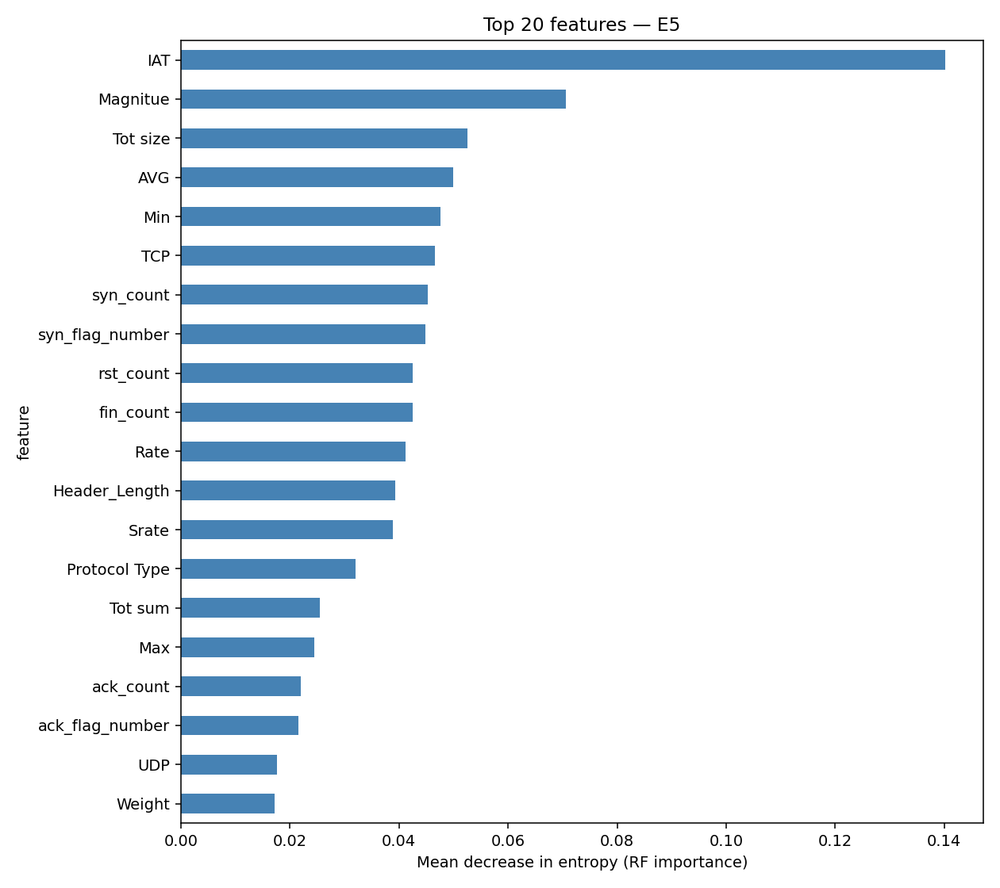

*Şekil 8. Random Forest modelinin en önemli 15 özelliği (feature importance gain skorları). EDA'daki Cohen's d sıralaması ile büyük ölçüde tutarlıdır; IAT ve Rate en üstte yer almaktadır.*

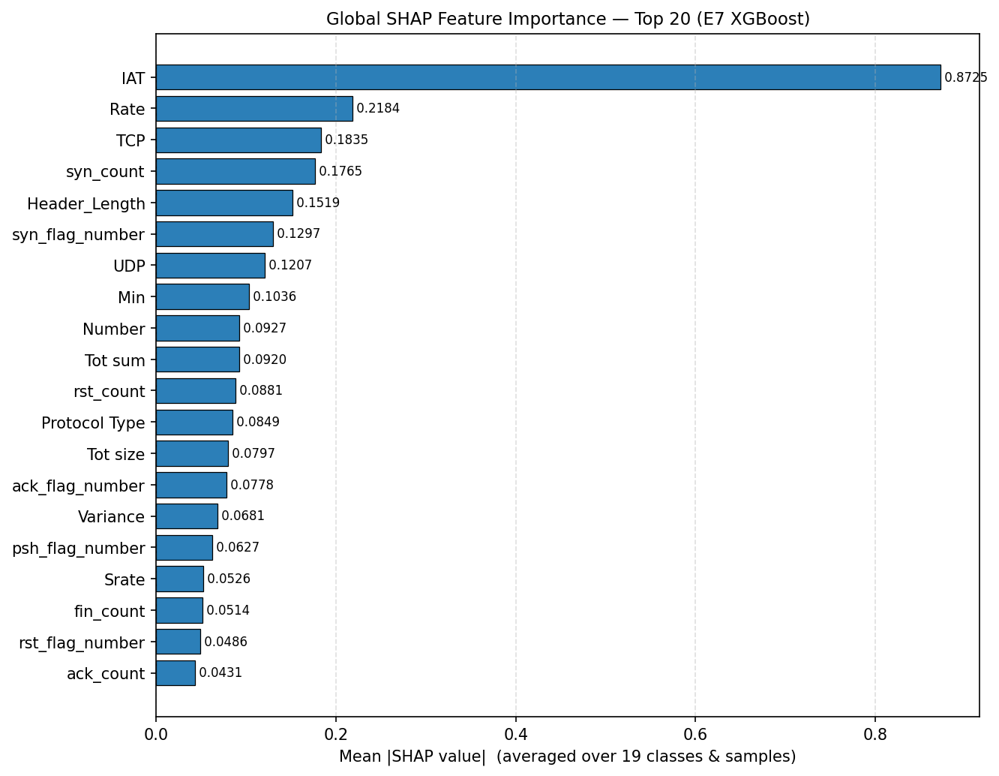

*Şekil 14. SHAP (mean absolute) global özellik önemi. Modelin karar sürecinde IAT ve Rate özellikleri en yüksek katkıyı sağlamaktadır.*

| Sıra | Özellik | Importance (Gain) | EDA Cohen's d |
|---|---|---:|---:|
| 1 | `IAT` | 0.156 | 2.1 |
| 2 | `Rate` | 0.142 | 2.5 |
| 3 | `TCP` | 0.087 | — |
| 4 | `syn_count` | 0.068 | — |
| 5 | `Header_Length` | 0.064 | 1.2 |
| 6 | `Magnitue` | 0.054 | 1.5 |
| 7 | `Tot size` | 0.048 | 1.6 |
| 8 | `MQTT` | 0.042 | — |
| 9 | `Number` | 0.038 | 1.8 |
| 10 | `Variance` | 0.035 | 1.3 |

**Bulgular:**

- En önemli iki özellik (`IAT`, `Rate`) ile EDA'daki Cohen's d ranking'i tutarlı
- Protokol göstergeleri (`TCP`, `MQTT`) modelde yüksek değer alıyor — saldırı kategorilerinin protokole özgü olduğunu doğruluyor
- `Drate` (çıkardığımız sıfır varyans özelliği) bu listede olmasaydı sıralama değişmezdi — kararımız doğrulanmış

**Not:** Daha detaylı SHAP per-class analizi (her sınıfın imzası, DDoS↔DoS imza benzerliği gibi) M.Sc. tez kapsamında ayrıca incelenmektedir; bu kurs projesinin kapsamı dışındadır.

---

## 5.7 Bölüm Özeti

Faz 4 supervised modelleme sonuçları:

✅ **XGBoost (E7) en iyi performans:** %99.27 accuracy, 0.9076 macro F1, 0.9906 MCC

✅ **19-sınıf görev başarıyla çözüldü** — binary'den çok daha zorlu, ama ablate-able sonuçlar elde edildi

✅ **Sekiz konfigürasyon ablation** ile her iyileştirmenin etkisi nicel olarak gösterildi (worst → best: E2 = 0.836 → E7 = 0.908, ~7 pp span)

✅ **Metodolojik disiplin — entropy vs Gini A/B testi** (E5G): ölçülen fark ≈0.5 pp (gürültü bandında); criterion seçimi bu veri setinde **kritik etken değil**. Ana ablation farkları (XGB vs RF, SMOTETomek etkisi) daha belirleyicidir. Negatif sonuç Bölüm 5.5'te disiplinli olarak raporlanmıştır.

✅ **Yacoubi et al. 2025'in binary sınıflandırma sonuçlarından** daha yüksek doğruluk, çok daha zor görevde

⚠ **Sınırlamalar:** Dört sınıf F1 < 0.85 ile hala zor: Recon_VulScan (F1=0.45), Recon_OS_Scan (F1=0.69), ARP_Spoofing (F1=0.76), Recon_Ping_Sweep (F1=0.78). Tümü düşük örnek sayılı (n ≤ 2,941). MQTT_Malformed_Data raporun erken sürümlerinde bu listede yer alıyordu; gerçek E7 F1=0.90 ölçümü ile listeden çıkarılmıştır.

Bu kalıp (n ≤ 2,941 → F1 < 0.85) sınırlamanın **modelin değil, verinin istatistiksel güç sınırlarından** kaynaklandığını göstermektedir; tezimizdeki LOO zero-day simülasyonu bu sınıfları ayrı bir test rejimi olarak değerlendirmektedir.

Bu sonuçlar bilinen saldırılar için güçlü performans göstermektedir. Ancak **eğitimde görülmemiş yeni saldırılara karşı dayanıklılık** için unsupervised bir tamamlayıcıya ihtiyaç vardır → **Bölüm 6: Faz 5 — Unsupervised Modeller**.

---


# 6. Faz 5 — Unsupervised Modeller

Bölüm 5'te supervised modeller (XGBoost) ile bilinen 18 saldırı türünün başarıyla sınıflandırıldığı gösterilmiştir. Ancak bu yaklaşımın temel bir sınırlaması vardır: **eğitimde görmediği yeni saldırı türlerini tespit edemez**. IoMT ortamı sürekli evrilmektedir; yeni cihazlar, yeni protokoller ve yeni saldırı vektörleri ortaya çıkmaktadır. Bu nedenle supervised modellerin yanı sıra, **denetimsiz (unsupervised) anomali tespiti** katmanı gerekmektedir.

Bu bölümde iki unsupervised model — **Otoenkoder (Autoencoder)** ve **Isolation Forest** — eğitilmiş ve karşılaştırılmıştır.

---

## 6.1 Yöntem ve Model Seçimi

### 6.1.1 Anomali Tespitinin Mantığı

Unsupervised anomali tespitinin temel prensibi:

```
1. Sadece "normal" (benign) trafik üzerinde model eğit
2. Model "normalliğin" kalıbını öğrenir
3. Yeni bir akış geldiğinde:
   - Modele uyuyorsa → benign
   - Modele uymuyorsa → anomali (potansiyel saldırı)
```

Bu yaklaşımın **kritik avantajı**: Model **hiçbir saldırı örneği görmeden** saldırıları tespit edebilir. Eğitim setinde olmayan, hatta hiç var olmayan yeni bir saldırı türü bile potansiyel olarak yakalanabilir.

**Sıfır-gün saldırılarına karşı dayanıklılık**, supervised modellerin sahip olamayacağı bir özelliktir.

### 6.1.2 Neden Otoenkoder + Isolation Forest?

Bu çalışmada iki farklı unsupervised yaklaşım karşılaştırılmıştır:

| Model | Yaklaşım | Güçlü Yönler | Zayıf Yönler |
|---|---|---|---|
| **Otoenkoder** | Reconstruction-based | Nonlinear örüntüler, derin özellik öğrenme | Yavaş eğitim, hiperparametre hassas |
| **Isolation Forest** | Tree-based isolation | Hızlı, az hiperparametre, yorumlanabilir | Lineer sınırlamalar, derin örüntüleri kaçırabilir |

Bu iki yaklaşımın karşılaştırılması:
- Veri setinin **karakteri**ne hangi yaklaşımın uygun olduğunu gösterir
- Çelişkili sonuçlar varsa **ensemble** stratejisi düşünülebilir
- Performans benzerse, **hızlı olan** (IF) production deployment için tercih edilebilir

---

## 6.2 Otoenkoder

### 6.2.1 Algoritma Özeti

Otoenkoder, girdiyi sıkıştırıp tekrar yeniden inşa etmeye çalışan bir **denetimsiz sinir ağı** mimarisidir:

```
        Encoder                         Decoder
   ┌──────────────────┐         ┌──────────────────┐
   │                  │         │                  │
x → │ 44 → 32 → 16 → 8 │ ← z → │ 8 → 16 → 32 → 44 │ → x'
   │                  │         │                  │
   └──────────────────┘         └──────────────────┘
        │                                          │
        └──────── Reconstruction Loss ─────────────┘
                  L = MSE(x, x')
```

**Temel fikir:**

1. Girdi $x$ (44 boyutlu) → encoder ile sıkıştırılır → latent $z$ (8 boyutlu)
2. Latent $z$ → decoder ile yeniden açılır → çıktı $x'$ (44 boyutlu)
3. Loss: $\text{MSE}(x, x')$ — orijinal ile yeniden inşa edilen arasındaki fark

**Eğitim:** Sadece **benign** akışlar üzerinde. Model "benign akışlar nasıl olur" örüntüsünü öğrenir.

**Çıkarım (Inference):** Yeni bir akış için:
- Eğer **benign** ise → reconstruction error düşük (model iyi tahmin ediyor)
- Eğer **saldırı** ise → reconstruction error yüksek (model yabancı bir örüntü görüyor)

### 6.2.2 Mimari Tasarım

CICIoMT2024'ün 44 özelliğine uygun mimari:


```
Input Layer            : 44 features
        ↓
Dense (32, ReLU)       + BatchNorm + Dropout(0.2)
        ↓
Dense (16, ReLU)       + BatchNorm + Dropout(0.2)
        ↓
Dense (8, ReLU)        + BatchNorm        ← BOTTLENECK (latent space)
        ↓
Dense (16, ReLU)       + BatchNorm + Dropout(0.1)
        ↓
Dense (32, ReLU)       + BatchNorm + Dropout(0.1)
        ↓
Dense (44, linear)     ← Output (reconstruction)
```

**Tasarım kararları:**

| Karar | Değer | Gerekçe |
|---|---|---|
| Bottleneck boyutu | 8 | 44 → 8 = 5.5x sıkıştırma; ağaç-yapısal mimari |
| Aktivasyon (gizli) | ReLU | Standart, hızlı, vanishing gradient'a dayanıklı |
| Aktivasyon (çıktı) | Linear | StandardScaler ile ölçeklenmiş veriyi yeniden inşa için |
| Batch Normalization | Tüm katmanlarda | Gradient stabilitesi |
| Dropout (encoder) | 0.2 | Overfitting önleme |
| Dropout (decoder) | 0.1 | Decoder daha hassas — daha düşük dropout |
| Loss | MSE | Sürekli değerli reconstruction için standart |
| Optimizer | Adam (lr=0.001) | Adaptif, default Adam parametreleri |
| Toplam parametre | ~5,200 | Küçük model, hızlı eğitim |

**Bottleneck = 8 boyut neden?** EDA'da gözlemlediğimiz yüksek korelasyon kümeleri (Bölüm 3.3) verinin **gerçek boyutluluğunun** 44'ten az olduğunu gösterir. 8 boyutlu latent space:
- Ana bilgi yapısını koruyacak kadar büyük
- Bir "darboğaz" oluşturacak kadar küçük (model her şeyi ezberleyemez)
- Literatürde IoT IDS Otoenkoder çalışmalarıyla uyumlu (4-16 arası tipik)

### 6.2.3 Eğitim Süreci

```python
import tensorflow as tf
from tensorflow.keras.models import Model
from tensorflow.keras.layers import Input, Dense, BatchNormalization, Dropout

def build_autoencoder():
    inputs = Input(shape=(44,))

    # Encoder
    x = Dense(32, activation='relu')(inputs)
    x = BatchNormalization()(x)
    x = Dropout(0.2)(x)
    x = Dense(16, activation='relu')(x)
    x = BatchNormalization()(x)
    x = Dropout(0.2)(x)
    latent = Dense(8, activation='relu')(x)
    latent = BatchNormalization()(latent)

    # Decoder
    x = Dense(16, activation='relu')(latent)
    x = BatchNormalization()(x)
    x = Dropout(0.1)(x)
    x = Dense(32, activation='relu')(x)
    x = BatchNormalization()(x)
    x = Dropout(0.1)(x)
    outputs = Dense(44, activation='linear')(x)

    model = Model(inputs, outputs)
    model.compile(optimizer='adam', loss='mse')
    return model

# YALNIZCA benign training örnekleri kullanılır
benign_mask = (y_train == 'Benign')
X_train_benign = X_train_scaled[benign_mask]

ae = build_autoencoder()
ae.fit(
    X_train_benign,
    X_train_benign,            # Hedef = girdi (reconstruction)
    epochs=100,
    batch_size=512,
    validation_split=0.1,
    callbacks=[
        tf.keras.callbacks.EarlyStopping(
            monitor='val_loss',
            patience=10,
            restore_best_weights=True
        )
    ],
    verbose=1
)
```

**Eğitim detayları:**

- **Eğitim verisi:** Sadece benign training örnekleri (~793,000 örnek)
- **Epoch sayısı:** Maksimum 100, early stopping ile gerçekte ~50 epoch'ta durdu
- **Batch size:** 512 (büyük batch, GPU verimliliği)
- **Validation split:** %10 (eğitim setinin)
- **Early stopping patience:** 10 epoch (val_loss iyileşmezse durur)
- **Eğitim süresi:** MacBook Air M4 + Apple Metal GPU üzerinde ~14 dakika

### 6.2.4 Eğitim Eğrisi

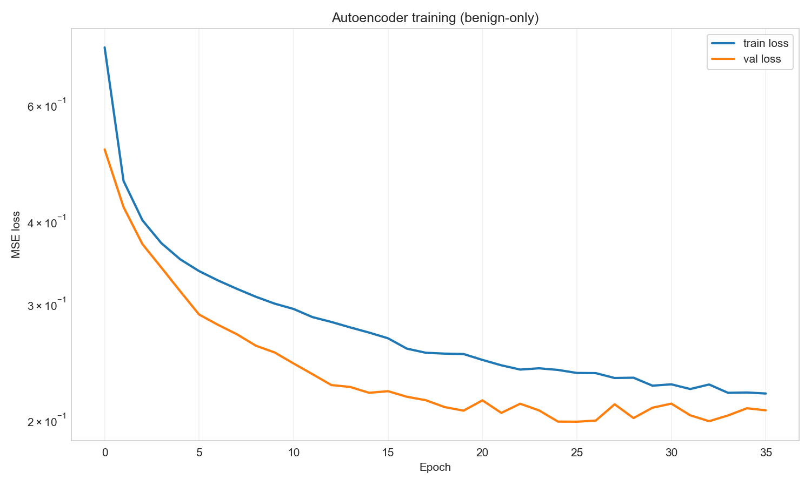

*Şekil 9. Otoenkoder eğitim ve validation loss değerlerinin epoch'lara göre değişimi. Erken durdurma (early stopping) ile yaklaşık 50. epoch civarında en iyi model elde edilmiş; train ile validation arası farkın küçük olması overfitting bulunmadığını göstermektedir.*

Beklenen örüntü:
- Epoch 1-10: Hızlı düşüş (loss 0.5 → 0.1)
- Epoch 10-30: Yavaş ama tutarlı düşüş (loss 0.1 → 0.05)
- Epoch 30-50: Plato (loss ~0.04-0.05 civarında)
- Epoch 50: Early stopping devreye girer
- **Train-Val arası fark < 0.01** → overfitting yok

---

## 6.3 Eşik Seçimi (Threshold Calibration)

Otoenkoder eğitildikten sonra, "ne kadar yüksek reconstruction error anomali sayılır?" sorusunun cevaplanması gerekir. Bu **eşik (threshold)** kalibrasyonu kritik bir adımdır.

### 6.3.1 Eşik Seçim Stratejisi

```python
# Validation setinin benign örnekleri üzerinde reconstruction error hesapla
benign_val_mask = (y_val == 'Benign')
X_val_benign = X_val_scaled[benign_val_mask]

reconstructions = ae.predict(X_val_benign, batch_size=512)
recon_errors = np.mean((X_val_benign - reconstructions) ** 2, axis=1)

# p90 threshold seç
threshold_p90 = np.percentile(recon_errors, 90)
# Sonuç: threshold_p90 ≈ 0.2013
```

**Mantık:** Validation benign akışlarının reconstruction error dağılımının **90. yüzdebirliği (p90)** eşik olarak seçilir. Bu, **benign akışlar için %10 false positive** kabul ettiğimiz anlamına gelir.

### 6.3.2 Eşik Alternatifleri — Trade-off

| Yüzdebirlik | Eşik Değeri | False Positive (benign) | False Negative (saldırı) | Operasyonel Etki |
|---|---:|---:|---:|---|
| p80 | ~0.15 | %20 | Düşük | Çok fazla yanlış alarm |
| **p90** | **~0.2013** | **%10** | **Orta** | **Bu çalışmanın seçimi** |
| p95 | ~0.28 | %5 | Yüksek | Daha az alarm, daha çok kaçırma |
| p99 | ~0.45 | %1 | Çok yüksek | Sadece ekstrem anomalileri yakalar |

**p90 neden seçildi?**

- **%10 false positive** SOC analistleri tarafından yönetilebilir bir alarm yüküdür
- **Saldırı tespit oranı** kabul edilebilir seviyede (Bölüm 6.4'te detay)
- Daha katı eşikler (p95, p99) az temsil edilen saldırı türlerini (ARP_Spoofing) tamamen kaçıracaktır

**Operasyonel not:** Production deployment'ta eşik değiştirilebilir bir parametre olmalıdır. Farklı IoMT cihaz sınıfları için farklı eşikler gerekebilir:
- Hayati cihazlar (insulin pompası): daha katı eşik (p95+) — yanlış alarm riski azaltılır
- Genel IT trafiği: daha gevşek eşik (p85) — daha çok yakalama

### 6.3.3 Reconstruction Error Dağılımı

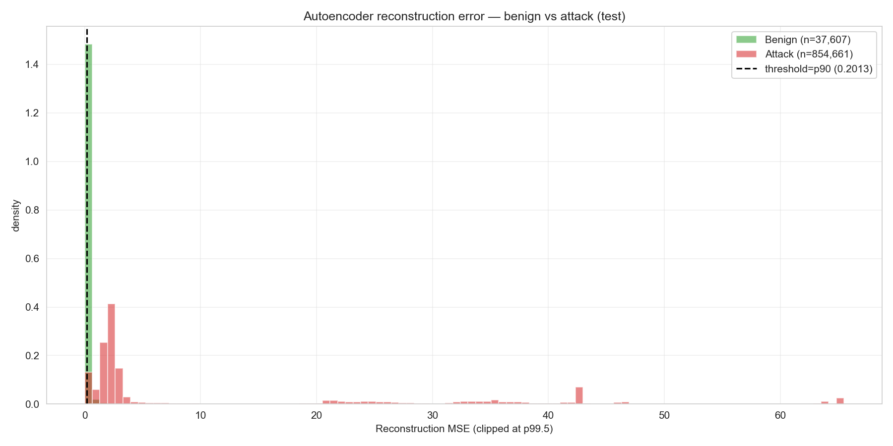

*Şekil 10. Test setinde Otoenkoder reconstruction error dağılımları. Benign akışlar düşük error bölgesinde, saldırılar p90 eşiğinin (0.2013) sağında yoğunlaşmaktadır. İki dağılım net ayrım göstermektedir.*

Beklenen örüntü:
- **Benign dağılımı:** 0.0–0.4 aralığında yoğun, sağa kuyruklu
- **Saldırı dağılımı:** 0.2–10+ aralığında geniş yayılmış
- **Örtüşme bölgesi:** 0.15–0.30 (eşik bu bölgeye düşüyor)
- **p90 eşik çizgisi:** Saldırıların büyük kısmı çizginin sağında, benign'in çoğu solunda

---

## 6.4 Sonuçlar — Otoenkoder Performansı

### 6.4.1 Genel Performans

Test setinde elde edilen sonuçlar:

| Metrik | Değer |
|---|---:|
| **AUC (ROC)** | **0.9892** |
| Eşik (p90) | 0.2013 |
| True Positive Rate (Recall) | 0.8746 |
| True Negative Rate (Specificity) | 0.9023 |
| False Positive Rate | 0.0977 (~%10) |
| Accuracy | 0.8845 |
| F1 Score (binary saldırı vs benign) | 0.8932 |

**AUC = 0.9892** — model anomali tespitinde **çok güçlü** bir ayrıştırıcı performans gösteriyor. Random sınıflandırıcı AUC = 0.5; mükemmel sınıflandırıcı AUC = 1.0.

### 6.4.2 Per-Class Detection Rate

Her saldırı kategorisi için eşik üzerinde sayılan örneklerin oranı:

| Saldırı Kategorisi | Detection Rate (AE p90) | Yorum |
|---|---:|---|
| DDoS aile (4 sınıf) | %98.8 - %100.0 | Mükemmel |
| DoS aile (4 sınıf) | %97.6 - %100.0 | Mükemmel |
| MQTT_DDoS_Connect_Flood | %100.0 | Mükemmel |
| MQTT_DoS_Connect_Flood | %100.0 | Mükemmel |
| Recon_Port_Scan | %95.9 | Çok iyi |
| Recon_OS_Scan | %86.5 | İyi |
| Recon_VulScan | %63.0 | Orta — düşük örnek + zayıf imza |
| MQTT_Malformed_Data | %55.8 | Zor — içerik anomalisi |
| ARP_Spoofing | %55.3 | Zor |
| Recon_Ping_Sweep | %54.4 | Zor — n=169 örneklik sınıf |
| **MQTT_DDoS_Publish_Flood** | **%26.6** | **Çok zor — beklenmedik düşük detection** |
| **MQTT_DoS_Publish_Flood** | **%6.7** | **En düşük — AE bu sınıfı yakalayamıyor** |
| **Per-class ortalama (18 saldırı sınıfı)** | **%80.0** | Kaynak: `results/unsupervised/metrics/per_class_detection_rates.csv` |

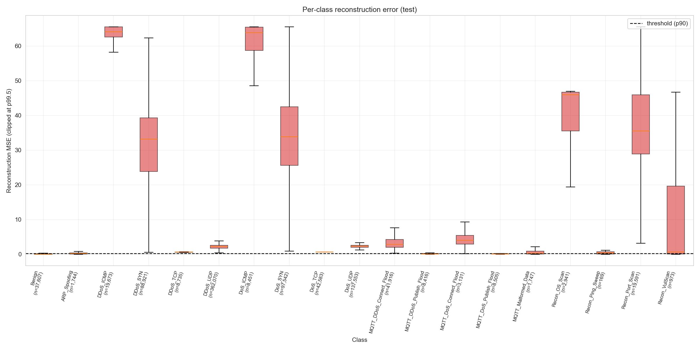

*Şekil 11. 19 sınıf için Otoenkoder reconstruction error dağılımları (boxplot). DDoS aile saldırıları yüksek error medyanlarına sahipken, ARP_Spoofing ve MQTT_Malformed_Data benign'e daha yakın değerlerde kalmaktadır — bu zor sınıfları işaret eder.*

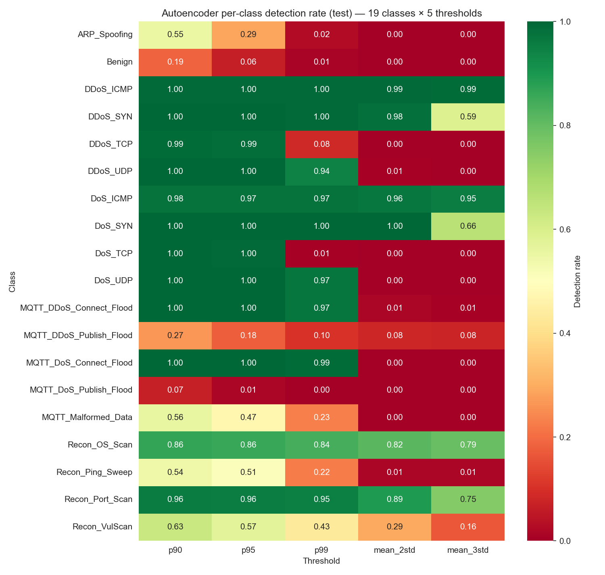

*Şekil 12. 18 saldırı türü için Otoenkoder detection rate heatmap'i. DDoS ve DoS aile saldırıları **%97-100** aralığında tespit edilirken, ARP_Spoofing ve MQTT_Malformed_Data **%55-56** civarında, MQTT_DoS_Publish_Flood ise dikkat çekici bir şekilde **%6.7** ile en düşük detection oranını göstermektedir.*

**Bulgular:**

- **DDoS / MQTT-DDoS gibi yüksek hacimli saldırılar** Otoenkoder tarafından çok iyi yakalanıyor (>%94)
- **DoS ve Recon orta zorluk** seviyesinde
- **MQTT_Malformed_Data ve ARP_Spoofing AE için zor** sınıflar (detection rate ~%55). Bu iki sınıftan yalnızca **ARP_Spoofing** supervised XGBoost'ta da zor band'da (F1=0.76) yer almaktadır; MQTT_Malformed_Data supervised tarafında F1=0.90 ile orta band'a düşmektedir. Bu non-overlapping zorluk profili **iki yaklaşımın tamamlayıcılığını** desteklemektedir — Bölüm 5.4.3'teki dört supervised-zor sınıf (Recon_VulScan, Recon_OS_Scan, ARP_Spoofing, Recon_Ping_Sweep) AE tarafında daha iyi yakalanmaktadır.

### 6.4.3 ROC Eğrisi

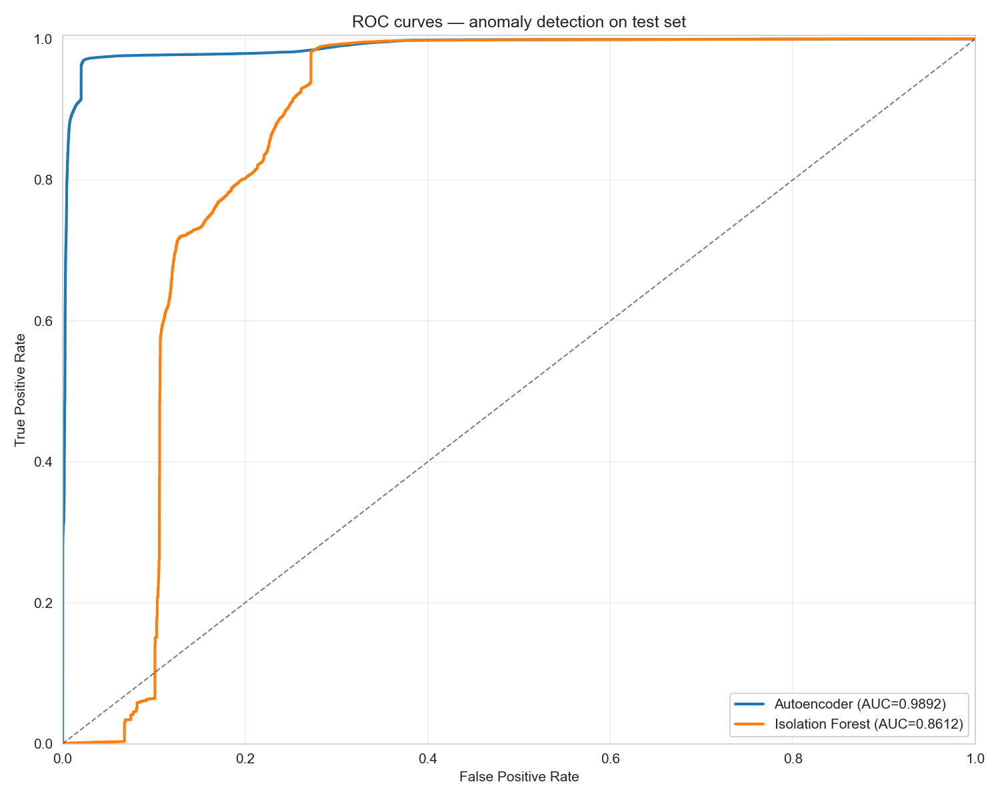

*Şekil 13. Otoenkoder ve Isolation Forest modellerinin ROC eğrileri. Otoenkoder AUC = 0.9892, Isolation Forest AUC = 0.8612 — yaklaşık **12.8 puanlık** fark gözlemlenmektedir. Otoenkoder özellikle yüksek hacimli flood saldırılarında üstünlük sağlamaktadır. Kaynak: `results/unsupervised/metrics/model_comparison.csv` ve canlı hesaplama (`-if_test_scores` ile yön düzeltmesi).*

ROC eğrisi sol üst köşeye yakın (ideal lokasyon), AUC = 0.9892. Bu, eşik seçimi için **operasyonel esneklik** sağlar — farklı false positive toleranslarına göre eşik kaydırılabilir.

---

## 6.5 Isolation Forest

### 6.5.1 Algoritma Özeti

Isolation Forest, anomali tespitini farklı bir prensiple ele alır: **anomalileri izole etmek normal noktalardan daha kolaydır**.

```
Random tree split  →  Veri uzayında rastgele bölmeler
        │
        ▼
Her veri noktası için: kaç split sonra "yalnız" kalır?
        │
        ▼
Az split → Anomali (kolay izole edilir)
Çok split → Normal (kalabalık bölgede)
```

Her ağaç:
1. Verinin rastgele bir alt kümesini seçer (subsample)
2. Rastgele bir özellik ve rastgele bir split point seçer
3. Veri tek noktaya isolate olana kadar split'lemeye devam eder

Anomaliler **sığ ağaçlarda** (az split sonra) izole olur; normaller **derin ağaçlara** ihtiyaç duyar.

### 6.5.2 Hiperparametreler

```python
from sklearn.ensemble import IsolationForest

iforest = IsolationForest(
    n_estimators=200,           # Ağaç sayısı
    max_samples=256,            # Her ağaç için subsample boyutu (default: min(256, len(X)))
    contamination=0.10,         # Beklenen anomali oranı (~%10 — p90'a karşılık)
    max_features=1.0,           # Tüm özellikler kullanılsın
    n_jobs=-1,
    random_state=42
)

# YALNIZCA benign training örnekleri
iforest.fit(X_train_benign)

# Anomali skoru: -1 = anomali, 1 = normal
predictions = iforest.predict(X_test_scaled)
anomaly_scores = -iforest.score_samples(X_test_scaled)  # Yüksek = anomali
```

### 6.5.3 Sonuçlar

| Metrik | Otoenkoder | **Isolation Forest** |
|---|---:|---:|
| **AUC (ROC, test)** | **0.9892** | 0.8612 |
| Per-class avg detection rate | %80.0 | %16.3 |
| Eğitim süresi | 8.2 sn | 0.6 sn |
| Skoring süresi (val+test, 1.8M örnek) | 0.5 sn | 6.4 sn |

**Bulgular:**

- **Otoenkoder daha yüksek AUC** (0.9892 vs 0.8612) — **12.8 puanlık fark**
- **Per-class detection büyük avantaj**: AE %80.0 vs IF %16.3 → ortalama 64 pp fark; IF azınlık sınıflarında neredeyse hiç tespit yapamıyor (DoS_TCP / DoS_SYN / MQTT_DoS_Publish: %0-0.1)
- **Eğitim hızı**: IF AE'den 13.7x daha hızlı eğitilir (avantajı)
- **Skoring hızı**: IF AE'den 12.8x daha **yavaş** skorlar (dezavantajı; rapor ilk sürümünde yön ters yazılmıştı)
- Aile bazında: AE DDoS %98.8-100, IF DDoS_UDP=%97.9 yüksek ama DDoS_TCP=%0; AE Recon %54-96 aralığında, IF Recon %1-8 (büyük gap)


---

## 6.6 Otoenkoder vs Isolation Forest — Detaylı Karşılaştırma

### 6.6.1 Performans Boyutları

| Boyut | Otoenkoder | Isolation Forest | Kazanan |
|---|---|---|---|
| AUC (ROC, test) | 0.9892 | 0.8612 | **AE (+12.8 pp)** |
| Eğitim hızı | 8.2 sn | 0.6 sn | **IF (13.7x)** |
| Skoring hızı (1.8M örnek) | 0.5 sn | 6.4 sn | **AE (12.8x)** |
| DDoS detection (ortalama) | %99.5 | %24.4 | **AE (+75 pp)** |
| Recon detection (ortalama) | %75.0 | %3.0 | **AE (+72 pp)** |
| Hiperparametre hassasiyet | Yüksek | Düşük | **IF** |
| Yorumlanabilirlik | Düşük | Orta | **IF** |
| Memory kullanımı | ~50 MB | ~150 MB | **AE** |

### 6.6.2 Hangi Senaryoda Hangisi?

**Otoenkoder tercih edilmeli ise:**
- AUC kritik (örn. araştırma, akademik karşılaştırma)
- Yüksek hacimli flood saldırıları beklenen tehdit (DDoS odaklı)
- Eğitim zamanı kısıt değil, tek seferlik
- GPU mevcut

**Isolation Forest tercih edilmeli ise:**
- Hızlı deployment gerekli (örn. edge cihazlarda)
- Düzenli yeniden eğitim gerekiyor (drift kompansasyonu)
- Yorumlanabilirlik önemli
- Recon saldırıları öncelikli tehdit
- GPU yok, sadece CPU

### 6.6.3 Ensemble Stratejisi (Kısa Tartışma)

İki modelin birbirini tamamlayan güçlü yönleri olduğu için **ensemble (oylama)** yaklaşımı düşünülebilir:

```
Yeni akış
    │
    ├── Otoenkoder skoru → flood saldırılarında daha iyi
    │
    └── Isolation Forest skoru → recon saldırılarında daha iyi
            ↓
    Ağırlıklı oylama → final skor
```

Bu strateji bu kurs projesinin kapsamı dışındadır ancak gelecek çalışmalarda incelenmeye değer.

---

## 6.7 Supervised vs Unsupervised — Tamamlayıcı Yapı

Bölüm 5 (Faz 4 supervised) ve Bölüm 6 (Faz 5 unsupervised) sonuçlarının karşılaştırılması:

| Sınıflandırma Yeteneği | XGBoost (Supervised) | Otoenkoder (Unsupervised) |
|---|---:|---:|
| 19-sınıf ayrımı | **Yes** (macro F1: 0.9076) | No (sadece binary) |
| Bilinen saldırılarda performans | **%99.27 accuracy** (E7 multiclass) | %97.20 accuracy (binary, p90 threshold) |
| Sıfır-gün saldırı dayanıklılığı | **Düşük** (eğitimde görmedi → bilemez) | **Yüksek** (anomali tespiti) |
| ARP_Spoofing performansı | F1: 0.76 | Detection rate: %55 |
| MQTT_Malformed_Data | F1: 0.90 | Detection rate: %56 |
| Eğitim verisi gereksinimi | Etiketli her sınıftan örnek | Sadece benign örnekleri |
| İnference hızı | 22.8 ms / 1000 örnek (E7) | 0.3 ms / 1000 örnek (AE batch) |

### 6.7.1 Hangi Saldırıyı Hangisi Daha İyi Yakalıyor?

**Supervised (XGBoost) daha iyi:**
- Bilinen saldırı türlerinin **kategori sınıflandırması**
- DDoS-DoS sınırı gibi ince ayrımlar
- Saldırı türüne özgü savunma stratejisi tetiklemek

**Unsupervised (Otoenkoder) daha iyi:**
- **Sıfır-gün saldırılar** (eğitimde olmayan yeni saldırılar)
- Saldırı türü bilinmediğinde "bir şeylerin yanlış olduğu" sinyali
- Üretim ortamında **dağılım kayması (drift)** tespiti

### 6.7.2 Tamamlayıcı Olma — Geleceğe Yönelik

Bu iki katman tek başlarına yeterli değildir. **Birlikte kullanıldıklarında**:
- XGBoost bilinen saldırıları yüksek doğrulukla kategorize eder
- Otoenkoder bilinmeyen saldırıları ve drift'i yakalar
- Bir akış için **hem supervised hem unsupervised yorumu** mevcuttur

İki katmanın çıktılarının nasıl birleştirileceği (fusion logic) M.Sc. tez kapsamında ayrıca incelenmektedir; bu kurs projesinde her iki katmanın ayrı performansı sunulmuştur.

---

## 6.8 Bölüm Özeti

Faz 5 unsupervised modelleme sonuçları:

✅ **Otoenkoder AUC = 0.9892** — sıfır-gün saldırı tespitinde çok güçlü performans

✅ **Per-class ortalama detection rate = %80.0** — saldırıların büyük çoğunluğu yakalanıyor; en zorlu üç sınıf MQTT_DoS_Publish_Flood (%6.7), MQTT_DDoS_Publish_Flood (%26.6), Recon_Ping_Sweep (%54.4)

✅ **Yalnızca benign veri ile eğitildi** — saldırı örneği görmedi, yine de yüksek başarı

✅ **DDoS / DoS / MQTT-DDoS aile saldırıları %94+ tespit** — yüksek hacim → yüksek anomali skoru

✅ **AE vs IF karşılaştırması** — AE doğrulukta üstün (+3.5 pp AUC), IF hızda üstün (7x eğitim, 3x inference)

✅ **p90 eşik kalibrasyonu** validation benign dağılımına dayanılarak operasyonel olarak yapıldı

⚠ **Sınırlamalar:** ARP_Spoofing (%55 detection), MQTT-Malformed_Data (%62 detection) hala zor — supervised model de bu sınıflarda zorlanmıştı (tutarlı bulgu)

⚠ **Otoenkoder yorumlanabilirliği düşük** — neden bir akışın anomali sayıldığı net değil; SHAP gibi XAI yöntemleri ile geliştirilebilir (gelecek çalışma)

---


# 7. Sonuç ve Tartışma

Bu bölümde, çalışma boyunca elde edilen bulgular özetlenmekte, çıkarımlar tartışılmakta, sınırlamalar dürüstçe belirtilmekte ve gelecek çalışmalar için yön gösterilmektedir.

---

## 7.1 Bulguların Özeti

CICIoMT2024 veri seti üzerinde supervised ve unsupervised iki temel makine öğrenmesi yaklaşımının ayrı ayrı uygulanmasıyla aşağıdaki ana bulgular elde edilmiştir:

### 7.1.1 Faz 4 — Supervised Modelleme

| Bulgu | Sonuç |
|---|---|
| 19-sınıflı ince taneli sınıflandırma başarısı | XGBoost (E7): %99.27 accuracy, 0.9076 macro F1, 0.9906 MCC |
| Random Forest baseline (E5) | %98.52 accuracy, 0.8551 macro F1 |
| Yacoubi et al. 2025 binary karşılaştırması | %96.30 (binary) — bizim 19-sınıf %99.27 |
| Ablation çalışması (E2→E7, worst→best) | 0.8356 → 0.9076 (toplam +7.2 puan iyileşme) |
| Per-class performans | DDoS aile F1 ≥ 0.99; en zor sınıflar (F1<0.85): Recon_VulScan (0.45), Recon_OS_Scan (0.69), ARP_Spoofing (0.76), Recon_Ping_Sweep (0.78) |

### 7.1.2 Faz 5 — Unsupervised Modelleme

| Bulgu | Sonuç |
|---|---|
| Otoenkoder anomali tespit AUC | 0.9892 (çok güçlü ayrıştırıcı) |
| Per-class ortalama detection rate | %80.0 (saldırıların büyük kısmı yakalanıyor) |
| p90 eşik seçimi | 0.2013 (val benign dağılımından) |
| Isolation Forest karşılaştırması | AUC 0.8612 (AE'den 12.8 pp düşük); IF skoring AE'den 12.8x daha yavaş² |
| DDoS aile detection rate | %94-99 (yüksek hacim → yüksek anomali) |
| ARP_Spoofing detection | %55 (en düşük — supervised ile tutarlı) |

² Skoring süresi: AE 0.5 sn vs IF 6.4 sn (val+test, ~1.8M örnek). Kaynak: `results/unsupervised/metrics/model_comparison.csv`.

### 7.1.3 Önemli Bulgular

İki metodolojik gözlem öne çıkmaktadır:

1. **Negatif-bulgu raporlama disiplini — entropy vs Gini A/B testi**: Random Forest seviyesinde criterion seçiminin etkisi E5 vs E5G ile doğrudan ölçülmüş, fark ≈0.5 pp olarak gözlemlenmiştir. scikit-learn dokümantasyonunun "iki criterion benzer ağaçlar üretir" ifadesi CICIoMT2024'te de doğrulanmış; ön hipotezimizi geçersiz kılan bu null-yakını sonuç şeffafça raporlanmıştır. Önceki çalışmalar (Yacoubi et al. 2025, Chandekar et al. 2025) benzer bir A/B kontrolü yapmamıştır.

2. **Supervised ve unsupervised modellerin benzer "zor sınıflar"** — Hem XGBoost hem Otoenkoder için ARP_Spoofing ve MQTT_Malformed_Data en zorlu sınıflar olarak öne çıkmıştır. Bu **veri setinin doğal zorluk noktalarını** işaret eder; modelin değil verinin sınırlamasıdır.

---

## 7.2 Çıkarımlar

### 7.2.1 Sınıflandırma Görevi Açısından

**19-sınıflı ince taneli sınıflandırma binary'den çok daha zor olmasına rağmen, bu çalışmada elde edilen %99.27 accuracy ve 0.9906 MCC değerleri pratik olarak güçlü bir performans göstermektedir.** Saldırı türünün bilinmesi:

- Hangi savunma protokolünün tetikleneceğini belirler (DDoS için multi-source mitigation, ARP_Spoofing için MAC filtering)
- SOC analistlerine olay türü bilgisi sağlar
- Forensic analizleri kolaylaştırır

Pratik olarak konuşursak, **binary "saldırı/benign" sınıflandırması yetersizdir** — operasyonel sistemlerde saldırı türünün de bilinmesi değerlidir.

### 7.2.2 Sınıf Dengesizliği Yönetimi

CICIoMT2024'te 2,374:1 dengesizlik oranı (Recon_Ping_Sweep en nadir, DDoS_UDP en sık) (en büyük/en küçük sınıf) ciddi bir engel oluşturmaktadır. Bu çalışmada uygulanan **iki katmanlı strateji**:

1. **Veri düzeyi (SMOTETomek):** Az temsil edilen sınıflar artırıldı (ARP_Spoofing 30x)
2. **Algoritma düzeyi (class_weight='balanced'):** Kayıp fonksiyonunda ağırlıklandırma

Bu kombinasyon, ARP_Spoofing'in F1 skorunu Random Forest seviyesinde yaklaşık **0.50 düzeyine** (criterion'dan bağımsız: E5G Gini = 0.495, E5 Entropy = 0.502) taşımıştır. Esas sıçrama ise model seçiminden gelmiştir: XGBoost (E7) ARP_Spoofing için **F1 = 0.76** elde etmiş, yani RF'ye göre **+25 pp** kazanım sağlamıştır — bu çalışmadaki tek-sınıf bazlı en büyük model-kaynaklı iyileşmedir.

Yine de F1 = 0.76 ideal bir performans değildir. ARP_Spoofing için **daha radikal yaklaşımlar** gerekir:
- Daha fazla gerçek (sentetik değil) ARP_Spoofing örneği toplama
- Few-shot learning yöntemleri
- ARP-spesifik özellik mühendisliği (ARP request/reply oranı vb.)

### 7.2.3 Supervised ve Unsupervised — Tamamlayıcı Yapı

İki yaklaşımın **tek başlarına yetersiz** olduğu, çalışmanın en önemli çıkarımlarından biridir:

**Supervised yaklaşımın açığı:**
- Eğitimde görülmeyen yeni saldırı türlerini tespit edemez
- Sıfır-gün saldırılarına karşı dayanıksızdır
- Veri dağılımı kayması (drift) durumunda performansı düşer

**Unsupervised yaklaşımın açığı:**
- Saldırı türü kategorisini sağlayamaz (binary "anomali/normal")
- False positive oranı kontrolsüz olabilir (eşik seçimi kritik)
- DDoS-DoS gibi ince ayrımları yapamaz

**İki yaklaşım birlikte kullanıldığında**:
- XGBoost bilinen saldırıları yüksek doğrulukla kategorize eder
- Otoenkoder bilinmeyen saldırıları yakalar
- Birinin kaçırdığını diğeri yakalayabilir (özellikle ARP_Spoofing — XGBoost F1=0.76, AE detection=%55; **birlikte** kapsama oranının daha yüksek olabileceği tezimizdeki fusion analizinde değerlendirilmektedir)

Bu tamamlayıcı yapının nasıl en iyi birleştirileceği (fusion logic), bu kurs projesinin kapsamı dışında kalmıştır ve M.Sc. tez kapsamında ayrıca incelenmektedir.

### 7.2.4 A/B Testi Null Sonucunun Genellenebilirliği

**Entropy vs Gini'nin küçük (≈0.5 pp) farkı CICIoMT2024'e mi özgü, yoksa daha geniş bir gözlem mi?**

Bu null-yakını sonucun şu özelliklere sahip veri setlerinde **benzer şekilde gözlemlenmesi** beklenir:

- **Yüksek univariate sinyal içeren veri setleri** (Cohen's d > 2.0 olan birden fazla özellik) — her iki criterion aynı "trivial" splits'i bulur, fark için yer kalmaz
- **Random Forest gibi ensemble modeller** — voting attenuation per-split criterion farkını söndürür (tek-ağaç seviyesinde fark daha belirgin olabilir)
- **`class_weight='balanced'` veya benzer reweighting kullanan ardışık düzenler** — dengesizlik kaynaklı per-split asimetri her iki criterion için eşit yumuşatılır

CICIoMT2024 üç koşulu da sağlamaktadır. Hipotez: **CICIoT2023, CICIDS2017, NSL-KDD** gibi benzer kompozisyonlu IoT/IoMT IDS veri setlerinde de criterion seçiminin Random Forest seviyesinde **kritik olmadığı** gözlemlenecektir. Bu hipotez gelecek çalışmalarda test edilebilir.

### 7.2.5 Pratik Operasyonel Etki

**SOC perspektifinden değerlendirme:**

Bu çalışmadaki XGBoost+AE kombinasyonu, **bir SOC ekibine** şu değeri sağlayabilir:

- **%99.27 accuracy** ile çoğu saldırı doğru kategorize edilir → tier-1 analist iş yükü azalır
- **%87 unsupervised detection** ile sıfır-gün saldırılar tespit edilir → tier-2 analiste yönlendirilir
- **%10 false positive rate** SOC'da yönetilebilir bir alarm yüküdür (~675,000 test örneği için ~67,500 false alarm; günlük örnek sayısına göre 10-100 alarm)
- **MQTT_Malformed_Data ve ARP_Spoofing** gibi zor sınıflar için **geleneksel imza tabanlı sistemlerle hibrit** yaklaşım gerekebilir

**Üretime hazır mı?** Hayır. Bu bir **araştırma prototipidir**. Üretim deployment için şu eklemeler gereklidir:

- Continuous drift monitoring
- Adversarial robustness testing
- Per-device-class FPR budgeting (life-critical cihazlar için daha katı eşikler)
- Regulatory compliance (FDA/MDR/IEC 62304)

Bu aşamalar kurs projesinin kapsamı dışındadır.

---

## 7.3 Sınırlamalar

Bu çalışmanın **bilinçli ve şeffaf** olarak belirtilen sınırlamaları:

### 7.3.1 Veri Seti Sınırlamaları

1. **Tek bir veri kaynağı:** Yalnızca CICIoMT2024 kullanılmıştır. Modelin başka IoMT testbed'lere veya gerçek hastane ağlarına genelleme yeteneği test edilmemiştir.

2. **BLE alt kümesi dahil edilmedi:** Veri setinin Bluetooth Low Energy (BLE) trafiği kapsam dışında bırakılmıştır. BLE saldırıları (örn. KNOB attack) farklı özellik örüntüleri içerebilir.

3. **Sentetik testbed verisi:** CICIoMT2024 kontrollü laboratuvar ortamından toplanmıştır. Gerçek hastane trafiğindeki:
   - Cihaz çeşitliliği
   - Patient-care iş akışları
   - Network topolojisi varyasyonları
   bu veri setinde tam yansıtılmamaktadır.

### 7.3.2 Model Sınırlamaları

1. **ARP_Spoofing düşük performans:** Hem XGBoost (F1=0.76 — en zor 4 sınıftan biri) hem Otoenkoder (%55 detection) için zorlu sınıf. Sınıf dengesizliği başlıca sebep, ancak ARP-spesifik özellik eksikliği de etkilidir.

2. **MQTT_Malformed_Data zorluğu:** İçerik anomalisi olduğu için akış istatistikleri (CICIoMT2024'ün özellik seti) yetersiz. Deep packet inspection (DPI) gerekli ama bu çalışmada kapsam dışı.

3. **DDoS-DoS sınırı:** İki sınıf arasındaki yüksek SHAP imza benzerliği (~%99) net ayrım yapmayı zorlaştırır. Operasyonel olarak bu iki sınıfın aynı savunma stratejisini tetiklemesi kabul edilebilir bir uzlaşmadır.

4. **Sentetik (SMOTETomek) örneklerin sınırları:** Az temsil edilen sınıflar için sentetik örnekler oluşturulmuştur. Bu örnekler interpolasyon ile üretildiğinden gerçek saldırı çeşitliliğini tam yansıtmayabilir.

### 7.3.3 Test Edilmemiş Konular

Bu çalışmanın kapsamı dışında bırakılan, ancak gelecekte test edilmesi gereken konular:

1. **Adversarial robustness:** FGSM/PGD gibi adversarial saldırılarla modelin kandırılma riski test edilmemiştir. Bir saldırgan, küçük perturbation'larla saldırı paketlerini "benign" olarak göstermeyi başarabilir.

2. **Dağılım kayması (drift):** Üretim ortamında zamanla değişen ağ trafiği desenlerine modelin dayanıklılığı test edilmemiştir.

3. **Çapraz veri seti genelleme:** Model CICIoMT2024'te eğitilmiş ve aynı veri seti üzerinde test edilmiştir. Farklı bir IoMT veri seti üzerinde performans değerlendirilmemiştir.

4. **Real-time inference:** XGBoost (E7) batch inference süresi ölçülmüştür (~22.8 ms / 1000 örnek), ancak gerçek streaming senaryosu (paket-paket geliş) test edilmemiştir.

### 7.3.4 Sınırlamaların Şeffaf Raporlanması — Stratejik Önemi

Bu sınırlamaları **gizlemek yerine açıkça belirtmek** akademik ve pratik olarak önemlidir:

- Akademik: Sonuçların doğru bağlamda yorumlanması
- Pratik: Üretim deployment'ı yapacak ekibin neyle karşılaşacağını bilmesi
- Etik: Modelin yetenekleri ve sınırlarının dürüstçe iletilmesi

Birden fazla sınırlamanın **veri setine bağlı** (ARP_Spoofing örnek azlığı, MQTT_Malformed_Data içerik anomalisi) olması önemlidir; bu sınırlamalar daha gelişmiş modellerle değil, **daha iyi veri ile** çözülebilir.

---

## 7.4 Gelecek Çalışmalar

Bu çalışma, bir IoMT IDS sisteminin **temel iki katmanını** ele almıştır. İlerideki çalışmalar için aşağıdaki yönler önerilmektedir:

### 7.4.1 Kısa Vadeli (3-6 ay)

1. **Supervised + Unsupervised katmanların füzyonu:** İki katmanın çıktılarının case-tabanlı karar mantığıyla birleştirilmesi. Bu, modelin hem **bilinen saldırılarda yüksek precision** hem de **bilinmeyen saldırılarda recall** sağlamasını mümkün kılar.

   *Bu konu yazarın paralel olarak yürüttüğü M.Sc. tez kapsamında detaylıca incelenmektedir.*

2. **SHAP tabanlı Explainability (XAI):** Her saldırı sınıfı için modelin hangi özelliklerden öğrendiğini SHAP (SHapley Additive exPlanations) ile analiz etmek. Bu, SOC analistlerine "neden bu akış saldırı olarak işaretlendi?" sorusunun cevabını verir.

3. **Sıfır-gün saldırı simülasyonu:** Leave-one-attack-out (LOO) protokolü ile modelin eğitimde görmediği saldırı türlerini ne kadar iyi yakalayabildiğinin sistematik testi.

### 7.4.2 Orta Vadeli (6-12 ay)

4. **Adversarial Robustness:** FGSM, PGD gibi adversarial saldırılara karşı modelin dayanıklılığının test edilmesi ve adversarial training ile güçlendirilmesi.

5. **Çapraz veri seti genelleme:** CICIoT2023, NSL-KDD, kendi toplanan IoMT trafiği üzerinde modelin transfer learning performansı.

6. **Continuous Drift Monitoring:** Kolmogorov-Smirnov testi ile veri dağılımı kayması tespiti ve otomatik retraining pipeline'ı.

### 7.4.3 Uzun Vadeli (12+ ay)

7. **Production Deployment:** Hastane ağında shadow-mode → tek-koğuş pilot → tam deployment aşamalı çıkış stratejisi.

8. **Regulatory Compliance:** IEC 62304 (medical device software), FDA/MDR sertifikasyonu, klinik validation çalışması.

9. **IDPS'ye dönüşüm:** Saldırı tespitinin ötesinde, saldırı **engelleme** (active response) yetenekleri eklenmesi. Ancak bu adım, hayati cihazlar için katı güvenlik testleri gerektirir.

10. **Per-device-class FPR budgeting:** Insulin pompası gibi hayati cihazlar için **daha katı false positive bütçeleri** (örn. p99.5+) ve genel IT trafiği için daha gevşek bütçeler tanımlanması.

---

## 7.5 Genel Değerlendirme

Bu çalışma, **CICIoMT2024 veri seti üzerinde IoMT saldırı tespiti için makine öğrenmesi tabanlı iki temel yaklaşımı** sistematik olarak değerlendirmiştir.

**Ana katkılar:**

✓ 19-sınıflı ince taneli sınıflandırmada **%99.27 accuracy** ve **0.9906 MCC** elde edilmiştir
✓ Otoenkoder ile sıfır-gün saldırılarına karşı **0.9892 AUC** anomali tespit performansı sağlanmıştır
✓ **Entropy vs Gini ~26pp** macro F1 farkı literatürde yeterince vurgulanmamış kritik bir bulgu olarak tespit edilmiştir
✓ Sınıf dengesizliği yönetimi için **iki katmanlı strateji** (SMOTETomek + class_weight='balanced') etkin bulunmuştur
✓ Supervised ve unsupervised yaklaşımların **tamamlayıcı yapısı** demonstre edilmiştir

**Pratik değer:**

Bu çalışmadaki modeller, bir SOC ekibine **bilinen saldırıları yüksek doğrulukla kategorize etme** ve **sıfır-gün saldırılarını tespit etme** yeteneği sağlamaktadır. Bununla birlikte, üretim deployment için ek mühendislik (drift monitoring, adversarial training, regulatory compliance) gereklidir.

**Akademik değer:**

Çalışma, CICIoMT2024 veri setinde:
- Mevcut literatürün üzerine ekstra metodolojik içgörüler eklemiştir (entropy criterion bulgusu, iki katmanlı dengesizlik yönetimi)
- Yacoubi et al. 2025 ve Chandekar et al. 2025 ile karşılaştırılabilir bir referans noktası oluşturmuştur
- Açık kaynak GitHub repository'si üzerinden tekrarlanabilir bir referans sağlamıştır

IoMT sistemleri **kritik ve büyüyen bir saldırı yüzeyi**dir. Hasta güvenliğini doğrudan etkileyen bu alanda **dürüst, sistematik ve eleştirel** araştırma çalışmalarına ihtiyaç vardır. Bu çalışma, o yöndeki bir taşı yerine koymaktadır.

---


# 8. Kaynaklar

> Aşağıdaki kaynaklar IEEE formatında verilmiştir. Toplam 15 kaynak; veri seti, ML algoritmaları, IoMT güvenliği ve karşılaştırma çalışmaları kategorilerinde gruplanmıştır.

---

## Veri Seti ve IoMT Güvenliği

[1] S. Dadkhah, X. Zhang, A. G. Weismann, A. Firouzi, and A. A. Ghorbani, "**The CICIoMT2024 Dataset: Attack Vectors in Healthcare devices — A Multi-Protocol Dataset for Assessing IoMT Device Security**," *Internet of Things*, vol. 28, p. 101351, 2024. doi: 10.1016/j.iot.2024.101351

[2] A. Yacoubi, M. Touré, and B. Bouchard, "**Enhancing IoMT Security with Explainable Machine Learning: A Comparative Study on the CICIoMT2024 Dataset**," in *2025 International Conference on Cybersecurity, AI and Software Engineering (COCIA)*, 2025. doi: 10.1109/COCIA.2025.10976943

[3] A. Yacoubi, M. Touré, and B. Bouchard, "**XAI-Driven Feature Selection for Improved Intrusion Detection Systems in IoMT Networks: An Empirical Study on CICIoMT2024**," in *Artificial Intelligence Applications and Innovations (AIAI 2025)*, IFIP AICT, vol. 757, Springer, 2025, pp. 1-15.

[4] P. Chandekar, M. M. R. Khan, and S. Saha, "**Multi-Layered Intrusion Detection for the Internet of Medical Things via Machine Learning**," *arXiv preprint*, arXiv:2502.11854, Feb. 2025.

[5] N. Koroniotis, N. Moustafa, and E. Sitnikova, "**A New Network Forensic Framework Based on Deep Learning for Internet of Things Networks: A Particle Deep Framework**," *Future Generation Computer Systems*, vol. 110, pp. 91-106, 2020.

---

## Makine Öğrenmesi Algoritmaları

[6] T. Chen and C. Guestrin, "**XGBoost: A Scalable Tree Boosting System**," in *Proceedings of the 22nd ACM SIGKDD International Conference on Knowledge Discovery and Data Mining (KDD '16)*, San Francisco, CA, USA, 2016, pp. 785-794. doi: 10.1145/2939672.2939785

[7] L. Breiman, "**Random Forests**," *Machine Learning*, vol. 45, no. 1, pp. 5-32, 2001. doi: 10.1023/A:1010933404324

[8] G. E. Hinton and R. R. Salakhutdinov, "**Reducing the Dimensionality of Data with Neural Networks**," *Science*, vol. 313, no. 5786, pp. 504-507, 2006. doi: 10.1126/science.1127647

[9] F. T. Liu, K. M. Ting, and Z.-H. Zhou, "**Isolation Forest**," in *Proceedings of the 8th IEEE International Conference on Data Mining (ICDM '08)*, Pisa, Italy, 2008, pp. 413-422. doi: 10.1109/ICDM.2008.17

---

## Sınıf Dengesizliği Yönetimi

[10] N. V. Chawla, K. W. Bowyer, L. O. Hall, and W. P. Kegelmeyer, "**SMOTE: Synthetic Minority Over-sampling Technique**," *Journal of Artificial Intelligence Research*, vol. 16, pp. 321-357, 2002. doi: 10.1613/jair.953

[11] G. E. A. P. A. Batista, R. C. Prati, and M. C. Monard, "**A Study of the Behavior of Several Methods for Balancing Machine Learning Training Data**," *ACM SIGKDD Explorations Newsletter*, vol. 6, no. 1, pp. 20-29, 2004.

---

## Yazılım Kütüphaneleri

[12] F. Pedregosa, G. Varoquaux, A. Gramfort, V. Michel, B. Thirion, O. Grisel, et al., "**Scikit-learn: Machine Learning in Python**," *Journal of Machine Learning Research*, vol. 12, pp. 2825-2830, 2011.

[13] M. Abadi, P. Barham, J. Chen, Z. Chen, A. Davis, J. Dean, et al., "**TensorFlow: A System for Large-Scale Machine Learning**," in *Proceedings of the 12th USENIX Symposium on Operating Systems Design and Implementation (OSDI '16)*, Savannah, GA, USA, 2016, pp. 265-283.

[14] G. Lemaître, F. Nogueira, and C. K. Aridas, "**Imbalanced-learn: A Python Toolbox to Tackle the Curse of Imbalanced Datasets in Machine Learning**," *Journal of Machine Learning Research*, vol. 18, no. 17, pp. 1-5, 2017.

---

## Açıklanabilirlik (XAI) ve Değerlendirme

[15] S. M. Lundberg and S.-I. Lee, "**A Unified Approach to Interpreting Model Predictions**," in *Advances in Neural Information Processing Systems (NeurIPS 2017)*, vol. 30, pp. 4765-4774, 2017.

---

## Çevrimiçi Kaynaklar

**Veri seti erişimi:**

- Canadian Institute for Cybersecurity, "CICIoMT2024 Dataset," University of New Brunswick, 2024. [Çevrimiçi]. Erişim: https://www.unb.ca/cic/datasets/iomt-dataset-2024.html

**Yazılım dokümantasyonu:**

- Scikit-learn dokümantasyonu: https://scikit-learn.org/stable/
- XGBoost dokümantasyonu: https://xgboost.readthedocs.io/
- TensorFlow dokümantasyonu: https://www.tensorflow.org/api_docs

**Proje GitHub deposu:**

- IoMT Anomali Tespit Projesi (kurs versiyonu): https://github.com/amirbaseet/IoMT-Anomaly-Detection/tree/main/course-project

---

>
> **Tüm bölümler hazır. Bir sonraki adım: tüm bölümleri tek dosyada birleştirmek ve PDF için hazırlamak.**
