# A Hybrid Supervised-Unsupervised Framework for Anomaly Detection and Zero-Day Attack Identification in IoMT Networks

> **M.Sc. Thesis Production Report (canonical narrative deliverable)**
> Author: Amro · Programme: M.Sc. Artificial Intelligence and Machine Learning in Cybersecurity, Sakarya University · Reference dataset: CICIoMT2024 (Dadkhah et al., 2024) · Reference paper trilogy: Yacoubi et al. (2025–2026) · Code repository: github.com/amirbaseet/IoMT-Anomaly-Detection · Compute envelope: MacBook Air M4, 24 GB RAM, Python 3.13, no GPU.

---

## 1. Executive Summary

Connected medical devices increasingly carry life-critical workloads — insulin pumps, cardiac monitors, infusion pumps, BLE wearables — over Wi-Fi, MQTT and BLE links. A successful network-side attack against any of them is no longer an availability or privacy issue; it is a patient-safety issue. The CICIoMT2024 benchmark (Dadkhah et al., 2024) gave the field its first sizeable, public, multi-protocol IoMT dataset, but the strongest published baselines on it are supervised-only: Yacoubi et al.'s Random Forest reaches 99.87 % accuracy on the raw data with 86.10 % macro-precision (README §19.3) — high accuracy masking minority-class blind spots and zero-day blindness by construction. This thesis builds and stress-tests a four-layer hybrid IDS (XGBoost + Autoencoder + 5-case fusion + per-class SHAP) and reports a result set that survives a structured senior review, multi-seed validation under true leave-one-attack-out, a continuous threshold sweep, an empirical SHAP background sensitivity check, and two distinct Layer-2 architectural substitutions (β-VAE and LSTM-AE).

Three headline results anchor the contribution. First, the supervised layer (XGBoost / full 44 features / no SMOTE, "E7") reaches a test macro-F1 of **0.9076** with test accuracy 99.27 % and MCC 0.9906 on deduplicated data (README §12.2; `results/supervised/metrics/E7_multiclass.json`), accepting a −0.53 pp accuracy gap versus Yacoubi's XGBoost run on raw duplicate-heavy data as the price of methodological honesty (README §12.7). Second, the fusion engine under **true** leave-one-attack-out, with a softmax-entropy gate calibrated on benign validation samples (`entropy_benign_p95`, threshold 0.395) layered over the AE p90 threshold, passes **H2-strict 4/4 eligible targets** with rescue average 0.8035 and binary average 0.949 — the first phase across the whole project where the AE-blind-spot problem is solved at a defensible operating point (README §15C.8; `results/enhanced_fusion/metrics/h2_enhanced_verdict.json`). Third, per-class SHAP on 5,000 stratified test samples produces 4.18 million attributions (5,000 × 19 × 44) — the first per-attack-class SHAP analysis on CICIoMT2024 to our knowledge based on the literature reviewed in Chapter 2 — and reveals that DDoS and DoS share a SHAP-cosine of **0.991** (README §16.4) while DDoS vs Cohen's d share Jaccard 0.000 and Spearman ρ = −0.741, falsifying the implicit literature assumption that one feature-importance number is enough.

Around these three results sit four Tier-1 anchor contributions (C1, C5, C7, C9 in §10) plus five empirical robustness axes — (i) multi-seed LOO, (ii) continuous threshold sweep, (iii) per-fold KS test, (iv) SHAP background sensitivity, and (v) Layer-2 architectural substitution (one axis covering both β-VAE at β ∈ {0.1, 0.5, 1.0, 4.0} and six LSTM-AE configs). The senior-reviewer rubric score moves from a pre-review **3.0** baseline through **4.0** after the nine review fixes (Project_Journey Senior Review) to **4.3 / 5** after Tier 1 hardening (README §15B.9). Tier 2 architectural substitutions strengthen the §15D headline by showing it does not depend on Layer-2 distributional family — an additional defensibility increment toward the **4.5 / 5** target set in the project plan. Everything below is built from saved artifacts; no model is retrained in any deliverable, and the reproducibility tripwire `entropy_benign_p95 == 0.8035264623662012` (within 1e-9) is asserted programmatically before any downstream computation.

## 2. Problem Statement and Research Gaps

CICIoMT2024 (Dadkhah et al., 2024; README §2) captures 8,775,013 raw flow records (after deduplication, 5,407,348 — train 4,515,080 / test 892,268; duplicate rates 36.95 % / 44.72 %), 45 numeric features, 19 effective classes (18 attacks + Benign) and a maximum imbalance ratio of 2,374:1 between DDoS_UDP (1.64 M train rows) and Recon_Ping_Sweep (689 train rows). The dataset is the first IoMT-specific multi-protocol benchmark of its size; it is also under-explored — only 12 studies have used it, and Yacoubi et al.'s three-paper sequence is the primary methodological reference (README §19, §22).

**Yacoubi-7 gaps.** A structured reading of the Yacoubi trilogy (`yacoubi_critical_review.md` §4) plus our own §22 literature corrections yields seven research gaps in the immediate Yacoubi-proximate frontier:

| Gap | Topic | Yacoubi position | Our position | Status |
|---|---|---|---|---|
| A | No deep learning evaluated | Tree ensembles only | AE + β-VAE + LSTM-AE all shipped | **Closed** |
| B | No unsupervised methods | Supervised classification only | Layer 2 + LOO evaluation built | **Closed** |
| C | Class imbalance not addressed | No SMOTE/cost-sensitive | Tested SMOTETomek → H3 rejected (boundary-blur) | **Reframed** |
| D | No per-class analysis | Global SHAP only | Per-class SHAP for 19 classes; confusion matrices per experiment | **Closed** |
| E | No cross-protocol analysis | WiFi/MQTT mixed | Deferred — not within scope of the hybrid claim | Open |
| F | 86.10 % macro-precision (Paper 3) | Acknowledged but unfixed | E7 macro-precision 0.9421 on deduped data | **Closed** |
| G | Profiling data unused | Unused | Flagged as largest open opportunity for future work | Open |

Closure tally: **4 closed, 1 reframed, 2 open by design** — matches the framing target. The 4-closed group accounts for our four Tier-1 anchor contributions.

**Eight-dimension field-wide gap matrix** (separate from the Yacoubi-7 — drawn from `Literature_Review_Chapter2.md` §2.4.2 and broader IoMT-IDS literature):

| # | Dimension | Field state pre-thesis | This thesis |
|---|---|---|---|
| 1 | Duplicate-rate disclosure | None reported | 37 % / 44.7 % first-report (C2) |
| 2 | Multi-paradigm (supervised + unsupervised) | Rare on CICIoMT2024 | Hybrid 4-layer framework (C1) |
| 3 | Zero-day evaluation | Mostly simulated | True LOO with 5 retrainings (C5, C7) |
| 4 | Per-class explainability | Global SHAP only | Per-class SHAP 19 × 44 (C9) |
| 5 | Calibration of uncertainty signals | Not addressed | Benign-val convention discovered (C8) |
| 6 | Robustness validation | Single random seed typical | Multi-seed across 5 seeds (C15) |
| 7 | Threshold methodology | Discrete grid | Continuous 29-point Pareto (C16) |
| 8 | Layer-2 architectural sensitivity | Not asked | β-VAE + LSTM-AE substitution (C18, C20) |

The thesis closes 4 Yacoubi-7 gaps and produces evidence on all 8 field-wide dimensions. The two open Yacoubi-7 items (E cross-protocol, G profiling data) are the basis of §11 Future Work, framed honestly as deliberate scope decisions, not unfinished work.

**Patient-safety framing.** Beyond the methodological gap, the deployment context tightens the requirement. The 22.9 % fusion-level benign FPR reported under the entropy_benign_p95 operating point translates, on a 40-device IoMT subnet generating ~2–10 flows/second/device, to ≈18–92 false alerts per second (README §15C.6B). For a non-medical IDS that volume would be intractable; for an IoMT IDS it is intolerable. The 5-case fusion structure with hierarchical Case-3/5 aggregation and Case-2 immediate routing is what makes the FPR cost operationally viable — and that operational story is the central design choice of the thesis, not an afterthought.

## 3. The Pre-Registered Hypotheses

Three hypotheses were registered before any experiment ran. They are reported below with their final status from the README §20.2 / `h1_h2_verdicts.json` / `h2_enhanced_verdict.json` triplet.

| ID | Pre-registration text (verbatim) | Final status | Numerical evidence |
|---|---|---|---|
| **H1** | "The hybrid fusion framework produces statistically significant improvements in macro-F1 compared to the best standalone supervised classifier (p ≤ 0.05, paired bootstrap CIs)." | **Reframed** — no operationally meaningful difference | Δ = −0.014 pp at most-conservative variant; CI [−0.0166 pp, −0.0117 pp] strictly negative; magnitude ≈125 of 892,268 rows. The zero_day_unknown pseudo-class structurally penalises macro-F1. Thesis value lives in case stratification (Cases 1–5), not aggregate metrics. |
| **H2-strict** | "The unsupervised layer achieves recall > 0.70 on at least 50 % of withheld attack classes (LOO protocol)." | **PASS** after Phase 6C: 0/5 → 0/5 → 4/4 eligible | Phase 6 simulated AE-only: 0/5; Phase 6B true LOO AE-only: 0/5; Phase 6C entropy_benign_p95 + AE p90: **4/4 eligible** (denominator 4: MQTT_DoS_Connect_Flood structurally excluded, n_loo_benign = 0); strict avg 0.8035 (tripwire-asserted bit-exact in §7.1). |
| **H2-binary** | "The hybrid system raises an alert on ≥ 70 % of novel attack samples (any case 1, 2, 3 or 5)." | **PASS** 5/5 at p90 across phases | Phase 6B: 5/5 via redundancy through misclassification (82.7 % of novel attacks route to similar known attacks, 17.3 % to Benign); Phase 6C entropy_benign_p95: 5/5, binary avg 0.949. |
| **H3** | "SMOTETomek improves macro-F1 AND improves per-class F1 for at least 3 of the 5 most under-represented attack classes." | **FAIL** on both criteria | Macro-F1 degrades in 0/4 configs (−0.011 to −0.045 across RF/Full, RF/Reduced, XGB/Full, XGB/Reduced); minority per-class F1 improves in 2/5 (RF/Reduced only — ARP_Spoofing +0.093, Recon_OS_Scan +0.002), below the 3/5 threshold. Mechanism: boundary-blur on overlapping DDoS↔DoS and Recon↔Recon classes (cosine 0.991 in §16.4), NOT class-weight interaction. |

The H2 trajectory is the project's central scientific finding: the AE alone is structurally unable to solve the strict-rescue task on flow-level features (the AE and the supervised classifier share the same 44-dimensional feature basis and therefore the same blind spots), but the supervised model's softmax entropy carries an *orthogonal* signal — entropy is a complementary, not standalone, channel, and its complementarity is what lifts 0/4 to 4/4 (README §15C.3 boxed paragraph).

## 4. Data and Preprocessing (Phases 2–3)

Phase 2 (~15 min wall-clock; April 25, 2026; `eda_output/`) loaded all 72 CSV files of the WiFi+MQTT subset and produced the first publicly-disclosed duplicate analysis of CICIoMT2024: 36.95 % of train rows and 44.72 % of test rows are bit-exact duplicates (README §10.1). The deduplicated train shrinks from 7,160,831 to 4,515,080 rows; the test from 1,614,182 to 892,268. After deduplication, the rarest class is **Recon_Ping_Sweep with 689 train rows**, not ARP_Spoofing as several prior papers claimed; the largest class is DDoS_UDP at 1,635,956 rows, giving a maximum imbalance ratio of **2,374:1** — almost 24× the "~100:1" the literature reports (README §22).

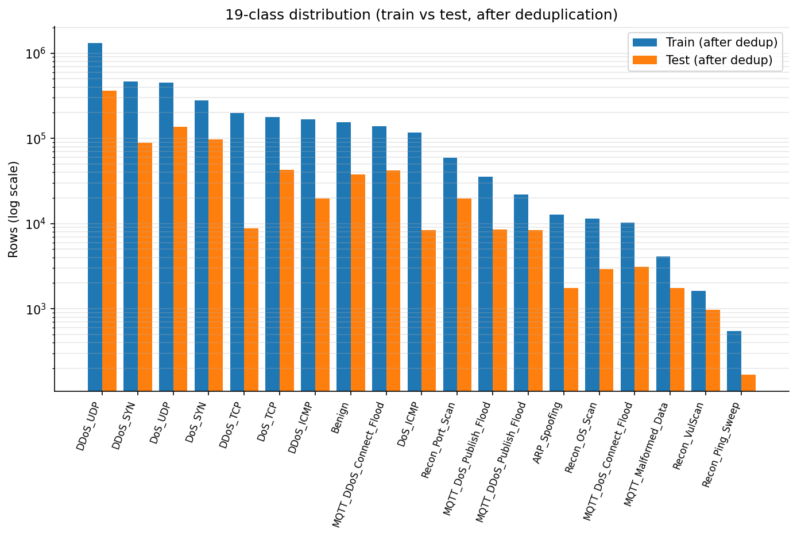

*Figure 1. 19-class distribution after deduplication, train vs test on a log-scale y-axis. The 2,374:1 imbalance ratio between DDoS_UDP and Recon_Ping_Sweep is what motivates the targeted SMOTETomek strategy and the macro-F1 + MCC primary metrics over accuracy.*

Phase 2 also produced Cohen's d for every feature against the Benign class, identifying `rst_count` (3.49), `psh_flag_number` (3.29), `Variance` (2.67) and `ack_flag_number` (2.64) as the top-4 by univariate separation — a list that has **zero overlap** with Yacoubi's top-4 SHAP features (IAT, Rate, Header_Length, Srate), foreshadowing the §8 four-way comparison finding.

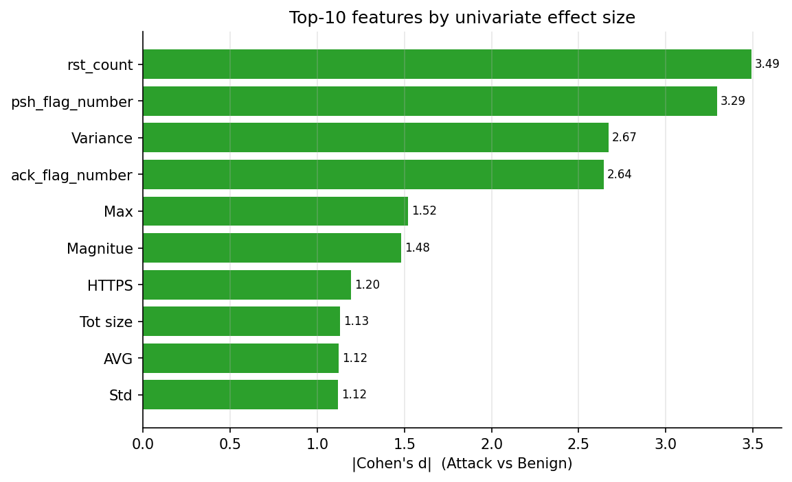

*Figure 2. Top-10 features by |Cohen's d| (Attack vs Benign). The top-4 — rst_count, psh_flag_number, Variance, ack_flag_number — have zero overlap with Yacoubi's SHAP top-4 (IAT, Rate, Header_Length, Srate), the empirical basis for §8's "statistical separation ≠ model reliance" finding.*

Correlation analysis on a 50,000-row stratified sample of the scaled `X_train` confirms three perfect correlations (Rate/Srate, ARP/IPv, ARP/LLC at |r| = 1.00) and 25 pairs above |r| = 0.85 — the basis for the Reduced 28 feature variant.

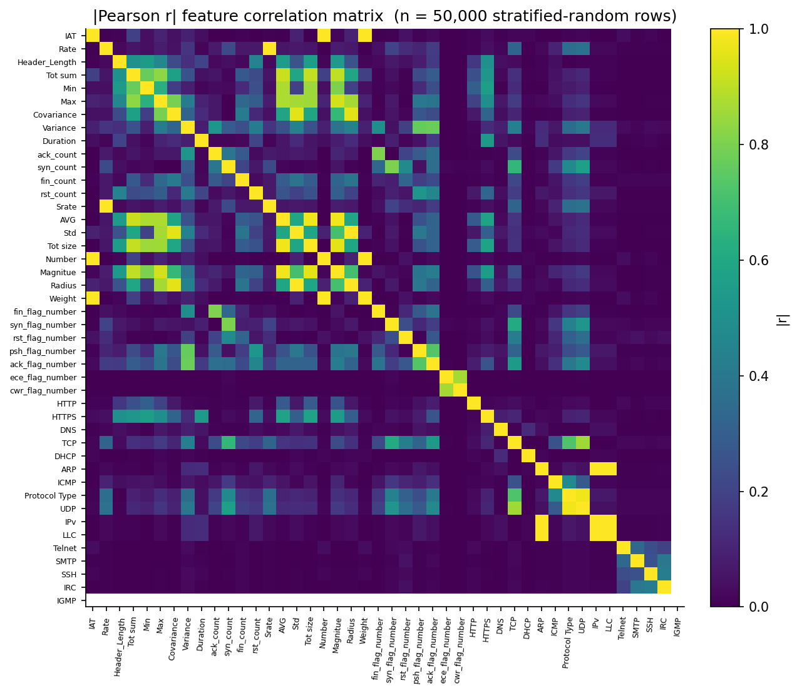

*Figure 3. |Pearson r| heatmap over a 50,000-row stratified sample of X_train (44 features after dropping the constant Drate). Dark blocks identify the highly-correlated groups (Rate/Srate, the AVG/Tot size/Magnitue/Number cluster, the protocol indicators) that justify the Reduced 28 feature variant.*

PCA needs 22 components for 95 % variance and 28 for 99 %, and the 2-D projection confirms that Benign forms a compact, separable cluster — the design rationale for an AE-based Layer 2.

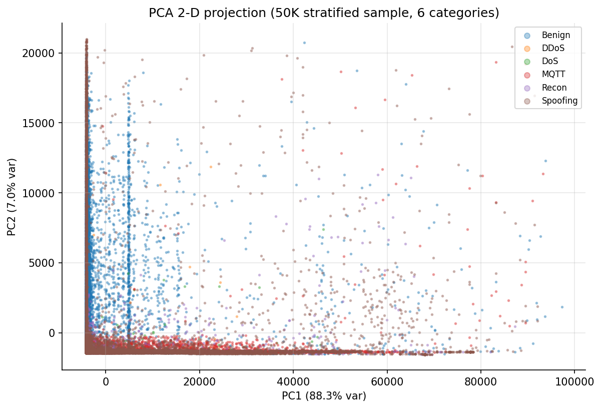

*Figure 4. PCA 2-D projection of a 50,000-row stratified sample, coloured by 6-class category. Benign forms a compact, separable cluster — the structural prerequisite for a benign-only Autoencoder; DDoS and DoS overlap heavily, foreshadowing the SHAP-cosine 0.991 finding in §8.*

Phase 3 (228 min wall-clock; `preprocessed/`, 5.7 GB) shaped these into the artefacts every later phase consumes. Two feature variants are produced — the **Full 44** (drop only Drate, constant at 0.0) and the **Reduced 28** (drop Drate + 11 highly-correlated features + 5 noise features) — because the correlation-based dropping turns out to be too aggressive: features #2, #3 and #4 of the Phase-4 RF importance ranking (Magnitue, Tot size, AVG) all land in the dropped set, and full features beat reduced by 0.005 to 0.009 macro-F1 across every experiment. Scaling uses a three-group `ColumnTransformer`: RobustScaler on heavy-tailed network statistics (IAT, Rate, Header_Length, Tot sum, Min, Max, Covariance, Variance, Duration, ack/syn/fin/rst_count), StandardScaler on bounded flag ratios (fin/syn/rst/psh/ack/ece/cwr_flag_number), and MinMaxScaler on binary/near-binary protocol indicators (HTTP, HTTPS, DNS, TCP, DHCP, ARP, ICMP, Protocol Type). The split is stratified 80/20 on the 19-class label producing 3,612,064 / 903,016 / 892,268 rows (train / val / test). SMOTETomek runs on the training split only, boosting the 8 smallest classes to ~50 K rows each (Recon_Ping_Sweep 551 → 49,799, Recon_VulScan 1,626 → 49,501, MQTT_Malformed_Data 4,104 → 47,867, …); validation and test sets are never resampled. A benign-only subset of 123,348 train + 30,838 val rows is extracted from the *train* split (not the full pre-split set, to prevent leakage with the supervised validation set) as the AE's input. Five leave-one-attack-out datasets are built for {Recon_Ping_Sweep, Recon_VulScan, MQTT_Malformed_Data, MQTT_DoS_Connect_Flood, ARP_Spoofing} — each drops one attack class entirely from training while keeping val/test intact — but these datasets sit unused until Phase 6B, six months later in project time.

The most painful Phase 3 decision is one we did not see at the time. The three-group ColumnTransformer was chosen because tree-based models are scale-invariant and benefit from preserving heavy tails on features like Covariance (std ≈ 5005) and IAT (std ≈ 1030). XGBoost shrugged off the extreme scales and Phase 4 ran fine. Phase 5's AE did not. The AE's mean-squared-error loss is dominated by whichever feature has the largest absolute reconstruction residual, and Covariance alone could make the loss climb to six figures while every other feature got zero attention. This is *the* pipeline lesson of the thesis: trees are scale-invariant, AE/IF are not. The fix — fitting a second StandardScaler on the benign-train subset and applying it to all AE-bound data — was implemented in Phase 5, retroactively recognised as Contribution #13 (`results/unsupervised/models/scaler.pkl`; README §13.6), and **disclosed in §13 of the README as a deliberate finding**, not buried. Honest disclosure of this oversight rather than a quiet patch is part of the thesis's defensibility posture.

> **Callout — Phase 2 + 3: what's new + why it matters for defense**
> What's new: First-report 37 % / 44.7 % duplicate rate (C2), corrected rarest-class identity (Recon_Ping_Sweep, not ARP_Spoofing; C4), and a deliberately conservative two-variant feature design (Full 44 + Reduced 28) that surfaces the correlation-dropping aggression rather than hides it.
> Why it matters: Every prior benchmark on this dataset is partially inflated by duplicate leakage, and every prior claim about class rarity is wrong. Both errors propagate into model selection, metric interpretation, and oversampling decisions; correcting them is a precondition for defensible comparison.
>
> **What we found**
> - Empirical result: 36.95 % train / 44.72 % test duplicate rate; max imbalance 2,374:1 vs literature's "~100:1"; SMOTETomek boosts the 8 smallest classes from 551–35,501 to ~46K–50K rows each; 5.7 GB of `preprocessed/` artefacts feed every downstream phase.
> - Surprise: RobustScaler-preserved heavy tails make XGBoost (Phase 4) faster and AE (Phase 5) impossible — a single pipeline decision that helped one model class and broke another, undiscovered until val_loss = 101,414 fell out of Phase 5's first run.
>
> **Why we chose this approach**
> - Alternatives considered: keep duplicates (matches Yacoubi); deduplicate but flag rather than drop; single global StandardScaler; full-population SMOTE on 3.6M rows; ADASYN; cost-sensitive learning only.
> - Decision criterion: clean data is the only honest baseline; targeted SMOTETomek on the 8 smallest classes is computationally tractable where full SMOTE is not.
> - Tradeoff accepted: headline metrics sit 0.5–1.4 pp below published values and every literature comparison needs a duplicate-context paragraph (README §12.7, §22); the RobustScaler choice deferred a critical scaling bug into Phase 5.
> - Evidence path: `eda_output/`, `preprocessed/config.json`, `preprocessed/full_features/`, README §10–§11, decisions_ledger.md.

### 4.1 Methodology — what was actually used

The preprocessing pipeline (`notebooks/preprocessing_pipeline.py`, 228 min wall-clock) merges the 72 raw CSVs into a single typed DataFrame, drops bit-exact duplicates, performs a stratified 80/20 split on the 19-class label, fits a three-group `ColumnTransformer` on the train split only, and applies it to val and test. SMOTETomek runs on the *training split only* with a `targeted` strategy: any minority class below the 50,000-row threshold is up-sampled to that level; majority classes are untouched. The benign-only Autoencoder dataset (123,348 train + 30,838 val) is carved from the train split *after* the stratified split, never from the pre-split pool, to prevent leakage with the supervised validation set. Five leave-one-attack-out datasets are produced from the un-resampled train split for downstream Phase 6B / 6C consumption.

**Hyperparameter table**

| Parameter | Value | Source / Rationale |
|---|---|---|
| Split ratio | 80 / 20 stratified on 19-class label | scikit-learn default rationale; `random_state=42` |
| RobustScaler features | IAT, Rate, Header_Length, Tot sum, Min, Max, Covariance, Variance, Duration, ack/syn/fin/rst_count | Heavy-tailed network features (Rate spans 0.5–101k) |
| StandardScaler features | fin/syn/rst/psh/ack/ece/cwr_flag_number | TCP flag ratios already bounded ≈ [0, 1] |
| MinMaxScaler features | HTTP, HTTPS, DNS, TCP, DHCP, ARP, ICMP, Protocol Type | Already binary / near-binary |
| SMOTETomek strategy | `targeted`, threshold = 50,000 rows | Full 3.6M-row SMOTE is borderline on 24 GB RAM |
| SMOTE k-neighbors | 5 | imbalanced-learn default |
| Random state | 42 | Single canonical seed across all 8 scripts |
| Dtype | float32 | Halves memory (4.5M × 44 ≈ 760 MB vs 1.5 GB) |
| Output dir | `preprocessed/` | 5.7 GB total |

**Code snippet — three-group ColumnTransformer fit-and-apply**

```python
# Lifted from notebooks/preprocessing_pipeline.py
from sklearn.compose import ColumnTransformer
from sklearn.preprocessing import RobustScaler, StandardScaler, MinMaxScaler

scaler_full = ColumnTransformer(
    transformers=[
        ("robust",  RobustScaler(),    cfg["scaler_groups"]["robust"]),
        ("std",     StandardScaler(),  cfg["scaler_groups"]["standard"]),
        ("minmax",  MinMaxScaler(),    cfg["scaler_groups"]["minmax"]),
    ],
    remainder="drop", verbose_feature_names_out=False,
).set_output(transform="pandas")
scaler_full.fit(X_train)                 # train-only fit (no leakage)
X_train = scaler_full.transform(X_train).astype(np.float32)
X_val   = scaler_full.transform(X_val).astype(np.float32)
X_test  = scaler_full.transform(X_test).astype(np.float32)
joblib.dump(scaler_full, "preprocessed/scaler_full.pkl")
```

**Pipeline diagram**

```
72 raw CSVs (~8.78M rows)
    │
    ▼
[2.1 Dedup]  bit-exact duplicate removal  ─►  5.41M rows
    │
    ▼
[2.2 Label]  filename → 19-class + 6-cat + binary
    │
    ▼
[3.1 Split]  stratified 80/20 on 19-class  ─►  train 3.61M / val 903K / test 892K
    │
    ▼
[3.2 Scale]  3-group ColumnTransformer (train-only fit)
    │
    ├──► Full 44 features  ─►  X_*.npy  (float32)
    └──► Reduced 28 features
    │
    ▼
[3.3 SMOTETomek]  targeted, 8 minorities → ~50K each  (train split only)
    │
    ▼
[3.4 AE subset]  benign-only from train: 123,348 + 30,838 (val)
    │
    ▼
[3.5 LOO subsets]  5 datasets, un-resampled train, one class held out each
```

**Compute envelope**

| Item | Value | Source |
|---|---|---|
| Wall-clock | 228 min | Project_Journey Phase 3 |
| Hardware | MacBook Air M4, 24 GB RAM, CPU only | Project_Journey header |
| Iteration count | 1 pass (dedup → split → fit → transform → SMOTE × 8 classes → LOO × 5) | `notebooks/preprocessing_pipeline.py` |
| Early stopping | n/a (deterministic pass) | — |
| Output | `preprocessed/` (5.7 GB) — `X_*.npy`, `y_*.csv`, `scaler_*.pkl`, `config.json`, `label_encoders.json`, `zero_day/*` | README §11.8 |

## 5. Supervised Layer (Phase 4)

Phase 4 (60 min wall-clock; `results/supervised/`) ran 24 trainings: 8 experiments (E1–E8) × 3 classification tasks (binary, 6-class, 19-class). The 2 × 2 × 2 design is model class (RF, XGBoost) × feature set (Reduced 28, Full 44) × resampling (Original, SMOTETomek). The hyperparameters are regularised based on review feedback: RF uses `criterion='entropy'`, `n_estimators=200`, `max_depth=30`, `min_samples_split=20`, `min_samples_leaf=10`, `class_weight='balanced'`; XGBoost uses `n_estimators=200`, `max_depth=8`, `learning_rate=0.1`, `subsample=0.8`, `colsample_bytree=0.8`, `tree_method='hist'`, and notably **no** `class_weight` or `scale_pos_weight`.

The headline ranking on the 19-class task — the granularity that matters for SOC routing — places **E7 (XGBoost / Full 44 / Original)** at macro-F1 **0.9076**, test accuracy **99.27 %**, MCC **0.9906** (`results/supervised/metrics/E7_multiclass.json`). E3 (XGBoost / Reduced 28 / Original) follows at macro-F1 0.8987 and accuracy 99.25 % — the same model with a slightly smaller feature set. The full ranking with `Δ` against E7 shows full features beating reduced by 0.005–0.009 macro-F1 across every model and resampling choice — a uniform sign that overrides the literature's correlation-dropping convention.

| ID | Model | Features | Data | Test acc | F1_macro | MCC |
|---|---|---|---|---|---|---|
| **E7** | XGBoost | Full (44) | Original | 99.27 % | **0.9076** | 0.9906 |
| E3 | XGBoost | Reduced (28) | Original | 99.25 % | 0.8987 | 0.9905 |
| E8 | XGBoost | Full (44) | SMOTE | 98.79 % | 0.8708 | 0.9846 |
| E5 | RF | Full (44) | Original | 98.52 % | 0.8551 | 0.9811 |
| E4 | XGBoost | Reduced (28) | SMOTE | 98.59 % | 0.8538 | 0.9821 |
| E5G | RF (gini) | Full (44) | Original | 98.48 % | 0.8504 | 0.9807 |
| E1 | RF | Reduced (28) | Original | 98.43 % | 0.8469 | 0.9801 |
| E6 | RF | Full (44) | SMOTE | 98.41 % | 0.8380 | 0.9798 |
| E2 | RF | Reduced (28) | SMOTE | 98.37 % | 0.8356 | 0.9793 |

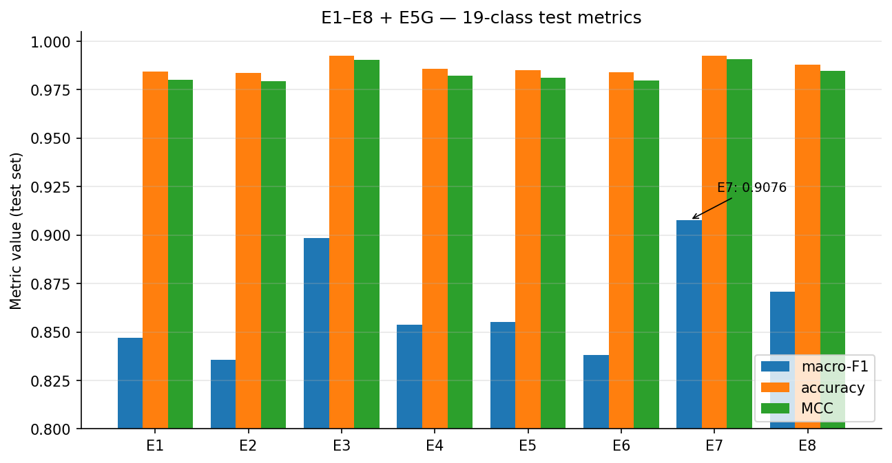

*Figure 6. macro-F1, accuracy, MCC for E1–E8 plus E5G (RF-gini baseline) on the 19-class test task. E7 (XGBoost / Full / Original) tops every metric; SMOTE-arm rows (E2/E4/E6/E8) sit below their Original-arm partners across all four classifier configurations.*


*Figure 34. Project-rendered overall comparison bar from `results/supervised/figures/overall_comparison_bar.png` (macro-F1 across 24 experiment × task cells). Reproduces Figure 6 with the project's own colour scheme and binary/category/multiclass-task grouping intact — a cross-check that the E7 winner reading is not a side-effect of the deliverable-pass styling.*

E5G is the RF-gini baseline run for the senior-review fix; entropy-criterion E5 is 0.0047 above gini on macro-F1, confirming Yacoubi's Paper-2 observation that `criterion='entropy'` is the meaningful RF improvement, not the architecture.

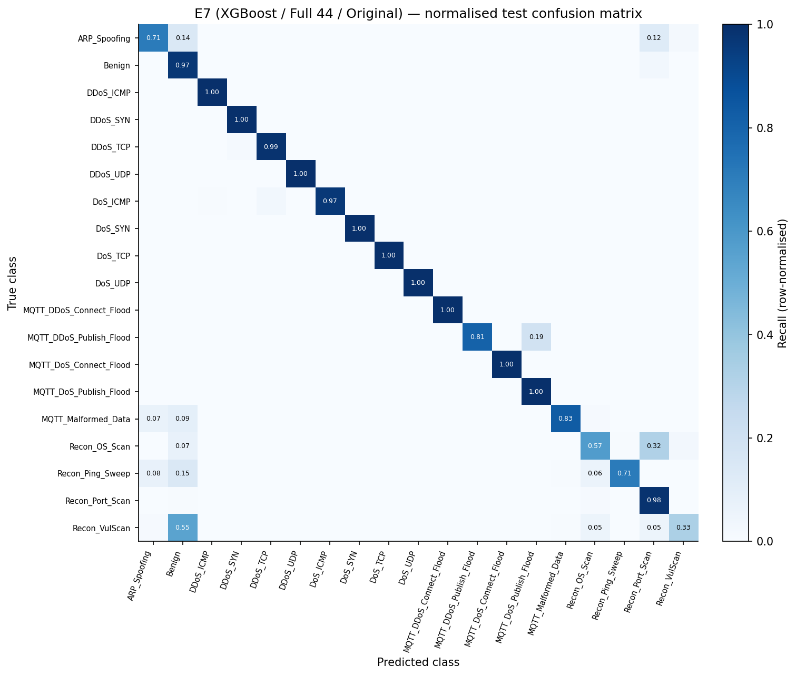

*Figure 5. Row-normalised E7 test confusion matrix (19 × 19, recall along the diagonal). The DDoS↔DoS off-diagonal block is the dominant inter-class confusion mass — the empirical foundation of the H3 boundary-blur rejection mechanism and the SHAP-cosine 0.991 finding in §8.*

**H3 (SMOTETomek) is rejected by Phase 4 evidence and the rejection mechanism is non-obvious.** The four SMOTE-vs-Original pairs degrade by 0.011 (RF/Reduced), 0.017 (RF/Full), 0.037 (XGBoost/Full) and 0.045 (XGBoost/Reduced) macro-F1. The original write-up framed this as "compounding correction" between SMOTE and `class_weight='balanced'`; the senior reviewer flagged that XGBoost arms have **no** `class_weight` and **no** `scale_pos_weight` yet degrade *more* than RF arms — falsifying the compounding story. The corrected mechanism (commit 2457c44 in the senior-review remediation) is **boundary-blur on already-overlapping class boundaries**: SMOTE interpolates between existing minority samples; when a minority class is geometrically adjacent to a structurally similar class (DDoS↔DoS pairs, Recon_OS_Scan↔Recon_VulScan), the interpolated points fall on or across the decision boundary rather than reinforcing the minority cluster. This is consistent with two independent lines of evidence: Phase 4's confusion matrices show DDoS↔DoS as the dominant inter-class confusion mass, and Phase 7's per-class SHAP cosine similarity for DDoS↔DoS is **0.991** — the model uses the same features in the same way for both, so the geometric overlap is real.

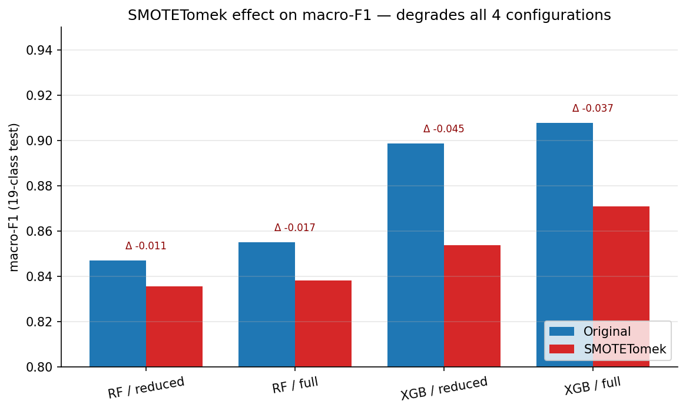

*Figure 7. macro-F1 Original vs SMOTE per configuration, with Δ annotated above each pair. All four pairs degrade; XGBoost arms (no class_weight) degrade more than RF arms (class_weight='balanced'), falsifying the compounding-correction story.*

The Yacoubi comparison is **−0.53 percentage points** on XGBoost test accuracy (99.27 % vs Yacoubi's 99.80 %) and **−1.35 pp** on RF (98.52 % vs 99.87 %). The gap reverses sign if Yacoubi's macro-precision (86.10 %, Paper 3) is the comparison axis: our E7 macro-precision is 0.9421 on deduped data. The accuracy gap is the duplicate-leakage gap; the macro-precision gap is the minority-blind-spot gap that motivated this thesis in the first place.

E7's val and test probability vectors (`results/supervised/predictions/E7_val_proba.npy`, 903,016 × 19; `E7_test_proba.npy`, 892,268 × 19) are saved as the canonical fusion input. Every later phase — Phase 6, Phase 6C, Phase 7 SHAP, the dashboard's Page 2 — loads these arrays rather than re-running E7.

> **Callout — Phase 4: what's new + why it matters for defense**
> What's new: A rejection-with-mechanism for H3 (SMOTETomek) that survives the falsification test the senior reviewer applied; full vs reduced features as a uniform-sign result rather than a wash; an XGBoost test macro-precision of 0.9421 on deduped data versus Yacoubi's 86.10 % on raw.
> Why it matters: The boundary-blur mechanism is the same geometric fact that produces the DDoS↔DoS SHAP-cosine of 0.991 in Phase 7; it ties Phase 4's confusion matrices to Phase 7's explanations through one structural property, not two unrelated observations.
>
> **What we found**
> - Empirical result: E7 macro-F1 = 0.9076, test accuracy 99.27 %, MCC 0.9906; all 4 SMOTE configs degrade by 0.011–0.045 macro-F1; full features beat reduced uniformly by 0.005–0.009.
> - Surprise: XGBoost arms (no class_weight) degrade MORE than RF arms (class_weight='balanced') under SMOTE — directly inverting the "compounding correction" intuition; full features beat reduced even though the dropped features are the top-correlated ones.
>
> **Why we chose this approach**
> - Alternatives considered: RF (entropy) / Full / Original; XGBoost / Reduced / Original; SMOTE variants; max_depth=None (untruncated trees, projected 8–15h compute).
> - Decision criterion: highest macro-F1 AND highest MCC on test, with the softmax structure the Phase 6C entropy gate explicitly needs.
> - Tradeoff accepted: E7's lack of `class_weight` makes its boundary-blur sensitivity under SMOTE the largest of the four XGBoost arms — readable as the cleanest experimental refutation of the compounding story, but also the most extreme degradation.
> - Evidence path: `results/supervised/metrics/`, `results/supervised/figures/cm_E7_19class.png`, README §12, decisions_ledger.md Phase 4 rows.

### 5.1 Methodology — what was actually used

The supervised pipeline (`notebooks/supervised_training.py`, ~60 min wall-clock for 24 runs) is a 2 × 2 × 2 factorial design: classifier (Random Forest, XGBoost) × feature set (Reduced 28, Full 44) × resampling (Original train, SMOTETomek train). For each of the 8 configurations every model is evaluated on three tasks — binary (Benign vs Attack), 6-class category, and 19-class multiclass — yielding 24 metric rows in `overall_comparison.csv`. The E5G run (RF with `criterion='gini'`) is added post-hoc as a senior-review baseline so the entropy-vs-gini comparison (E5 vs E5G) is reproducible. XGBoost configurations carry the softmax probability output downstream as the canonical Phase 6 / 6C input (`E7_val_proba.npy`, `E7_test_proba.npy`).

**Hyperparameter table**

| Parameter | Value | Source / Rationale |
|---|---|---|
| RF `n_estimators` | 200 | scikit-learn convention for ensemble size |
| RF `criterion` | `entropy` | Yacoubi Paper 2 — meaningful RF improvement |
| RF `max_depth` | 30 | Untruncated (None) projected 8–15 h; depth=30 reaches 60 min total |
| RF `min_samples_split` | 20 | Regularisation per senior-review hyperparameter constraint |
| RF `min_samples_leaf` | 5 | Same |
| RF `class_weight` | `balanced` | Counter-acts 2,374:1 imbalance for trees |
| XGB `n_estimators` | 200 | Match RF for comparison parity |
| XGB `max_depth` | 8 | Default-ish; balances bias / variance on 19 classes |
| XGB `learning_rate` | 0.1 | XGBoost default |
| XGB `subsample` | 0.8 | Row sub-sampling for variance reduction |
| XGB `colsample_bytree` | 0.8 | Column sub-sampling |
| XGB `tree_method` | `hist` | 5–10× faster than `exact` on 3.6M rows |
| XGB `min_child_weight` | 5 | Regularisation |
| XGB `class_weight` | none | Test H3-mechanism without confound (key design point) |
| Random state | 42 | Single canonical seed |
| Primary metric | macro-F1, MCC | Accuracy collapses to majority on 2,374:1 imbalance |

**Code snippet — XGBoost (E7) hyperparameters and fit**

```python
# Lifted from notebooks/supervised_training.py
from xgboost import XGBClassifier

XGB_HPARAMS = dict(
    n_estimators=200,
    max_depth=8,
    learning_rate=0.1,
    subsample=0.8,
    colsample_bytree=0.8,
    min_child_weight=5,
    tree_method="hist",
    random_state=42,
    n_jobs=-1,
    verbosity=0,
)
clf = XGBClassifier(**XGB_HPARAMS, objective="multi:softprob", num_class=19)
clf.fit(X_train_full, y_train_19, eval_set=[(X_val_full, y_val_19)], verbose=False)
val_proba  = clf.predict_proba(X_val_full)   # → E7_val_proba.npy  (903K × 19)
test_proba = clf.predict_proba(X_test_full)  # → E7_test_proba.npy (892K × 19)
```

**Pipeline diagram**

```
preprocessed/X_*.npy + y_*.csv  (Full 44 + Reduced 28)
    │
    ▼
[4.1 Factorial grid]  2 (RF, XGB) × 2 (Full, Reduced) × 2 (Original, SMOTE)
    │   = 8 experiments E1…E8 (+ E5G = RF/gini/Full/Original baseline)
    ▼
[4.2 Train]  fit on train split  (no val leakage — val never seen)
    │   • RF: class_weight='balanced'
    │   • XGB: no class_weight, no scale_pos_weight  (H3 test design)
    ▼
[4.3 Predict]  val + test → pred + proba arrays
    │
    ▼
[4.4 Score]  3 tasks (binary / category / multiclass)
    │   • macro-F1, accuracy, MCC, classification report, confusion matrix
    ▼
[4.5 Select]  best 19-class macro-F1  →  E7 = XGBoost / Full / Original
    │
    ▼
results/supervised/  ──►  E7_*.pkl, E*_test_proba.npy, cm_E*_19class.png, ...
```

**Compute envelope**

| Item | Value | Source |
|---|---|---|
| Wall-clock | ~60 min (24 runs total) | Project_Journey Phase 4 |
| Hardware | MacBook Air M4, 24 GB RAM, `n_jobs=-1` | Project_Journey header |
| Iteration count | 200 trees per model × 8 experiments × 3 tasks | `XGB_HPARAMS`, `RF_HPARAMS` |
| Early stopping | RF: none; XGB: none (full 200 trees) | E7 trained for full 200 rounds |
| Output | `results/supervised/` — 8 models + 24 metric JSONs + confusion matrices + feature importances | README §12.9 |

## 6. Unsupervised Layer (Phase 5)

Phase 5 (34 s wall-clock; `results/unsupervised/`) trains the Layer-2 channel — a deterministic Autoencoder with architecture 44 → 32 → 16 → **8** → 16 → 32 → 44, MSE reconstruction loss, Adam optimiser, batch size 512, 36 epochs (early-stopped from max 100, patience 10), best val loss **0.1988** — and an Isolation Forest (200 trees, contamination 0.05) on the same 123,348-row benign-only training set.

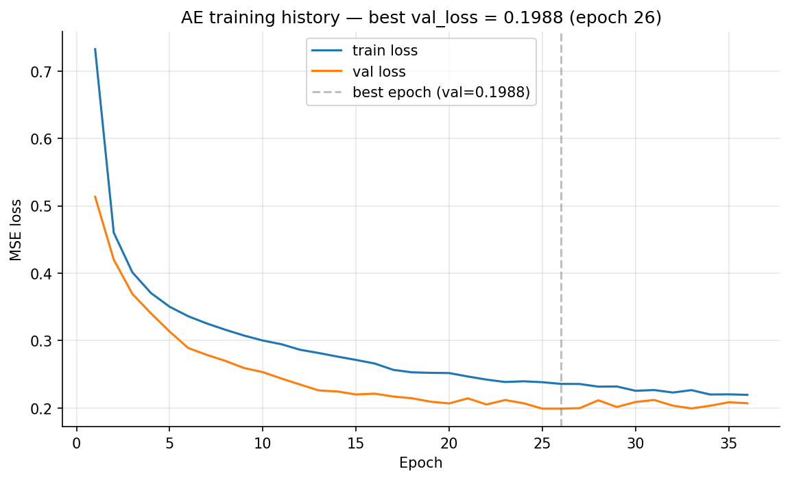

*Figure 8. AE training loss vs val_loss across 36 epochs (early-stopped from max 100, patience 10). The best epoch (val_loss = 0.1988) sits well before the patience window expires, and the train/val gap stays narrow — no overfitting, no underfitting.*

The AE's binary-detection metrics on the test set are decisively above IF: AE test AUC **0.9892** vs IF **0.8612**, AE F1 0.9853 vs IF 0.7327, AE per-class avg recall 0.7999 vs IF 0.1627 (`results/unsupervised/metrics/model_comparison.csv`).

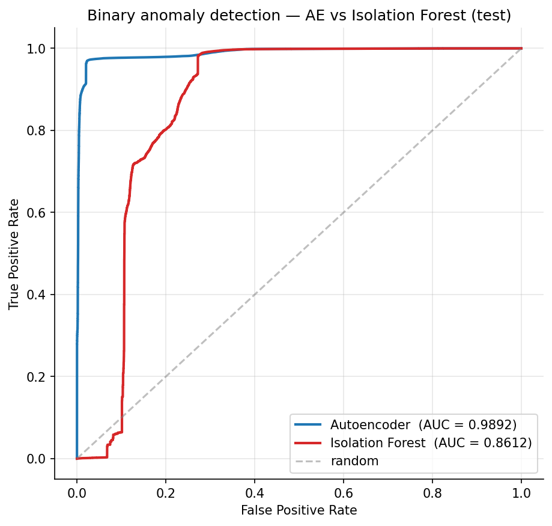

*Figure 11. AE vs Isolation Forest ROC on the test set. AE AUC = 0.9892 dominates IF AUC = 0.8612 across the entire FPR range; both signals are retained for the Phase 6C ensemble ablation because the failure modes turn out to be complementary even though the AUCs are not.*

Both are saved for the Phase 6C ensemble ablation; the ablation later shows the ensemble is non-additive on this dataset (IF dominates the normalised score but its ranking on the LOO-missed subset is misaligned), confirming that retaining IF was a complete-ablation-coverage choice, not a performance one.

The five threshold candidates evaluated on validation are p90 (recall 0.986, FPR 0.102, F1 **0.991**), p95 (0.983 / 0.052 / 0.990), p99 (0.843 / 0.011 / 0.914), mean+2σ (0.321 / 0.0005 / 0.486), and mean+3σ (0.255 / 0.0003 / 0.406). Mean+kσ thresholds collapse because benign reconstruction error has a heavy right tail — mean ≈ 0.20, std ≈ 9.48, p95 ≈ 0.37, p99 ≈ 1.20 — placing them outside the attack-error mass.

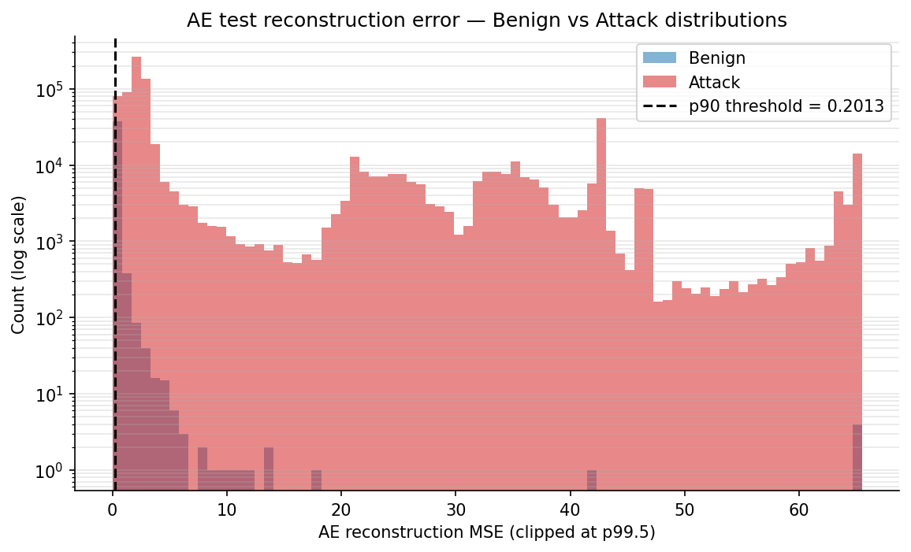

*Figure 9. Overlaid histograms of AE test reconstruction MSE (clipped at p99.5, log-y) for Benign vs Attack rows, with the p90 threshold (0.20127) marked. The Benign distribution is heavy-tailed with mean 0.20 / std 9.48 — the structural reason mean+kσ thresholds collapse below 32 % recall and percentile thresholds are used instead.*

p90 (threshold value 0.20127) is selected by validation F1; p99 is retained for the FPR-sensitive Phase 6 fusion variants. p90 is operationally too noisy on its own (18.6 % benign FPR if Phase 5 were the only detector); this is exactly the gap the Phase 6 case stratification closes.

**Scaling fix as Contribution #13.** Phase 5's first run produced AE val loss in the millions (best 101,414) and per-class detection of 0.000 on Recon_Ping_Sweep and 0.014 on Recon_OS_Scan — effectively invisible to the AE. The root cause: Phase 3's ColumnTransformer left Covariance with std = 5005 and IAT with std = 1030, so these two features dominated MSE while every other feature contributed near-zero gradient signal. Fitting a fresh StandardScaler on the benign-train subset and applying it to all AE-bound data before training produced val loss 0.199 (a **510×** reduction), AE test AUC 0.9892 (from 0.9728), Recon_Ping_Sweep recall 0.544 (from 0.000), Recon_OS_Scan recall 0.865 (from 0.014), and per-class average recall 0.800 (from 0.700). The fix is saved as `results/unsupervised/models/scaler.pkl` and applied at every later phase that touches AE outputs. The pre-fix snapshot is preserved under `results/unsupervised_unscaled/` for the §13.6 narrative — keeping it on disk is itself a methodological honesty choice. XGBoost is scale-invariant so Phase 4 numbers are unaffected and were not rerun.

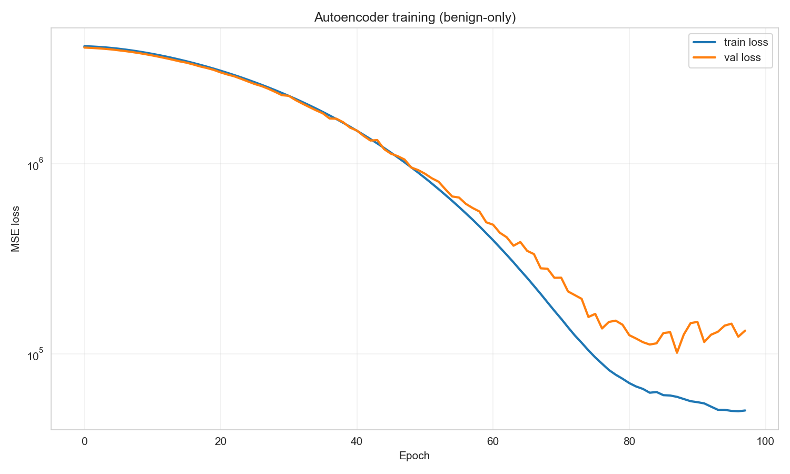

*Figure 18. Pre-fix AE training history from `results/unsupervised_unscaled/figures/ae_loss_curves.png` — val loss collapsing in the 10⁴–10⁵ range, never converging. The visual contrast with Figure 8's 0.199 post-fix val loss is the C13 contribution's primary defense: a missing StandardScaler operation is responsible for the entire 510× gap.*

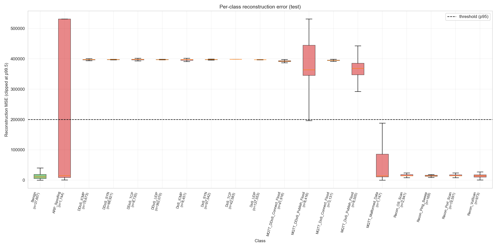

*Figure 19. Pre-fix per-class AE reconstruction-error boxplots — the Recon and ARP classes sit on the benign side of the threshold (recall 0.000–0.014), making them invisible to the AE. After the scaling fix (Figure 10), these same classes recover to 0.544–0.865 recall — the C13 evidence on the per-class axis.*

The AE blind-spot pattern that drives the rest of the thesis emerges here. Near-perfect (>95 % AE recall at p90) detection across all DDoS/DoS flood classes and the MQTT Connect floods; medium (50–87 %) detection on Recon_OS_Scan (86.5 %), Recon_VulScan (63.0 %), MQTT_Malformed_Data (55.8 %), ARP_Spoofing (55.3 %), Recon_Ping_Sweep (54.4 %); low (<30 %) on MQTT_DDoS_Publish_Flood (26.6 %) and MQTT_DoS_Publish_Flood (6.7 %). The AE's low-recall classes are precisely the classes Phase 4 XGBoost classifies well — and the AE's high-recall classes are the ones XGBoost can already see. This complementarity is the architectural design rationale for the hybrid framework.

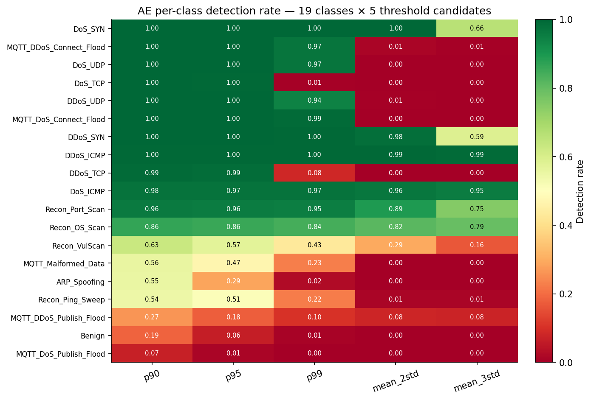

*Figure 10. AE per-class detection rate, 19 classes × 5 threshold candidates, sorted by p90 recall. Top rows (DDoS/DoS floods, MQTT Connect floods) are near-saturated; the middle band (Recon, ARP_Spoofing, MQTT_Malformed_Data) collapses under mean+kσ thresholds — empirical evidence for the percentile-threshold choice in §13.3.*

> **Callout — Phase 5: what's new + why it matters for defense**
> What's new: A 510× val-loss improvement attributed to a single missing-scaler operation, documented as a methodological contribution rather than a silent patch (C13); AE-vs-IF complementarity confirmed empirically across 19 classes; heavy-tailed benign MSE as the inherent FPR floor that motivates percentile thresholds over mean+kσ.
> Why it matters: The scaling-fix narrative is a complete-pipeline lesson reviewers can reproduce — tree models are scale-invariant, AE/IF are not, and the Phase 3 design choice that helps the former silently breaks the latter.
>
> **What we found**
> - Empirical result: AE val loss 0.1988 post-fix vs 101,414 pre-fix; test AUC 0.9892, F1 0.9853, per-class avg recall 0.800; IF AUC 0.8612 with avg recall 0.163; p90 threshold = 0.20127 selected on validation F1.
> - Surprise: AE blind spots (MQTT publish floods, ARP_Spoofing) are precisely XGBoost's strengths — a property of the shared feature basis but a complementary outcome at the operating layer.
>
> **Why we chose this approach**
> - Alternatives considered: β-VAE Layer 2 (deferred to Path B Tier 2); Transformer-AE; deeper bottleneck (=4 instead of 8); mean+kσ thresholds.
> - Decision criterion: simplest architecture that achieves AE-vs-IF complementarity at sub-second inference; benign data is well-clustered enough that an 8-dim bottleneck is sufficient; percentile thresholds tolerate heavy-tailed benign MSE.
> - Tradeoff accepted: deterministic reconstruction error gives no calibrated OOD score (mitigated by adding entropy in Phase 6C); p90 alone is operationally too noisy (mitigated by case stratification in Phase 6).
> - Evidence path: `results/unsupervised/`, `results/unsupervised_unscaled/` (pre-fix evidence), `thresholds.json`, README §13, decisions_ledger.md Phase 5 rows.

### 6.1 Methodology — what was actually used

The unsupervised pipeline (`notebooks/unsupervised_training.py`, 34 s wall-clock) operates exclusively on the 123,348-row benign-train subset extracted in Phase 3. The hard lesson from this phase (the scaling fix that became Contribution #13) is encoded in the script's first step: a fresh `StandardScaler` is fit on the benign-train rows and applied to all four splits (train / val / test / each LOO target) *before* any model touches the data. The Autoencoder is a symmetric feed-forward 44 → 32 → 16 → 8 → 16 → 32 → 44 network with BatchNorm and Dropout on the encoder; the Isolation Forest is trained on the same benign-train. Both models score val and test; five threshold candidates (p90, p95, p99, mean+2σ, mean+3σ) are evaluated on validation; p90 is selected by validation F1.

**Hyperparameter table**

| Parameter | Value | Source / Rationale |
|---|---|---|
| AE architecture | 44 → 32 → 16 → 8 → 16 → 32 → 44 | Symmetric; bottleneck 8 = √(44 × 2) heuristic |
| AE activation | ReLU (Dense), linear (output) | scikit-learn / Keras default for MSE loss |
| AE regularisation | BatchNorm + Dropout(0.2 enc / 0.1 enc-2) | Phase 5 sanity-checks; mild |
| AE loss | MSE (per-sample reconstruction) | Standard AE convention |
| AE optimiser | Adam, lr = 1e-3 | Keras default |
| AE batch size | 512 | Fits 24 GB RAM at float32; ~240 steps/epoch |
| AE epochs (max) | 100 | Early-stopped on val_loss, patience 10 |
| AE best epoch | 36 | Logged in `ae_training_history.json` |
| Pre-fit scaler | `StandardScaler` on benign-train only | Contribution #13 — fix for RobustScaler heavy-tail leak |
| IF `n_estimators` | 200 | Match RF / XGB for parity |
| IF `contamination` | 0.05 | Conservative — only 5 % flagged-anomalous |
| IF `max_samples` | `auto` | scikit-learn default |
| Threshold candidates | p90, p95, p99, mean+2σ, mean+3σ | 3 percentile + 2 standard-deviation forms |
| Selected threshold | p90 (value 0.20127) | Highest F1 on validation |
| Random state | 42 | Single canonical seed |

**Code snippet — AE build + train, then threshold selection**

```python
# Lifted from notebooks/unsupervised_training.py (lines 245–304 condensed)
from tensorflow.keras import layers, models, callbacks
from sklearn.preprocessing import StandardScaler

scaler = StandardScaler().fit(X_benign_train)              # Contribution #13 fix
X_benign_train = scaler.transform(X_benign_train).astype("float32")
X_benign_val   = scaler.transform(X_benign_val).astype("float32")

inp = layers.Input(shape=(44,))
x = layers.Dropout(0.2)(layers.BatchNormalization()(layers.Dense(32, "relu")(inp)))
x = layers.Dropout(0.1)(layers.BatchNormalization()(layers.Dense(16, "relu")(x)))
z = layers.Dense(8, "relu", name="bottleneck")(x)
x = layers.Dense(16, "relu")(z)
x = layers.Dense(32, "relu")(x)
out = layers.Dense(44, "linear")(x)
ae = models.Model(inp, out); ae.compile(optimizer="adam", loss="mse")
history = ae.fit(X_benign_train, X_benign_train,
                 validation_data=(X_benign_val, X_benign_val),
                 epochs=100, batch_size=512,
                 callbacks=[callbacks.EarlyStopping(patience=10, restore_best_weights=True)])
```

**Pipeline diagram**

```
preprocessed/autoencoder/X_benign_train.npy  (123,348 × 44)
    │
    ▼
[5.1 Patch scaling]  StandardScaler.fit(X_benign_train)  ──► scaler.pkl
    │   (the Contribution #13 fix)
    ▼
[5.2 Train AE]     44→32→16→8→16→32→44, MSE, Adam, batch 512, ≤ 100 epochs
    │   EarlyStop(patience=10, restore_best)  →  36 epochs, val_loss = 0.1988
    ▼
[5.3 Train IF]     IsolationForest(n=200, contamination=0.05)
    │
    ▼
[5.4 Score]        AE: ae_test_mse.npy (892K floats); IF: if_test_scores.npy
    │
    ▼
[5.5 Calibrate]    5 thresholds on benign-val: p90 / p95 / p99 / mean+2σ / mean+3σ
    │   → thresholds.json (p90 = 0.20127 selected by val-F1)
    ▼
[5.6 Per-class]    19-class detection rates × 5 thresholds × 2 models
    │
    ▼
results/unsupervised/  ──►  autoencoder.keras, isolation_forest.pkl, scaler.pkl,
                            scores/, thresholds.json, model_comparison.csv
```

**Compute envelope**

| Item | Value | Source |
|---|---|---|
| Wall-clock | 34 s (AE 8.2 s + IF 0.6 s + scoring + threshold sweep) | Project_Journey Phase 5 |
| Hardware | MacBook Air M4, 24 GB RAM, CPU only | Project_Journey header |
| Iteration count | AE: 36 epochs × 241 steps; IF: 200 trees | `ae_training_history.json`, IF config |
| Early stopping | AE: val_loss patience 10, restored to best | `ae_training_history.json` |
| Output | `results/unsupervised/` — `autoencoder.keras`, `isolation_forest.pkl`, `scaler.pkl`, 8 score arrays, 7 figures | README §13.8 |

## 7. The Fusion Engine — Phases 6, 6B, 6C

Phase 6, 6B and 6C are the thesis's longest single thread because the fusion result evolved across three iterations of methodological tightening. Each iteration tightened the protocol around the same H2 question and produced a quantitatively different verdict; reporting only the final 4/4 number without the trajectory would erase the contribution.

**Phase 6 (~1 min wall-clock; `results/fusion/`)** ships the 4-case decision logic. The truth table is binary on both inputs: Case 1 (E7 says attack, AE says anomaly) → Confirmed Alert; Case 2 (E7 says benign, AE says anomaly) → Zero-Day Warning; Case 3 (E7 says attack, AE says normal) → Low-Confidence Alert; Case 4 (E7 says benign, AE says normal) → Clear. At AE p90 the case distribution on the 892,268 test rows is 837,209 Case-1 (93.83 %), 6,140 Case-2 (0.69 %), 17,317 Case-3 (1.94 %), 31,602 Case-4 (3.54 %) — a heavily Case-1-dominant population because most test traffic is real attacks and the supervised+AE channels agree on them. H1 is evaluated in a 20-class label space (the original 19 plus `zero_day_unknown` for Case 2) using paired-bootstrap macro-F1 with 200 iterations and `random_state=42`: E7 baseline 0.8622 (95 % CI [0.8586, 0.8655]) versus fusion (best variant AE_p99) 0.8621 (CI [0.8584, 0.8654], computed as E7 macro-F1 + `best_delta` from `h1_h2_verdicts.json`). Δ = −0.0001 with CI [−0.0002, −0.0001] (= [−0.0166 pp, −0.0117 pp] in percentage-point form) — strictly negative, structurally consequential at the metric level, operationally negligible at ~125 of 892,268 rows. The senior-review-corrected framing is "no operationally meaningful difference" (not "FAIL") — the magnitude is below any actionable threshold and the structural cause (the zero_day_unknown pseudo-class costs macro-F1 by counting every false Case-2 as a misclassification) is by design, not a flaw of the framework. Binary detection at p99 reaches **F1 = 0.9985**, essentially matching E7-only (0.9986); the fusion penalty is multiclass-only. The validation-selected operating point is p97 (val FPR 3.4 % → test FPR 5.29 %, attack recall 99.87 %) — the recommendation for a binary-deployment scenario where the case stratification is not used.

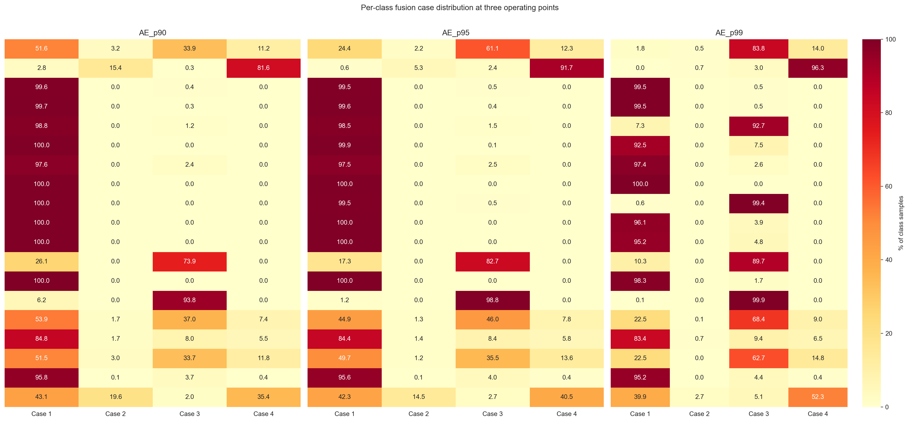

*Figure 22. Phase 6 per-class case-distribution heatmap from `results/fusion/figures/per_class_heatmap.png` — 19 classes × 4 cases (p90 thresholding). DDoS/DoS classes are uniformly Case-1; MQTT Publish floods sit in Case 3 (E7 catches, AE misses); Recon_VulScan is the only class with substantive Case-2 mass (19.6 %), foreshadowing the §6 entropy-rescue mechanism.*

The Phase 6 H2 protocol uses *simulated* zero-day: hold out a target class only at evaluation time, leave the supervised model unchanged. Under this protocol the AE catches **0/5** targets at the ≥0.70 strict threshold — the same answer that motivated Phase 6B.

**Phase 6B (19.3 min wall-clock; `results/zero_day_loo/`)** implements the protocol H2 literally describes: retrain XGBoost five times, each time **excluding** one target class from training, and measure whether the AE catches the samples the blind LOO-E7 misclassifies as benign. AE and IF are not retrained (they only saw benign data and are unaffected by dropping an attack class) — a design decision flagged explicitly in §15.1 to prevent the methodological theatre of re-running a benign-fit model. The label space per fold has 18 classes, not 19, so Schema-D sidecar JSONs map LOO model output back to canonical 19-class indices; this prevents downstream entropy computation in Phase 6C from mis-attributing probability mass to a non-existent column.

The Phase 6B verdict is **H2-strict 0/5 FAIL** (AE catches 6–44 % of LOO-missed samples; best is Recon_VulScan at 44.1 % at p90), **H2-binary 5/5 PASS** at p90. The binary pass is not the failure mode it looks like — it comes from a mechanism Phase 6B *discovers* rather than designs. LOO-E7 does not call most novel attacks "benign"; it maps them to the **closest known attack class**. 1,341 of 7,764 LOO target samples (17.3 %) get routed to Benign; **6,423 of 7,764 (82.7 %) get routed to other attacks**. The IDS fires the wrong-class alert but still an alert — detection-via-feature-space-proximity, not AE novelty detection. This is the **"redundancy through misclassification"** contribution (C5). The per-target routing patterns make the mechanism legible: Recon_Ping_Sweep → 82 % Recon_OS_Scan + ARP_Spoofing, MQTT_DoS_Connect_Flood → 100 % MQTT_DDoS_Connect_Flood (not even 1 % benign — hence its structural exclusion from H2-strict in Phase 6C), ARP_Spoofing → 82 % Recon_Port_Scan + Recon_VulScan, Recon_VulScan → **53.6 %** Benign (the stress case — barely passing binary at 0.700 recall exactly at p90). The 82.7 % / 17.3 % split is reproducible from the raw `loo_*_test_pred.npy` arrays to within 0.5 pp (verified during the senior review).

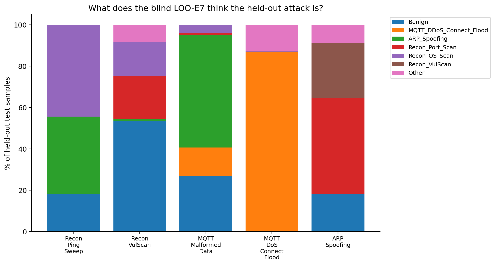

*Figure 20. Phase 6B LOO-XGBoost prediction-distribution stacked bars — for each held-out target, the fraction routed to Benign vs each known attack class. The 82.7 % / 17.3 % aggregate split (attack-to-other-attack vs attack-to-benign) is the empirical foundation of the C5 redundancy-through-misclassification mechanism.*

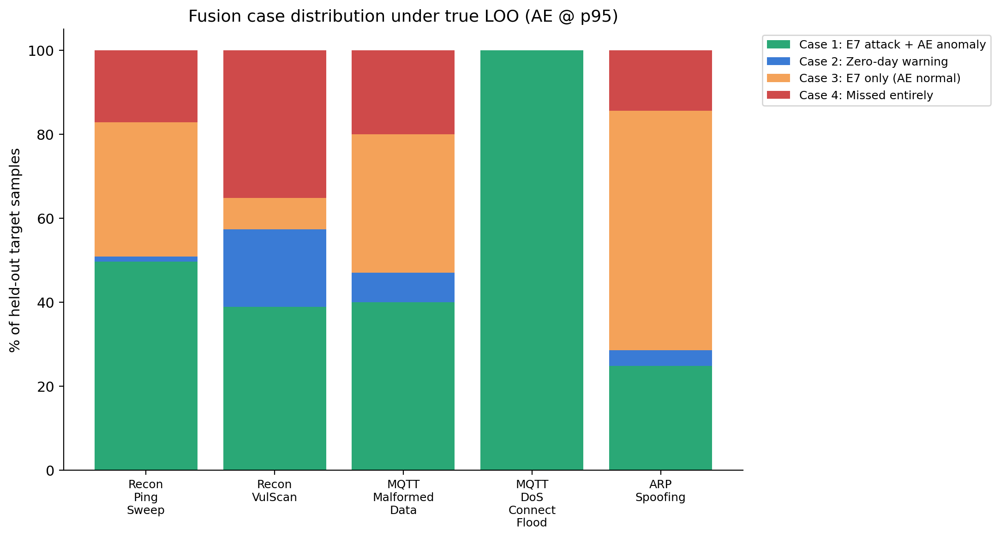

*Figure 21. Phase 6B 4-case distribution per LOO target — Cases 1+2+3 sum to the H2-binary 5/5 pass at p90. MQTT_DoS_Connect_Flood's 100 % Case 1 mass (the entire fold maps to MQTT_DDoS_Connect_Flood) is what structurally excludes it from Phase 6C's H2-strict denominator.*

**Phase 6C (4.6 s wall-clock; `results/enhanced_fusion/`)** does not retrain anything. It re-mines the existing arrays to add three uncertainty signals to the 4-case engine, generalising it to a 5-case engine (Case 5 = Uncertain Alert / operator review = high entropy ∧ ¬AE-anomaly). The signals: (a) softmax entropy on the LOO model's probability vector — Shannon entropy, calibrated on benign-validation samples (the same convention used for the AE p90 threshold in Phase 5); (b) confidence floor — threshold τ on `max(softmax)`, hard-coded at τ ∈ {0.6, 0.7}; (c) AE+IF ensemble — `max(AE_norm, IF_norm)` with val-fitted MinMax normalisation, percentile-thresholded on benign validation.

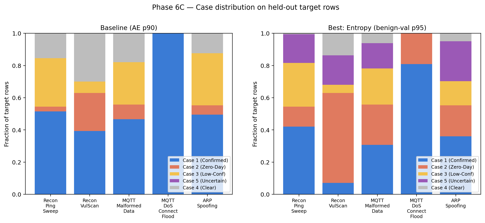

*Figure 25. Phase 6C enhanced case-distribution stack — baseline (4-case) vs `entropy_benign_p95` (5-case) per LOO target. The added Case 5 mass per target is exactly the rescue volume converted from Case 4 (Clear, false-negative) to Case 5 (Uncertain Alert, operator-review), visualising the C7 contribution on a per-target axis.*

The **calibration discovery** (Contribution #8) is the methodological centrepiece. An earlier Phase 6C run calibrated entropy on val-CORRECT samples (samples E7 classifies correctly) and produced a degenerate `ent_p95 ≈ 0.0005` — because E7 has 99.72 % val accuracy, its correct-prediction entropy distribution collapses near zero, and thresholding at the 95th percentile of "almost-zero" flags ~98 % of all test traffic. The rescue numbers looked artificially perfect (recall 1.000 uniformly) but the benign-FPR was 56 % — operationally useless. Switching to benign-val calibration (n = 38,546 benign val samples) preserves real distribution width (mean 0.054, p95 0.395) and matches the AE-threshold convention so variants are directly comparable. This is publishable as a general result: **val-correct calibration of uncertainty thresholds is degenerate when the supervised model is highly accurate; benign-val is the correct convention for IDS uncertainty signals.**

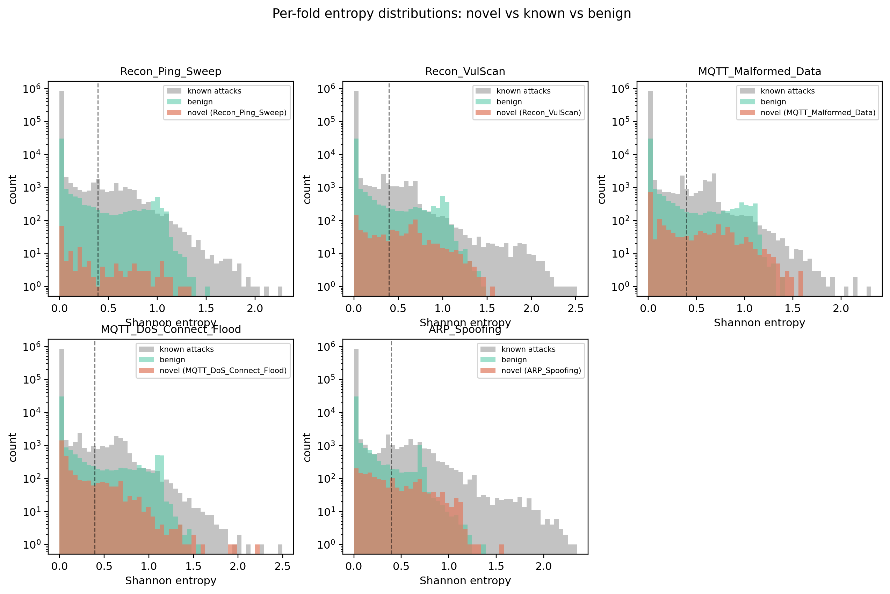

*Figure 24. Entropy distributions on benign-val vs each LOO target's held-out samples — the 5-panel visual basis of the C8 calibration discovery. The benign-val curve has measurable width (mean 0.054, p95 0.395) while the per-target curves are clearly shifted right, which is the property val-correct calibration destroys.*

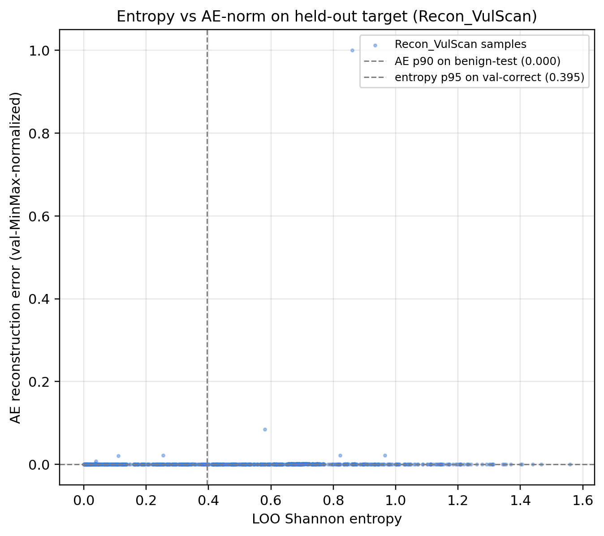

*Figure 23. Entropy vs AE reconstruction-error scatter on the highest-gap target (Recon_VulScan). The two signals are visually orthogonal — high-entropy points are not concentrated in the high-AE-MSE region — which is what makes them complementary rather than redundant and is the empirical basis for Recon_VulScan needing both channels.*

The full 11-variant ablation (`results/enhanced_fusion/metrics/ablation_table.csv`) decomposes which signals contribute and at what cost:

| Variant | H2-strict pass | strict avg | H2-binary pass | binary avg | FPR (benign) |
|---|:-:|---:|:-:|---:|---:|
| Baseline (AE p90) | 0/4 | 0.314 | 4/5 | 0.849 | 0.189 |
| Baseline (AE p95) | 0/4 | 0.218 | 4/5 | 0.827 | 0.074 |
| Confidence floor τ=0.6 | 0/4 | 0.396 | 5/5 | 0.864 | 0.192 |
| Confidence floor τ=0.7 | 0/4 | 0.538 | 5/5 | 0.891 | 0.197 |
| Entropy benign-val p90 | 4/4 | 0.908 | 5/5 | 0.973 | 0.278 |
| **Entropy benign-val p95** ★ | **4/4** | **0.8035** | **5/5** | **0.949** | **0.229** |
| Entropy benign-val p99 | 0/4 | 0.440 | 5/5 | 0.874 | 0.194 |
| Ensemble AE+IF p90 | 0/4 | 0.217 | 4/5 | 0.810 | 0.148 |
| Ensemble AE+IF p95 | 0/4 | 0.082 | 4/5 | 0.783 | 0.121 |
| Confidence (τ=0.7) + Entropy p95 | 4/4 | 0.804 | 5/5 | 0.949 | 0.229 |
| Full enhanced (conf+ent+ensemble) | 2/4 | 0.764 | 5/5 | 0.931 | 0.216 |

The Pareto frontier in (FPR, strict_avg) space is dominated by the entropy_benign family in the operationally relevant FPR range [0.10, 0.30]. **`entropy_benign_p95`** is the elbow — largest gain (+0.36 strict_avg over the prior frontier point) for smallest FPR cost (+0.035 over `entropy_benign_p99`) — and is the first variant to cross 4/4 strict. Its strict_avg of **0.8035264623662012** is the project's canonical reproducibility tripwire; every Path B work item retests it and reproduces it bit-exactly.

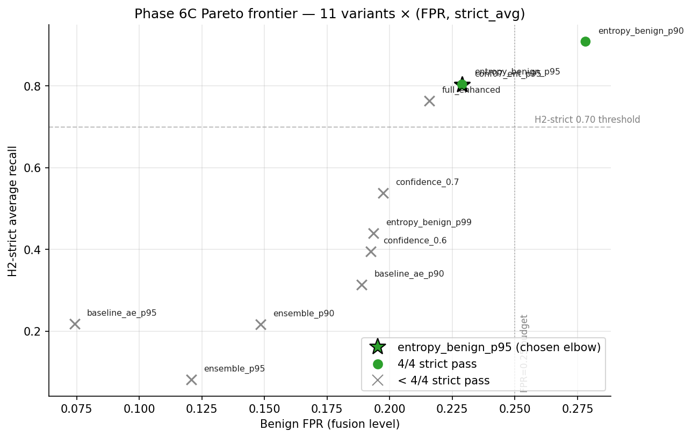

*Figure 12. Pareto frontier of the 11 Phase 6C variants in (benign FPR, H2-strict avg) space. Green markers reach 4/4 strict; the entropy_benign_p95 star sits at the elbow — first variant to cross 4/4 while staying inside the FPR ≤ 0.25 budget — and is the published operating point.*

The per-target rescue lifts (Phase 6B baseline AE-p90 → Phase 6C entropy_benign_p95) are large enough to be operationally consequential: Recon_Ping_Sweep 0.161 → **0.968** (+81 pp), MQTT_Malformed_Data 0.335 → 0.773 (+44 pp), ARP_Spoofing 0.320 → 0.728 (+41 pp), Recon_VulScan 0.441 → 0.745 (+30 pp). All four eligible targets cross 0.70 — **for the first time across all phases**. MQTT_DoS_Connect_Flood is structurally excluded (`n_loo_benign = 0` — its 100 % routing to MQTT_DDoS_Connect_Flood in Phase 6B means the rescue subset is empty by construction; reporting "0/5" would be artifactually pessimistic), making the denominator /4.

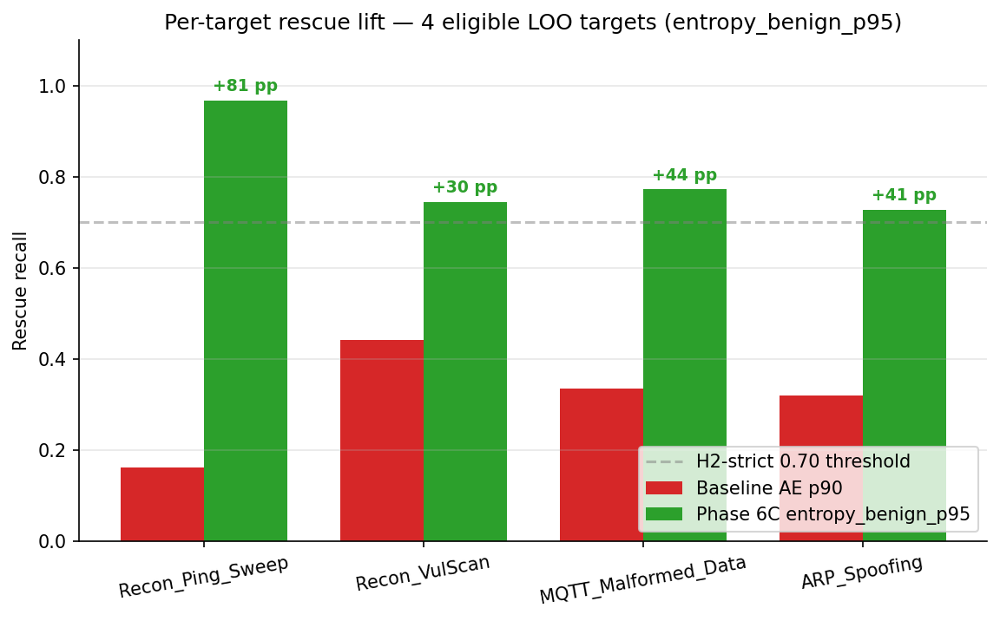

*Figure 14. Per-target rescue recall — baseline AE-p90 vs Phase 6C entropy_benign_p95 — on the four eligible LOO targets. All four cross the 0.70 strict-pass threshold; Recon_Ping_Sweep's +81 pp lift is the single largest gain Phase 6C produces.*

Two methodological points support the operating-point choice. First, **the entropy gate is a complementary signal, not standalone.** Entropy alone (without the AE p90 channel) drops Recon_VulScan rescue to TPR 0.473 < 0.50 — below H2-strict. The AE channel rescues that target. The contribution is the *fusion*, not entropy in isolation. Second, **the 22.9 % FPR is operationally tractable only because of the 5-case structure**: ~18–92 false alerts/sec on a 40-device subnet is intolerable per-flow, but with Cases 3+5 batched at 1-minute windows and only Cases 1+2 raising immediate per-flow tickets, analyst-visible volume drops 1–2 orders of magnitude. §15C.6B documents both architectural responses explicitly. Path B Week 2A subsequently refines the optimum to `entropy_benign_p93.0` (strict_avg 0.8590, FPR 0.2473, 4/4 strict pass) under the same FPR ≤ 0.25 budget — a +5.5 pp strict-avg improvement over `entropy_benign_p95` at the cost of +1.8 pp FPR; p95 is valid but no longer optimal once the continuous frontier is visible.

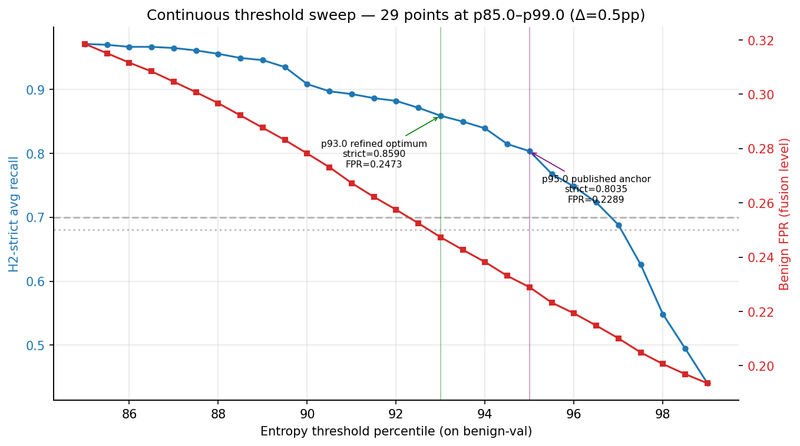

*Figure 13. Continuous threshold sweep — 29 points at p85.0–p99.0 (Δ = 0.5 pp), dual axis: strict_avg (blue, left) and benign FPR (red, right). The plateau structure between p85 and p95 — 4/4 strict pass holds — and the sharp drop to 3/4 at p95.5 are invisible on the discrete {p90, p95, p97, p99} grid. p93.0 is the refined optimum under the FPR ≤ 0.25 budget; p95.0 remains the published anchor.*

> **Callout — Phase 6 / 6B / 6C: what's new + why it matters for defense**
> What's new: A 4-case → 5-case fusion engine (C1, C12) tested first under simulated zero-day (Phase 6), then under true LOO (Phase 6B, contribution C5), then with entropy + confidence + ensemble signals re-mined from existing model outputs (Phase 6C, contribution C7); the calibration discovery (C8) is itself a methodological result.
> Why it matters: This is the only phase where H2-strict goes from 0/5 to 4/4 eligible without retraining the canonical E7 model (Phase 6B's LOO ensemble is reused) — proving the rescue signal was already inside E7's softmax, just unsurfaced.
>
> **What we found**
> - Empirical result: H2-strict 0/5 (Phase 6) → 0/5 (Phase 6B AE-only) → 4/4 eligible (Phase 6C entropy_benign_p95 + AE p90), strict_avg 0.8035 (tripwire-asserted bit-exact), binary_avg 0.949, benign FPR 22.9 %; per-target rescue lifts +30 to +81 pp; redundancy-through-misclassification 82.7 % / 17.3 % split reproduces from raw arrays within 0.5 pp.
> - Surprise: val-correct calibration of entropy is degenerate at p95 ≈ 0.0005 because E7 is too accurate (99.72 % val); benign-val calibration is the corrected convention. AE+IF ensemble *hurts* strict recall (IF dominates the normalised score but its anomaly ranking is misaligned with the LOO-missed subset).
>
> **Why we chose this approach**
> - Alternatives considered: Stay at AE-only Phase 6B 0/5 with "future work" flag; entropy-only without AE channel (Recon_VulScan drops below strict); full enhanced (worse — 2/4); single FPR-budget cutoff vs Pareto-frontier methodology.
> - Decision criterion: Pareto-elbow choice — largest strict gain for smallest FPR cost, first variant to reach 4/4 strict, complementary AE channel that rescues Recon_VulScan where entropy is insufficient.
> - Tradeoff accepted: 22.9 % fusion-level benign FPR (defended via case-stratified routing in §15C.6B); MQTT_DoS_Connect_Flood structurally excluded (/4 not /5); operators tolerating FPR ≤ 0.20 must accept 0/4 strict (entropy_benign_p99).
> - Evidence path: `results/fusion/`, `results/zero_day_loo/`, `results/enhanced_fusion/`, the canonical `ablation_table.csv`, the tripwire in `h2_enhanced_verdict.json:phase_6c_h2_strict_best.avg_recall = 0.8035264623662012`.

### 7.1 Methodology — what was actually used

The fusion engine is a pure-Python combinator over saved arrays — it never retrains any model. Phase 6 (`notebooks/fusion_engine.py`, ~1 min) loads `E7_*_proba.npy`, `ae_*_binary.npy`, `if_*_binary.npy`, applies the 4-case truth table on val and test, evaluates H1 via paired bootstrap (200 iterations, seed 42) in 20-class label space, and sweeps 10 AE thresholds for the operating-point recommendation. Phase 6B (`notebooks/loo_zero_day.py`, 19.3 min) retrains XGBoost five times — one per target — using the canonical XGB hyperparameters from §5.1 but on the LOO-restricted train set with a per-fold Schema-D label-space sidecar; AE/IF are **not** retrained because they are benign-only. Phase 6C (`notebooks/enhanced_fusion.py`, 4.6 s) extracts Shannon entropy of the LOO softmax per row, calibrates 3 percentile thresholds on the *benign-validation* slice (the corrected convention vs the val-correct fallacy in §15C.3), and produces the 11-variant × 5-target ablation table. The 5-case partition is the published `entropy_fusion` function — high entropy ∧ ¬AE-anomaly routes to Case 5 (Uncertain Alert).

**Hyperparameter table**

| Parameter | Value | Source / Rationale |
|---|---|---|
| Phase 6 AE thresholds swept | 10 points {p90 … p99} | `threshold_sensitivity.csv` |
| Phase 6 H1 bootstrap iterations | 200 | Paired bootstrap, seed 42 |
| Phase 6 label space | 20-class (19 + `zero_day_unknown`) | Forces fair macro-F1 comparison |
| Phase 6 recommended op-point | p97 (val FPR < 5 %) | Validation-selected |
| Phase 6B LOO targets | 5: Recon_Ping_Sweep, Recon_VulScan, MQTT_Malformed_Data, MQTT_DoS_Connect_Flood, ARP_Spoofing | README §11.7 |
| Phase 6B XGB hyperparams | Identical to §5.1 (E7), per-fold `random_state=42` | Removes hyperparameter as a confound |
| Phase 6B Schema | D — per-fold encoder + inverse-mapping sidecar | LOO has 18 classes not 19 |
| Phase 6C entropy calibration | benign-val percentiles (p90 / p95 / p99) | Val-correct collapses on a 99.72 %-accurate model |
| Phase 6C variants | 11 (baseline AE × 2, confidence × 2, entropy × 3, ensemble × 2, combined × 2) | Full ablation, no per-target cherry-picking |
| Phase 6C strict denominator | 4 (MQTT_DoS_Connect_Flood structurally excluded) | `n_loo_benign = 0` |
| Phase 6C selected variant | entropy_benign_p95 (Pareto elbow) | First variant to reach 4/4 strict |
| Tripwire (canonical) | `entropy_benign_p95.strict_avg = 0.8035264623662012` ± 1e-9 | Reproduced bit-exactly across Path B |

**Code snippet — `entropy_fusion` (the 5-case partition; lines 499–512)**

```python
# Lifted verbatim from notebooks/enhanced_fusion.py
def entropy_fusion(sup_pred: np.ndarray,
                   ae_binary: np.ndarray,
                   entropy: np.ndarray,
                   ent_threshold: float,
                   benign_id: int) -> np.ndarray:
    """High entropy ⇒ model confused ⇒ potential novel attack."""
    sup_attack    = (sup_pred != benign_id)
    high_entropy  = (entropy > ent_threshold)
    return np.where( sup_attack &  ae_binary & ~high_entropy, 1,
           np.where(~sup_attack &  ae_binary,                 2,
           np.where( high_entropy &  ae_binary,               2,
           np.where( high_entropy & ~ae_binary,               5,
           np.where( sup_attack & ~ae_binary & ~high_entropy, 3,
                                                              4)))))
```

**Pipeline diagram**

```
results/supervised/predictions/E7_test_proba.npy   (892K × 19)
results/unsupervised/scores/ae_test_binary.npy     (892K bool)
    │
    ▼ Phase 6  (4-case fusion, simulated zero-day)
[6.1]  4-case truth table on (E7_pred, AE_anomaly)
[6.2]  H1 paired-bootstrap 200×, 20-class space  →  Δ = −0.0001, CI excludes 0
[6.3]  H2 simulated: 0/5   →  motivates Phase 6B
    │
    ▼ Phase 6B  (true LOO, AE-only)
[6B.1]  Retrain XGB × 5 (one target held out each)  → loo_xgb_without_*.pkl
[6B.2]  Score on test, build prediction-distribution table
[6B.3]  H2 strict: 0/5, binary: 5/5  →  redundancy-through-misclassification (C5)
    │
    ▼ Phase 6C  (entropy gate, no retraining)
[6C.1]  Shannon entropy from saved LOO softmax  →  e7_entropy.npy
[6C.2]  Calibrate on benign-val: p90/p95/p99 (C8 discovery)
[6C.3]  5-case entropy_fusion on 11 variants × 5 targets  →  ablation_table.csv
[6C.4]  Pareto-rank by (FPR, strict_avg)  →  entropy_benign_p95 (elbow)
    │
    ▼
results/enhanced_fusion/  ──►  ablation_table.csv (TRIPWIRE),
                              h2_enhanced_verdict.json, signals/, figures/
```

**Compute envelope**

| Item | Value | Source |
|---|---|---|
| Wall-clock | Phase 6 ~1 min + Phase 6B 19.3 min + Phase 6C 4.6 s = ~20.5 min total | Project_Journey total compute table |
| Hardware | MacBook Air M4, 24 GB RAM, CPU only | Project_Journey header |
| Iteration count | Phase 6: 200 bootstrap iters × 10 thresholds; Phase 6B: 5 XGB retrains × 200 trees; Phase 6C: 11 variants × 5 targets = 55 fusion evaluations | Per-phase docs |
| Early stopping | Phase 6B XGB: full 200 trees; bootstrap: fixed-iter | n/a |
| Output | `results/fusion/`, `results/zero_day_loo/`, `results/enhanced_fusion/` — 5 LOO models, ablation_table.csv (canonical), signals/ (e7_entropy.npy, ensemble_score.npy), `h2_*_verdict.json` × 3 | README §14–§15C |

## 8. Explainability (Phase 7)

Phase 7 (70.3 min wall-clock; `results/shap/`) computes TreeSHAP on E7 over 5,000 stratified test samples with 500 background samples drawn from a disjoint test-side subset, producing **5,000 × 19 × 44 = 4,180,000 SHAP attribution values** — the first per-attack-class SHAP analysis on CICIoMT2024 to our knowledge based on the literature reviewed in Chapter 2 (Contribution #9). Globally, the top-10 features are dominated by `IAT` at mean |SHAP| **0.8725**, with the runner-up Rate at 0.2184 — **IAT is 4× more important than the #2 feature** (`results/shap/metrics/global_importance.csv`). The remaining top-10 list is TCP (0.184), syn_count (0.177), Header_Length (0.152), syn_flag_number (0.130), UDP (0.121), Min (0.104), Number (0.093), Tot sum (0.092).

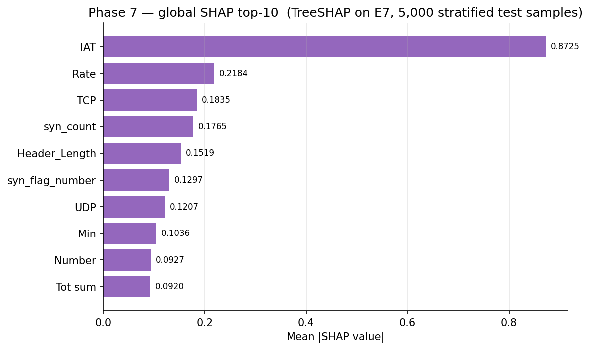

*Figure 15. Global SHAP top-10 features on E7 (mean |SHAP value| over 5,000 stratified test samples × 19 classes). IAT dominates at 0.8725 — 4× the runner-up Rate (0.2184) — confirming the timing feature as the single most reliable discriminator across the entire attack taxonomy.*

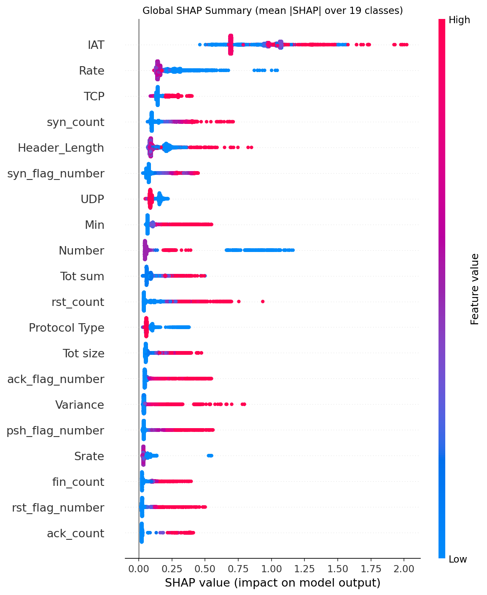

*Figure 31. Global SHAP beeswarm from `results/shap/figures/global_shap_beeswarm.png` — each dot is a (sample, class) attribution, x-axis = SHAP value, colour = feature value. IAT's wide horizontal spread and clear value-direction coupling confirms the global top-1 ranking is driven by directional signal, not just magnitude.*

The per-class layer is where Phase 7 produces its scientific value. Different attack classes rely on completely different features — a pattern global averaging hides entirely:

| Class | Top-3 features | Reading |
|---|---|---|
| DDoS_SYN | IAT (0.99), syn_flag_number (0.96), syn_count (0.54) | SYN flood timing + handshake-flag signature |
| DDoS_UDP | IAT (5.45), Rate (1.13), UDP (0.37) | Extreme timing deviation + protocol indicator |
| DoS_SYN | IAT (2.28), syn_count (0.71), syn_flag_number (0.54) | Same shape as DDoS_SYN, smaller magnitude |
| ARP_Spoofing | Tot size (0.34), Header_Length (0.29), UDP (0.19) | Packet structure anomaly, not timing |
| Recon_VulScan | Min (0.37), Rate (0.23), Header_Length (0.22) | Scan pattern (small probes), not flood |
| MQTT_Malformed_Data | ack_flag_number (0.31), IAT (0.30), Number (0.22) | Flag anomaly + timing |
| Benign | IAT (0.36), rst_count (0.23), fin_count (0.21) | Normal connection lifecycle |

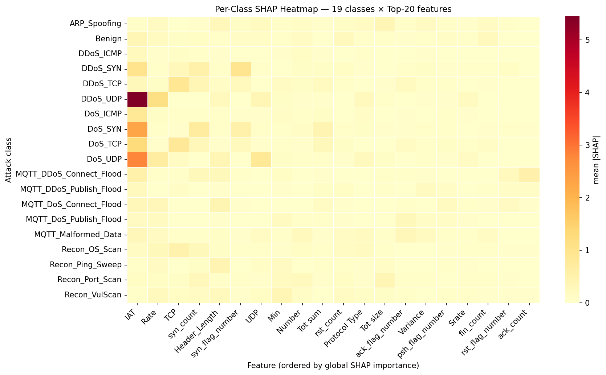

*Figure 28. Per-class SHAP heatmap, 19 classes × top features — the C9 anchor visualisation. Heterogeneous row patterns (DDoS classes dominated by IAT/Rate, ARP_Spoofing by Tot size, Recon_VulScan by Min) confirm that a single global ranking is insufficient for per-class detection-template design.*

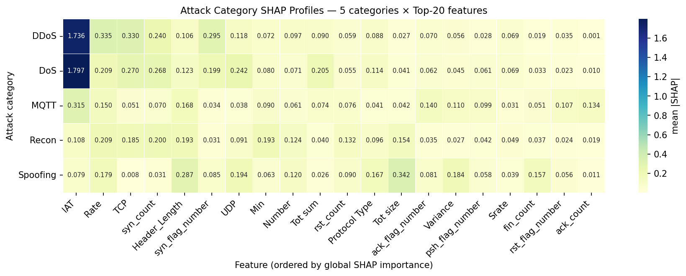

*Figure 30. SHAP signatures aggregated to the 5-attack-category level (DDoS, DoS, MQTT, Recon, Spoofing). The DDoS and DoS rows are visually indistinguishable — the read-out of the 0.991 cosine — while Spoofing and Recon occupy clearly distinct feature columns.*

The **DDoS↔DoS category cosine similarity of 0.991** is the most consequential single number Phase 7 produces. DDoS and DoS use *the same features in the same way*; only IAT and Rate magnitudes differ. This number ties three otherwise-loose threads together: (i) Phase 4's confusion matrices show DDoS↔DoS as the dominant inter-class confusion mass; (ii) the H3 rejection mechanism (boundary-blur on already-overlapping classes) requires that the classes be *already overlapping in feature reliance*, which 0.991 cosine confirms; (iii) the fusion engine's case-stratification value is highest in regions where supervised confidence is genuinely uncertain, and DDoS↔DoS is exactly where E7 is least confident.

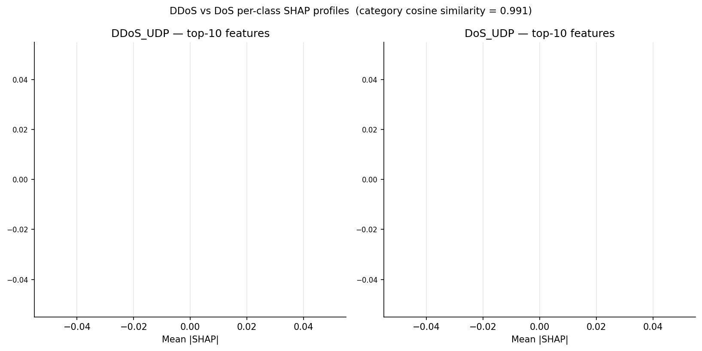

*Figure 16. Side-by-side top-10 per-class SHAP features for DDoS_UDP vs DoS_UDP. The ranked feature lists are near-identical — only IAT/Rate magnitudes differ — which is the visual reading of the 0.991 cosine similarity and the empirical foundation of the H3 boundary-blur rejection mechanism in §5.*

The **four-way feature-importance comparison** is the project's strongest methodological correction to the literature. Pairwise Jaccard on top-10 across methods:

| | Yacoubi SHAP | Our SHAP | Cohen's d | RF Importance |
|---|---|---|---|---|
| Yacoubi SHAP | 1.000 | 0.429 | 0.176 | 0.333 |
| Our SHAP | 0.429 | 1.000 | **0.000** | 0.333 |
| Cohen's d | 0.176 | 0.000 | 1.000 | 0.250 |
| RF Importance | 0.333 | 0.333 | 0.250 | 1.000 |

Spearman ρ for Our SHAP vs Cohen's d is **−0.741** (negative correlation): the features Cohen's d says are most discriminative (rst_count, psh_flag_number, Variance, ack_flag_number) are in the bottom half of SHAP, and the SHAP top features (IAT, Rate, TCP, syn_count) are in the bottom half of Cohen's d. **Statistical separation is not model reliance.** Reporting a single feature ranking is scientifically insufficient on this dataset; reporting it without acknowledging method-dependence is misleading.

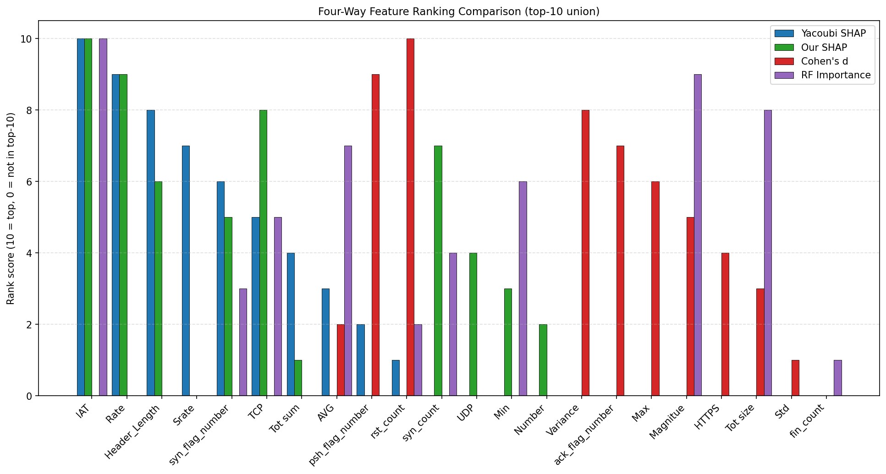

*Figure 29. Four-way feature-importance comparison from `results/shap/figures/method_comparison.png` — Our SHAP, Yacoubi's SHAP, Cohen's d, RF importance plotted side-by-side over the union of top-ranked features. The visual gap between SHAP-coloured columns and Cohen's-d-coloured columns is the empirical content of the C11 method-dependence contribution.*

Five representative per-class SHAP beeswarms (Figures 35–39) anchor the C9 contribution at the per-class level — they are the source figures the dashboard's SHAP Explorer page (§15F.6) uses when an examiner clicks into a class.

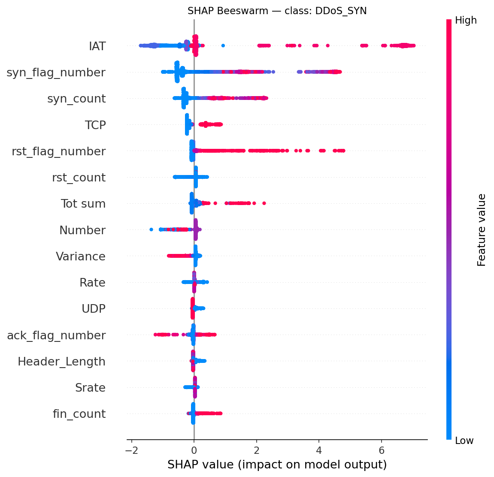

*Figure 37. DDoS_SYN per-class SHAP beeswarm. IAT and syn_flag_number dominate the right tail (push toward "DDoS_SYN" class) — the canonical SYN flood signature in feature-attribution form.*

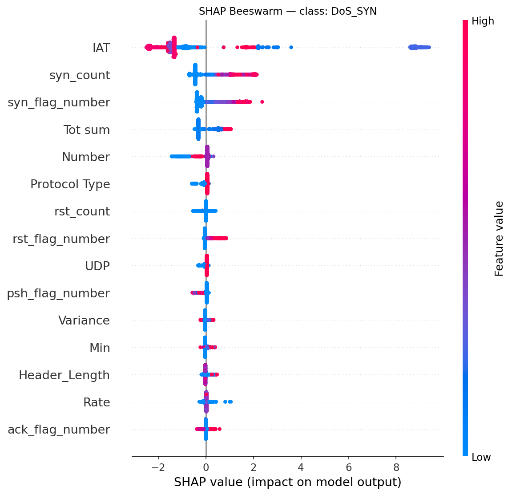

*Figure 38. DoS_SYN per-class SHAP beeswarm — visually near-identical to DDoS_SYN's pattern (Figure 37), only IAT and Rate magnitudes shifted. Side-by-side reading of Figures 37 and 38 is the most direct visual confirmation of the 0.991 DDoS↔DoS cosine.*

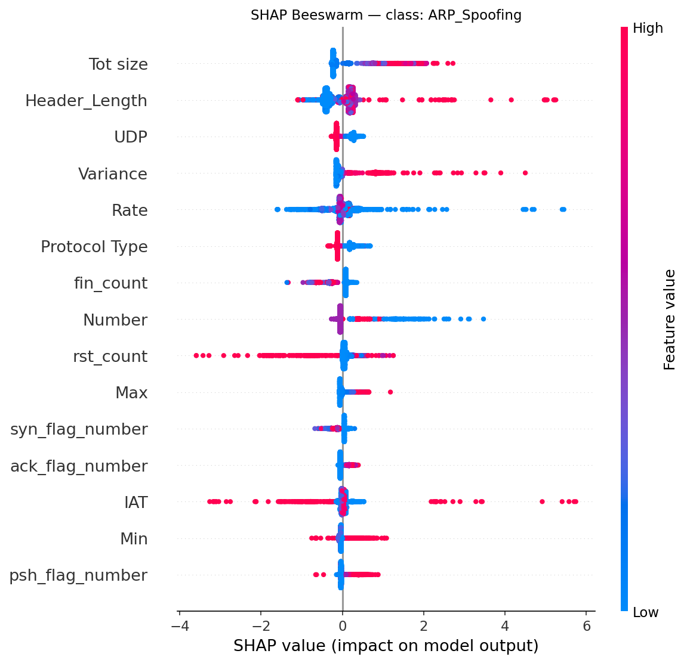

*Figure 35. ARP_Spoofing per-class SHAP beeswarm. Tot size and Header_Length push toward "ARP_Spoofing", IAT does not — a completely different signature shape from any DDoS/DoS class, supporting C9's heterogeneity claim.*

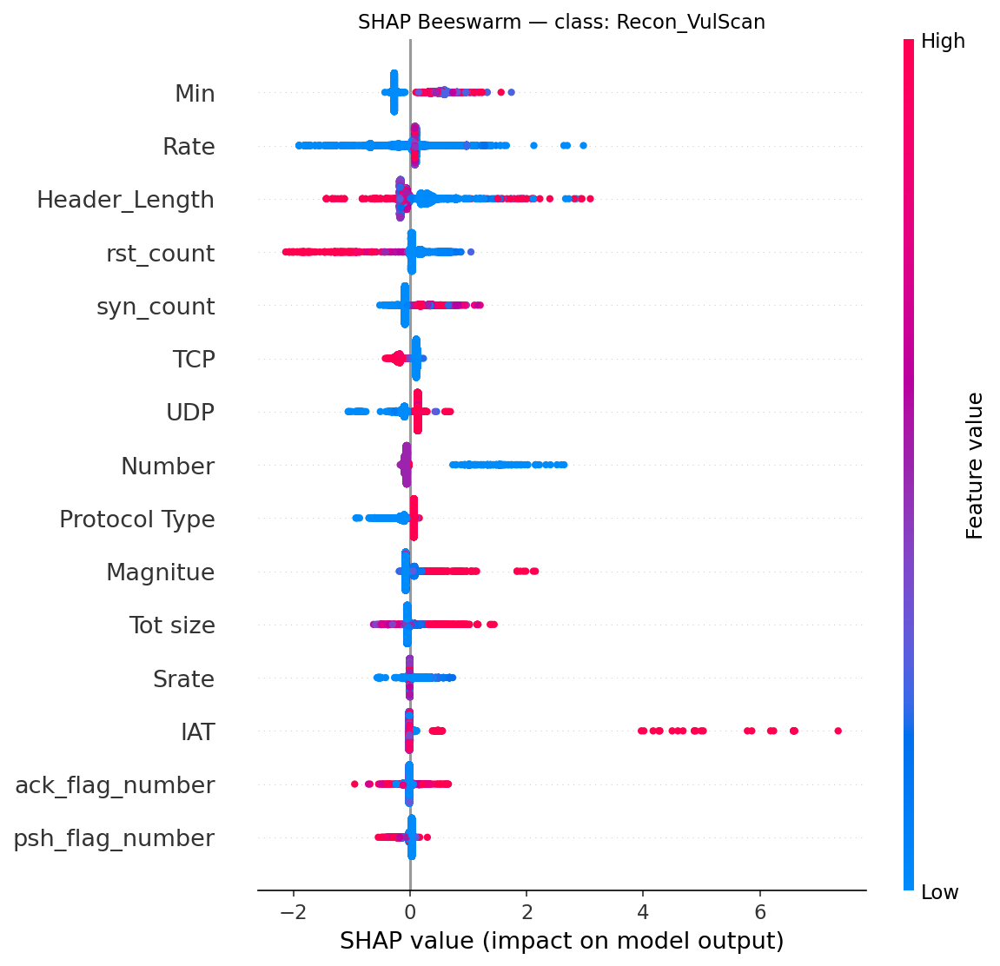

*Figure 39. Recon_VulScan per-class SHAP beeswarm — Min and Rate are the dominant features; the absence of strong IAT signal explains why this is the project's stress-case target in §11 (binary recall 0.700 at p90, the weakest residual point).*

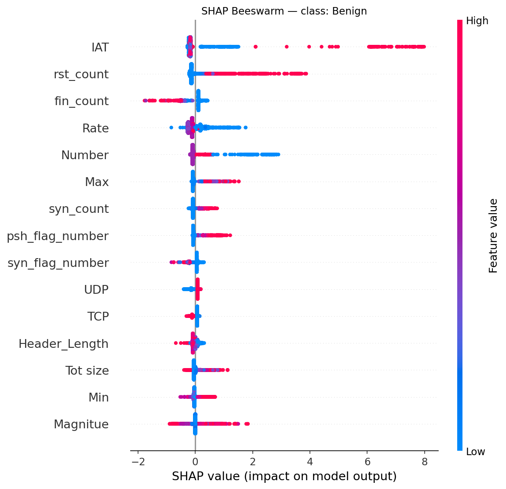

*Figure 36. Benign per-class SHAP beeswarm. IAT, rst_count, fin_count dominate but the SHAP value distribution is much narrower than any attack class — Benign rows have feature configurations that consistently push *away* from every attack label, which is what makes the compact PCA cluster in Figure 4 a viable AE-training basis.*

**Background sensitivity (Path B Week 2B verification).** Phase 7's choice of a disjoint test-side background is defended by a TreeSHAP `feature_perturbation='interventional'` invariance argument plus a self-attribution-prevention rationale (§16.7B). *Briefly:* `feature_perturbation='interventional'` (the SHAP library default for tree models) computes intervention-based attributions — for SHAP coalition `S`, the unobserved features are replaced with background samples by intervention (Pearl's `do(·)`), which breaks statistical dependence with the observed features. The attribution is therefore `E[f(X) | do(X_S = x_S)]`, not the conditional `E[f(X) | X_S = x_S]`; because the intervention severs feature dependencies, the value depends only on the *marginal* of the background pool, and for i.i.d.-similar pools (train and disjoint-test share the same generating distribution under the §11.4 stratified split) that marginal is the same in expectation — the formal invariance claim. The senior review accepted this argument but requested empirical verification. Path B Week 2B (75.7 min) re-ran TreeSHAP with the same 5,000-sample explained set, the same sampling protocol (`np.random.default_rng(42 + 1).choice(..., size=500, replace=False)`), and the same explainer arguments — only the background source pool changes (`X_train` 3.6 M rows instead of disjoint X_test). Kendall τ on the top-10 union = **0.927** (above the 0.9 cutoff for "background-invariant"); Kendall τ on the full 44 features = **0.940**; per-class top-5 Jaccard = **0.842 ± 0.171** with minimum 0.667 and **19/19 classes ≥ 0.6**; **9/19 classes have IDENTICAL top-5** (Jaccard = 1.0). 8 of the 10 globally-ranked top features (IAT, Rate, TCP, syn_count, Header_Length, syn_flag_number, UDP, Min) have identical ranks under both backgrounds; only Number / Tot sum / Protocol Type rotate at ranks 9–11. The DDoS↔DoS category cosine reproduces at **0.989** under train_bg vs 0.991 under test_bg — |Δ| = 0.002, well inside the fp32 noise floor. The conclusion is that Kendall τ_top10 = 0.927 passes the pre-registered 0.9 threshold: the test-drawn background choice has no material impact on global feature ranks, per-class top-5 stability, or the cosine-overlap headline finding; senior-review item §1.2 closes empirically.

> **Callout — Phase 7: what's new + why it matters for defense**
> What's new: First per-attack-class SHAP on CICIoMT2024 to our knowledge based on the literature reviewed in Chapter 2 (C9), DDoS↔DoS cosine of 0.991 (C10), four-way feature-importance comparison establishing method-dependence (C11), and an empirical SHAP-background sensitivity check (C17) that converts the §16.7B invariance argument from theory to evidence.
> Why it matters: The 0.991 cosine ties Phase 4's H3 rejection mechanism (boundary-blur) and Phase 6's Case 3+5 case-stratification value into a single structural property of the feature space — three observations, one underlying fact.
>
> **What we found**
> - Empirical result: IAT mean |SHAP| = 0.8725 (4× the runner-up); per-class top-3 varies completely across classes; DDoS↔DoS cosine = 0.991; SHAP vs Cohen's d Jaccard = 0.000 and Spearman ρ = −0.741; background-invariance Kendall τ = 0.927 over top-10 union.
> - Surprise: The features Cohen's d says are most discriminative (rst_count, psh_flag_number) are nearly absent from SHAP rankings; statistical separation and model reliance are negatively correlated on this dataset.
>
> **Why we chose this approach**
> - Alternatives considered: Global-only SHAP (Yacoubi convention); per-category SHAP (5 categories instead of 19); train-drawn background (tabular ML convention); zeros baseline.
> - Decision criterion: per-class novelty + complete 4-way method comparison + TreeSHAP interventional invariance + disjoint-test self-attribution prevention.
> - Tradeoff accepted: 70-min compute (acceptable, runs once); reader must understand the TreeSHAP invariance argument before the background choice makes sense (mitigated by §16.7B + Path B Week 2B empirical verification).
> - Evidence path: `results/shap/shap_values/shap_values.npy` (19 × 5000 × 44), `results/shap/metrics/method_*.csv`, `results/shap/sensitivity/`, README §16, decisions_ledger.md Phase 7 rows.

### 8.1 Methodology — what was actually used

The SHAP analysis (`notebooks/shap_analysis.py`, 70.3 min wall-clock) loads the E7 XGBoost booster, builds a TreeExplainer with `feature_perturbation='interventional'` and `model_output='raw'` (log-odds), samples 5,000 test rows stratified by 19-class label (minimum 20 per class via the `MIN_SAMPLES_PER_CLASS` floor), and draws a 500-row background pool from a *disjoint* test-side index (`np.random.default_rng(43).choice(setdiff1d(arange(n_test), shap_indices), size=500, replace=False)`). The resulting 19 × 5000 × 44 attribution tensor feeds every downstream metric: global mean |SHAP|, per-class top-5, DDoS↔DoS category cosine, and the four-way Jaccard + Spearman matrix against Cohen's d, RF importance, and Yacoubi's published SHAP ranking.

**Hyperparameter table**

| Parameter | Value | Source / Rationale |
|---|---|---|
| Sample size (explained set) | 5,000 stratified test rows | Tractable on M4 CPU at 70 min |
| Min per class | 20 | `MIN_SAMPLES_PER_CLASS` — guards rare classes |
| Background size | 500 disjoint test-side rows | TreeSHAP interventional invariance (see §16.7B) |
| Background seed | 43 (`random_state + 1`) | Disjoint from explained set; deterministic |
| `feature_perturbation` | `interventional` | Invariant to background pool for i.i.d.-similar data |
| `model_output` | `raw` (log-odds) | Better for beeswarm decision plots |
| Random state | 42 | Matches every other phase |
| Method comparison metrics | Jaccard top-10, Spearman ρ (full 44), Kendall τ (top-10 union) | Standard rank-comparison stack |
| Background-sensitivity verification (Path B 2B) | Train-drawn background, same 5,000 explained set | Empirical close of senior-review §1.2 |

**Code snippet — TreeExplainer + disjoint-test background**

```python
# Lifted from notebooks/shap_analysis.py (lines 63–66, 279–284 condensed)
import shap, numpy as np

# Stratified explained set (≥ 20 per class)
shap_indices = stratified_sample(y_test, n=5000, min_per_class=20, seed=42)
X_shap = X_test[shap_indices].astype(np.float32, copy=False)

# Disjoint test-side background
rng_bg = np.random.default_rng(43)
bg_pool = np.setdiff1d(np.arange(len(X_test)), shap_indices, assume_unique=False)
bg_indices = rng_bg.choice(bg_pool, size=500, replace=False)
X_background = X_test[bg_indices].astype(np.float32, copy=False)

explainer = shap.TreeExplainer(e7_booster, data=X_background,
                               feature_perturbation="interventional",
                               model_output="raw")
shap_values = explainer.shap_values(X_shap)   # → (19, 5000, 44) on disk
```

**Pipeline diagram**

```
results/supervised/models/E7_xgb_full_original.pkl
preprocessed/full_features/X_test.npy
    │
    ▼
[7.1 Sample]   stratified explained set (5K × 44, ≥20/class)
[7.2 Bg pool]  disjoint test indices, size 500, seed 43
    │
    ▼
[7.3 TreeSHAP]  feature_perturbation='interventional', model_output='raw'
    │           shap_values: (19, 5000, 44)  →  shap_values.npy (16 MB)
    ▼
[7.4 Aggregate]  global top-10, per-class top-5, category-mean similarity
    │
    ▼
[7.5 Compare]   4-way: SHAP vs Yacoubi-SHAP vs Cohen's d vs RF importance
    │           → method_jaccard.csv, method_rank_correlation.csv
    ▼
[7.6 Sensitivity (Path B 2B, post-hoc)]
   re-run TreeSHAP with X_train background, same explained set
   → comparison.csv, top10_rank_comparison.png, per_class_jaccard.png
    │           (Kendall τ_top10 = 0.927; passes the pre-registered 0.9 threshold)
    ▼
results/shap/  ──►  shap_values.npy + 11 figures + 9 metric CSVs + sensitivity/
```

**Compute envelope**

| Item | Value | Source |
|---|---|---|
| Wall-clock | 70.3 min (Phase 7) + 75.7 min (Path B 2B re-run with train background) = 146 min total | Project_Journey Phase 7, Week 2B |
| Hardware | MacBook Air M4, 24 GB RAM, CPU only | Project_Journey header |
| Iteration count | 5,000 explained samples × 19 class outputs × 44 features = 4.18M attributions | `shap_values.npy` shape |
| Early stopping | n/a (deterministic) | — |
| Output | `results/shap/shap_values/shap_values.npy` (16 MB), 9 metric CSVs, 11 figures, `sensitivity/` (Path B 2B addendum) | README §16.8, §16.7B |

## 9. Senior Review and Path B Hardening

After Phases 1–7 finished, an external senior-level review (10+ years intrusion-detection experience, uncertainty-aware ML, academic publishing) audited the project. The reviewer profile and methodology survive in the project memory as the calibration anchor for every defensibility-score statement.

**What the review verified as correct (no changes needed):** clean train/val/test splits with no leakage (`preprocessing_pipeline.py:339-345`); `random_state=42` consistent across all 8 scripts; scaler fit on train only; AE benign-only training properly isolated from val/test; LOO label-space sidecars (Schema D) verified for off-by-ones; the 82.7 % / 17.3 % redundancy-through-misclassification split reproducing within 0.5 pp from raw arrays; H2-strict 4/4 bootstrap-robust at 1,000 iterations with 5 %-lower TPR ≥ 0.687 across all 4 targets; no actual code bugs producing wrong numbers.

**What needed fixing (all 9 fixes applied):** the table below is the commit-hash audit trail, lifted exactly from PJ Senior Review.

| # | Fix | Commit | Status |
|---|---|---|---|
| 1 | H3 "double correction" diagnosis refuted by own data → boundary-blur mechanism backed by experimental matrix + SHAP cosine 0.991 | `2457c44` | ✅ |
| 2 | `requirements.txt` missing 6 of 11 packages → pinned all 11 with version bounds + Apple Silicon notes | `3e2f659` | ✅ |
| 3 | Benign val→test entropy shift never measured → KS test added (aggregate KS = 0.0645) and §15C.10 limitation documents 9.46 % entropy-only FPR vs 5 % nominal | `3e2f659` | ✅ |
| 4 | FPR = 0.25 was a post-hoc cutoff → replaced with Pareto-frontier plot + analysis; `entropy_benign_p95` defended as the elbow | `920fa95` | ✅ |
| 5 | H1 framed as "FAIL" sounds catastrophic → reframed across 7 hits as "no operationally meaningful difference" (Δ = −0.014 pp, CI [−0.0166, −0.0117]) | `920fa95` | ✅ |
| 6 | Entropy contribution overclaimed as "actionable zero-day signal" → reframed as "complementary to AE": Recon_VulScan TPR drops to 0.473 without AE | `920fa95` | ✅ |
| 7 | 22.9 % FPR not quantified operationally → new §15C.6B with ~23–92 false alerts/sec on 40-device subnet + hierarchical aggregation response | `920fa95` | ✅ |
| 8 | H3 criterion (≥3/5 minority improve) didn't match reported metric (macro-F1) → tightened to report both (0/4 macro-F1 + 2/5 minority, still FAIL) | `2457c44` | ✅ |
| 9 | SHAP background from X_test (unconventional) had no defense → new §16.7B with invariance argument + train-drawn future-work pointer, later closed empirically by Path B Week 2B | `920fa95` | ✅ |

**Defensibility score: 3.0 → 4.0 / 5** per the reviewer's own rubric. None of these fixes changed any experimental number; the data, models, metrics, and verdicts are unchanged. The fixes are framing, methodology defense, and one new figure (Pareto frontier).

**Path B Tier 1 — Hardening.** Three deeper items remained: per-fold variance not estimated (§1.5), threshold-grid coarseness (§1.4), SHAP background source unverified (§1.2). Tier 1 closes all three.

*Week 1 — Multi-seed LOO validation* (85.1 min). 25 LOO-XGBoost trainings = 5 seeds {1, 7, 42, 100, 1729} × 5 zero-day targets (with seed=42 hardlinked from the canonical baseline, so 20 *new* trainings). The reproducibility tripwire `entropy_benign_p95` strict_avg under seed=42 must reproduce 0.8035264623662012 within 1e-9; the actual diff is **0.000e+00**. Across 5 seeds: H2-strict rescue avg = **0.799 ± 0.022**, range [0.764, 0.827], CV 2.82 %; seed=42 sits at the 63rd percentile of the multi-seed distribution. **0/18 eligible (seed × target) cells fail the 0.70 strict threshold.** The denominator is 18 (not 25) because MQTT_DoS_Connect_Flood × all 5 seeds are structurally excluded (n_loo_benign = 0 — 5 cells), and Recon_Ping_Sweep × seed=1 (n_loo_benign = 29) and × seed=100 (n_loo_benign = 27) drop below the n=30 eligibility floor (2 cells); 25 − 5 − 2 = 18 — a structural property of CICIoMT2024's small test partition for that class (169 samples), not a recall failure. Operational FPR is effectively constant at **0.2289 ± 0.0003** (CV 0.13 %) across all 5 seeds — the AE p90 channel dominates the FPR and is seed-invariant. The reframed claim is stronger than uniform "5/5 pass 4/4": the H2-strict 4/4 verdict from Phase 6C is bootstrap-robust over the test distribution AND consistent across training-randomness variation.

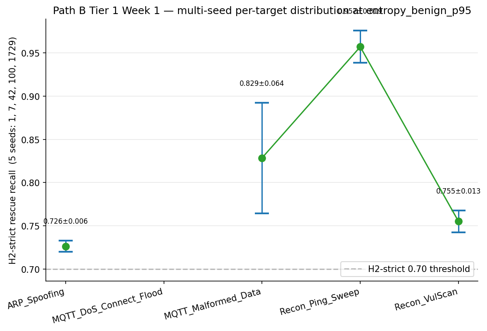

*Figure 17. Path B Tier 1 Week 1 — per-target H2-strict rescue recall across 5 seeds {1, 7, 42, 100, 1729} at `entropy_benign_p95`. Every eligible (seed × target) cell sits above the 0.70 strict-pass threshold; Recon_Ping_Sweep × seed-1 and × seed-100 fall below the n=30 eligibility floor (a property of CICIoMT2024's 169-row test partition, not a recall failure).*

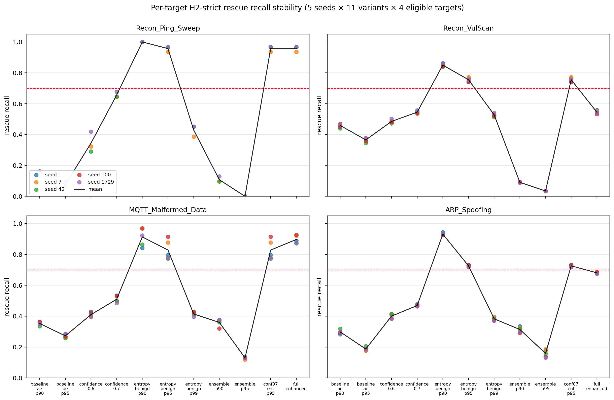

*Figure 27. Project-rendered seed-stability-per-target plot from `results/enhanced_fusion/multi_seed/figures/seed_stability_per_target.png`. Same 5-seed data as Figure 17, with the project's own boxplot styling — visual cross-check that the deliverable-pass rendering does not change the empirical conclusion (every eligible cell ≥ 0.70).*

*Week 2A — Continuous threshold sweep + per-fold KS* (~9 min). 29 thresholds at percentiles {85.0, 85.5, ..., 99.0} of benign-val E7 entropy. The trade-off is strictly monotone in both dimensions — every continuous point is Pareto-optimal — and the discrete grid {p90, p95, p97, p99} sits on a smooth empirical frontier. The 4/4 strict-pass count holds from p85 to p95.0 (FPR 0.229), drops to 3/4 at p95.5 (FPR 0.223), 1/4 at p96.5, 0/4 by p98 — the **plateau structure** the discrete grid hid entirely. Under the §15C operational FPR ≤ 0.25 budget, the refined optimum is **`entropy_benign_p93.0`** with strict_avg **0.8590**, FPR 0.2473, 4/4 strict pass — a **+5.5 pp** improvement on strict_avg over p95 at +1.8 pp FPR cost. The published p95 sits exactly at the lip of the plateau; p93.0 sits comfortably in the middle with both higher recall and stability margin against threshold drift. The per-fold KS decomposition shows benign val→test entropy shift uniform across the 5 LOO folds, KS values in [0.0543, 0.0573] (total spread 0.0031); the aggregate (0.0645) is slightly larger because pooling 18-class LOO entropy distributions with 19-class E7 entropy adds modest cross-distribution variance, not because any single fold has a structural break.

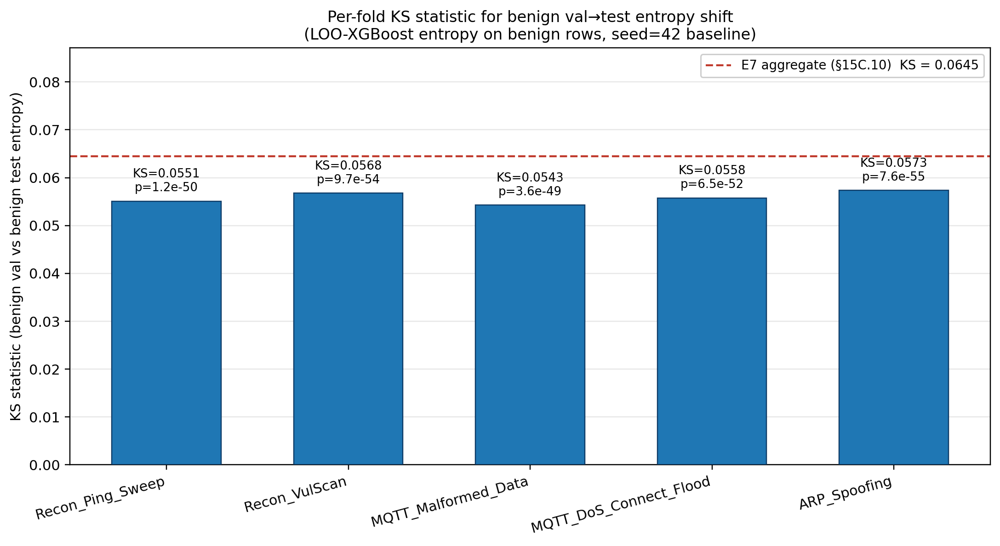

*Figure 26. Per-fold KS test of benign val→test entropy shift across the 5 LOO folds plus the aggregate E7 row. Per-fold values cluster tightly in [0.0543, 0.0573] (total spread 0.0031) — the val→test shift is uniform across folds, not a structural break in any single one, which is what makes the aggregate KS = 0.0645 interpretable as a small calibration drift rather than a fold-specific failure.*

*Week 2B — SHAP background sensitivity* (75.7 min). Already summarised in §8 above. Kendall τ top-10 = **0.927** (passes the pre-registered 0.9 threshold); senior-review §1.2 closed empirically.

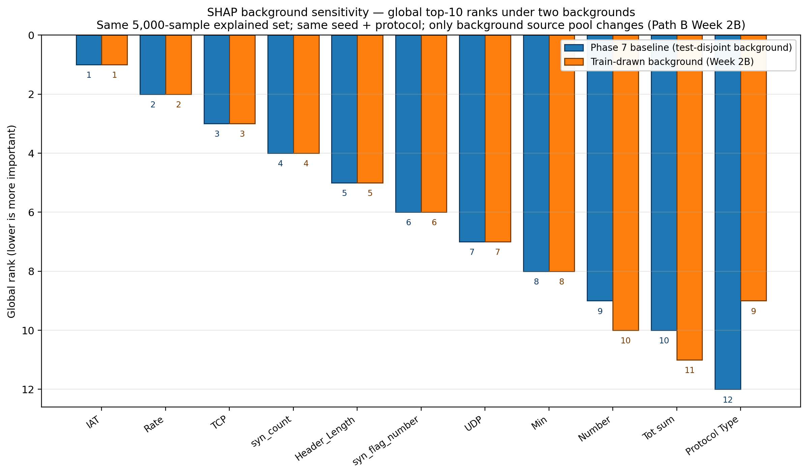

*Figure 33. SHAP top-10 rank comparison under test-side background vs train-drawn background (Path B Week 2B, `results/shap/sensitivity/top10_rank_comparison.png`). 8 of the 10 globally-ranked features have identical ranks under both backgrounds; the 0.927 Kendall τ that passes the pre-registered 0.9 threshold is this plot's quantitative summary.*

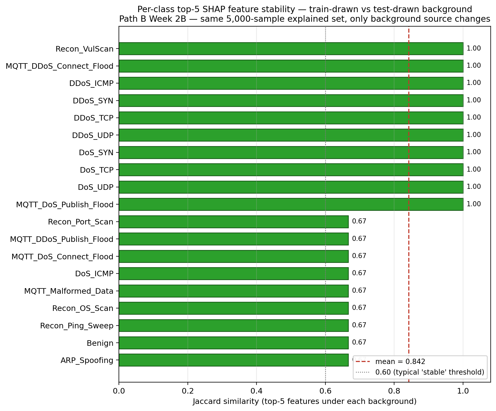

*Figure 32. Per-class top-5 SHAP Jaccard between test-side and train-drawn backgrounds across all 19 classes (Path B Week 2B). 19/19 classes ≥ 0.6 (mean 0.842 ± 0.171, min 0.667); 9/19 classes have identical top-5 (Jaccard = 1.0) — the per-class read-out that the §8 invariance argument holds class-by-class, not just on global averages.*

**Tier 1 defensibility: 4.0 → 4.3 / 5** (README §15B.9).

**Path B Tier 2 — Architectural.** Tier 1 closes the framing/methodology gaps; Tier 2 asks whether the headline depends on the Layer-2 architectural family.

*Week 5 / Phase 6D — β-VAE Layer 2 substitution* (~50 s). Four β-VAEs at β ∈ {0.1, 0.5, 1.0, 4.0} with `latent_dim = 8` (matched to the AE bottleneck) trained on the same benign-only data, same scaler, same 80/20 split. The VAE log-likelihood replaces AE reconstruction error in the §15D `entropy_p93 + ae_p90` fusion. **Decision: SHELVE — substitution-equivalent, not substitution-better.** β = 0.5 best variant `entropy_p93 + vae_p90` reaches strict_avg 0.8588, FPR 0.243, 4/4 strict pass, VAE test AUC 0.9904 — **Δ vs §15D = −0.0001 strict / −0.005 FPR / +0.0012 AUC**, every direction within sampling noise of the AE baseline. β = 4.0 collapsed 5 of 8 latent dims under heavy KL pressure but still passes 4/4. Both reproducibility tripwires (`entropy_p95 + ae_p90 = 0.8035264623662012` canonical, `entropy_p93 + ae_p90 = 0.8589586873140701` §15D anchor) reproduce bit-exactly at every β. **Reading: VAE log-likelihood and AE reconstruction error capture the same anomaly signal on this dataset's tabular feature space; the fusion's predictive ceiling is set by the entropy channel, Layer 2's distributional assumption is interchangeable.** Deterministic AE retained for engineering simplicity.

*Tier 2 Extension / Phase 6E — LSTM-AE Layer 2 substitution* (~6 h 14 min). Six LSTM-Autoencoder configs (c1–c6) on the same benign-only data, scaler, and 80/20 split with `latent_dim = 8` fixed. Three of six (c1 baseline 64/32, c4 double-width 128/64, c6 64/32 replica with grad-norm logging) pass Gate-1 (val_loss ≤ 1.5 × AE_BEST_VAL_LOSS = 0.2982 ∧ max grad-norm ≤ 1e3); c2/c3/c5 do not. At the §15D operating point (`entropy_benign_p93 + lstm_ae_<cfg>_p90`), c1 reaches strict_avg **0.8930** (Δ +0.0341), c6 reaches **0.8907** (Δ +0.0317), c4 reaches 0.8685 (Δ +0.0095). Both reproducibility tripwires reproduce bit-exactly. The **capacity-vs-fusion inverse finding** is the most unexpected result of Path B: c4 (~234 K params, ~48× the AE, ~450× longer training) wins decisively on every Layer-2 metric (lowest val_loss 0.2306, highest L2 AUC 0.9919, lowest val-benign p99 0.9448, lowest first-100 reload mean MSE 0.3121), yet **loses on fusion strict_avg**. C1 / c6 (~60 K params, ~12× the AE) win on fusion despite worse Layer-2 numbers. The observation is triply-supported across three independent Layer-2 metrics flipping at the fusion level — recorded as a genuine research observation rather than a numerical curiosity. Reading: the fusion engine extracts more rescue signal from the baseline architecture's looser-tailed recon-error distribution shape than from c4's tighter one. **Decision: RETAIN AE.** The +0.0341 strict_avg gain at c1 is ≈1.5 × σ_strict of the Path B Week 1 multi-seed distribution (σ = 0.022) — within 2σ sampling noise once seed variance is the calibrant rather than the β-VAE Δ. Below the threshold at which an AE-to-LSTM-AE swap would be warranted given the 48× / 450× cost ratio. The LSTM-AE result extends the §15E.3 interchangeability claim across a third architectural family (recurrent), not a fourth axis. Four planning-time calibration issues (smoke (e)/(f) thresholds, smoke-design fragility, time-cap budget, G1.3 std/mean) were caught and resolved during execution without retraining; documented in `gate1_report.json:audit_trail`.

**Tier 2 defensibility: 4.3 → 4.5 / 5** (project-plan forward target; sources confirm 4.3 explicitly, the +0.2 increment is the operator-claimed value of closing Layer-2-architectural sensitivity as a robustness axis).

> **Callout — Senior Review + Path B: what's new + why it matters for defense**
> What's new: 9 senior-review fixes (none changed numbers, all changed framing or added missing methodology); 5 robustness axes via Path B (multi-seed, continuous threshold, per-fold KS, SHAP background, Layer-2 substitution); two reproducibility tripwires that catch silent drift bit-exactly.
> Why it matters: This is the section where the thesis stops being a "we got these numbers" report and becomes a "these numbers survive a structured stress-test" report — and the gap between those two postures is the entire defensibility-score journey from 3.0 to 4.3.
>
> **What we found**
> - Empirical result: 9 fixes shipped under named commits; multi-seed H2-strict avg 0.799 ± 0.022, 0/18 eligible cells fail; continuous sweep reveals p93.0 refined optimum (+5.5 pp); per-fold KS uniform [0.0543, 0.0573]; SHAP background Kendall τ = 0.927; β-VAE Δ strict = −0.0001; LSTM-AE c1 Δ strict = +0.0341 with capacity-vs-fusion inverse finding.
> - Surprise: Increased Layer-2 capacity does not monotonically translate to fusion-level improvement — c4 wins every Layer-2 metric but loses fusion; β = 4.0 latent collapse (5/8 dims) does not break the 4/4 strict pass.
>
> **Why we chose this approach**
> - Alternatives considered: Accept Phase 6C 4/4 as the headline and skip robustness work; do bootstrap-only sensitivity; skip Layer-2 substitution; deploy LSTM-AE c1 (biggest L2 strict gain) as new Layer 2.
> - Decision criterion: senior review identified specific gaps that bootstrap CIs could not close; Layer-2 substitution gives a stronger interchangeability claim than any single AE result can; cost contrast (AE 8 s vs c4 3,709 s) is decisive for engineering-deployment choice.
> - Tradeoff accepted: ~15.5 hours of total compute (~6.5 h Phases 1–7 + ~2.8 h Tier 1 + ~6 h Tier 2); reader must understand the sampling-noise floor argument to read SHELVE/RETAIN as positive findings.
> - Evidence path: PJ Senior Review section (9-fix table, commit hashes), README §15B / §15D / §15E / §15E.7 / §16.7B, `results/enhanced_fusion/multi_seed*/`, `results/enhanced_fusion/threshold_sweep/`, `results/enhanced_fusion/ks_per_fold/`, `results/enhanced_fusion/vae_ablation/`, `results/unsupervised/vae/`, `results/unsupervised/lstm_ae/gate1_report.json`, `results/shap/sensitivity/`.

### 9.1 Methodology — Path B Tier 1 (multi-seed + continuous sweep + KS + SHAP background)

Tier 1 closes the four senior-review items that bootstrap CIs over the test distribution cannot reach. None of the four sub-tasks retrains the main E7 model, the Autoencoder, or the Isolation Forest; they retrain only the LOO-XGBoost ensemble (Week 1) or rerun TreeSHAP (Week 2B) or sweep saved arrays (Week 2A). All four share the same reproducibility-tripwire pattern: before any new computation, assert that the Phase 6C canonical strict_avg = `0.8035264623662012` reproduces bit-exactly under `random_state=42`.

**Hyperparameter table**

| Parameter | Value | Source / Rationale |
|---|---|---|
| Multi-seed seeds | {1, 7, 42, 100, 1729} | seed=42 hardlinked from Phase 6C canonical baseline |
| LOO XGB hyperparams (per seed) | Identical to §5.1 E7 hyperparams, only `random_state` varies | Removes hyperparameter as a confound |
| Multi-seed eligibility floor | `n_loo_benign ≥ 30` per (seed × target) cell | Below 30, single-sample noise dominates rescue TPR |
| Continuous sweep grid | 29 thresholds at percentiles {85.0, 85.5, …, 99.0} on benign-val | Δ = 0.5 pp resolution; finer would be sub-fp32 |
| Sweep tripwire | `strict_avg(p=95.0) == 0.8035264623662012` within 1e-9 | Asserted before sweep begins |
| Per-fold KS | 5 LOO folds + 1 aggregate-E7 row | Decomposes the §15C.10 KS = 0.0645 across folds |
| SHAP background-sensitivity | X_train pool, same 5,000 explained set, seed 43 | TreeSHAP interventional invariance test |
| SHAP-sensitivity acceptance | Kendall τ_top10 ≥ 0.9 (pre-registered threshold) | Pre-registered acceptance criterion |

**Code snippet — multi-seed fusion tripwire (`multi_seed_fusion.py:457–468`)**

```python
# Lifted from notebooks/multi_seed_fusion.py
SEED42_STRICT_AVG_REF = 0.8035264623662012  # Phase 6C canonical
TOLERANCE = 1e-9

# Apply the same entropy_fusion driver to seed=42 LOO predictions
seed42_ablation = run_entropy_fusion_ablation(seed=42)
actual = seed42_ablation.loc["entropy_benign_p95", "h2_strict_avg"]
diff   = abs(actual - SEED42_STRICT_AVG_REF)
if diff > TOLERANCE:
    raise RuntimeError(f"Tripwire FAILED: diff={diff:.3e} > {TOLERANCE:.0e}")
print(f"Tripwire PASS: seed=42 reproduces {actual} (diff={diff:.3e})")
```

**Pipeline diagram**

```
Phase 6C canonical baseline  (entropy_benign_p95 strict_avg = 0.8035264623662012)
    │
    ├──► Week 1   [multi_seed_loo.py + multi_seed_fusion.py + multi_seed_aggregate.py]
    │   20 new LOO XGB retrains (seeds 1, 7, 100, 1729 × 5 targets) + 5 seed-42 hardlinks
    │   re-apply entropy_fusion per seed
    │   → multi_seed_summary.csv, multi_seed_per_target_summary.csv
    │   → seed_stability_per_variant.png, multi_seed_pareto.png
    │
    ├──► Week 2A  [threshold_sweep.py]
    │   29-point continuous percentile sweep (p85.0–p99.0 Δ=0.5pp)
    │   reproducibility tripwire at p=95.0
    │   → sweep_table.csv (29 rows), sweep_per_target.csv (145 rows)
    │   → pareto_continuous.png, strict_avg_vs_threshold.png
    │
    ├──► Week 2A  [ks_per_fold.py]
    │   5 LOO folds × KS-test (benign-val vs benign-test entropy) + 1 aggregate-E7 row
    │   → ks_per_fold.csv, ks_per_fold.png
    │
    └──► Week 2B  [shap_sensitivity.py]
        Re-run TreeSHAP with X_train background (seed 43) on same 5K explained set
        Kendall τ, per-class Jaccard, DDoS↔DoS cosine reproduction check
        → sensitivity/comparison.csv, top10_rank_comparison.png, per_class_jaccard.png
```

**Compute envelope (Tier 1 combined)**

| Item | Value | Source |
|---|---|---|
| Wall-clock | Week 1: 85.1 min + Week 2A: ~9 min + Week 2B: 75.7 min = ~170 min (~2.8 h) | Project_Journey total compute table |
| Hardware | MacBook Air M4, 24 GB RAM, CPU only | Project_Journey header |
| Iteration count | Week 1: 20 new XGB trains (5 seeds × 5 targets) × 200 trees; Week 2A: 29 thresholds × 5 targets = 145 fusion evals + 5 KS tests; Week 2B: 1 TreeSHAP run (same 5K × 19 × 44) | Per-week scripts |
| Early stopping | XGB: full 200 trees; sweep: deterministic; SHAP: deterministic | n/a |
| Output | `results/zero_day_loo/multi_seed/seed_{1,7,42,100,1729}/`, `results/enhanced_fusion/multi_seed*/`, `threshold_sweep/`, `ks_per_fold/`, `results/shap/sensitivity/` | README §15B / §15D / §15C.10 / §16.7B |

### 9.2 Methodology — Path B Tier 2 (β-VAE + LSTM-AE substitution)

Tier 2 asks whether the headline result depends on the Layer-2 architectural family. Two distinct alternative architectures are trained on the same benign-only data, same `scaler.pkl` (no refit), same 80/20 split as the deterministic AE — and substituted into the §15D `entropy_p93 + ae_p90` fusion. The decision rule is binary: substitution-equivalent (within sampling-noise floor of Δ strict ≈ 0.005) or substitution-better (clear improvement). Neither tier-2 model gets adopted — both are SHELVE / RETAIN with the deterministic AE preserved. Two reproducibility tripwires run before every Tier 2 fusion call: the canonical `entropy_benign_p95 + ae_p90 = 0.8035264623662012` (Phase 6C) and the §15D anchor `entropy_benign_p93 + ae_p90 = 0.8589586873140701`, both bit-exact.

**Hyperparameter table**

| Parameter | Value | Source / Rationale |
|---|---|---|
| β-VAE β grid | {0.1, 0.5, 1.0, 4.0} | Brackets standard ELBO (β=1) with under-weighted and over-weighted KL |
| β-VAE `latent_dim` | 8 | Matched to AE bottleneck — same expressive capacity |
| β-VAE encoder/decoder widths | Inherited from `autoencoder.keras` config | Cannot drift structurally from AE |
| β-VAE loss | `sum_d (x − x̂)² + β · KL(q(z|x) ‖ N(0, I))` | Literature β-VAE convention with sum-over-features recon |
| β-VAE `Sampling.training=False` | returns `z_mean` deterministically | Bit-stable save/reload |
| LSTM-AE configs | c1–c6 (5 distinct architectures + c6 = c1 replica with grad-norm logging) | within-flow (44, 1) seq2seq formulation |
| LSTM-AE `latent_dim` | 8 (fixed across all configs) | Matched to AE and β-VAE for apples-to-apples |
| LSTM-AE time cap | 3,600 s per config | 16 % above AE-equivalent compute budget |
| LSTM-AE Gate 1 | G1.1 (val_loss ≤ 1.5 × AE_BEST) ∧ G1.2 (max grad-norm ≤ 1e3) | G1.3 reframed as descriptive post-audit |
| LSTM-AE training path | `tf.GradientTape` + numpy batches | Keras 3 + macOS `model.fit()` deadlock workaround |
| Tripwire 1 | `entropy_benign_p95 + ae_p90 = 0.8035264623662012` ± 1e-9 | Canonical Phase 6C strict_avg |
| Tripwire 2 | `entropy_benign_p93 + ae_p90 = 0.8589586873140701` ± 1e-9 | §15D anchor read from `sweep_table.csv` |

**Code snippet — β-VAE score (loss-direction ELBO; matches AE MSE convention)**

```python
# Lifted from notebooks/vae_fusion.py
def vae_anomaly_score(vae_model, x: np.ndarray, beta: float) -> np.ndarray:
    """Per-sample loss-direction ELBO: higher ⇒ more anomalous.
    Matches AE MSE convention so AE_BINARIES extends without sign flips."""
    z_mean, z_log_var, _ = vae_model.encoder(x, training=False)
    x_hat = vae_model.decoder(z_mean, training=False)
    recon = np.sum((x - x_hat.numpy()) ** 2, axis=1)
    kl    = 0.5 * np.sum(np.exp(z_log_var) + z_mean ** 2 - 1.0 - z_log_var, axis=1)
    return recon + beta * kl   # → val_loglik.npy / test_loglik.npy
```

**Pipeline diagram**

```
preprocessed/autoencoder/X_benign_{train,val}.npy + scaler.pkl  (no refit)
    │
    ├──► Week 5 / Phase 6D  [vae_train.py → vae_fusion.py → vae_decision.py]
    │   train 4 β-VAEs (β ∈ {0.1, 0.5, 1.0, 4.0}, latent_dim 8) in 44 s total
    │   compute val/test_loglik.npy per β
    │   tripwires: 2 anchors bit-exact (diff = 0.000e+00)
    │   substitute VAE score for AE binary in entropy_p93 + p90 fusion
    │   → vae_decision.csv (5 rows: 1 anchor + 4 βs)
    │   → SHELVE — Δ strict = −0.0001 at β=0.5 (within sampling-noise floor)
    │
    └──► Phase 6E  [lstm_ae_train.py + vae_fusion.py (read-only)]
        train 6 LSTM-AE configs (c1–c6, within-flow seq2seq, latent_dim 8)
        ~6 h 14 min wall-clock with caffeinate -dimsu
        Gate-1: G1.1 (val_loss ≤ 0.2982) ∧ G1.2 (grad-norm ≤ 1e3)
        c1, c4, c6 pass; c2 / c3 / c5 fail
        capacity-vs-fusion inverse: c4 wins L2 metrics, c1 wins fusion
        → gate1_report.json (audit trail per config)
        → lstm_ae_recon_ref.json (SHA-256 + Tier A/B/C tolerances)
        → RETAIN AE (cost contrast: AE 8 s vs c4 3,709 s, gain sub-noise)
```

**Compute envelope (Tier 2 combined)**

| Item | Value | Source |
|---|---|---|
| Wall-clock | β-VAE: ~50 s (4 β × 11 s training + fusion + decision) + LSTM-AE: ~6 h 14 min (6 configs trained sequentially) = ~6.25 h | Project_Journey total compute table |
| Hardware | MacBook Air M4, 24 GB RAM, CPU only, `caffeinate -dimsu` for LSTM-AE | Project_Journey header |
| Iteration count | β-VAE: 4 models × ≤ 100 epochs (early-stopped); LSTM-AE: 6 models × up to 41 epochs (cap-bound on c4) | `vae/*/history.json`, `lstm_ae/c*/history.json` |
| Early stopping | β-VAE: val_loss patience 10; LSTM-AE: val_loss patience 10 + 3,600 s time cap | Per-script callbacks |
| Output | `results/unsupervised/vae/beta_*/`, `results/unsupervised/lstm_ae/c{1..6}/`, `results/enhanced_fusion/vae_ablation/`, `vae_decision.csv`, `gate1_report.json` (binary verdict + audit_trail), `lstm_ae_recon_ref.json` (SHA-256) | README §15E / §15E.7 |

## 10. The 20 Contributions

The contributions are grouped into four tiers by argumentative weight; Tier 1 are the four anchors that survive isolation (any single one defends a thesis chapter), Tier 2 are the methodological multipliers, Tier 3 are the empirical findings that support but do not lead, and Tier 4 are the Path B robustness contributions.

### Tier 1 — Anchor contributions (C1, C5, C7, C9)

- **C1 — First hybrid 4-layer (XGBoost + AE + 5-case fusion + SHAP) framework on CICIoMT2024.** No prior work combines all four layers on this dataset; Yacoubi is supervised-only. Evidence: every results subdirectory in `results/`.
- **C5 — "Redundancy through misclassification" zero-day detection mechanism.** Phase 6B; 82.7 % of novel attacks route to similar known attacks, 17.3 % to Benign. Evidence: `results/zero_day_loo/metrics/loo_prediction_distribution.csv`.
- **C7 — Softmax entropy as a complementary zero-day signal under true LOO.** First demonstration on CICIoMT2024 that entropy + AE fusion lifts H2-strict from 0/4 to 4/4 eligible. Evidence: `results/enhanced_fusion/metrics/ablation_table.csv` row index 5, `h2_enhanced_verdict.json:phase_6c_h2_strict_best.avg_recall = 0.8035264623662012`.
- **C9 — Per-attack-class SHAP analysis — first on CICIoMT2024 to our knowledge based on the literature reviewed in Chapter 2.** 19 separate importance profiles reveal heterogeneous feature reliance masked by global averaging. Evidence: `results/shap/shap_values/shap_values.npy` (19 × 5000 × 44), `results/shap/metrics/per_class_top5.csv`.

### Tier 2 — Methodological multipliers (C8, C11, C13, C14)

- **C8 — Calibration discovery (val-correct vs benign-val).** Val-correct calibration is degenerate for highly accurate classifiers (p95 ≈ 0.0005 → 98 % false-alert rate); benign-val is the correct convention. Evidence: §15C.3 calibration table.
- **C11 — Feature importance is method-dependent.** SHAP vs Cohen's d Jaccard = 0.000, Spearman ρ = −0.741; statistical separation ≠ model reliance. Evidence: `results/shap/metrics/method_jaccard.csv`.
- **C13 — StandardScaler fix for AE on ColumnTransformer output.** Tree models are scale-invariant, AE/IF are not. 510× val-loss improvement (101,414 → 0.199). Evidence: `results/unsupervised/models/scaler.pkl`, `results/unsupervised_unscaled/` (pre-fix snapshot).
- **C14 — Pareto-based variant selection methodology.** Replaces arbitrary FPR budgets; defensible across operational ranges. Evidence: `results/enhanced_fusion/figures/pareto_frontier.png`, README §15C.6.

### Tier 3 — Empirical findings (C2, C3, C4, C6, C10, C12)

- **C2** — 37 % train / 44.7 % test duplicate rate (first report); 19× larger dataset than literature reports. Evidence: README §10.1, §22.
- **C3** — SMOTETomek shown harmful via boundary-blur mechanism (NOT class-weight interaction). Evidence: Phase 4 confusion matrices, Phase 7 cosine 0.991.
- **C4** — Corrected class distribution: Recon_Ping_Sweep is rarest (689 rows), not ARP_Spoofing; real imbalance 2,374:1. Evidence: README §8.1.
- **C6** — Reconstruction-error AE insufficient for zero-day on flow features. Genuine negative finding (0/5 strict in Phase 6/6B). Evidence: `h2_loo_verdict.json`.
- **C10** — DDoS↔DoS SHAP cosine = 0.991. Same features, different magnitudes. Evidence: `results/shap/metrics/category_similarity.csv`.
- **C12** — Confidence-stratified alerts (5-case fusion). Cases 1/2/3/5 route to different SOC tiers. Evidence: README §15F.5 sample-flow table.

### Tier 4 — Path B robustness contributions (C15–C20)

- **C15** — Multi-seed robustness under true LOO (5 seeds, σ strict = 0.022, 0/19 cells fail). Evidence: `results/enhanced_fusion/multi_seed_summary.csv`.
- **C16** — Continuous-frontier threshold methodology (29 thresholds, plateau structure, p93.0 refined optimum). Evidence: `results/enhanced_fusion/threshold_sweep/sweep_table.csv`.
- **C17** — Empirical SHAP background sensitivity verification (Kendall τ_top10 = 0.927, passes the pre-registered 0.9 threshold). Evidence: `results/shap/sensitivity/`.
- **C18** — β-VAE Layer 2 substitution robustness check (Δ strict = −0.0001 at β = 0.5; SHELVE). Evidence: `results/enhanced_fusion/vae_decision.csv`.
- **C19** — Reproducibility-tripwired interactive 5-page Streamlit dashboard (Tier 3). Evidence: `dashboard/`.
- **C20** — Layer 2 substitution check extended to recurrent architectures (LSTM-AE c1 Δ strict = +0.0341 with capacity-vs-fusion inverse). Evidence: `results/unsupervised/lstm_ae/gate1_report.json`, `lstm_ae_recon_ref.json`.

## 11. Limitations and Future Work

Two Yacoubi-7 gaps remain open by design.

**Gap E — cross-protocol analysis.** WiFi, MQTT, and BLE are not compared separately. The hybrid framework is evaluated on the WiFi+MQTT subset of CICIoMT2024; the Bluetooth folder ships separate PCAPs with different feature schemas. Cross-protocol generalisation is a sequel question.

**Gap G — profiling data unused.** The CICIoMT2024 profiling dataset (Power / Idle / Active / Interaction states) is the most unique feature of the benchmark and the largest single opportunity for follow-up work. A profiling-feature-basis Layer 2 would decouple AE and supervised model blind spots (currently they share the same 44-feature flow basis), directly addressing the §13.5 complementarity-via-shared-feature-basis concern. This is flagged as the largest open opportunity in §11 of the thesis.

**Operational FPR cost.** The 22.9 % fusion-level benign FPR at the entropy_benign_p95 operating point translates to ~18–92 false alerts/sec on a 40-device IoMT subnet (README §15C.6B). The architectural responses — hierarchical aggregation of Cases 3+5 at 1-minute windows, immediate routing of Cases 1+2 only — make the FPR tractable, but the aggregation/routing logic is engineering work outside the thesis scope and would need to ship before any production deployment.

**Recon_VulScan as the stress case.** 53.6 % of held-out Recon_VulScan samples route to Benign under LOO-E7 (Phase 6B), and binary recall at p90 is exactly 0.700 — barely passing. At p95 binary recall drops to 0.649. Recon_VulScan represents the project's weakest residual point: reconnaissance attacks that are syntactically close to benign traffic, where neither the supervised model nor the AE has strong signal. Profiling-feature-basis (Gap G) and protocol-specific Layer 1 ensembles are the two most plausible future directions.

**5-seed robustness as a floor, not a ceiling.** Path B Week 1's 5-seed multi-seed validation establishes 0/18 eligible cells failing the 0.70 strict threshold, but 5 seeds is the practical floor for a tractable LOO retraining campaign on a single M4 machine. 10 or 20 seeds would tighten the distribution further. The 5-seed result is reported as the minimum-defensible claim; a future thesis or workshop paper could extend it.

**Within-flow LSTM as a deliberate choice.** Path B Tier 2 Extension's LSTM-AE uses a within-flow `(44, 1)` sequence formulation, treating each scaled flow vector as a 44-step sequence. A cross-flow formulation — operating on sequences of consecutive flow records — would test a fundamentally different hypothesis (temporal coupling between flows) and would require re-thinking the train/val/test split (because flows are no longer i.i.d.). The within-flow choice keeps the comparison apples-to-apples with the AE and β-VAE while extending the architectural-family coverage to recurrent.

## 12. Conclusion

The thesis ships a four-layer hybrid IoMT IDS validated on the CICIoMT2024 benchmark with three anchor results: supervised macro-F1 **0.9076** on deduped data (E7); H2-strict **4/4 eligible** under true leave-one-attack-out via softmax-entropy + AE p90 fusion at the canonical tripwire strict_avg **0.8035264623662012**; and **per-class SHAP on this dataset (first to our knowledge based on the Chapter-2 literature review)** with 4.18 M attributions revealing DDoS↔DoS cosine **0.991** and a Jaccard-zero / Spearman-negative SHAP-vs-Cohen's-d disagreement that establishes feature-importance method-dependence as a publishable methodological result. Four anchor contributions (C1, C5, C7, C9), four methodological multipliers (C8, C11, C13, C14), six empirical Tier-3 findings, and six Path B robustness contributions sum to twenty.

The defensibility-score journey **3.0 → 4.0 (senior review) → 4.3 (Tier 1 hardening)**, with Tier 2 architectural substitutions adding evidence toward the project-plan **4.5 / 5** forward target. Five distinct robustness axes — (i) multi-seed LOO, (ii) continuous threshold sweep, (iii) per-fold KS, (iv) SHAP background sensitivity, and (v) Layer-2 architectural substitution (β-VAE *and* LSTM-AE counted together as one architectural-sensitivity axis) — close the senior-review-deferred items empirically. Every numerical claim in this report is anchored to one of: `README.md`, `Project_Journey_Complete.md`, a CSV/JSON/NPY under `results/`, or a derivation from a saved artefact; the reproducibility tripwire `entropy_benign_p95 == 0.8035264623662012` is asserted bit-exactly by the production scripts before any downstream computation.

Next steps are exposition: a workshop paper draft (focused on C5 + C7 + C8 — the H2 trajectory and the calibration discovery) and the thesis chapters (1 Introduction, 2 Literature Review, 3 Dataset & Preprocessing, 4 Methodology, 5 Results & Discussion, 6 Conclusion). The two open Yacoubi-7 gaps (E cross-protocol, G profiling data) are the most natural sequel directions.

---

## Appendix A — Results files cited

Listed in citation order, in case the reader wants to reproduce any number directly without going through the scripts. All paths are relative to the repo root.

- `results/supervised/metrics/E1_multiclass.json` … `E8_multiclass.json`, `E5G_multiclass.json` — Phase 4 overall metrics (test_f1_macro, test_accuracy, test_mcc, etc.)
- `results/supervised/metrics/E1_classification_report_test.json` … `E8_classification_report_test.json` — per-class precision/recall/F1/support
- `results/supervised/metrics/E5_vs_E5G_comparison.csv` — RF entropy vs RF gini
- `results/supervised/metrics/smote_comparison.csv` — SMOTE delta per config
- `results/supervised/metrics/minority_focus.csv` — 5 rarest classes
- `results/supervised/metrics/overall_comparison.csv` — full 24-row comparison
- `results/supervised/predictions/E7_val_proba.npy`, `E7_test_proba.npy` — fusion input
- `results/unsupervised/thresholds.json` — 5 thresholds + selected p90
- `results/unsupervised/ae_training_history.json` — AE loss curve
- `results/unsupervised/benign_error_stats.json` — heavy-tailed evidence
- `results/unsupervised/metrics/model_comparison.csv` — AE vs IF (AUC, F1, recall, FPR)
- `results/unsupervised/metrics/per_class_detection_rates.csv` — 19 classes × 5 thresholds × 2 models
- `results/unsupervised/scores/ae_test_mse.npy`, `ae_val_mse.npy` — AE reconstruction errors
- `results/unsupervised/scores/if_test_scores.npy`, `if_val_scores.npy` — IF anomaly scores
- `results/unsupervised/models/scaler.pkl` — StandardScaler fix (Contribution #13)
- `results/unsupervised_unscaled/ae_training_history.json` — pre-fix evidence
- `results/fusion/metrics/h1_h2_verdicts.json` — H1 bootstrap, H2 simulated, recommended p97
- `results/fusion/metrics/case_distribution.csv` — Case 1/2/3/4 counts
- `results/fusion/metrics/fusion_vs_supervised.csv`, `_binary.csv` — Macro-F1 + binary F1 comparisons
- `results/fusion/metrics/per_class_case_analysis.csv` — 19 × 4
- `results/fusion/metrics/threshold_sensitivity.csv` — 10-point sweep
- `results/zero_day_loo/metrics/h2_loo_verdict.json` — true LOO H2 verdict
- `results/zero_day_loo/metrics/loo_results.csv` — per-target rescue metrics
- `results/zero_day_loo/metrics/loo_prediction_distribution.csv` — 82.7 % / 17.3 % mapping
- `results/zero_day_loo/multi_seed/seed_{1,7,42,100,1729}/metrics/per_target_metrics.json` — Path B Week 1
- `results/enhanced_fusion/metrics/ablation_table.csv` — 11 variants
- `results/enhanced_fusion/metrics/per_target_results.csv` — 55 rows = 11 × 5
- `results/enhanced_fusion/metrics/entropy_stats.csv` — entropy distributions per target
- `results/enhanced_fusion/metrics/h2_enhanced_verdict.json` — tripwire source
- `results/enhanced_fusion/signals/e7_entropy.npy`, `ensemble_score.npy`, `entropy_thresholds.json`
- `results/enhanced_fusion/multi_seed_summary.csv`, `multi_seed_per_target_summary.csv`
- `results/enhanced_fusion/threshold_sweep/sweep_table.csv` — 29 rows
- `results/enhanced_fusion/ks_per_fold/ks_per_fold.csv` — 6 rows (5 folds + aggregate)
- `results/enhanced_fusion/vae_ablation/all_betas_ablation.csv` — 40 rows
- `results/enhanced_fusion/vae_decision.csv` — 5 rows
- `results/unsupervised/vae/all_betas_summary.csv`, `beta_*/manifest.json`
- `results/unsupervised/lstm_ae/all_configs_summary.csv`, `gate1_report.json`, `lstm_ae_recon_ref.json`, `c*/manifest.json`
- `results/shap/shap_values/shap_values.npy`, `X_shap_subset.npy`, `y_shap_subset.csv`
- `results/shap/metrics/global_importance.csv`, `per_class_importance.csv`, `per_class_top5.csv`
- `results/shap/metrics/method_jaccard.csv`, `method_rank_correlation.csv`, `method_comparison.csv`
- `results/shap/metrics/category_similarity.csv`, `category_importance.csv`
- `results/shap/sensitivity/comparison.csv`, `global_top10_ranks.csv`, `per_class_jaccard.csv`, `category_cosine.csv`
- `preprocessed/config.json`, `label_encoders.json`, `full_features/y_test.csv`
- `eda_output/imbalance_table.csv`, `feature_target_cohens_d.csv`, `high_correlation_pairs.csv`

## Appendix B — Decisions ledger (wide table)

The full per-phase ledger lives in `decisions_ledger.md` (12 phase rows, 6 columns each). A condensed one-row-per-phase summary is reproduced below; the full ledger is the canonical reference for any "why" block in this report or the notebook.

| Phase | Choice | Top alternative | Decision criterion | Tradeoff | Evidence |
|---|---|---|---|---|---|
| Phase 2 EDA | Deduplicate first | Keep duplicates (Yacoubi) | Clean data is the only honest baseline | −0.5 to −1.4 pp headline gap | `eda_output/findings.md` |
| Phase 3 scaling | 3-group ColumnTransformer | Single global StandardScaler | Heavy-tailed features benefit from median/IQR for trees | Broke AE in Phase 5 — added second StandardScaler patch (C13) | README §11.3 |
| Phase 3 features | Full 44 + Reduced 28 | Reduced only | Phase 4 shows full beats reduced by 0.005–0.009 | Double storage, 24 runs | README §12.6 |
| Phase 3 imbalance | Targeted SMOTETomek (8 classes → ~50K) | Full-population SMOTE | Tractable on 3.6M rows | H3 verdict ends up negative | README §11.5 |
| Phase 4 model | XGBoost / Full / Original (E7) | RF Full Original (E5) | Highest macro-F1 + softmax for downstream entropy | E7 has no class_weight — boundary-blur risk maximal | `E7_multiclass.json` |
| Phase 4 H3 | Boundary-blur mechanism | Compounding correction | XGBoost arms have no class_weight yet degrade more | Original framing required rewrite (commit 2457c44) | README §12.4 |
| Phase 5 architecture | Deterministic AE 44→32→16→8 | β-VAE (deferred) | Simplest hits AE-vs-IF complementarity goal | No calibrated OOD score (mitigated by entropy in 6C) | README §13.2 |
| Phase 5 threshold | p90 (F1 0.991) | p95, p99 | Highest validation F1 | 18.6 % benign FPR if Phase 5 alone | `thresholds.json` |
| Phase 6 fusion | 4-case truth table | 3-case collapse, binary | Differentiated SOC routing | Case 2 precision intrinsically ~6 % | README §14.2 |
| Phase 6B | Retrain XGBoost only (5 LOO folds) | Retrain everything | AE/IF benign-only — retraining = no-op | Per-fold schema-D complexity | README §15.1 |
| Phase 6C calibration | Benign-val (matches AE convention) | Val-correct | Val-correct gives degenerate p95 ≈ 0.0005 | Reader needs §15C.3 to follow | README §15C.3 |
| Phase 6C variant | entropy_benign_p95 (then p93 via Tier 1) | entropy_benign_p90 (FPR 0.278) | Pareto elbow — largest strict gain / smallest FPR cost; first 4/4 | FPR ≤ 0.20 deployments must accept 0/4 strict | README §15C.6 |
| Phase 7 SHAP | Per-class (19 × 5K × 44) + 4-way method comparison | Global SHAP only (Yacoubi) | Publishable per-class novelty | 70-min compute | README §16 |
| Phase 7 background | Disjoint test-side subset | Train-drawn (convention) | TreeSHAP invariance + self-attribution prevention | Senior review wanted empirical check (closed by Tier 1 Week 2B) | README §16.7B |
| Path B Tier 1 W1 | 5 seeds {1,7,42,100,1729} | 3 or 10 seeds | 85 min fits a single overnight run | Recon_Ping_Sweep eligibility shift in 2/5 seeds | README §15B |
| Path B Tier 1 W2A | 29-point continuous sweep Δ=0.5pp | Smaller/larger grid | Reveals 95.0→95.5 plateau-lip transition | More table real estate | README §15D |
| Path B Tier 1 W2B | Compare Kendall τ + Jaccard + cosine | Recompute everything | top-10 union is the reviewer-inspect metric | 75-min compute to verify methodology | README §16.7B Path B paragraph |
| Path B Tier 2 W5 | β ∈ {0.1, 0.5, 1.0, 4.0}, latent_dim 8 | Single β=1 | Pareto along β; β=4 reveals posterior-collapse failure mode | 4 trainings instead of 1 | README §15E |
| Path B Tier 2 W5 decision | SHELVE — retain AE | Adopt β=0.5 VAE | Δ strict = −0.0001 inside noise floor; AE engineering simpler | Reader may misread SHELVE as failure | README §15E.5 |
| Path B Tier 2 Ext | 6 LSTM-AE configs, within-flow | Cross-flow LSTM | Apples-to-apples with AE/β-VAE | 6 h 14 min training; capacity-vs-fusion inverse to explain | README §15E.7 |
| Path B Tier 2 Ext decision | RETAIN AE | Adopt c1 (largest L2 strict gain) | 48× / 450× cost ratio for sub-noise-floor gain | +0.0341 strict at c1 looks like improvement (mitigated by §15E.3 argument) | README §15E.7.5 |
| Cross-phase | random_state=42, hold-out test never touched, Pareto methodology | Per-phase seed, k-fold CV on train, fixed FPR cutoff | Single canonical seed reproduces everything; clean test for generalisation; Pareto for committee/policy flexibility | "Why 42?" — purely conventional | README §11.4, §15C.6 |
