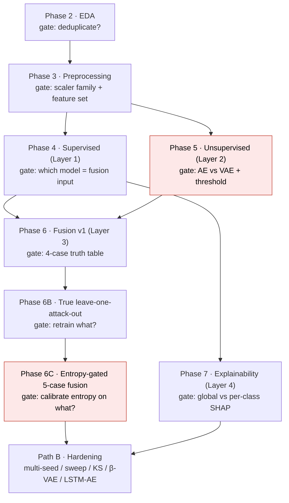

# IoMT Hybrid IDS — Per-Phase Documentation Index

> A four-layer hybrid intrusion-detection system for the CICIoMT2024 (WiFi+MQTT) benchmark: **XGBoost + Autoencoder + 5-case fusion + per-class SHAP**, stress-tested through a senior review and five robustness axes. This index links one doc per phase; each is readable standalone. Full narrative source: `full_report.md`. Every number traces to `numbers_map.md`; every figure is bundled under `figures/`.

## Project flow

> Red nodes (Phase 5, Phase 6C) are the two stages where a project-critical failure was hit and fixed — the missing benign-train StandardScaler (C13) and the val-correct entropy-calibration degeneracy (C8).

## Headline results

| # | Result | Value | Phase |
|---|---|---|---|
| 1 | Supervised winner E7 (XGBoost / Full 44 / Original) macro-F1 | **0.9076** (acc 99.27 %, MCC 0.9906) | [Phase 4](phase4_supervised.md) |
| 2 | Entropy-gated fusion (6C) over true-LOO models — H2-strict 4/4 | **4/4**, strict_avg **0.8035264623662012** | [Phase 6](phase6_fusion.md) |
| 3 | Per-class TreeSHAP attributions; DDoS↔DoS feature cosine | **4,180,000**; cosine **0.991** | [Phase 7](phase7_shap.md) |

Supporting facts: first public duplicate analysis (36.95 % train / 44.72 % test); max imbalance 2,374:1; AE test AUC 0.9892; redundancy-through-misclassification 82.7 %/17.3 %; SHAP vs Cohen's d Jaccard 0.000 (ρ = −0.741); multi-seed H2-strict 0.799 ± 0.022; defensibility 3.0 → 4.3 / 5. Total compute ~15.5 h, MacBook Air M4, CPU only. *(All values from `numbers_map.md`.)*

## Pre-registered hypotheses

| Hypothesis | Pre-registration | Final status |
|---|---|---|
| **H1** | Fusion produces statistically significant macro-F1 gain over the best standalone classifier | **Reframed** — Δ = −0.014 pp (CI excludes zero but ~125 / 892,268 rows; operationally negligible) |
| **H2-strict** | Unsupervised layer recall > 0.70 on ≥ 50 % of withheld attack classes | **0/5 → 0/5 → 4/4 eligible** (Phase 6C entropy + AE) |
| **H2-binary** | System raises an alert on ≥ 70 % of novel attack samples | **5/5** at p90 (consistent across all phases) |
| **H3** | SMOTETomek improves macro-F1 AND minority per-class F1 (≥ 3/5) | **FAIL** on both — macro-F1 degrades in 0/4 configs; minority improves in 2/5 only (boundary-blur mechanism) |

*(Paraphrased; verbatim pre-registration text + sources in `numbers_map.md §3`.)*

## Per-phase documents

| Doc | Layer / role | Headline |
|---|---|---|
| [phase2_eda.md](phase2_eda.md) | Data foundation | Duplicate discovery; corrected rarest class; Cohen's d vs SHAP zero-overlap seed |
| [phase3_preprocessing.md](phase3_preprocessing.md) | Data foundation | 3-group scaler, SMOTETomek, benign-only AE set, 5 LOO datasets; RobustScaler→C13 |
| [phase4_supervised.md](phase4_supervised.md) | Layer 1 | E7 wins (0.9076); H3 rejected via boundary-blur |
| [phase5_unsupervised.md](phase5_unsupervised.md) | Layer 2 | AE AUC 0.9892; the 510× StandardScaler fix (C13) |
| [phase6_fusion.md](phase6_fusion.md) | Layer 3 | 4→5-case engine; H2-strict 0/5 → 4/4; the tripwire; C5/C7/C8 |
| [phase7_shap.md](phase7_shap.md) | Layer 4 | First per-class SHAP on CICIoMT2024; cosine 0.991; method-dependence |
| [pathB_hardening.md](pathB_hardening.md) | Robustness | 9 review fixes; multi-seed/sweep/KS; β-VAE & LSTM-AE substitution |

## Reading notes

- **Tripwire:** the string `0.8035264623662012` (Phase 6C `entropy_benign_p95` strict_avg) is asserted bit-exactly before every Path B computation — it appears in [phase6_fusion.md](phase6_fusion.md) and [pathB_hardening.md](pathB_hardening.md).
- **Sourcing:** narrative derives from `full_report.md`; numbers from `numbers_map.md`; decisions from `decisions_ledger.md`; failures from `decisions_ledger_addendum.md`; code + executed outputs from `thesis_walkthrough.ipynb` and `notebooks/*.py`; artifact paths from `artifact_manifest.md`. These docs **derive** — they do not replace the canonical sources.
- **Figures** are bundled in `figures/` so the folder is portable (`cp -r` safe).
