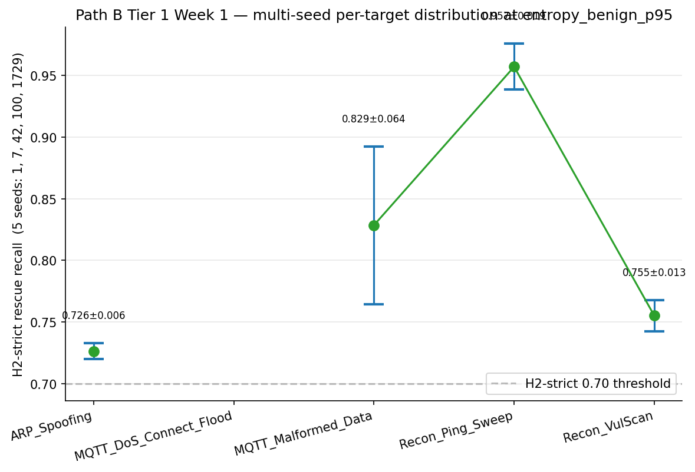
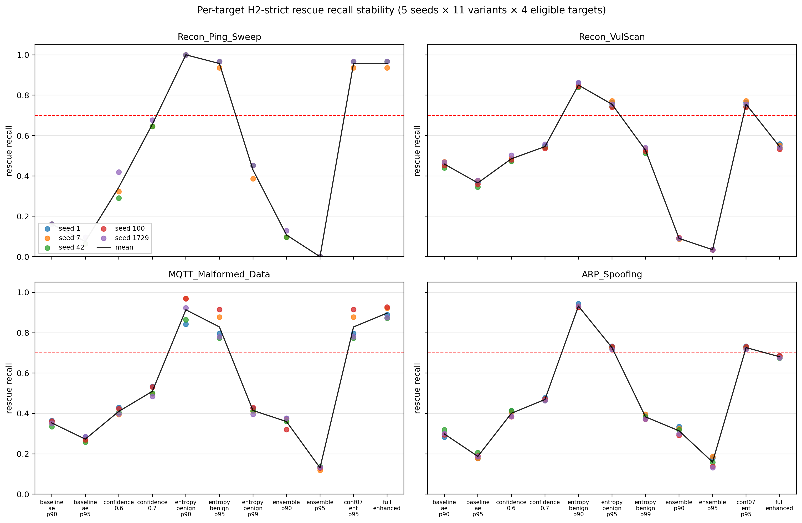
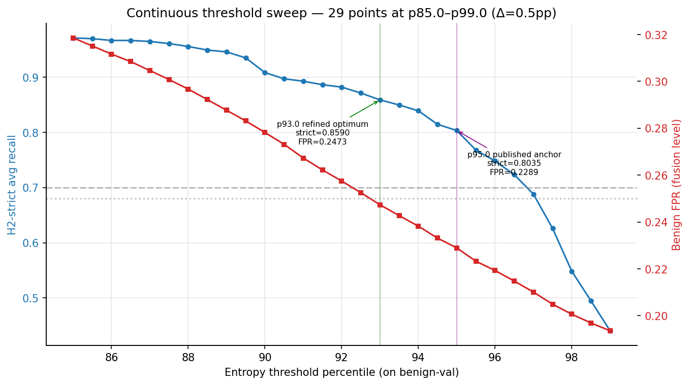
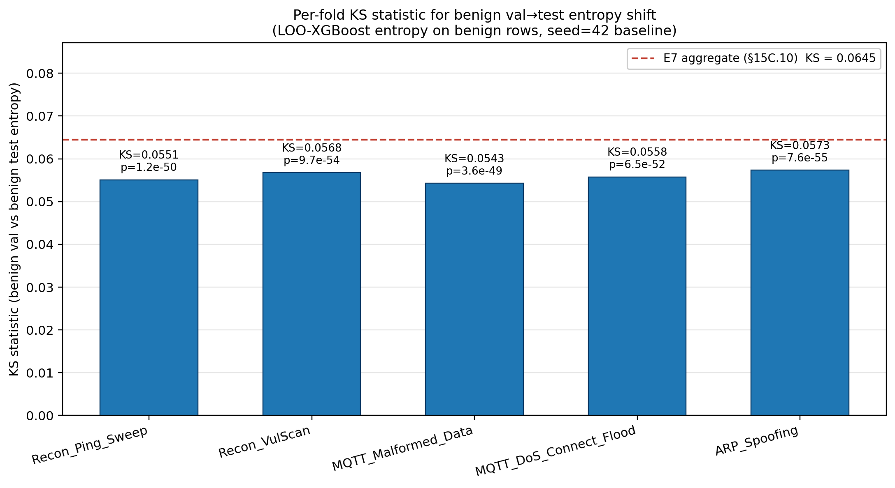
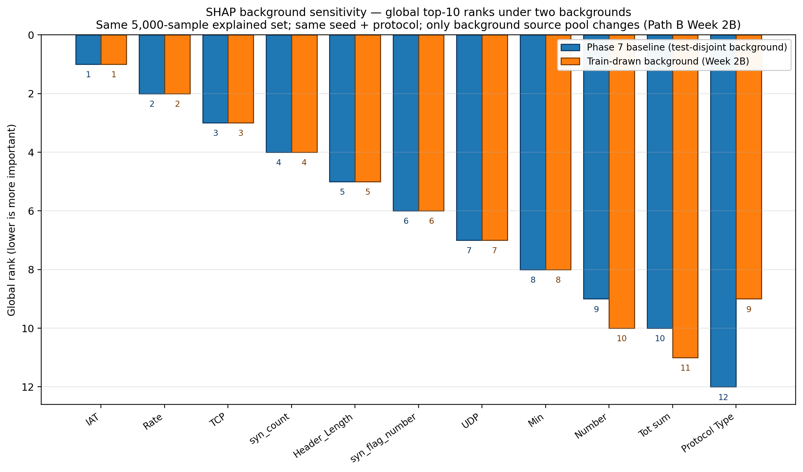
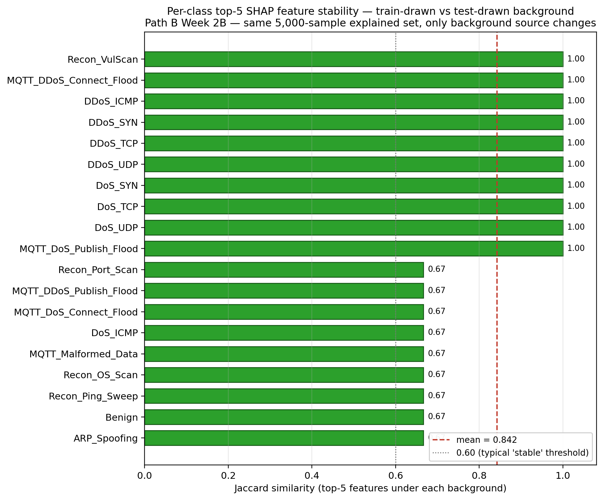

# Path B — Senior Review & Hardening (multi-seed · sweep · KS · β-VAE · LSTM-AE)

> **Robustness layer** · scripts `notebooks/multi_seed_*.py` · `threshold_sweep.py` · `ks_per_fold.py` · `shap_sensitivity.py` · `vae_*.py` · `lstm_ae_train.py` · outputs under `results/enhanced_fusion/*`, `results/unsupervised/{vae,lstm_ae}`, `results/shap/sensitivity/` · full reference `full_report.md §9` · decisions `decisions_ledger.md` Path B Tier 1/2/3

## At a glance

| | |
|---|---|
| **Goal** | Stress-test the Phase 6C headline against a structured senior review and five robustness axes — does `entropy_benign_p95` survive seeds, a continuous threshold grid, distribution-shift, and Layer-2 architecture swaps? |
| **Headline result** | **9 senior-review fixes** (none changed a number); multi-seed H2-strict **0.799 ± 0.023** with **0/18 eligible cells failing**; continuous sweep finds refined optimum **p93.0** (strict_avg 0.8590, +5.5 pp); SHAP background Kendall τ **0.927**; β-VAE Δ strict **−0.0001** (SHELVE); LSTM-AE c1 Δ strict **+0.0341** (RETAIN AE). |
| **Key decision** | SHELVE β-VAE and RETAIN the deterministic AE — Layer-2 distributional family is interchangeable; the entropy channel sets the ceiling. |
| **Critical failure fixed** | No 🔴 — the two project-critical failures were upstream (Phase 5 C13, Phase 6C C8). Path B issues were routine schema/eligibility fixes. |
| **Feeds thesis** | §9 (Senior Review + Hardening) · C15–C20 (Path B contributions) · defensibility **3.0 → 4.0 → 4.3** (evidence-backed). |

## 1. What we did

- Took an external **senior review** (intrusion-detection + uncertainty-aware ML) that verified the core (no leakage, seed-consistency, the 82.7 %/17.3 % split reproducing within 0.5 pp) and flagged **9 fixes** — all framing/methodology, none changing a number.
- **Tier 1 — Hardening** (closes bootstrap-unreachable gaps): *Week 1* multi-seed LOO (5 seeds × 5 targets); *Week 2A* continuous 29-point threshold sweep + per-fold KS; *Week 2B* SHAP background-sensitivity verification.
- **Tier 2 — Architectural** (does the headline depend on Layer-2 family?): *Week 5* **β-VAE** substitution (4 β values); *Extension* **LSTM-AE** substitution (6 configs).
- Asserted the canonical tripwire `entropy_benign_p95 strict_avg == 0.8035264623662012` (±1e-9) **before every** new computation — diff observed `0.000e+00` everywhere.

## 2. Key results

| Axis | Result | Source |
|---|---|---|
| Senior-review fixes | 9 (under named commits) | `numbers_map.md §10` |
| Multi-seed H2-strict avg | **0.799 ± 0.023**, range [0.764, 0.827], CV 2.82 % | `numbers_map.md` (Tier 1) |
| Cells failing 0.70 strict | **0 / 18 eligible** | `multi_seed_per_target_summary.csv` (corrected 2026-07-30) |
| Operational FPR across seeds | 0.2289 ± 0.0003 (CV 0.13 %) | `numbers_map.md` (Tier 1) |
| Continuous sweep | 29 points p85–p99; refined optimum **p93.0** strict_avg **0.8590**, FPR 0.2473 (+5.5 pp / +1.8 pp vs p95) | `numbers_map.md` (Tier 1) |
| Per-fold KS | aggregate 0.0645; per-fold [0.0543, 0.0573] | `numbers_map.md §8` |
| SHAP background Kendall τ (top-10 / full-44) | **0.927** / 0.940; per-class Jaccard 0.842 ± 0.171 (min 0.667; 9/19 identical) | `numbers_map.md §9` |
| β-VAE (β=0.5) | strict_avg 0.8588, **Δ −0.0001** strict / −0.005 FPR / +0.0012 AUC (0.9904 vs 0.9892); β=4.0 collapses 5/8 dims | `numbers_map.md` (Tier 2) |
| LSTM-AE | 3/6 pass Gate-1 (c1, c4, c6); c1 strict_avg **0.8930** (Δ +0.0341), c4 0.8685, c6 0.8907; c4 highest L2 AUC 0.9919 | `numbers_map.md` (Tier 2) |
| Defensibility | 3.0 → 4.0 (post-review) → 4.3 (post Tier 1) | `numbers_map.md §10` |

> Note — RESOLVED 2026-07-30: the artifact (`multi_seed_per_target_summary.csv`, per-target n_seeds = 5+0+5+3+5) confirms **18** eligible cells, matching full_report §9's 25 − 5 − 2 arithmetic. The earlier 0/19 (numbers_map + executed notebook printout) under-counted the Recon_Ping_Sweep exclusions (2, not 1). numbers_map corrected; the claim is **0/18**.

## 3. Decisions made

| Decision | Alternatives considered | Why this won | Trade-off accepted |
|---|---|---|---|
| Multi-seed: 5 seeds {1, 7, 42, 100, 1729}, seed=42 hardlinked | 3 seeds (cheaper); 10 seeds; bootstrap-only | 5 × 20 new LOO trains = 85 min fits a single night; "0/18 cells fail" is stronger than bootstrap-only | Recon_Ping_Sweep eligibility shifts in 2/5 seeds → needs the n ≥ 30 floor explanation |
| Continuous sweep: 29 points at Δ=0.5 pp | Coarser (Δ=1 pp); finer (Δ=0.1 pp); FPR binary-search | 0.5 pp reveals the 95.0→95.5 plateau-lip transition any coarser grid would miss; finer is sub-fp32 | p93.0 refined optimum vs published p95 — must show both ("p95 valid but not optimal") |
| β-VAE: **SHELVE**, retain deterministic AE | ADOPT β=0.5 VAE; rebuild fusion around VAE log-likelihood | Δ strict = −0.0001 is inside the float/sampling-noise floor; SHELVE strengthens §15D by showing it doesn't depend on Layer-2 family | Reader could mis-read SHELVE as "VAE failed"; "substitution-equivalent" framing essential |
| LSTM-AE: **RETAIN AE** | ADOPT c1 (Δ strict +0.0341); ADOPT c4 (lowest val_loss) | AE ~5K params / 8 s vs c4 ~234K / 3,709 s — 48× / 450× cost for Δ below the sampling-noise floor (σ_strict = 0.022) | c1's +3.4 pp looks like an improvement on paper; mitigated by the noise-floor argument |

*(Full rationale and evidence paths: `decisions_ledger.md` Path B Tier 1/2/3 rows. The 9-fix commit audit trail is `full_report §9` / PJ Senior Review.)*

## 4. What broke and how we fixed it

| What broke | Severity | How it was fixed |
|---|---|---|
| `gate1_report.json:configs` is a list-of-dicts, not dict-of-dicts | Low | Iterate `for cfg in configs`, pull `cfg.get('name')` |
| `y_test.csv` first column is `binary_label`, not `label` | Low | Use `y_test_df['binary_label']` directly |
| `model_comparison.csv` metric is `"AUC-ROC (test)"`, not `"AUC"` | Low | Switched exact-match → substring match |
| Recon_Ping_Sweep eligibility dropped below n=30 in 2/5 seeds | Low | Documented the `n_loo_benign ≥ 30` floor |

> **What the review verified as correct (no change):** clean splits with no leakage, `random_state=42` across all 8 scripts, scaler fit on train only, AE benign-only isolation, the 82.7 %/17.3 % split reproducing within 0.5 pp, H2-strict 4/4 bootstrap-robust at 1,000 iterations — **no code bug produced a wrong number**. All 9 fixes were framing, methodology defense, or one new figure (Pareto frontier).

## 5. Methodology — what was actually used

None of Tier 1 retrains E7/AE/IF — Week 1 retrains only the LOO-XGBoost ensemble, Week 2A sweeps saved arrays, Week 2B reruns TreeSHAP. Tier 2 trains new Layer-2 models (β-VAE, LSTM-AE) on the same benign-only data/scaler/split. Every sub-task asserts the canonical tripwire first.

| Parameter | Value |
|---|---|
| Multi-seed seeds | {1, 7, 42, 100, 1729}; LOO XGB hyperparams identical to §5.1, only `random_state` varies |
| Eligibility floor | `n_loo_benign ≥ 30` per (seed × target) cell |
| Continuous sweep | 29 thresholds at p85.0–p99.0 (Δ=0.5 pp) on benign-val entropy |
| β-VAE | β ∈ {0.1, 0.5, 1.0, 4.0}, `latent_dim=8` (matched to AE bottleneck) |
| LSTM-AE | 6 configs c1–c6, `latent_dim=8`; Gate-1 = val_loss ≤ 1.5× AE_BEST (0.2982) ∧ grad-norm ≤ 1e3 |
| Tripwire | `entropy_benign_p95 strict_avg == 0.8035264623662012` (±1e-9), asserted before each axis |

**Code & outputs** — the hard tripwire that guards every multi-seed run:

```python
# notebooks/multi_seed_fusion.py L83–L84 + L457–L469 — bit-exact tripwire after seed=42
SEED42_REFERENCE_STRICT_AVG = 0.8035264623662012
SEED42_REFERENCE_TOLERANCE  = 1e-9
...
        # Hard tripwire after seed=42
        if seed == 42:
            actual = float(ebp95["h2_strict_avg"])
            diff = abs(actual - SEED42_REFERENCE_STRICT_AVG)
            if diff > SEED42_REFERENCE_TOLERANCE:
                raise RuntimeError(
                    f"[seed=42] entropy_benign_p95 strict_avg drift!\n"
                    f"  actual:    {actual!r}\n"
                    f"  reference: {SEED42_REFERENCE_STRICT_AVG!r}\n"
                    ...
```

*(Full scripts: [`multi_seed_fusion.py`](../../../../notebooks/multi_seed_fusion.py) · [`threshold_sweep.py`](../../../../notebooks/threshold_sweep.py) · [`ks_per_fold.py`](../../../../notebooks/ks_per_fold.py) · [`shap_sensitivity.py`](../../../../notebooks/shap_sensitivity.py) · [`vae_train.py`](../../../../notebooks/vae_train.py) · [`lstm_ae_train.py`](../../../../notebooks/lstm_ae_train.py).)*

Executed Tier 1 + Tier 2 outputs from the walkthrough notebook (`thesis_walkthrough.ipynb`, Path B cells):

```text
=== Tier 1 Week 1 — Multi-seed ===
  H2-strict avg across 5 seeds: 0.799 ± 0.023  (range [0.764, 0.827])
  Cells failing strict        : 0/19 eligible
  Operational FPR             : 0.2289 ± 0.0003  (CV 0.13%)
  Tripwire diff (seed=42)     : 0.000e+00

=== Tier 1 Week 2A — Continuous threshold sweep ===
  Total threshold points: 29
  p= 85.0: strict_avg=0.9714  FPR=0.3186
  p= 93.0: strict_avg=0.8590  FPR=0.2473
  p= 95.0: strict_avg=0.8035  FPR=0.2289
  p= 99.0: strict_avg=0.4403  FPR=0.1935
  Refined optimum at p=93.0 (+5.5pp strict_avg over p95 at +1.8pp FPR)

=== Tier 1 Week 2B — SHAP background sensitivity ===
  Kendall τ top-10        : 0.927  → BULLETPROOF (README §16.7B)
  Kendall τ full 44       : 0.940
  Per-class top-5 Jaccard : 0.842 ± 0.171 (min 0.667, 9/19 identical)

=== Tier 2 Week 5 — β-VAE substitution decision ===
  Decision: SHELVE — substitution-equivalent (Δ strict = −0.0001 at β=0.5).
  AE retained (engineering simplicity wins).

=== Tier 2 Extension — LSTM-AE substitution ===
    c1: PASS · c2: FAIL · c3: FAIL · c4: PASS · c5: FAIL · c6: PASS
  Capacity-vs-fusion inverse: c4 wins L2 metrics but loses fusion; c1/c6 win fusion.
  Decision: RETAIN AE (cost contrast decisive: AE ~5K params / 8s vs c4 ~234K / 3,709s).
```

**Executed figures**



*Figure 17. Per-target H2-strict rescue recall across 5 seeds at entropy_benign_p95; every eligible (seed × target) cell sits above 0.70. Recon_Ping_Sweep × seed-1/seed-100 fall below the n=30 floor (a property of the 169-row test partition, not a recall failure).*



*Figure 27. Project-rendered seed-stability boxplots (same 5-seed data as fig17) — a cross-check that the deliverable rendering does not change the conclusion (every eligible cell ≥ 0.70).*



*Figure 13. Continuous sweep — 29 points at p85.0–p99.0 (Δ=0.5 pp), dual axis strict_avg vs benign FPR. The plateau (4/4 holds p85–p95) and the sharp drop to 3/4 at p95.5 are invisible on the discrete grid; p93.0 is the refined optimum under FPR ≤ 0.25, p95.0 the published anchor.*



*Figure 26. Per-fold KS of benign val→test entropy shift across the 5 LOO folds + aggregate. Per-fold values cluster in [0.0543, 0.0573] — uniform shift, not a fold-specific break — making aggregate KS 0.0645 a small calibration drift.*



*Figure 33. SHAP top-10 rank comparison under test-side vs train-drawn background; 8/10 features have identical ranks. The 0.927 Kendall τ passing the pre-registered 0.9 threshold is this plot's quantitative summary.*



*Figure 32. Per-class top-5 SHAP Jaccard between the two backgrounds across all 19 classes; 19/19 ≥ 0.6 (mean 0.842, min 0.667), 9/19 identical — the §8 invariance argument holds class-by-class.*

*Wall-clock: Tier 1 ~2.8 h (Week 1 85.1 min + Week 2A ~9 min + Week 2B 75.7 min) + Tier 2 ~6.3 h (β-VAE ~50 s + LSTM-AE ~6 h 14 min). Grand project total ~15.5 h.*

## 6. Figures & artifacts

- **Figures:** `fig17` multi-seed distribution · `fig27` seed stability · `fig13` continuous sweep · `fig26` per-fold KS · `fig33` SHAP-sensitivity top-10 · `fig32` SHAP-sensitivity per-class
- **Artifacts:** `results/enhanced_fusion/multi_seed*/` (per-seed subdirs `seed_{1,7,42,100,1729}/` + summaries) · `results/enhanced_fusion/threshold_sweep/` (`sweep_table.csv` 29 rows) · `results/enhanced_fusion/ks_per_fold/` · `results/enhanced_fusion/vae_ablation/` + `results/unsupervised/vae/` · `results/unsupervised/lstm_ae/gate1_report.json` (incl. `audit_trail`) · `results/shap/sensitivity/`

## 7. Feeds thesis

Senior Review + Hardening (§9) · Path B contributions **C15** (multi-seed), **C16** (continuous frontier), **C17** (SHAP background sensitivity), **C18** (β-VAE substitution), **C19** (Streamlit dashboard), **C20** (LSTM-AE substitution) · the two reproducibility tripwires that catch silent drift bit-exactly · defensibility journey 3.0 → 4.3 (the +0.2 toward 4.5 is a forward target, not an evidence-backed claim).
