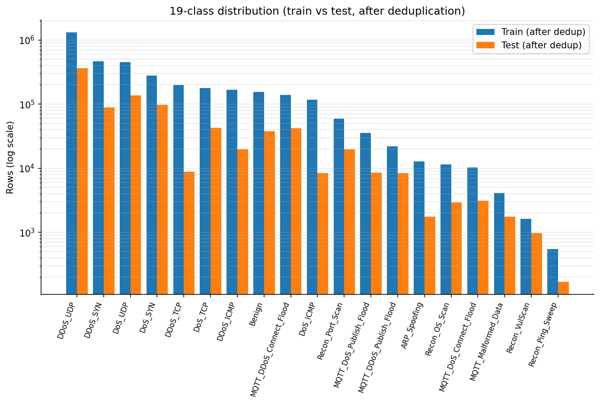
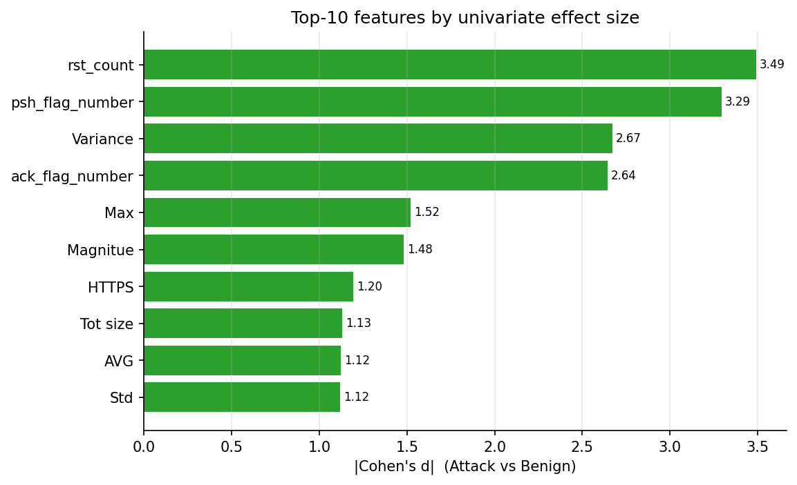
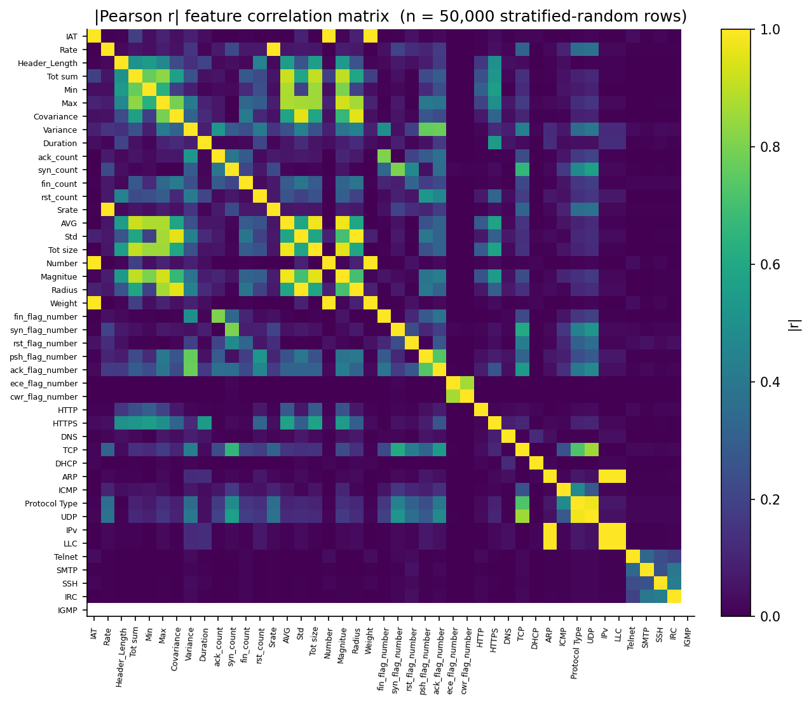
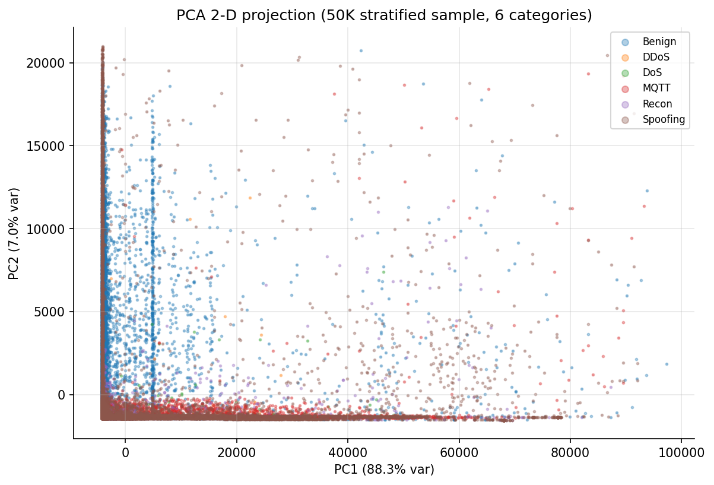

# Phase 2 — Exploratory Data Analysis (CICIoMT2024 WiFi+MQTT)

> **Data foundation** · script `notebooks/ciciomt2024_eda.py` · output `eda_output/` · full reference `full_report.md §4` (EDA half) · decisions `decisions_ledger.md` Phase 2

## At a glance

| | |
|---|---|
| **Goal** | Characterise the dataset before any modelling — establish an honest, deduplicated baseline plus the class-imbalance and feature-separation facts every later phase depends on. |
| **Headline result** | First public duplicate analysis of CICIoMT2024: **36.95 %** train / **44.72 %** test duplicates, **bit-identical at float32** — the pipeline's typed precision (at the CSVs' printed float64 precision the exact-row counts are **5,119 train / 2,065 test**, reproducing the literature's 5,119 figure exactly; see the DR-6 reconciliation, `iomt-pcap-experiments/dr6_out/`). Post-dedup max imbalance **2,374:1**, with **Recon_Ping_Sweep (689 train rows)** the true rarest class — not ARP_Spoofing as prior papers claimed. |
| **Key decision** | Deduplicate *before* any downstream computation — clean data is the only honest baseline. |
| **Critical failure fixed** | No 🔴 in Phase 2. Published class counts disagreed with the raw files (Med) → recounted from the 72 raw CSVs and logged (§22). *(The RobustScaler heavy-tail choice made downstream was latent-critical but only surfaced in Phase 5 → C13.)* |
| **Feeds thesis** | §4 (Data) · the 2,374:1 imbalance → SMOTETomek + macro-F1/MCC metric choice (Phase 3–4) · Benign forms a separable cluster → AE Layer-2 rationale (Phase 5) · Cohen's d vs SHAP zero-overlap → §8 four-way comparison |

## 1. What we did

- Loaded all **72 CSV files** of the WiFi+MQTT subset (raw 7,160,831 train / 1,614,182 test rows) into a single typed DataFrame and ran a per-split quality report (missing %, near-constant columns, duplicate count).
- Produced the **first publicly-disclosed duplicate analysis** of CICIoMT2024: dropped duplicates (bit-identical at float32, the typed precision every later phase consumes), shrinking train 7,160,831 → **4,515,080** and test 1,614,182 → **892,268**. (7,160,831 − 4,515,080 = 2,645,751 dropped = the float32 duplicate count independently reproduced in the DR-6 experiment.)
- Recomputed the **19-class distribution** from the deduplicated data, finding the true rarest class (Recon_Ping_Sweep, 689 train rows) and a maximum imbalance ratio of **2,374:1** — almost 24× the "~100:1" the literature reports.
- Computed **Cohen's d** for every feature against Benign (univariate separation), and ran **correlation analysis** + **PCA** on a 50,000-row stratified sample of scaled `X_train` to motivate the Reduced-28 feature variant and the benign-only Autoencoder.

## 2. Key results

| Metric | Value | Source |
|---|---|---|
| Train duplicate rate | **36.95 %** (bit-identical at float32) | `numbers_map.md` (README §10.1) |
| Test duplicate rate | **44.72 %** (bit-identical at float32) | `numbers_map.md` (README §10.1) |
| Float64-exact duplicate counts | 5,119 train / 2,065 test (= the literature's 5,119, reproduced) | `iomt-pcap-experiments/dr6_out/` (DR-6, 2026-07-28) |
| Deduplicated train rows | 4,515,080 | `numbers_map.md` (README §8) |
| Deduplicated test rows | 892,268 | `numbers_map.md` (README §11.4) |
| Max imbalance ratio | **2,374:1** (DDoS_UDP vs Recon_Ping_Sweep) | `numbers_map.md` (README §8.1) |
| Rarest class | Recon_Ping_Sweep (689 train rows) | `numbers_map.md` (README §8.1) |
| Cohen's d top-4 | rst_count 3.49 · psh_flag_number 3.29 · Variance 2.67 · ack_flag_number 2.64 | `full_report.md §4` · `eda_output/feature_target_cohens_d.csv` |
| Correlation structure | 3 perfect pairs (Rate/Srate, ARP/IPv, ARP/LLC at \|r\| = 1.00); 25 pairs above \|r\| = 0.85 | `full_report.md §4` · `eda_output/high_correlation_pairs.csv` |
| PCA variance | 22 components for 95 %, 28 for 99 % | `full_report.md §4` |

**The separation finding:** the Cohen's d top-4 (rst_count, psh_flag_number, Variance, ack_flag_number) has **zero overlap** with Yacoubi's SHAP top-4 (IAT, Rate, Header_Length, Srate). That gap is the empirical seed of §8's "statistical separation ≠ model reliance" result. The PCA projection shows Benign as a compact, separable cluster — the structural prerequisite for a benign-only Layer-2 Autoencoder — while DDoS and DoS overlap heavily, foreshadowing the SHAP-cosine 0.991 finding.

## 3. Decisions made

| Decision | Alternatives considered | Why this won | Trade-off accepted |
|---|---|---|---|
| Deduplicate before any downstream computation | Keep duplicates as-is (matches Yacoubi); deduplicate but flag rather than drop | Yacoubi's 99.87 % accuracy is partially inflated by 37 % train + 44.7 % test duplicate leakage; clean data is the only honest baseline | All headline numbers (E7 99.27 %, etc.) sit 0.5–1.4 pp below published values; the gap must be explained in every literature comparison |
| Report feature importance three ways — Cohen's d **and** SHAP (Phase 7) **and** RF importance | Report Cohen's d only (univariate); SHAP only (model-conditional); RF importance only | The methods disagree (Jaccard 0.000 SHAP↔Cohen's d, Spearman ρ = −0.741); single-method reporting hides this finding | More table real estate; readers must understand the "method-dependent" claim |

*(Full rationale and evidence paths: `decisions_ledger.md` Phase 2 rows.)*

## 4. What broke and how we fixed it

| What broke | Severity | How it was fixed |
|---|---|---|
| Dataset download needed live session cookies | Low | `wget` with cookies; DownThemAll fallback |
| Published class counts disagreed with the raw files | Med | Recounted from the 72 raw CSVs; logged the corrections (§22) |

> **Why the recount matters:** the corrected rarest-class identity (Recon_Ping_Sweep, not ARP_Spoofing) is **Contribution #4**. Every prior claim about class rarity on this dataset is wrong, and that error propagates into oversampling and metric-interpretation decisions — so recounting is a precondition for defensible comparison, not housekeeping.

## 5. Methodology — what was actually used

Merge 72 raw CSVs → quality report → replace ±inf with NaN → drop bit-exact duplicates → recount class distribution and imbalance → Cohen's d (benign vs attack mean-difference) → correlation heatmap + highly-correlated pairs on a 50K stratified sample → PCA. Random state 42 throughout.

| Parameter | Value |
|---|---|
| Input | 72 raw CSVs, WiFi+MQTT subset (7.16M train / 1.61M test rows) |
| Dedup method | `pandas.DataFrame.drop_duplicates` (bit-exact, after ±inf→NaN) |
| Separation metric | Cohen's d = \|mean(attack) − mean(benign)\| / pooled_std |
| Correlation sample | 50,000-row stratified sample of scaled `X_train`; threshold \|r\| > 0.85 |
| PCA | components for 95 % / 99 % variance + 2-D projection |
| Random state | 42 |

**Code & outputs**

```python
# notebooks/ciciomt2024_eda.py L267–L284 — duplicate count + bit-exact dedup
    print(f"[{name}] duplicate rows: {df.duplicated().sum():,} "
          f"(of {len(df):,})")
    ...
    # Clean: replace ±inf with NaN, drop exact duplicates, fill NaN with column median
    for df in (df_train, df_test):
        df.replace([np.inf, -np.inf], np.nan, inplace=True)

    before = len(df_train), len(df_test)
    df_train.drop_duplicates(inplace=True, ignore_index=True)
    df_test.drop_duplicates(inplace=True,  ignore_index=True)
```

```python
# notebooks/ciciomt2024_eda.py L602–L607 — Cohen's d, benign vs attack
    bmean = df_train_s.loc[df_train_s["label"] == "Benign", FEATURES].mean()
    amean = df_train_s.loc[df_train_s["label"] != "Benign", FEATURES].mean()
    pooled_std = df_train_s[FEATURES].std() + 1e-9
    cohen_d = ((amean - bmean) / pooled_std).abs().sort_values(ascending=False)
    top20 = cohen_d.head(20)
```

*(Full scripts: [`notebooks/ciciomt2024_eda.py`](../../../../notebooks/ciciomt2024_eda.py). Seed confirmation from the executed notebook: `preprocessed/config.json … random_state: 42`.)*

**Executed outputs — the four EDA figures**



*Figure 1. 19-class distribution after deduplication, train vs test on a log-scale y-axis. The 2,374:1 imbalance ratio between DDoS_UDP and Recon_Ping_Sweep motivates the targeted SMOTETomek strategy and the macro-F1 + MCC primary metrics over accuracy.*



*Figure 2. Top-10 features by |Cohen's d| (Attack vs Benign). The top-4 — rst_count, psh_flag_number, Variance, ack_flag_number — have zero overlap with Yacoubi's SHAP top-4, the empirical basis for §8's "statistical separation ≠ model reliance" finding.*



*Figure 3. |Pearson r| heatmap over a 50,000-row stratified sample of X_train. Dark blocks identify the highly-correlated groups (Rate/Srate, the size cluster, the protocol indicators) that justify the Reduced-28 feature variant.*



*Figure 4. PCA 2-D projection of a 50,000-row stratified sample, coloured by 6-class category. Benign forms a compact, separable cluster — the structural prerequisite for a benign-only Autoencoder; DDoS and DoS overlap heavily, foreshadowing the SHAP-cosine 0.991 finding in §8.*

*Wall-clock ~15 min (April 25, 2026), MacBook Air M4, 24 GB RAM, CPU only.*

## 6. Figures & artifacts

- **Figures:** `fig01` class distribution · `fig02` Cohen's d top-10 · `fig03` correlation heatmap · `fig04` PCA 2-D projection
- **Artifacts:** `eda_output/` (repo root, **not** under `results/`) → `findings.md`, `imbalance_table.csv`, `high_correlation_pairs.csv`, `feature_target_cohens_d.csv`, `quality_train.csv` / `quality_test.csv`, `benign_profile.csv`, `train_cleaned.csv` / `test_cleaned.csv`

## 7. Feeds thesis

Data foundation (§4) · the 2,374:1 imbalance and corrected rarest-class identity drive the SMOTETomek strategy and the macro-F1/MCC metric choice (**Phase 3–4**) · Benign's compact separability is the rationale for the benign-only Autoencoder (**Phase 5**) · the Cohen's d vs SHAP zero-overlap carries into the **§8** four-way method comparison (Jaccard 0.000, Spearman ρ = −0.741).
