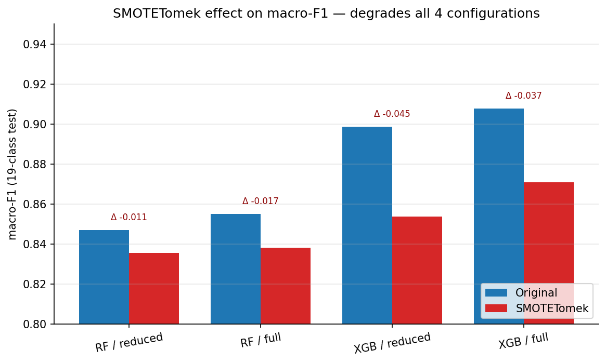

# Phase 3 — Preprocessing (scaling, SMOTETomek, LOO datasets)

> **Data foundation** · script `notebooks/preprocessing_pipeline.py` · output `preprocessed/` (5.7 GB) · full reference `full_report.md §4.1` · decisions `decisions_ledger.md` Phase 3

## At a glance

| | |
|---|---|
| **Goal** | Turn the deduplicated data into the exact artefacts every later phase consumes: scaled feature matrices, a class-balanced training split, a benign-only Autoencoder set, and five leave-one-attack-out datasets. |
| **Headline result** | Two feature variants (**Full 44** / **Reduced 28**), a three-group `ColumnTransformer`, targeted SMOTETomek boosting the 8 smallest classes to ~50K rows each, a benign-only AE subset (**123,348** train + **30,838** val), and 5 LOO datasets — all from a single deterministic pass. |
| **Key decision** | Three-group `ColumnTransformer` (RobustScaler / StandardScaler / MinMaxScaler) **and** ship both feature variants rather than only the literature-conventional Reduced 28. |
| **Critical failure fixed** | RobustScaler preserved heavy tails (Covariance std ≈ 5005, IAT std ≈ 1030) — **latent-critical**: scale-invariant for trees, but it silently broke the Phase 5 AE (val loss 101,414). Root-caused and fixed in Phase 5 as **Contribution #13**. |
| **Feeds thesis** | §4 (Methodology) · `preprocessed/` is the input to **every** downstream phase (4, 5, 6, 6B, 6C, 7, Path B). |

## 1. What we did

- Merged the 72 raw CSVs into one typed DataFrame, dropped bit-exact duplicates, then performed a **stratified 80/20 split** on the 19-class label producing **3,612,064 / 903,016 / 892,268** rows (train / val / test).
- Fit a three-group `ColumnTransformer` on the **train split only** (no leakage) and applied it to val and test; produced both the **Full 44** (drop only the constant Drate) and **Reduced 28** (drop Drate + 11 correlated + 5 noise features) variants.
- Ran **SMOTETomek on the training split only** with a `targeted` strategy — any minority class below 50,000 rows is up-sampled to that level; majority classes untouched; val/test never resampled. Post-SMOTE training size **3,869,271** rows.
- Carved a **benign-only AE dataset** (123,348 train + 30,838 val) from the *train* split after the stratified split (not the pre-split pool, to prevent leakage), and built **5 leave-one-attack-out datasets** for downstream Phase 6B/6C consumption.

## 2. Key results

| Metric | Value | Source |
|---|---|---|
| Train rows (after split) | 3,612,064 | `numbers_map.md` (README §11.4) |
| Validation rows | 903,016 | `numbers_map.md` (README §11.4) |
| Test rows | 892,268 | `numbers_map.md` (README §11.4) |
| Features — Full / Reduced | 44 / 28 | `numbers_map.md` (README §11.2) |
| Post-SMOTE size (Full variant) | 3,869,271 rows | `numbers_map.md` (README §11.5) |
| SMOTETomek boost targets | 8 minority classes → ~50K each | `numbers_map.md` (README §11.5) |
| AE training set | 123,348 benign rows | `numbers_map.md` (README §11.6) |
| AE val set | 30,838 benign rows | `numbers_map.md` (README §11.6) |

**Per-class SMOTE boost** (executed notebook output; per-class values from `full_report.md §4` / README §11.5 — see *numbers_map gaps* in the verification report): Recon_Ping_Sweep 551 → 49,799 (90×), Recon_VulScan 1,626 → 49,501 (30×), MQTT_Malformed 4,104 → 47,867 (12×), MQTT_DoS_Connect 10,218 → 49,942 (5×), ARP_Spoofing 12,808 → 46,786 (4×).

## 3. Decisions made

| Decision | Alternatives considered | Why this won | Trade-off accepted |
|---|---|---|---|
| Three-group `ColumnTransformer` (Robust / Standard / MinMax) | Single global StandardScaler; single RobustScaler; PowerTransformer per feature | Heavy-tailed network features benefit from median/IQR scaling for tree models; flag ratios already bounded; per-feature would lose model-class consistency | RobustScaler preserves heavy tails — **broke the AE in Phase 5** (val loss 101,414); needed a second StandardScaler patch (C13) |
| Ship **both** Full (44) and Reduced (28) | Use only the literature-conventional Reduced 28 to save compute | Phase 4 shows Full beats Reduced by 0.005–0.009 macro-F1 — correlation-dropping was too aggressive (#2/#3/#4 RF features Magnitue, Tot size, AVG all in the dropped set) | Double the storage (~5.7 GB); 24 training runs instead of 12 |
| Targeted SMOTETomek on 8 minority classes (→ ~50K each) | Full-population SMOTE; ADASYN; cost-sensitive only; no resampling | Avoid the runtime/memory blow-up of full SMOTE on 3.6M rows; still test H3 empirically | H3 verdict turns out negative — boundary-blur degrades macro-F1 (Phase 4) |
| Build 5 LOO datasets but leave them unused until Phase 6B | Use immediately (Yacoubi-style); skip and use only simulated zero-day | Phase 6 needed E7 in-distribution comparison first; LOO retraining cost is justified only after Phase 6 confirms case-stratification value | Six months between dataset creation and use (verified intact via SHA on first reuse) |
| Surface the Phase 3→5 scaling oversight as **Contribution #13** | Quietly add StandardScaler in Phase 5 with no comment | A 510× val-loss improvement (Recon detection 0 → 0.544) is publishable as a pipeline lesson | Reviewer sees an obvious "you missed this" risk; mitigated by framing as a deliberate finding |

*(Full rationale and evidence paths: `decisions_ledger.md` Phase 3 rows.)*

## 4. What broke and how we fixed it

| What broke | Severity | How it was fixed |
|---|---|---|
| Full pipeline ran 228 min | Low | Ran overnight under `caffeinate` |
| 🟠 RobustScaler left features with std > 1000 | **Latent-critical** | Not caught here — surfaced as the Phase 5 AE failure (val loss 101,414) and root-caused there via a benign-train StandardScaler (Contribution #13) |

> **The pipeline lesson:** the three-group ColumnTransformer was chosen because tree models are scale-invariant and benefit from preserving heavy tails (Covariance std ≈ 5005, IAT std ≈ 1030). XGBoost shrugged the extreme scales off and Phase 4 ran fine; Phase 5's AE did not — its MSE loss was dominated by whichever feature had the largest absolute residual. *Trees are scale-invariant; AE/IF are not.* The fix lives in Phase 5 (C13) and is disclosed openly in README §13.6 rather than buried.

## 5. Methodology — what was actually used

Merge 72 CSVs → drop duplicates → stratified 80/20 split on the 19-class label → fit a three-group `ColumnTransformer` on train only → apply to val/test → SMOTETomek (targeted, train-only) → carve benign-only AE subset → build 5 LOO subsets. `random_state=42`, `float32` throughout.

| Parameter | Value |
|---|---|
| Split ratio | 80 / 20 stratified on 19-class label (`random_state=42`) |
| RobustScaler features | IAT, Rate, Header_Length, Tot sum, Min, Max, Covariance, Variance, Duration, ack/syn/fin/rst_count |
| StandardScaler features | fin/syn/rst/psh/ack/ece/cwr_flag_number |
| MinMaxScaler features | HTTP, HTTPS, DNS, TCP, DHCP, ARP, ICMP, Protocol Type |
| SMOTETomek strategy | `targeted`, threshold = 50,000 rows; k-neighbors = 5 |
| Dtype / output | `float32` → `preprocessed/` (5.7 GB) |

**Code & outputs**

```python
# notebooks/preprocessing_pipeline.py L307–L315 — three-group ColumnTransformer
    return ColumnTransformer(
        transformers=[
            ("robust", RobustScaler(), heavy),
            ("standard", StandardScaler(), flags),
            ("minmax", MinMaxScaler(), binary),
        ],
        remainder="passthrough",
        verbose_feature_names_out=False,
    )
```

*(Full script: [`notebooks/preprocessing_pipeline.py`](../../../../notebooks/preprocessing_pipeline.py). The fit is train-only — see `fit_scale()` L318–L323, "Fit the ColumnTransformer on TRAIN ONLY, transform both".)*

Executed config + SMOTETomek boost from the walkthrough notebook (`thesis_walkthrough.ipynb`, Phase 2+3 cell):

```text
preprocessed/config.json loaded (11 top-level keys).
  random_state: 42

SMOTETomek boost (README §11.5):
  Recon_Ping_Sweep   551 → 49,799  (90×)
  Recon_VulScan    1,626 → 49,501  (30×)
  MQTT_Malformed   4,104 → 47,867  (12×)
  MQTT_DoS_Connect 10,218 → 49,942  (5×)
  ARP_Spoofing    12,808 → 46,786  (4×)
```



*Figure 7. macro-F1 Original vs SMOTE per configuration, with Δ annotated above each pair. All four pairs degrade; XGBoost arms (no class_weight) degrade more than RF arms (class_weight='balanced'), falsifying the compounding-correction story.* (Result belongs to Phase 4's H3 verdict; the SMOTETomek transform that produces it is built here.)

```
72 raw CSVs (~8.78M rows) → [dedup] → [label: 19-class/6-cat/binary]
  → [stratified 80/20 split]  train 3.61M / val 903K / test 892K
  → [3-group ColumnTransformer, train-only fit]  ├─ Full 44 ─┐
                                                  └─ Reduced 28 ┘ → X_*.npy (float32)
  → [SMOTETomek targeted]  8 minorities → ~50K each  (train only) → 3,869,271 rows
  → [AE subset]  benign-only from train: 123,348 + 30,838 val
  → [LOO subsets]  5 datasets, un-resampled, one class held out each
```

*Wall-clock 228 min, MacBook Air M4, 24 GB RAM, CPU only — a single deterministic pass.*

## 6. Figures & artifacts

- **Figures:** `fig07` SMOTE effect (Original vs SMOTE macro-F1 per config — the H3 evidence; transform built here)
- **Artifacts:** `preprocessed/` (repo root, **not** under `results/`, 5.7 GB) → `full_features/` & reduced `X_*.npy`, `y_*.csv`, `scaler_full.pkl` / `scaler_reduced.pkl`, `config.json`, `label_encoders.json`, `zero_day/*` (5 LOO datasets)

## 7. Feeds thesis

Methodology (§4.1) · `preprocessed/` is the universal input to **Phase 4** (supervised), **Phase 5** (benign-only AE subset), **Phase 6/6B/6C** (the 5 LOO datasets), **Phase 7** (test matrices for SHAP), and **Path B** · the RobustScaler heavy-tail choice is the root of **Contribution #13** (resolved in Phase 5).
