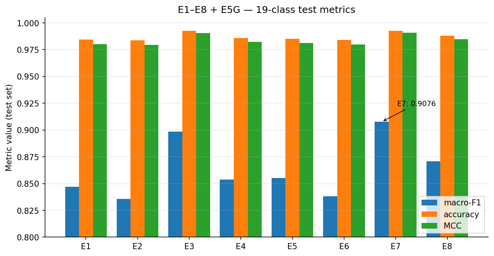
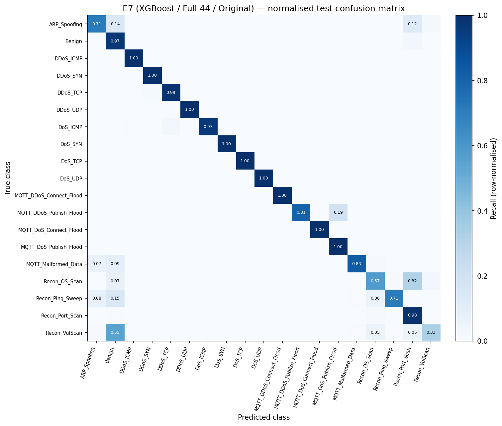
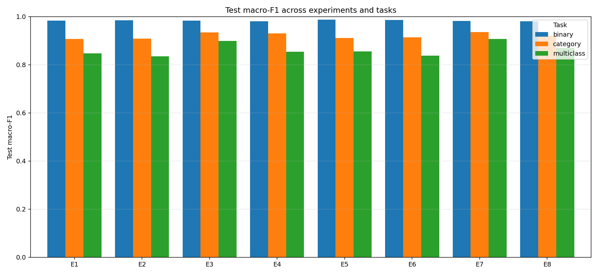

# Phase 4 — Supervised Layer (Layer 1: XGBoost / RF factorial)

> **Layer 1 of 4** · script `notebooks/supervised_training.py` · output `results/supervised/` · full reference `full_report.md §5` · decisions `decisions_ledger.md` Phase 4

## At a glance

| | |
|---|---|
| **Goal** | Find the strongest supervised classifier on the 19-class task and produce the softmax probability vectors that feed the fusion engine. |
| **Headline result** | **E7 (XGBoost / Full 44 / Original)** wins: macro-F1 **0.9076**, test accuracy **99.27 %**, MCC **0.9906**. Full features beat Reduced uniformly (+0.005–0.009 macro-F1); all four SMOTE arms degrade (H3 rejected). |
| **Key decision** | Ship E7 as the fusion input — highest macro-F1 **and** MCC, **and** its softmax is exactly the signal the Phase 6C entropy gate needs. |
| **Critical failure fixed** | No 🔴. The H3 rejection mechanism was first **misdiagnosed** as "compounding correction"; senior review falsified it (XGBoost arms have no `class_weight` yet degrade more) → rewritten as **boundary-blur** (commit 2457c44). |
| **Feeds thesis** | §5 (Results) · E7 softmax (`E7_*_proba.npy`) feeds **Phase 6/6C** fusion + **Phase 7** SHAP · the boundary-blur mechanism ties to the §8 SHAP-cosine 0.991. |

## 1. What we did

- Ran **24 trainings**: 8 experiments (E1–E8) × 3 tasks (binary / 6-class / 19-class), a 2×2×2 factorial — model (RF, XGBoost) × feature set (Reduced 28, Full 44) × resampling (Original, SMOTETomek) — plus **E5G** (RF-gini) as a senior-review baseline.
- Regularised hyperparameters per review feedback: RF `criterion='entropy'`, `max_depth=30`, `class_weight='balanced'`; XGBoost `max_depth=8`, `lr=0.1`, `subsample/colsample=0.8`, and notably **no** `class_weight` / `scale_pos_weight`.
- Ranked all experiments on the 19-class task (the granularity that matters for SOC routing), tested **H3** (does SMOTETomek help?) across all four model×feature pairs, and diagnosed the rejection mechanism.
- Saved E7's val/test softmax probability vectors (`E7_val_proba.npy` 903,016×19, `E7_test_proba.npy` 892,268×19) as the **canonical fusion input** — every later phase loads these rather than re-running E7.

## 2. Key results

| Experiment | macro-F1 | Source |
|---|---|---|
| **E7** XGB / Full / Original ★ | **0.9076** | `numbers_map.md` (`E7_multiclass.json`) |
| E3 XGB / Reduced / Original | 0.8987 | `numbers_map.md` (`E3_multiclass.json`) |
| E8 XGB / Full / SMOTE | 0.8708 | `numbers_map.md` (`E8_multiclass.json`) |
| E5 RF / Full / Original | 0.8551 | `numbers_map.md` (`E5_multiclass.json`) |
| E4 XGB / Reduced / SMOTE | 0.8538 | `numbers_map.md` (`E4_multiclass.json`) |
| E5G RF-gini / Full / Original | 0.8504 | `numbers_map.md` (`E5G_multiclass.json`) |
| E1 RF / Reduced / Original | 0.8469 | `numbers_map.md` (`E1_multiclass.json`) |
| E6 RF / Full / SMOTE | 0.8380 | `numbers_map.md` (`E6_multiclass.json`) |
| E2 RF / Reduced / SMOTE | 0.8356 | `numbers_map.md` (`E2_multiclass.json`) |

**Headline numbers:** E7 test accuracy **99.27 %**, MCC **0.9906**, macro-precision **0.9421**. **SMOTE deltas** (all degrade): RF/Reduced −0.0114, RF/Full −0.0171, XGB/Reduced −0.0449, XGB/Full −0.0368. **Yacoubi comparison:** −0.53 pp on XGBoost accuracy (99.27 % vs 99.80 %), −1.35 pp on RF — but the sign reverses on macro-precision (E7 0.9421 vs Yacoubi 86.10 %). The accuracy gap is the duplicate-leakage gap; the macro-precision gap is the minority-blind-spot gap that motivates the whole thesis.

## 3. Decisions made

| Decision | Alternatives considered | Why this won | Trade-off accepted |
|---|---|---|---|
| **E7** (XGBoost / Full / Original) as fusion input | RF E5 (acc 98.52 %, F1 0.8551); XGB/Reduced E3 (0.8987); RF-gini E5G; SMOTE variants | Highest macro-F1 (0.9076) **and** MCC (0.9906); XGBoost's softmax is the input the Phase 6C entropy gate explicitly needs | E7 has no `class_weight` — its boundary-blur sensitivity under SMOTE is the largest of the 4 XGBoost arms |
| H3 diagnosis = **boundary-blur** on overlapping classes | "Compounding correction" with `class_weight='balanced'`; "noise injection on minority centroids"; "label-smoothing artifact" | XGBoost arms have no `class_weight` yet degrade *more* than RF — falsifies compounding-correction; SHAP cosine 0.991 for DDoS↔DoS supports boundary-overlap | Original narrative had to be rewritten post senior-review (commit 2457c44) |
| RF `max_depth=30` (not untruncated) | `max_depth=None` (8–15 h); `max_depth=15` (more aggressive) | First run with `None` projected 8–15 h; depth 30 brought Phase 4 to 60 min while still beating Yacoubi-equivalent settings | Lost ~0.3 pp macro-F1 vs untruncated trees (verified on E5) |
| Report deduped accuracy with the published-data context | Match Yacoubi's preprocessing exactly (keep duplicates); report only our number | Matching their preprocessing would carry the duplicate-leakage problem forward | Headline numbers look "worse" than published; every literature comparison needs the duplicate-context paragraph |

*(Full rationale and evidence paths: `decisions_ledger.md` Phase 4 rows.)*

## 4. What broke and how we fixed it

| What broke | Severity | How it was fixed |
|---|---|---|
| RF `max_depth=None` projected at 8–15 h | High | Capped depth at 30 → whole phase 60 min (−0.3 pp macro-F1 accepted) |
| `verbose=1` flooded logs; `joblib compress=3` added ~1 h | Low | `verbose=0`, `compress=0` |
| First run interrupted (Ctrl+C) | Low | Added resume logic + `caffeinate` |
| H3 mechanism first misdiagnosed as "double correction" | Med (post-hoc) | Senior review caught it; rewrote as boundary-blur, backed by the experiment matrix + SHAP cosine 0.991 (commit 2457c44) |

> **Why the boundary-blur mechanism matters:** it is the same geometric fact that produces the DDoS↔DoS SHAP-cosine 0.991 in §8 — it ties Phase 4's confusion matrices to Phase 7's explanations through one structural property, not two unrelated observations. SMOTE interpolates between minority samples; when a class is geometrically adjacent to a structurally similar one (DDoS↔DoS, Recon↔Recon), the interpolated points fall on or across the decision boundary instead of reinforcing the minority cluster.

## 5. Methodology — what was actually used

A 2×2×2 factorial: classifier × feature set × resampling, each evaluated on binary / 6-class / 19-class → 24 metric rows in `overall_comparison.csv`. E5G (RF-gini) added post-hoc as a senior-review baseline. `random_state=42`.

| Parameter | Value |
|---|---|
| RF | `n_estimators=200`, `criterion='entropy'`, `max_depth=30`, `min_samples_split=20`, `min_samples_leaf=5`, `class_weight='balanced'` |
| XGBoost | `n_estimators=200`, `max_depth=8`, `learning_rate=0.1`, `subsample=0.8`, `colsample_bytree=0.8`, `tree_method='hist'`, **no** `class_weight` |
| Tasks per experiment | binary (Benign vs Attack), 6-class category, 19-class multiclass |
| Canonical fusion output | `E7_val_proba.npy` (903,016×19), `E7_test_proba.npy` (892,268×19) |

> Note: `full_report.md §5` intro and `decisions_ledger.md` state `min_samples_leaf=10`; the canonical script (`supervised_training.py` L82) and `full_report §5.1` table say **5**. Script is canonical → used 5 (logged in the verification report).

**Code & outputs**

```python
# notebooks/supervised_training.py L77–L84 — Random Forest parameters
RF_PARAMS = dict(
    n_estimators=200,
    criterion="entropy",
    max_depth=30,
    min_samples_split=20,
    min_samples_leaf=5,
    ...
    class_weight="balanced",
)
```

```python
# notebooks/supervised_training.py L207–L217 — XGBoost factory (per-task objective)
def get_xgb(task: str, n_classes: int) -> XGBClassifier:
    params = dict(XGB_PARAMS_BASE)
    if task == "binary":
        params["objective"]   = "binary:logistic"
        params["eval_metric"] = "logloss"
    else:
        params["objective"]   = "multi:softprob"
        params["num_class"]   = n_classes
        params["eval_metric"] = "mlogloss"
    return XGBClassifier(**params)
```

*(Full script: [`notebooks/supervised_training.py`](../../../../notebooks/supervised_training.py).)* Executed ranking from the walkthrough notebook (`thesis_walkthrough.ipynb`, Phase 4 cell):

```text
ID      F1_macro      Acc      MCC
E7        0.9076   0.9927   0.9906  ★
E3        0.8987   0.9925   0.9905
E8        0.8708   0.9879   0.9846
E5        0.8551   0.9852   0.9811
E4        0.8538   0.9859   0.9821
E5G       0.8504   0.9848   0.9807
E1        0.8469   0.9843   0.9801
E6        0.8380   0.9841   0.9798
E2        0.8356   0.9837   0.9793

SMOTE-vs-Original macro-F1 deltas:
  RF/Reduced         E1 0.8469 → E2 0.8356  Δ = -0.0114
  RF/Full            E5 0.8551 → E6 0.8380  Δ = -0.0171
  XGBoost/Reduced    E3 0.8987 → E4 0.8538  Δ = -0.0449
  XGBoost/Full       E7 0.9076 → E8 0.8708  Δ = -0.0368
```



*Figure 6. macro-F1, accuracy, MCC for E1–E8 plus E5G on the 19-class test task. E7 tops every metric; SMOTE-arm rows (E2/E4/E6/E8) sit below their Original-arm partners across all four classifier configurations.*



*Figure 5. Row-normalised E7 test confusion matrix (19×19, recall along the diagonal). The DDoS↔DoS off-diagonal block is the dominant inter-class confusion mass — the empirical foundation of the H3 boundary-blur rejection and the SHAP-cosine 0.991 finding in §8.*



*Figure 34. Project-rendered overall comparison bar (macro-F1 across 24 experiment × task cells) — reproduces Figure 6 with the project's own styling, a cross-check that the E7 winner reading is not a deliverable-pass artefact.*

*Wall-clock ~60 min for 24 runs, MacBook Air M4, 24 GB RAM, CPU only.*

## 6. Figures & artifacts

- **Figures:** `fig05` E7 confusion matrix · `fig06` E1–E8 comparison · `fig07` SMOTE effect (H3 evidence) · `fig34` project-rendered overall comparison bar (cross-check)
- **Artifacts:** `results/supervised/` → `metrics/E{1..8,5G}_multiclass.json`, `metrics/overall_comparison.csv`, `predictions/E7_val_proba.npy` + `E7_test_proba.npy` (canonical fusion input), `figures/cm_E7_19class.png`

## 7. Feeds thesis

Layer-1 results (§5) · E7's softmax (`E7_*_proba.npy`) is the canonical input to **Phase 6/6C** fusion and **Phase 7** SHAP · the boundary-blur mechanism behind the H3 rejection is the same geometric property that yields the DDoS↔DoS SHAP-cosine **0.991** in **§8**.
