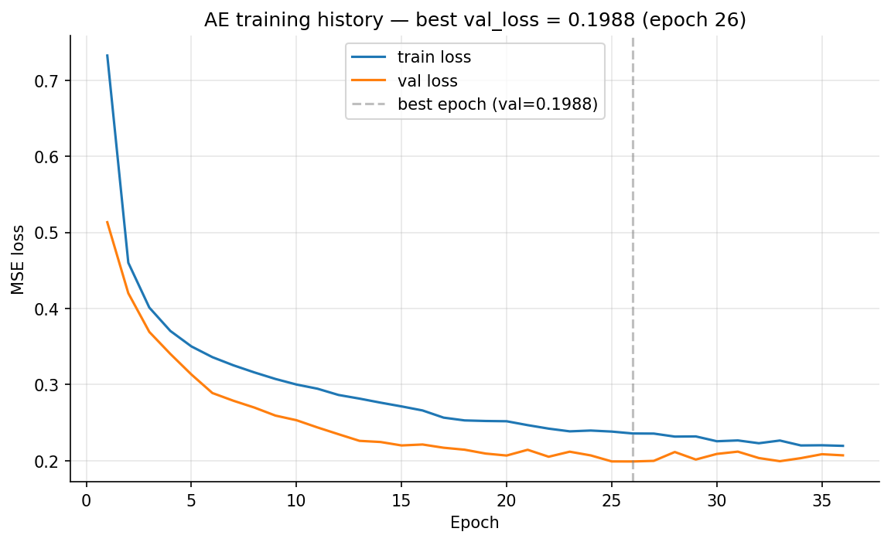
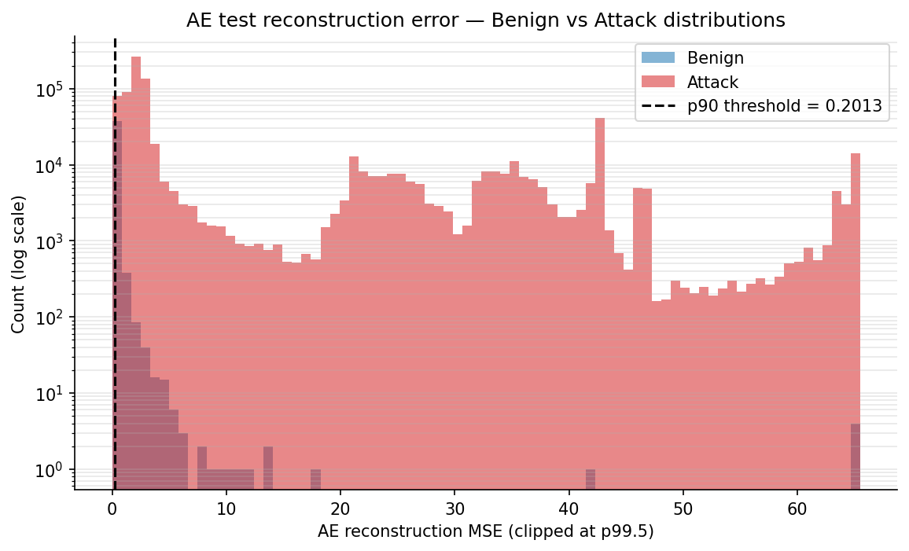
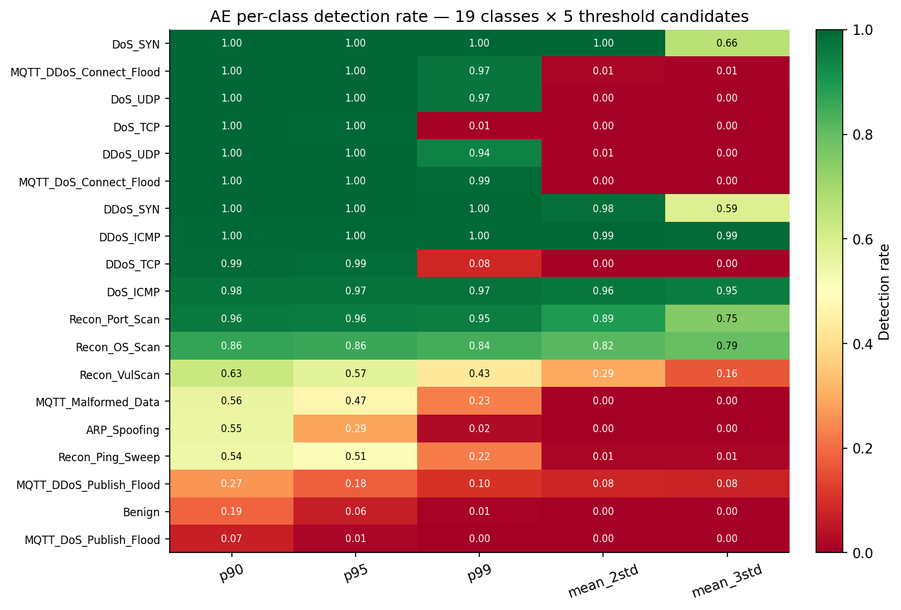
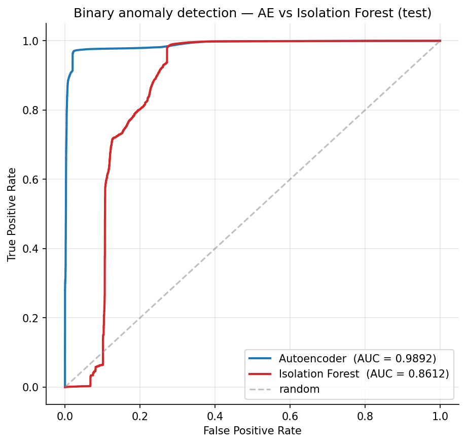
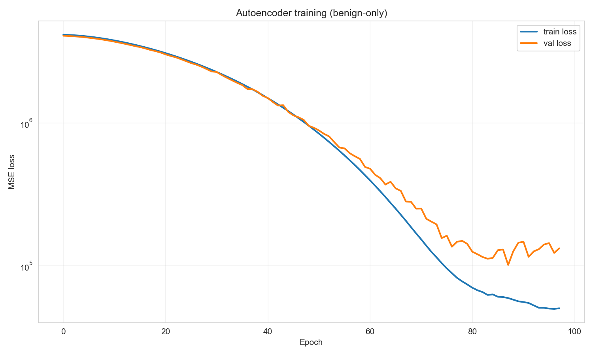
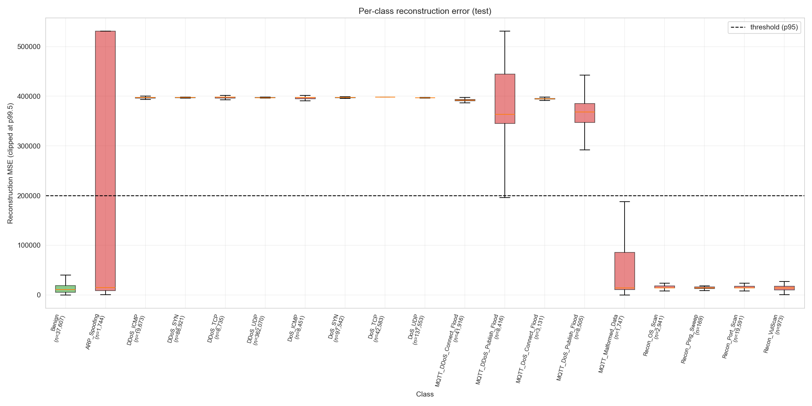

# Phase 5 — Unsupervised Layer (Autoencoder + Isolation Forest)

> **Layer 2 of 4** · script `notebooks/unsupervised_training.py` · output `results/unsupervised/` · full reference `full_report.md §6` · decisions `decisions_ledger.md` Phase 5

## At a glance

| | |
|---|---|
| **Goal** | Train a benign-only anomaly detector that catches what the supervised classifier (Layer 1) cannot — i.e. attacks it never saw. |
| **Headline result** | Autoencoder test AUC **0.9892**, F1 0.9853, per-class avg recall 0.800; Isolation Forest AUC 0.8612. |
| **Key decision** | Deterministic Autoencoder (not VAE), p90 threshold selected on validation F1. |
| **Critical failure fixed** | AE val loss 101,414 → 0.199 (510×) via a missing StandardScaler — documented as **Contribution #13**. |
| **Feeds thesis** | §4 (Methodology, Layer 2) · §5 (Results) · pipeline-lesson discussion (C13) |

## 1. What we did

- Trained a symmetric feed-forward Autoencoder `44 → 32 → 16 → 8 → 16 → 32 → 44` (MSE loss, Adam, batch 512) on the **123,348-row benign-only** training subset; 36 epochs, early-stopped from a max of 100 (patience 10), best val loss 0.1988.
- Trained an Isolation Forest (200 trees, contamination 0.05) on the same benign-only set, as a second, independent anomaly channel.
- Scored validation and test, then calibrated **five threshold candidates on validation** (p90, p95, p99, mean+2σ, mean+3σ) and selected p90 by validation F1.
- Measured per-class detection across all 19 classes — this is where the **AE blind-spot pattern** that motivates the whole hybrid framework first appears.

## 2. Key results

| Metric | Autoencoder | Isolation Forest |
|---|---|---|
| Test AUC | **0.9892** | 0.8612 |
| Test F1 | 0.9853 | 0.7327 |
| Per-class avg recall | 0.7999 | 0.1627 |
| Selected threshold | p90 = 0.20127 (val F1 = 0.991) | — |

**The complementarity finding:** the AE detects DDoS/DoS floods and MQTT connect floods near-perfectly (>95%), but is weak on MQTT publish floods (6.7–26.6%), ARP_Spoofing (55%), and Recon classes (54–87%). Those weak classes are precisely the ones Layer 1 XGBoost classifies *well* — and vice versa. That complementarity is the architectural rationale for fusing the two layers.

## 3. Decisions made

| Decision | Alternatives considered | Why this won | Trade-off accepted |
|---|---|---|---|
| Deterministic Autoencoder (8-dim bottleneck) | β-VAE; Transformer-AE; bottleneck = 4 | Simplest architecture that achieves AE-vs-IF complementarity at sub-second inference; benign data clusters tightly enough that 8 dims suffice | No calibrated OOD score — mitigated by adding softmax entropy in Phase 6C |
| p90 threshold (value 0.20127) | p95, p99, mean+2σ, mean+3σ | Highest F1 on validation | 18.6% benign FPR if Phase 5 were the only detector — mitigated by Phase 6 case stratification |
| Percentile thresholds | mean + kσ | Benign reconstruction error is heavy-tailed (mean 0.20, std 9.48), so mean+kσ lands outside the attack-error mass and collapses below 32% recall | — |
| Retain Isolation Forest despite weaker AUC | Drop IF, ship AE only | Complete ablation coverage for the Phase 6C ensemble test | IF turns out non-additive on this data (documented honest negative) |

*(Full rationale and evidence paths: `decisions_ledger.md` Phase 5 rows.)*

## 4. What broke and how we fixed it

| What broke | Severity | How it was fixed |
|---|---|---|
| 🔴 AE val loss in the millions (best 101,414); Recon_Ping_Sweep recall 0.000, Recon_OS_Scan 0.014 — invisible to the AE | **Critical** | Root cause: Phase 3's ColumnTransformer left Covariance (std 5005) and IAT (std 1030) dominating the MSE. Fitting a fresh `StandardScaler` on benign-train and applying it to all AE-bound data → val loss 0.199 (510× drop), AUC 0.9728→0.9892, Recon_Ping_Sweep 0→0.544, Recon_OS_Scan 0.014→0.865, avg recall 0.700→0.800. Saved as `scaler.pkl`; **Contribution #13**. |
| Python 3.14 incompatible with TensorFlow 2.21 | Med | Downgraded to Python 3.13 |
| Benign MSE heavy-tailed (std 9.48 vs mean 0.20) | Med | Percentile thresholds instead of mean + kσ |
| p90 carries 18.6% benign FPR on its own | Med | Documented; p99 retained for FPR-sensitive fusion variants; gap closed by Phase 6 case stratification |

> **Why the 🔴 fix is a contribution, not an embarrassment:** the pre-fix snapshot is kept on disk (`results/unsupervised_unscaled/`) precisely so the 510× improvement is reproducible. The lesson — tree models are scale-invariant but AE/IF are not, so a Phase 3 choice that *helps* XGBoost silently *breaks* the AE — is the methodological point.

## 5. Methodology — what was actually used

Symmetric feed-forward AE with BatchNorm + Dropout on the encoder; IF on the same benign-train; five thresholds calibrated on validation; p90 selected by val F1. Random state 42 throughout.

| Parameter | Value |
|---|---|
| AE architecture | 44 → 32 → 16 → **8** → 16 → 32 → 44 (bottleneck = √(44×2) heuristic) |
| AE loss / optimiser | MSE / Adam (lr 1e-3) |
| AE batch / epochs | 512 / max 100, early-stop patience 10, best epoch 36 |
| Pre-fit scaler | `StandardScaler` on benign-train only (Contribution #13) |
| IF | 200 trees, contamination 0.05, max_samples auto |
| Threshold candidates | p90, p95, p99, mean+2σ, mean+3σ → **p90 = 0.20127** selected |

**Code & outputs**

```python
# notebooks/unsupervised_training.py L245–L263 — symmetric AE 44→32→16→8→16→32→44
def build_autoencoder(input_dim: int = 44):
    """Symmetric deep AE: 44 -> 32 -> 16 -> 8 -> 16 -> 32 -> 44 ."""
    inp = layers.Input(shape=(input_dim,), name="input")
    # Encoder
    x = layers.Dense(32, activation="relu", name="enc_dense_32")(inp)
    x = layers.BatchNormalization(name="enc_bn_32")(x)
    x = layers.Dropout(0.2, name="enc_drop_32")(x)
    x = layers.Dense(16, activation="relu", name="enc_dense_16")(x)
    x = layers.BatchNormalization(name="enc_bn_16")(x)
    x = layers.Dropout(0.1, name="enc_drop_16")(x)
    bottleneck = layers.Dense(8, activation="relu", name="bottleneck")(x)
    # Decoder
    x = layers.Dense(16, activation="relu", name="dec_dense_16")(bottleneck)
    x = layers.BatchNormalization(name="dec_bn_16")(x)
    x = layers.Dense(32, activation="relu", name="dec_dense_32")(x)
    x = layers.BatchNormalization(name="dec_bn_32")(x)
    out = layers.Dense(input_dim, activation="linear", name="reconstruction")(x)
```

*(The C13 fix is the `StandardScaler` fit at `unsupervised_training.py` L224, applied to all AE-bound data. Full script: [`notebooks/unsupervised_training.py`](../../../../notebooks/unsupervised_training.py).)*

Executed thresholds + live AUC reproduction from the walkthrough notebook (`thesis_walkthrough.ipynb`, Phase 5 cell):

```text
AE thresholds (from thresholds.json):
  p90: 0.20127
  p95: 0.37264
  p99: 1.20253
  selected: p90 (F1 on val = 0.9908)

Live AE AUC computation:
  AE test AUC (live)   = 0.9892
  Published AE AUC     = 0.9892  (README §13.4)
  Match within 0.001:  PASS
```

**Executed figures**



*Figure 8. AE training/validation MSE loss curve (post-fix); best val loss 0.1988 at epoch 36, early-stopped from max 100.*



*Figure 9. Benign vs attack reconstruction-error distribution; the heavy benign right tail (mean 0.20, std 9.48) is why percentile thresholds beat mean+kσ.*



*Figure 10. Per-class detection rate × 5 thresholds × 2 models — the AE blind-spot pattern that motivates fusion.*



*Figure 11. AE (AUC 0.9892) vs Isolation Forest (AUC 0.8612) ROC — the AE channel dominates.*

The pre-fix contrast (the C13 evidence) — kept on disk in `results/unsupervised_unscaled/`:



*Figure 18. Pre-fix AE loss (no benign-train StandardScaler) — val loss 101,414, dominated by Covariance/IAT heavy tails.*



*Figure 19. Pre-fix per-class recall — Recon classes at 0–1.4 %, invisible to the AE; the contrast that makes the 510× fix (C13) reproducible.*

```
benign_train (123,348 × 44)
  → StandardScaler.fit  ──► scaler.pkl            # the C13 fix
  → train AE (36 epochs, val_loss 0.1988)  +  train IF (200 trees)
  → score val/test → ae_test_mse.npy, if_test_scores.npy
  → calibrate 5 thresholds on benign-val → thresholds.json (p90 selected)
  → 19-class detection rates × 5 thresholds × 2 models
```

*Wall-clock 34 s (AE 8.2 s + IF 0.6 s + scoring + sweep), MacBook Air M4, CPU only.*

## 6. Figures & artifacts

- **Figures:** `fig08` AE loss curve · `fig09` recon-error histogram · `fig10` per-class detection heatmap · `fig11` AE-vs-IF ROC · `fig18`/`fig19` pre-fix evidence (the C13 contrast)
- **Artifacts:** `results/unsupervised/` → `autoencoder.keras`, `isolation_forest.pkl`, `scaler.pkl`, `scores/`, `thresholds.json`, `metrics/model_comparison.csv`; pre-fix snapshot `results/unsupervised_unscaled/`

## 7. Feeds thesis

Layer 2 methodology (§4) · binary-detection and per-class results (§5) · the AE blind-spot → hybrid-framework rationale carries into **Phase 6** · the scaling fix anchors the pipeline-lessons discussion (C13).
