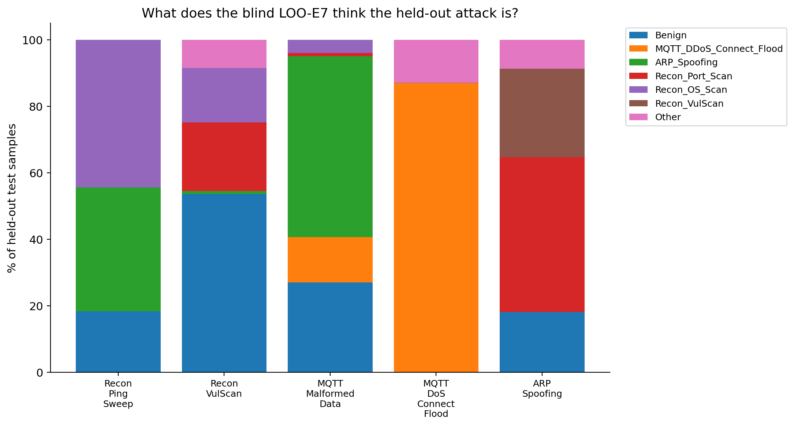
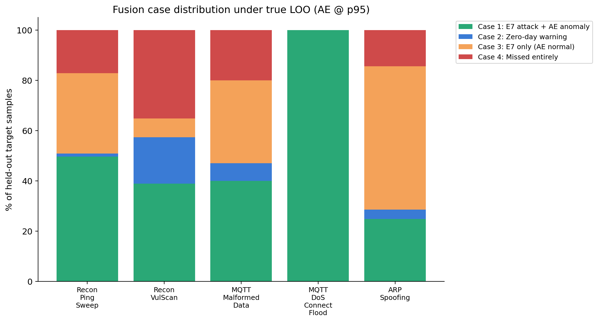
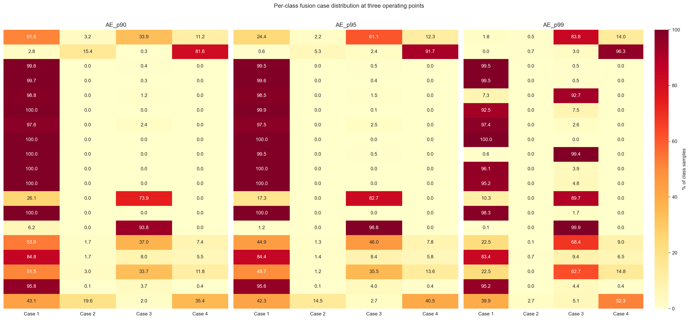
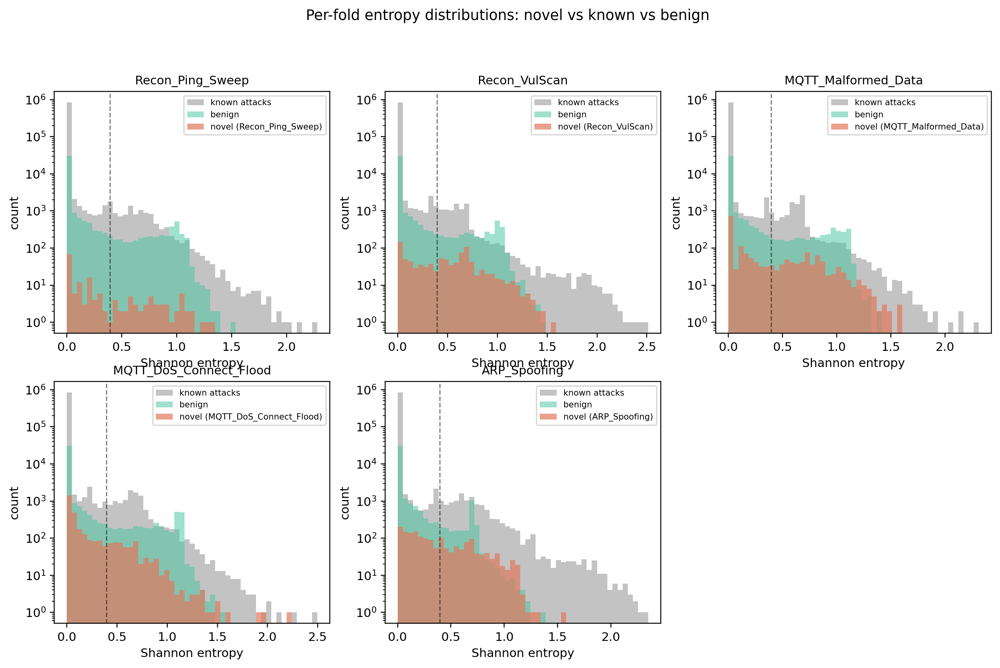
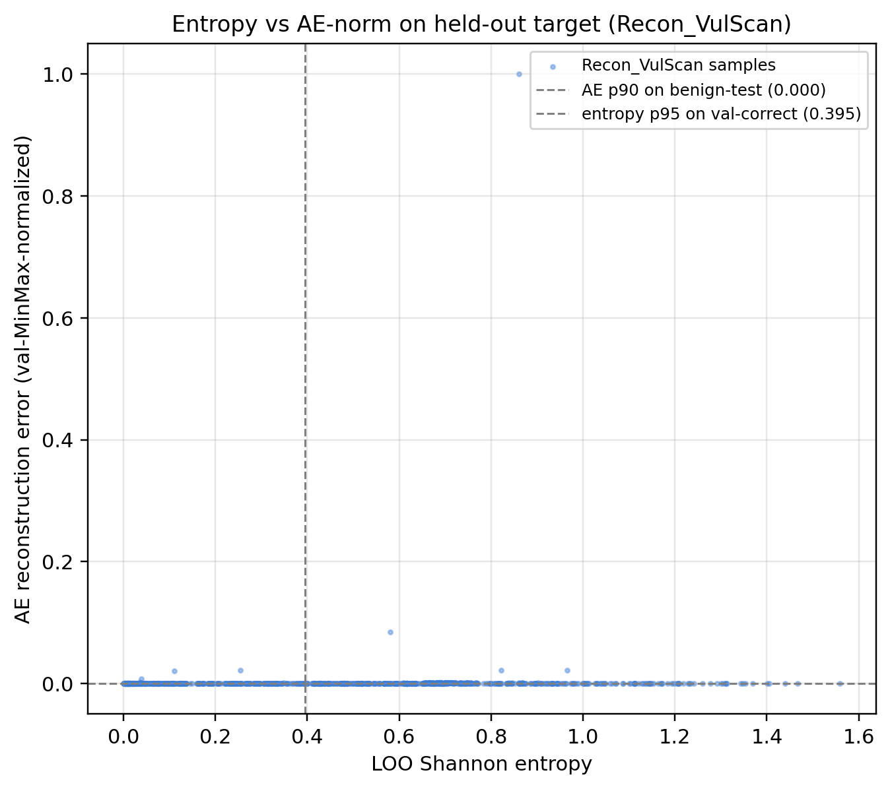
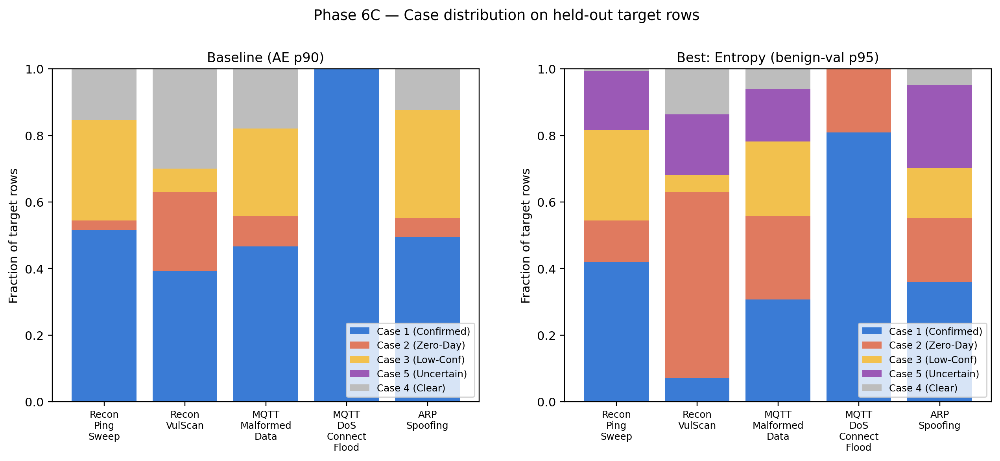
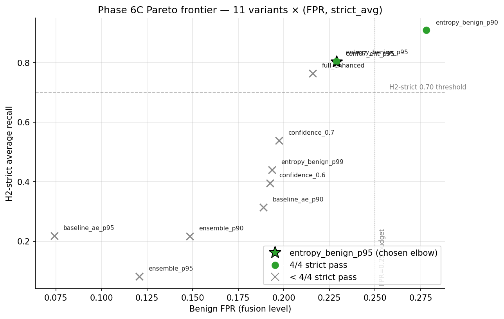
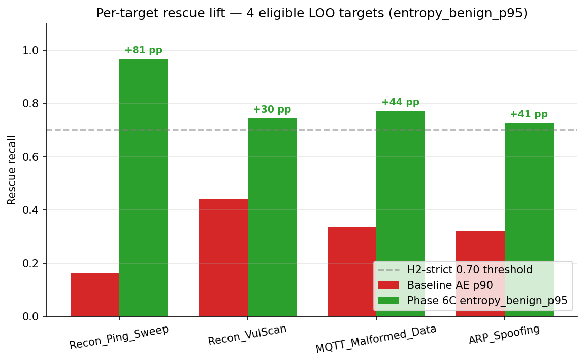

# Phase 6 / 6B / 6C — The Fusion Engine (Layer 3)

> **Layer 3 of 4** · scripts `notebooks/fusion_engine.py` · `loo_zero_day.py` · `enhanced_fusion.py` · outputs `results/fusion/`, `results/zero_day_loo/`, `results/enhanced_fusion/` · full reference `full_report.md §7` · decisions `decisions_ledger.md` Phases 6 / 6B / 6C

## At a glance

| | |
|---|---|
| **Goal** | Fuse the supervised (Layer 1) and unsupervised (Layer 2) channels into a confidence-stratified alert engine, and answer H2: can the system catch attacks the classifier never saw? |
| **Headline result** | H2-strict **0/5 → 0/5 → 4/4 eligible** across the three iterations. The winner — `entropy_benign_p95` (softmax-entropy gate on benign-val + AE p90) — has strict_avg **0.8035264623662012** (the canonical reproducibility tripwire), binary_avg 0.949, benign FPR 22.9 %. |
| **Key decision** | A 4-case → 5-case truth table, plus calibrating the entropy gate on **benign-validation** (not val-correct) samples. |
| **Critical failure fixed** | 🔴 Val-correct entropy calibration was degenerate (`p95 ≈ 0.0005` flagged 98 % of test). Recalibrated on benign-val → realistic FPR (**Contribution #8**). |
| **Feeds thesis** | §7 (Results) · the entropy-rescue mechanism (C7), redundancy-through-misclassification (C5), and 5-case routing (C12) · the tripwire anchors all of Path B. |

## 1. What we did

- **Phase 6 (~1 min, `results/fusion/`):** shipped the **4-case** truth table — Case 1 Confirmed (E7 attack ∧ AE anomaly), Case 2 Zero-Day Warning (E7 benign ∧ AE anomaly), Case 3 Low-Confidence (E7 attack ∧ AE normal), Case 4 Clear. Evaluated H1 via paired bootstrap (200 iters, seed 42) in a 20-class label space, and used *simulated* zero-day for H2.
- **Phase 6B (19.3 min, `results/zero_day_loo/`):** implemented the protocol H2 literally describes — retrained XGBoost **5 times**, each excluding one target class (AE/IF untouched, being benign-only), and measured whether the AE catches the samples the blind LOO-E7 misclassifies as benign.
- **Phase 6C (4.6 s, `results/enhanced_fusion/`):** retrained **nothing** — re-mined the existing arrays to add three uncertainty signals (softmax entropy, confidence floor, AE+IF ensemble), generalising the engine to **5 cases** (Case 5 = Uncertain Alert), and ran the **11-variant × 5-target ablation**.

## 2. Key results

**Phase 6 (4-case, simulated)** — case distribution at AE p90: Case 1 837,209 (93.83 %), Case 2 6,140 (0.69 %), Case 3 17,317 (1.94 %), Case 4 31,602 (3.54 %). H1: E7 macro-F1 (20-class) 0.8622 vs fusion **best variant (AE_p99) 0.8621**, **Δ = −0.00014 (−0.014 pp)** (operationally negligible, ~125 of 892,268 rows). *(The worked **primary operating point (AE_p90)** gives fusion 0.8582, Δ −0.0041 — see the code output below; 0.8621/−0.00014 is the headline best variant, 0.8582/−0.0041 the primary.)* Binary F1 at p99 **0.9985** ≈ E7-only 0.9986. Recommended op point **p97** (test TPR 0.9987, FPR 5.29 %). H2 simulated: **0/5**.

**Phase 6B (true LOO)** — H2-strict (AE-only @ p90) **0/5**; H2-binary @ p90 **5/5**. The binary pass comes from **redundancy through misclassification** (C5): LOO-E7 routes **82.7 %** (6,423/7,764) of held-out target samples to *other attack classes* and only **17.3 %** (1,341/7,764) to Benign — the IDS fires the wrong-class alert but still an alert. AE-on-missed recall: Recon_VulScan 0.4406, MQTT_Malformed 0.3347, ARP_Spoofing 0.3196, Recon_Ping_Sweep 0.1613, MQTT_DoS_Connect n/a (`n_loo_benign = 0`).

**Phase 6C (5-case, enhanced)** — the 11-variant ablation (all values from `ablation_table.csv` / `numbers_map.md §8`):

| Variant | strict pass | strict avg | binary pass | binary avg | FPR |
|---|:-:|---:|:-:|---:|---:|
| Baseline (AE p90) | 0/4 | 0.314 | 4/5 | 0.849 | 0.189 |
| Baseline (AE p95) | 0/4 | 0.218 | 4/5 | 0.827 | 0.074 |
| Confidence floor τ=0.6 | 0/4 | 0.396 | 5/5 | 0.864 | 0.192 |
| Confidence floor τ=0.7 | 0/4 | 0.538 | 5/5 | 0.891 | 0.197 |
| Entropy benign-val p90 | 4/4 | 0.908 | 5/5 | 0.973 | 0.278 |
| **Entropy benign-val p95 ★** | **4/4** | **0.8035** | **5/5** | **0.949** | **0.229** |
| Entropy benign-val p99 | 0/4 | 0.440 | 5/5 | 0.874 | 0.194 |
| Ensemble AE+IF p90 | 0/4 | 0.217 | 4/5 | 0.810 | 0.148 |
| Ensemble AE+IF p95 | 0/4 | 0.082 | 4/5 | 0.783 | 0.121 |
| Conf (τ=0.7) + Entropy p95 | 4/4 | 0.804 | 5/5 | 0.949 | 0.229 |
| Full enhanced | 2/4 | 0.764 | 5/5 | 0.931 | 0.216 |

`entropy_benign_p95` is the Pareto elbow — first variant to cross 4/4 strict, strict_avg **0.8035264623662012** (the tripwire). **Per-target rescue lifts** (baseline AE-p90 → entropy_benign_p95): Recon_Ping_Sweep 0.161 → **0.968** (+81 pp), MQTT_Malformed 0.335 → 0.773 (+44 pp), ARP_Spoofing 0.320 → 0.728 (+41 pp), Recon_VulScan 0.441 → 0.745 (+30 pp) — all four cross 0.70 **for the first time across all phases**. MQTT_DoS_Connect is structurally excluded (`n_loo_benign = 0`) → denominator /4.

## 3. Decisions made

| Decision | Alternatives considered | Why this won | Trade-off accepted |
|---|---|---|---|
| **4-case** truth table (Confirmed / Zero-day / Low-conf / Clear) | 3-case; 2-case binary; soft-probability fusion | SOC routing needs differentiated actions (block / quarantine / monitor / allow); binary would lose the zero-day warning | Case 2 precision intrinsically low (~6 %) |
| H1 framing = "no operationally meaningful difference" (Δ = −0.00014 / −0.014 pp) | "Fusion improves (FAIL)"; "Fusion damages (catastrophic)" | CI excludes zero but magnitude ~125 / 892,268 rows; the `zero_day_unknown` pseudo-class structurally penalises macro-F1 by design | Reader sees "Δ<0, CI excludes 0" and wants to call FAIL; mitigated by binary F1 0.9985 |
| Phase 6B: retrain **XGBoost only** (AE/IF reused) | Retrain AE per fold (a no-op); retrain on a mix | AE/IF are benign-only — dropping an attack class doesn't change their training distribution | Reader must understand "AE not retrained because benign-only" (§15.1) |
| Entropy calibrated on **benign-val** | Val-correct (E7 prediction == truth); per-class entropy thresholds | Val-correct gives degenerate p95 ≈ 0.0005 → flags 98 % → useless; benign-val preserves real width (mean 0.054, p95 0.395) | Reader must accept "high-accuracy classifier ⇒ val-correct collapses" (C8) |
| Best variant = `entropy_benign_p95` | `entropy_benign_p90` (FPR 0.278); conf+entropy (same numbers); full enhanced (2/4 — worse) | Pareto elbow — largest strict gain (+0.36) for smallest FPR cost (+0.035); first to cross 4/4 | Operators tolerating FPR ≤ 0.20 must accept 0/4 strict (entropy_benign_p99) |
| Tripwire: assert `strict_avg == 0.8035264623662012` within 1e-9 | No tripwire (silent drift); 1e-6 tolerance (lets fp32 noise pass) | Multi-seed, sweep, β-VAE, LSTM-AE ALL reproduce this value bit-exactly; any drift in the fusion driver is caught immediately | Bit-exact equality requires fp64 storage of intermediate scores |

*(Full rationale and evidence paths: `decisions_ledger.md` Phases 6 / 6B / 6C rows.)*

## 4. What broke and how we fixed it

| What broke | Severity | How it was fixed |
|---|---|---|
| Phase 6: H1 label-space bug (E7 in 19-class vs fusion in 20-class) | High | v3: both evaluated in the 20-class space |
| Phase 6: Case 2 precision ~6 % (mostly benign false alarms) | Med | Documented as an intrinsic limitation of the case |
| Phase 6: simulated LOO is not a real zero-day test | High | Built Phase 6B (true LOO) |
| Phase 6: H1 first framed as "FAIL"/catastrophic | Med (post-hoc) | Senior review: reframed to "no operationally meaningful difference" — same numbers |
| Phase 6B: per-fold label space changes (18 vs 19 classes) | Med | Per-fold encoder + inverse map (Schema-D sidecar JSONs) |
| Phase 6B: runtime estimated at 5 h | Low | Actually 19 min (each XGBoost ~4 min) |
| 🔴 Phase 6C: entropy threshold 0.0005 flagged 98 % of test | **Critical** | Recalibrated entropy on benign-val (not val-correct) → 0.395, realistic FPR. Val-correct is degenerate when the classifier is ~99.7 % accurate (publishable lesson, §15C.3) |
| Phase 6C: AE+IF ensemble *hurt* strict recall (intuition wrong) | Med | Documented as an honest negative; final system uses AE only |
| Phase 6C: FPR=0.25 budget was a post-hoc cutoff | Med (post-hoc) | Senior review: replaced with full Pareto frontier; chosen point is the elbow |
| Phase 6C: val→test entropy shift unmeasured | Med (post-hoc) | Added per-fold KS test (KS = 0.0645, §15C.10) |

> **Why the trajectory is the contribution:** reporting only the final 4/4 without the 0/5 → 0/5 → 4/4 path would erase the point. This is the only phase where H2-strict goes from 0/5 to 4/4 eligible **without retraining the canonical E7** — proving the rescue signal was already inside E7's softmax, just unsurfaced.

## 5. Methodology — what was actually used

A pure-Python combinator over saved arrays — no model is retrained at fusion time (Phase 6B's LOO retrains are the only training, and only of XGBoost). Phase 6 applies the 4-case truth table and bootstraps H1; Phase 6C extracts Shannon entropy of the LOO softmax, calibrates 3 percentile thresholds on the **benign-validation** slice, and produces the ablation. The 5-case partition routes high-entropy ∧ ¬AE-anomaly to Case 5.

| Parameter | Value |
|---|---|
| H1 bootstrap | paired, 200 iterations, `random_state=42`, 20-class label space |
| Entropy | Shannon entropy of per-row LOO softmax; calibrated on benign-val (n = 38,546 — `full_report §7`, not a numbers_map line-item) |
| Benign-val entropy thresholds | p90 0.1303, **p95 0.3946**, p97 0.6469, p99 0.9507 |
| Confidence floor | τ ∈ {0.6, 0.7} on `max(softmax)` |
| Ensemble | `max(AE_norm, IF_norm)`, val-fitted MinMax, percentile-thresholded |
| Tripwire | `entropy_benign_p95` strict_avg == 0.8035264623662012 (±1e-9) |

**Code & outputs** — the C8 calibration centrepiece: entropy thresholds fit on **benign-validation** samples (the corrected convention):

```python
# notebooks/enhanced_fusion.py L410–L417 — calibrate entropy thresholds on benign-val
benign_val_mask = (y_val_labels == "Benign")
entropy_benign  = e7_val_entropy[benign_val_mask]

log("Calibrating entropy thresholds on BENIGN validation samples ...")
entropy_thresholds = {
    f"ent_p{pct}": float(np.percentile(entropy_benign, pct))
    for pct in ENTROPY_PERCENTILES
}
```

The tripwire assertion, reproduced live in the walkthrough notebook (`thesis_walkthrough.ipynb`, Phase 6C cell):

```python
strict_avg_p95 = strict_best['avg_recall']
assert abs(strict_avg_p95 - 0.8035264623662012) < 1e-9, 'Tripwire failed'
```

```text
=== Phase 6C (enhanced fusion) ===
  Strict best variant   = Entropy (benign-val p95)
    pass                 = 4/4
    avg_recall           = 0.8035264623662012
  Binary best variant   = Entropy (benign-val p95)
    avg_recall           = 0.9494

Tripwire: entropy_benign_p95 strict_avg = 0.8035264623662012 (matches canonical bit-exactly)
```

Executed 11-variant ablation table (`ablation_table.csv`, via the notebook):

```text
           variant h2_strict_pass  h2_strict_avg h2_binary_pass  h2_binary_avg  avg_false_alert_rate
   baseline_ae_p90            0/4       0.314067            4/5       0.848607              0.188805
   baseline_ae_p95            0/4       0.218379            4/5       0.826529              0.074188
    confidence_0.6            0/4       0.395680            5/5       0.864053              0.192363
    confidence_0.7            0/4       0.538124            5/5       0.891457              0.197282
entropy_benign_p90            4/4       0.908467            5/5       0.972884              0.278177
entropy_benign_p95            4/4       0.803526            5/5       0.949366              0.228910
entropy_benign_p99            0/4       0.440267            5/5       0.873598              0.193517
      ensemble_p90            0/4       0.216651            4/5       0.809998              0.148414
      ensemble_p95            0/4       0.082076            4/5       0.782503              0.120834
    conf07_ent_p95            4/4       0.803526            5/5       0.949366              0.228910
     full_enhanced            2/4       0.763726            5/5       0.930804              0.215885
```

Phase 6 / 6B verdicts (notebook, reading `h1_h2_verdicts.json` + `h2_loo_verdict.json`):

```text
=== Phase 6 (simulated) ===
  E7 macro-F1 (20-class)            = 0.8622
  Fusion macro-F1 (primary AE p90)  = 0.8582
  Δ primary                          = -0.0041  CI [-0.004196851355120731, -0.003980279138569231]
  Best variant                      = AE_p99, CI [-0.00016481166024279737, -0.00011894470327992456]
  H2 simulated strict pass          = 0/5
  Recommended op point              = p97
    test_TPR / FPR / F1             = 0.9987 / 0.0529 / 0.9982

=== Phase 6B (true LOO) ===
  H2-strict AE-only @ p90  = 0/5
    Recon_Ping_Sweep              AE-on-missed = 0.1613    
    Recon_VulScan                 AE-on-missed = 0.4406    
    MQTT_Malformed_Data           AE-on-missed = 0.3347    
    MQTT_DoS_Connect_Flood        AE-on-missed = n/a       
    ARP_Spoofing                  AE-on-missed = 0.3196    
```

*(Full scripts: [`fusion_engine.py`](../../../../notebooks/fusion_engine.py) · [`loo_zero_day.py`](../../../../notebooks/loo_zero_day.py) · [`enhanced_fusion.py`](../../../../notebooks/enhanced_fusion.py). The notebook also re-derives the 5-case partition independently from saved E7 softmax + entropy + AE-binary, confirming the canonical fusion logic.)*

**Executed figures**



*Figure 20. Phase 6B LOO-XGBoost prediction distribution — the 82.7 % / 17.3 % attack-to-other-attack vs attack-to-benign split, the foundation of the C5 redundancy mechanism.*



*Figure 21. Phase 6B 4-case distribution per LOO target; Cases 1+2+3 sum to the H2-binary 5/5 pass at p90. MQTT_DoS_Connect_Flood's 100 % Case-1 mass is what structurally excludes it from H2-strict.*



*Figure 22. Phase 6 per-class case-distribution heatmap (19 classes × 4 cases, p90). Recon_VulScan is the only class with substantive Case-2 mass — foreshadowing the entropy rescue.*



*Figure 24. Entropy on benign-val vs each LOO target — the visual basis of the C8 calibration discovery. Benign-val has measurable width (mean 0.054, p95 0.395); val-correct destroys it.*



*Figure 23. Entropy vs AE reconstruction-error on Recon_VulScan — visually orthogonal signals, why they are complementary not redundant.*



*Figure 25. Baseline (4-case) vs entropy_benign_p95 (5-case) per target — the Case-5 mass is the rescue volume converted from Case-4 false-negatives (the C7 contribution).*



*Figure 12. Pareto frontier of the 11 variants in (benign FPR, H2-strict avg) space; the entropy_benign_p95 star sits at the elbow inside the FPR ≤ 0.25 budget — the published operating point.*



*Figure 14. Per-target rescue recall — baseline AE-p90 vs entropy_benign_p95 — on the four eligible targets; all cross 0.70, Recon_Ping_Sweep's +81 pp the largest single gain.*

*Wall-clock: Phase 6 ~1 min + Phase 6B 19.3 min + Phase 6C 4.6 s, MacBook Air M4, CPU only.*

## 6. Figures & artifacts

- **Figures:** `fig20` LOO prediction dist · `fig21` LOO case dist · `fig22` per-class case heatmap · `fig23` entropy-vs-AE scatter · `fig24` entropy distributions · `fig25` enhanced case dist · `fig12` Pareto frontier · `fig14` per-target rescue. *(The Week 2A continuous sweep `fig13` lives in [pathB_hardening.md](pathB_hardening.md).)*
- **Artifacts:** `results/fusion/metrics/h1_h2_verdicts.json` · `results/zero_day_loo/metrics/h2_loo_verdict.json` + `models/loo_label_map_*.json` · `results/enhanced_fusion/metrics/{ablation_table.csv, h2_enhanced_verdict.json, per_target_results.csv}` + `signals/{e7_entropy.npy, entropy_thresholds.json}`

## 7. Feeds thesis

Layer-3 results (§7) · C5 (redundancy through misclassification), C7 (entropy as complementary zero-day signal, 0/4 → 4/4), C8 (benign-val calibration), C12 (5-case routing) · the tripwire `0.8035264623662012` is the reproducibility anchor that **all of Path B** retests bit-exactly.
