# Phase 7 — Explainability (Layer 4: per-class TreeSHAP)

> **Layer 4 of 4** · script `notebooks/shap_analysis.py` · output `results/shap/` · full reference `full_report.md §8` · decisions `decisions_ledger.md` Phase 7

## At a glance

| | |
|---|---|
| **Goal** | Explain *which features* drive E7's per-class decisions — the first per-attack-class SHAP analysis on CICIoMT2024 — and stress-test feature-importance claims against other methods. |
| **Headline result** | **4,180,000** TreeSHAP attributions (5,000 × 19 × 44). Global #1 is **IAT** at mean \|SHAP\| **0.8725** — **4×** the runner-up. DDoS↔DoS category cosine **0.991**; Our SHAP vs Cohen's d Jaccard **0.000**, Spearman ρ **−0.741**. |
| **Key decision** | Per-class (not global-only) SHAP, with a disjoint test-side background of 500 samples. |
| **Critical failure fixed** | No 🔴. The unconventional test-side background was challenged at senior review → defended via TreeSHAP interventional invariance and **empirically verified** in Path B Week 2B (Kendall τ = 0.927). |
| **Feeds thesis** | §8 (Results) · the 0.991 cosine ties Phase 4's H3 boundary-blur and Phase 6's case-stratification into one structural fact (C9, C10, C11). |

## 1. What we did

- Computed **TreeSHAP** on E7 over **5,000 stratified test samples** with **500 background samples** from a disjoint test-side subset, producing a `(19, 5000, 44)` tensor = **4,180,000 attributions** (Contribution #9).
- Aggregated to a **global** top-10 ranking and decomposed it **per class** (19 classes) — the layer where global averaging hides the scientific signal.
- Computed the **DDoS↔DoS category cosine** and a **four-way method comparison** (Our SHAP vs Yacoubi SHAP vs Cohen's d vs RF importance) on top-10 Jaccard + Spearman ρ.
- Defended the background choice via TreeSHAP `feature_perturbation='interventional'` invariance (full empirical verification deferred to **Path B Week 2B** → [pathB_hardening.md](pathB_hardening.md)).

## 2. Key results

| Claim | Value | Source |
|---|---|---|
| Attribution tensor | 5,000 × 19 × 44 = 4,180,000 | `numbers_map.md §9` |
| Global #1 — IAT | mean \|SHAP\| **0.8725** | `numbers_map.md §9` (`global_importance.csv`) |
| #2 — Rate / ratio | 0.2184 / **4.0×** | `numbers_map.md §9` |
| DDoS↔DoS category cosine | **0.991** | `numbers_map.md §9` (README §16.4) |
| Our SHAP vs Cohen's d — Jaccard | **0.000** | `numbers_map.md §9` |
| Our SHAP vs Cohen's d — Spearman ρ | **−0.741** | `numbers_map.md §9` |
| Our SHAP vs Yacoubi — Jaccard | 0.429 | `numbers_map.md §9` |
| Our SHAP vs RF importance — Jaccard | 0.333 | `numbers_map.md §9` |
| Background sensitivity Kendall τ (top-10) | 0.927 → BULLETPROOF | `numbers_map.md §9` (Path B W2B) |

**Per-class top-3** (the C9 payload — different classes rely on completely different features): DDoS_SYN → IAT, syn_flag_number, syn_count · ARP_Spoofing → Tot size, Header_Length, UDP · Recon_VulScan → Min, Rate, Header_Length · MQTT_Malformed → ack_flag_number, IAT, Number · Benign → IAT, rst_count, fin_count. *(Per-class top-3 for DDoS_SYN/ARP_Spoofing/Recon_VulScan/MQTT_Malformed/Benign are in `numbers_map.md §9`; DDoS_UDP and DoS_SYN magnitudes come from `full_report §8` + `per_class_top5.csv` — see numbers_map gaps.)*

**The method-dependence finding:** the features Cohen's d ranks highest (rst_count, psh_flag_number, Variance, ack_flag_number — from Phase 2) are in the *bottom half* of SHAP, and SHAP's top features (IAT, Rate, TCP, syn_count) are in the bottom half of Cohen's d. **Statistical separation is not model reliance** (C11).

## 3. Decisions made

| Decision | Alternatives considered | Why this won | Trade-off accepted |
|---|---|---|---|
| **Per-class** SHAP (19 × 5K × 44) | Global-only (Yacoubi); per-category (5); per-sample | Per-class is the publishable novelty; reveals heterogeneous signatures global averaging masks; one tensor serves both global aggregate and per-class deep-dive | 70 min compute (runs once); 16 MB tensor file |
| Disjoint **test-side** background (500 samples) | Train-drawn (tabular convention); zeros baseline; full test set | TreeSHAP `interventional` is invariant to background source for i.i.d.-similar data; disjoint-test prevents self-attribution; Path B W2B confirms (τ = 0.927) | Reader needs the §16.7B invariance argument; senior review flagged it for verification |
| Four-way method comparison (Jaccard + Spearman) | Ours-only; two-way ours vs Yacoubi | Jaccard 0.000 / ρ = −0.741 between SHAP and Cohen's d is the strongest evidence that method-dependence matters | Dense 4×4 table; high reader effort |

*(Full rationale and evidence paths: `decisions_ledger.md` Phase 7 rows.)*

## 4. What broke and how we fixed it

| What broke | Severity | How it was fixed |
|---|---|---|
| Computation took 70 min (expected 15–30) | Low | Ran under `caffeinate` |
| SHAP API version differences (list vs Explanation) | Low | Script detects and handles both |
| Background drawn from X_test (unconventional) | Med (post-hoc) | Defended via TreeSHAP interventional invariance (§16.7B); empirically confirmed in Path B Week 2B (τ = 0.927) |

> **Why the 0.991 cosine is the load-bearing number:** DDoS and DoS use the same features in the same way; only IAT/Rate magnitudes differ. It ties three threads into one structural fact — Phase 4's DDoS↔DoS confusion mass, the H3 boundary-blur rejection (which requires the classes be *already* overlapping in feature reliance), and Phase 6's case-stratification value (highest where E7 is least confident).

## 5. Methodology — what was actually used

TreeSHAP on E7, `feature_perturbation='interventional'`, 5,000 stratified test samples, 500 disjoint test-side background samples. Output: a `(19, 5000, 44)` tensor plus global/per-class CSVs and the four-way comparison.

| Parameter | Value |
|---|---|
| Explainer | `shap.TreeExplainer`, `feature_perturbation='interventional'` |
| Explained set | 5,000 stratified test samples |
| Background | 500 samples, disjoint test-side slice (`rng(42+1).choice(..., 500, replace=False)`) |
| Tensor | `(19, 5000, 44)` = 4,180,000 attributions (16 MB) |

**Code & outputs** — global top-10 reproduced live in the walkthrough notebook (`thesis_walkthrough.ipynb`, Phase 7 cell, reading `shap_values.npy` + `global_importance.csv`):

```text
SHAP tensor shape: (19, 5000, 44)  (4,180,000 attributions)

Global top-10 features by mean |SHAP|:
   1.  IAT                        0.8725
   2.  Rate                       0.2184
   3.  TCP                        0.1835
   4.  syn_count                  0.1765
   5.  Header_Length              0.1519
   6.  syn_flag_number            0.1297
   7.  UDP                        0.1207
   8.  Min                        0.1036
   9.  Number                     0.0927
  10.  Tot sum                    0.0920

Top-1 (IAT) is 4.00× the runner-up.
```

Four-way method-Jaccard matrix (notebook, reading the SHAP comparison CSVs):

```text
       method  Yacoubi SHAP  Our SHAP  Cohen's d  RF Importance
 Yacoubi SHAP      1.000000  0.428571   0.176471       0.333333
     Our SHAP      0.428571  1.000000   0.000000       0.333333
    Cohen's d      0.176471  0.000000   1.000000       0.250000
RF Importance      0.333333  0.333333   0.250000       1.000000
```

*(The `interventional` background of 500 samples is built at `shap_analysis.py` L279–L284; the live DDoS↔DoS cosine recompute falls back to README §16.4 = 0.991 on a label-encoder schema mismatch. Full script: [`notebooks/shap_analysis.py`](../../../../notebooks/shap_analysis.py).)*

**Executed figures**

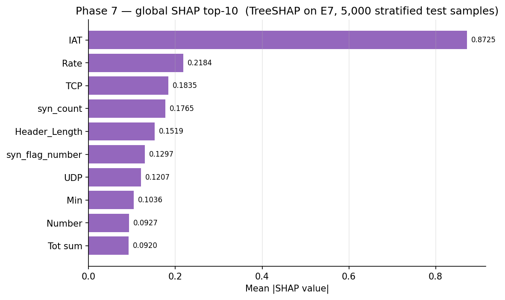

*Figure 15. Global SHAP top-10 on E7 (mean |SHAP| over 5,000 × 19). IAT dominates at 0.8725 — 4× the runner-up Rate.*

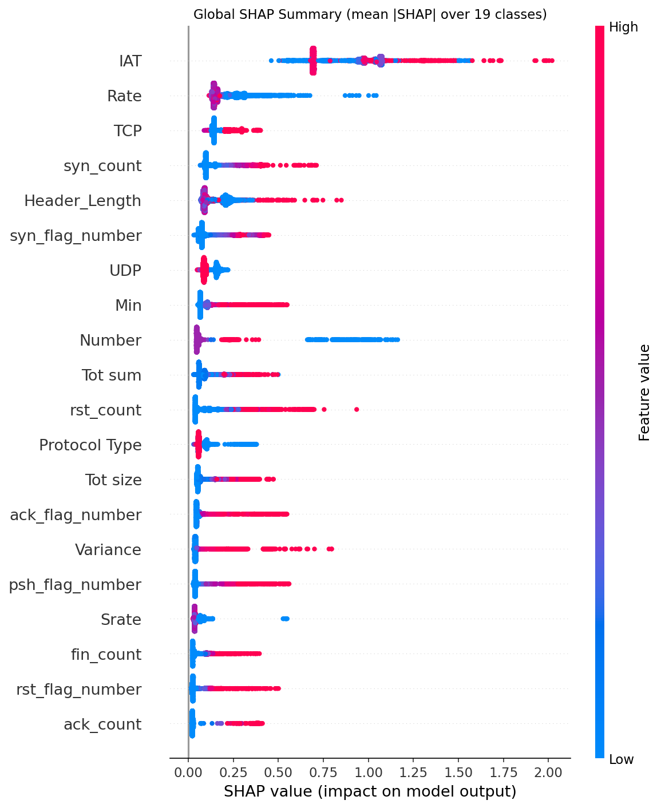

*Figure 31. Global SHAP beeswarm — IAT's wide spread and value-direction coupling confirm the top-1 ranking is driven by directional signal, not just magnitude.*

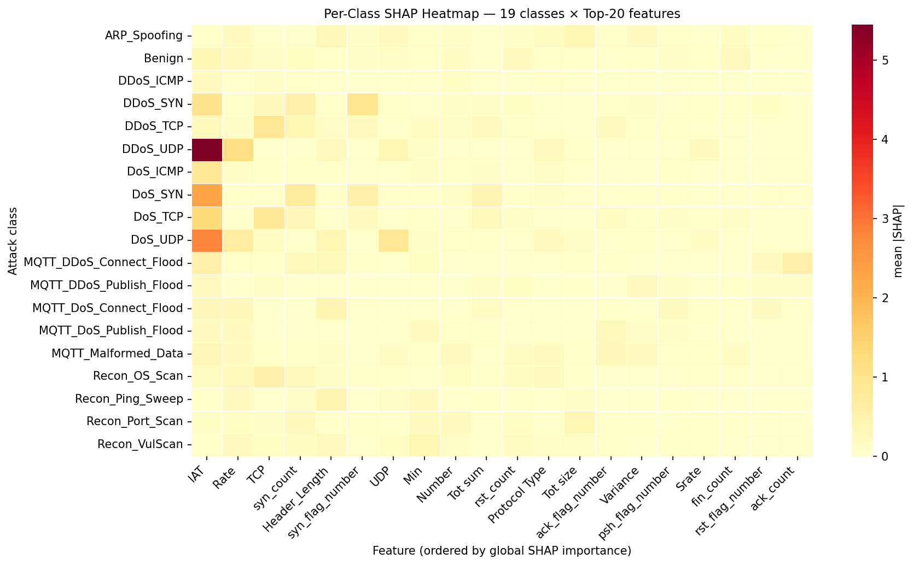

*Figure 28. Per-class SHAP heatmap, 19 classes × top features — the C9 anchor. Heterogeneous rows (DDoS by IAT/Rate, ARP by Tot size, Recon by Min) confirm one global ranking is insufficient.*

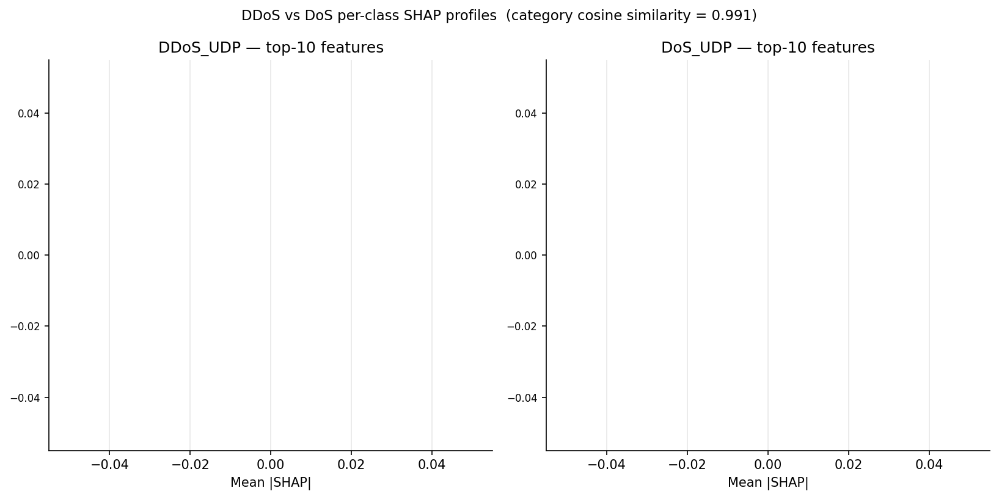

*Figure 16. Side-by-side top-10 SHAP for DDoS_UDP vs DoS_UDP — near-identical ranked lists, only IAT/Rate magnitudes differ; the visual reading of the 0.991 cosine and the foundation of the H3 boundary-blur mechanism.*

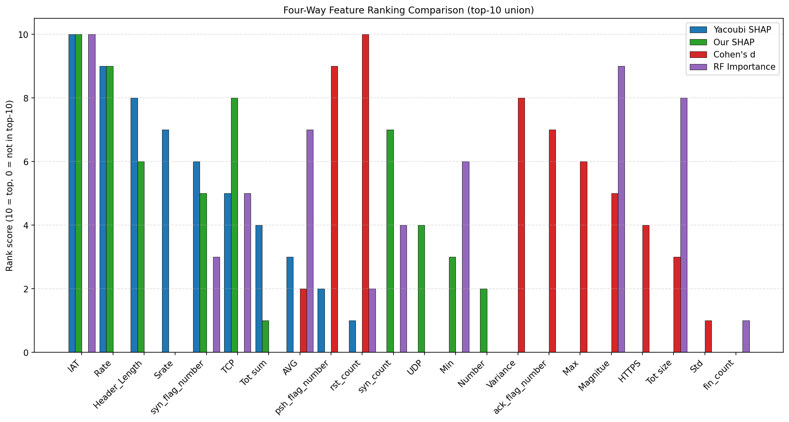

*Figure 29. Four-way feature-importance comparison (Our SHAP, Yacoubi SHAP, Cohen's d, RF importance). The gap between SHAP-coloured and Cohen's-d-coloured columns is the empirical content of the C11 method-dependence contribution.*

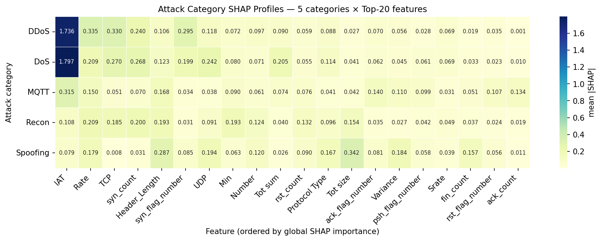

*Figure 30. SHAP signatures aggregated to the 5-attack-category level. DDoS and DoS rows are visually indistinguishable (the 0.991 cosine read-out); Spoofing and Recon occupy clearly distinct feature columns.*

**Per-class beeswarms (the C9 per-class payload):**

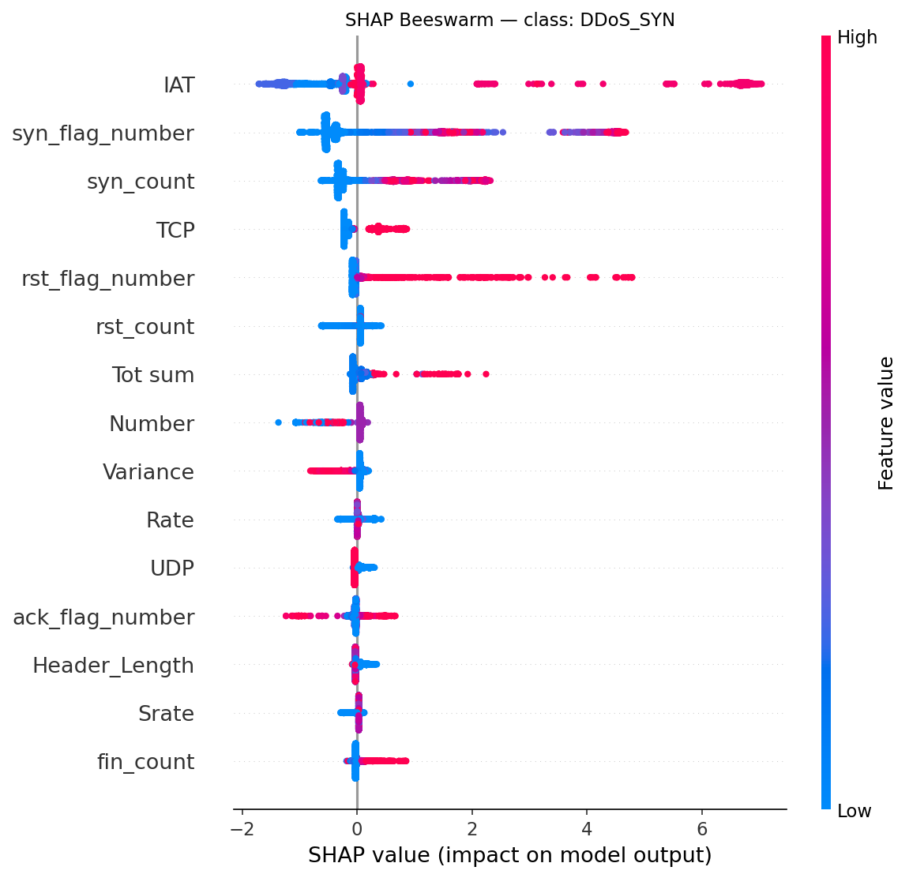

*Figure 37. DDoS_SYN — IAT and syn_flag_number dominate the right tail (the canonical SYN-flood signature).*

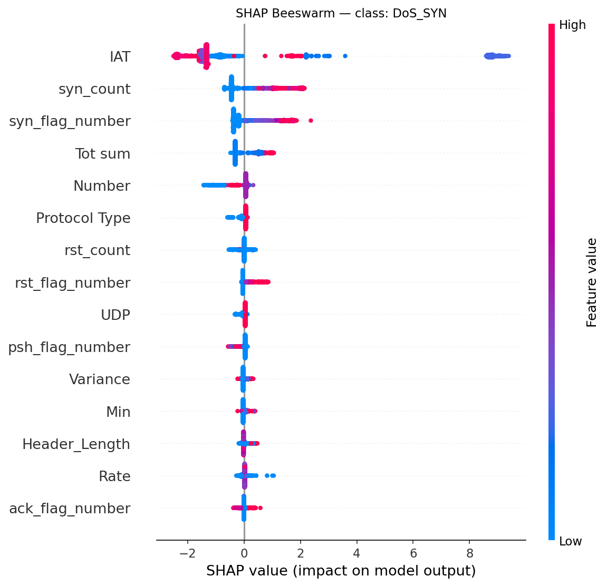

*Figure 38. DoS_SYN — near-identical to DDoS_SYN, only IAT/Rate magnitudes shifted; the most direct visual confirmation of the 0.991 cosine.*

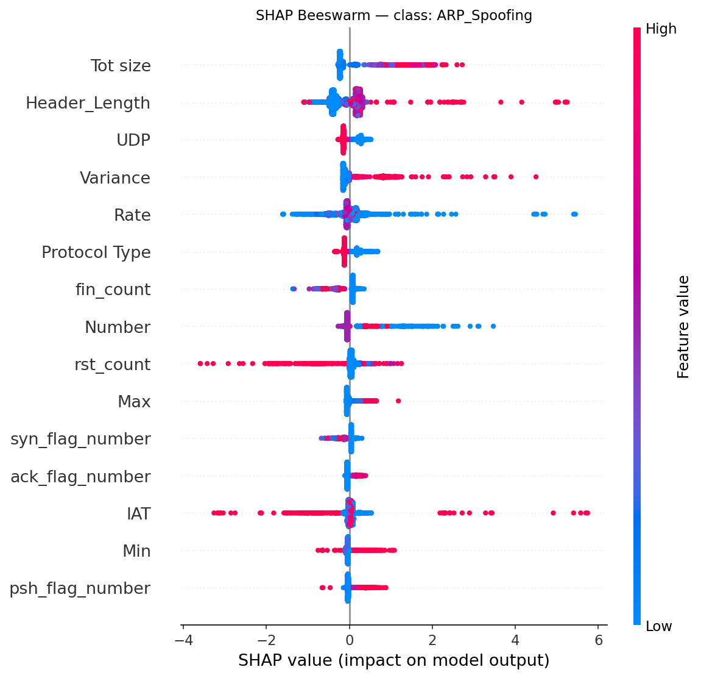

*Figure 35. ARP_Spoofing — Tot size and Header_Length dominate, IAT does not; a completely different signature shape (C9 heterogeneity).*

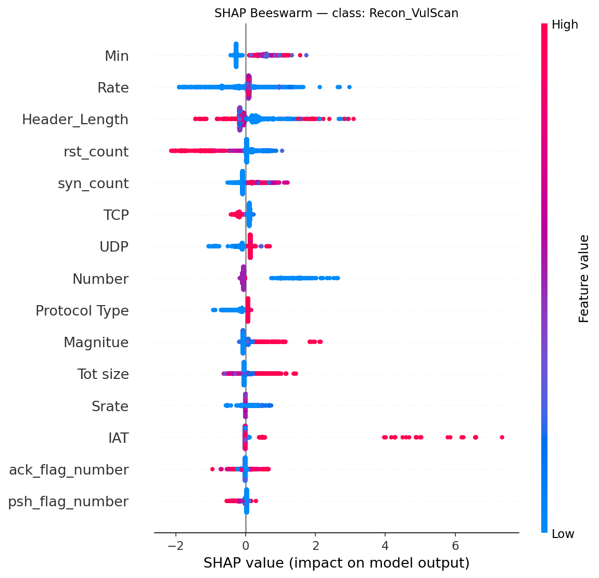

*Figure 39. Recon_VulScan — Min and Rate dominate; the absent IAT signal explains why this is the project's stress-case target.*

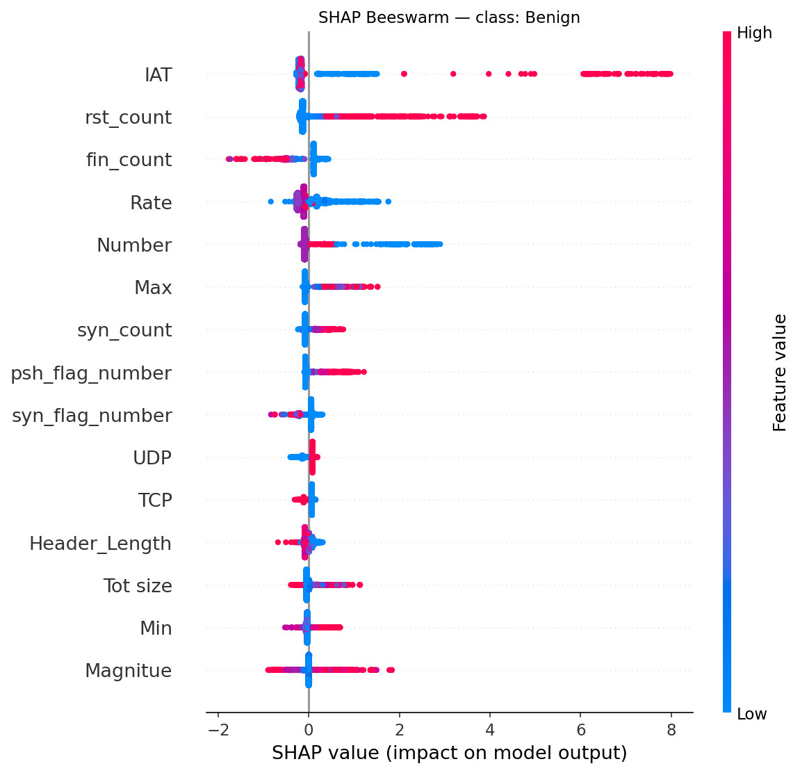

*Figure 36. Benign — IAT/rst_count/fin_count dominate but with a much narrower distribution; benign rows push away from every attack label, the basis for the AE-training cluster.*

*Wall-clock 70.3 min, MacBook Air M4, 24 GB RAM, CPU only (runs once).*

## 6. Figures & artifacts

- **Figures:** `fig15` global top-10 · `fig31` global beeswarm · `fig28` per-class heatmap · `fig16` DDoS-vs-DoS · `fig29` four-way comparison · `fig30` category profiles · per-class beeswarms `fig35` ARP_Spoofing · `fig36` Benign · `fig37` DDoS_SYN · `fig38` DoS_SYN · `fig39` Recon_VulScan. *(SHAP-sensitivity `fig32`/`fig33` are Path B → [pathB_hardening.md](pathB_hardening.md).)*
- **Artifacts:** `results/shap/shap_values/shap_values.npy` (19×5000×44) · `metrics/{global_importance.csv, per_class_top5.csv, method_*.csv}` · `sensitivity/comparison.csv` · `figures/`

## 7. Feeds thesis

Layer-4 results (§8) · C9 (first per-class SHAP on CICIoMT2024), C10 (DDoS↔DoS cosine 0.991), C11 (feature importance is method-dependent, Jaccard 0.000) · the 0.991 cosine is the single structural fact under Phase 4's H3 rejection and Phase 6's case-stratification · the background-sensitivity check becomes **C17** in Path B.
