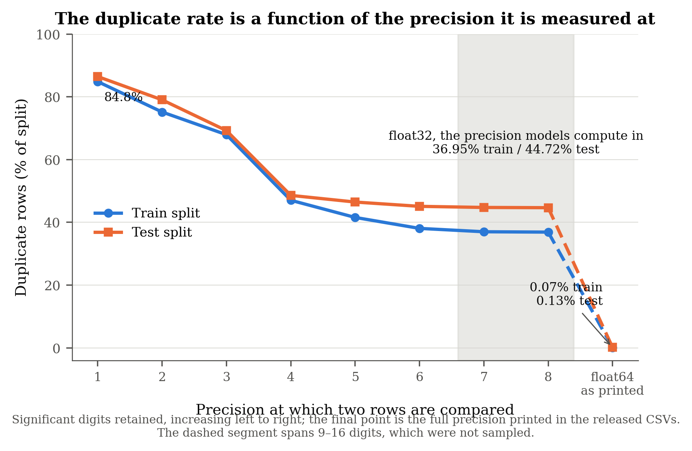
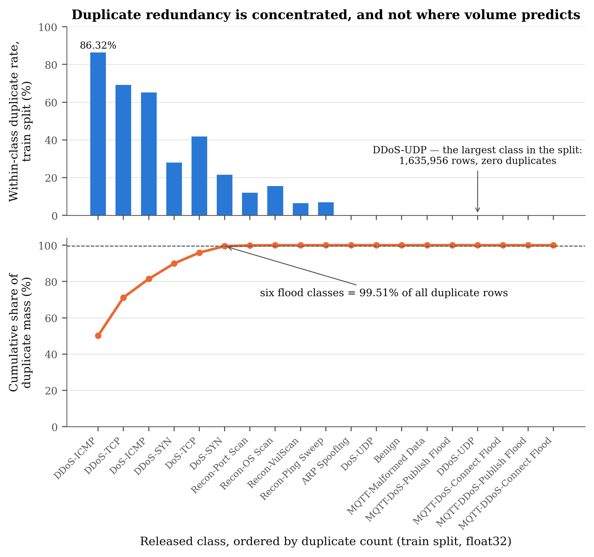
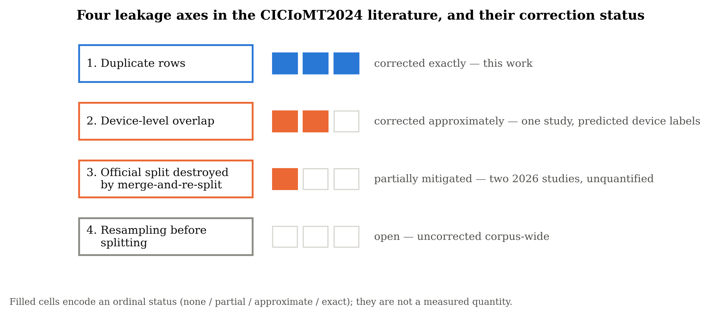
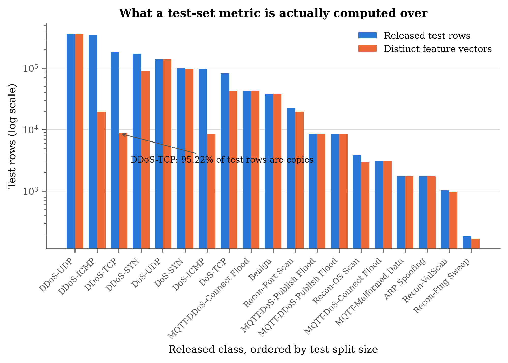
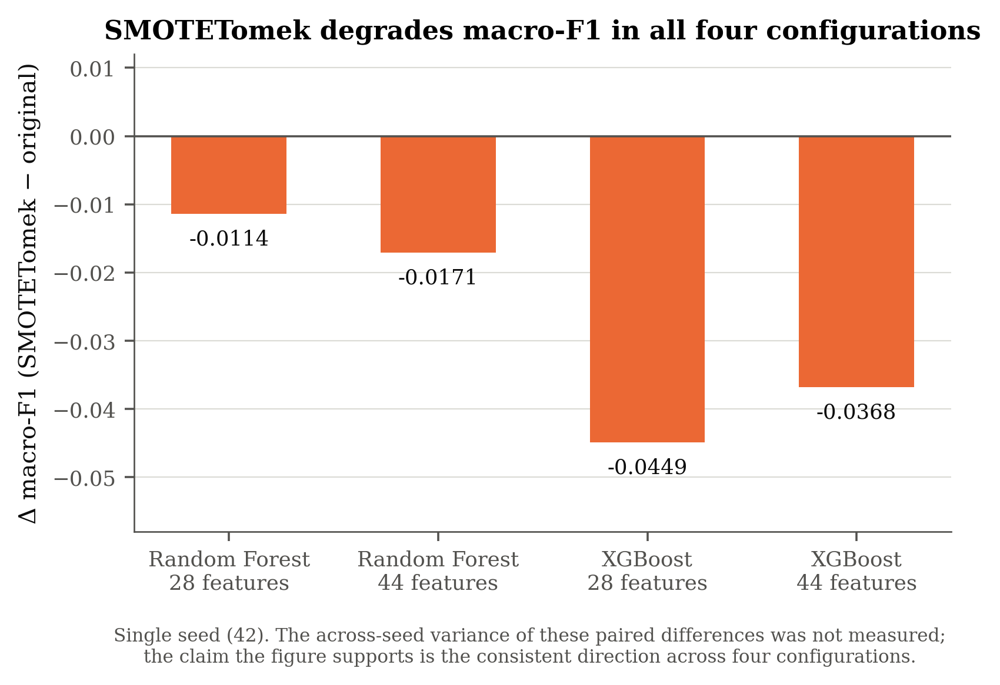

# How much of CICIoMT2024 is a copy? A per-split, precision-stated audit of duplicate leakage in the reference IoMT intrusion-detection benchmark

**Amro Baseet**ᵃ (ORCID 0009-0004-5532-8182) · **İsmail Bütün**ᵇ (ORCID 0000-0002-1723-5741)

ᵃ Department of Computer Engineering, Sakarya University, Sakarya, Türkiye
ᵇ Department of Software Engineering and the Research, Development and Application Center (SARGEM),
Sakarya University, Sakarya 54050, Türkiye

*Corresponding author:* Amro Baseet — mousa.baseet@org.sakarya.edu.tr
<!-- Supplied by the author 2026-07-31 from an IEEEtran author block. The INFORMATION transfers; the markup
     does not — \orcidlink, \IEEEmembership and \thanks are IEEEtran macros with no elsarticle equivalent.
     For elsarticle this becomes \author[a]{...} + \ead{} + \affiliation[a]{organization=...}, and IEEE
     membership is not carried in Elsevier author blocks at all, so it is dropped here.
     STILL OPEN: co-author confirmation for THIS paper specifically (the hoca batch's question 4 is unsent),
     and whether Baseet is the intended corresponding author — assumed, since his is the only e-mail given. -->

> **COMPLETE DRAFT, PRE-SUBMISSION** · target venue: *Internet of Things* (Elsevier) · drafted 2026-07-30,
> revised the same day after senior review.
> Governing spec: `.claude/plans/2026-07-30-p1-dedup-paper-brief.md` (FROZEN, incl. Amendment 1) + `OUTLINE.md`.
> All eleven sections are drafted, with 25 references, seven tables and five figures in place. The author
> block, affiliations, ORCIDs and the funding declaration are complete. Outstanding before submission: the
> CRediT role split and the competing-interest statement (both need only the authors' confirmation), the §2.2
> roster triage, the corpus freshness re-sweep, and the journal's own abstract-length limit. Every number carries an oracle reference in an HTML comment; those comments are stripped
> at submission and must survive `/fact-check` first.

## Abstract

CICIoMT2024 has become the reference benchmark for Internet-of-Medical-Things intrusion detection, used by more
than thirty studies in two years, with accuracies clustering above 99%. We show that a third of it
is duplicated content, that the size of that duplication depends entirely on the numeric precision at which
rows are compared, and that its effect on reported performance is narrower than the field assumes. Duplicate rows are 0.07% of the training split at the float64 precision the CSVs print,
and **36.95% of training rows and 44.72% of test rows at the float32 precision models compute in** — a factor
of 517 on identical rows. Three studies report removing exactly 5,119 duplicates; we reproduce that figure to
the row and show it is the float64-exact count of one split, so those reports are correct and mutually
incomparable. The redundancy is structured: six flood classes carry 99.51%
of it, while the largest training class and the benign class carry none. Within-split redundancy
dominates; cross-split identity — the only mechanism a contamination check would find — touches 0.84% of test
rows. A five-seed ablation shows that scoring on the duplicated test split raises accuracy
by 0.35–0.40 points — a change of estimand rather than contamination — that duplicated training
data has no separable effect, and that the raw-versus-deduplicated comparison the literature makes cannot be
resolved at five seeds. We withdraw two such figures of our own and propose a five-parameter reporting
protocol without which accuracy comparisons on this dataset are not interpretable.

<!-- WORD COUNT: recounted after the 2026-07-31 trim; target is <=250, the common Elsevier submission-form
     cap. The journal's own figure remains UNVERIFIED
     (ScienceDirect 403s automated fetch). Trimmed 330 -> 281 words on 2026-07-30; if the journal caps at 250
     it needs ~30 more cut, so recheck against the real limit before submission. Body sections 1-11, comments
     stripped: 8,671 words including table rows (7,789 excluding them) — inside the brief's 8-12k target. -->

## Highlights

- CICIoMT2024 duplicates: 0.07% at float64, 36.95%/44.72% at float32 — a 517x gap
- The three published "5,119 duplicates" reports are reproduced and shown incomparable
- Six flood classes hold 99.51% of duplicate mass; the largest class holds none
- A duplicated test split raises accuracy 0.35-0.40 pp; duplicated training does not
- Raw-vs-deduplicated comparisons on this dataset lie inside seed variance
<!-- Character counts recomputed 2026-07-30 after revision: 79 / 84 / 77 / 82 / 72 — all within the
     conventional <=85. That rule is UNVERIFIED for this journal (GfA unreachable); confirm before submission. -->

**Keywords:** intrusion detection; Internet of Medical Things; benchmark datasets; data leakage;
deduplication; reproducibility; evaluation methodology

---

## 1. Introduction

Benchmark datasets decide what a field believes. When one dataset becomes the common substrate for a research
area, its defects propagate into every result computed on it, and the defects that propagate furthest are the
ones nobody measures because everybody assumes somebody else did.

CICIoMT2024, released by the Canadian Institute for Cybersecurity in 2024 [1], is that substrate for
Internet-of-Medical-Things intrusion detection. It is the largest and only genuinely multi-protocol real-testbed
IoMT benchmark available — captured from a 40-device testbed (25 physical, 15 simulated) across Wi-Fi, MQTT
and Bluetooth, with **8,775,013** flow records in the Wi-Fi and MQTT subset that this paper and effectively
the entire literature use, and a separate Bluetooth feature schema shipping alongside — and it was adopted
quickly and broadly: our systematic search identifies more than thirty studies using it for
intrusion detection within two years of release. Reported performance on it is uniformly excellent. Binary
detection is saturated above 99%, and 19-class accuracies of 0.96–0.999 are routine.

Against that consensus stands an uncomfortable control, supplied by the dataset's own authors: their untuned
19-class baseline scores **0.733** [1]. The gap between 0.733 and 0.999 on the same task family is large enough to
demand an explanation, and better modelling is only part of one.

This paper measures a specific contributor that none of the 31 studies we verified against full text
quantifies. Duplicate records in
CICIoMT2024 are not a marginal data-hygiene matter — a third of the benchmark is copies — and their size,
location and consequence are all measurable. Our contributions:

1. **A per-split, precision-stated quantification of duplication** (§4). Duplicate rows are 0.07% of the
   training split at float64 and 36.95% at float32, with the test split reaching 44.72%. Precision is not a
   reporting detail on this dataset; it is a factor of 517.
2. **A reconciliation of the literature's one published duplicate figure** (§5). Three studies report removing
   exactly 5,119 rows. We reproduce that number to the row and identify it as the float64-exact count of the
   training directory; we also reconstruct one study's stated working set exactly and show that its quoted
   figure is pipeline-inherited rather than measured on that set. Nobody miscounted; the reports are not
   comparable with one another because the precision and scope behind them differ.
3. **The structure of the redundancy** (§6). It is concentrated, not diffuse: six volumetric TCP/IP flood
   classes hold 99.51% of the duplicate mass, four `Recon` sub-types show meaningful rates but negligible mass,
   and `Benign`, all five MQTT classes and the single largest flood class contain none. Duplication on this
   dataset is protocol-structural, not volume-driven.
4. **A three-mechanism decomposition** (§7), separating within-split redundancy from leakage proper.
   Within-split redundancy dominates; cross-split identity — the only mechanism a conventional contamination
   check detects, and the only one that is leakage in the strict sense — touches 0.84% of test rows; and
   the duplicate mass additionally distorts every preprocessing statistic fitted on the training split.
5. **A controlled measurement of the consequence, including two negative results** (§8). In one pipeline over
   five seeds, a duplicated test set inflates accuracy by 0.35–0.40 percentage points; duplicated training data
   has no separable effect; and the raw-versus-deduplicated comparison the field makes is inside its own seed
   variance. We withdraw a previously published figure of our own on this basis.
6. **A reporting protocol and a reproduction package** (§9, §3.7). Five parameters — precision, scope, stage,
   split and granularity — that make a duplicate count falsifiable and two accuracy figures comparable.

The intended contribution is not a better detector. It is that a specific, widely used benchmark cannot
currently support the cross-paper comparisons made on it, that the reason is measurable, and that the remedy
is cheap.

## 2. Related work

### 2.1 Leakage and duplication as evaluation failures

That duplicated records inflate measured performance is not a new observation in machine learning generally.
Leakage has been characterised as a principal driver of the reproducibility problem in machine-learning-based
science, with a taxonomy separating contamination of the train/test boundary from illegitimate features and
from sampling artifacts [19]. Security-specific treatments have catalogued the same failure modes as recurring
pitfalls in the design and evaluation of learning-based security systems [20], and duplicate-driven inflation
has been documented concretely in adjacent domains — near-duplicate images across the splits of standard vision
benchmarks [21], and train/test overlap in Android malware corpora [22].
<!-- All four external references [19]-[22] were added and source-verified on 2026-07-30; per-entry
     verification notes are in the reference list. -->

What distinguishes the present case is not the phenomenon but its invisibility in a literature that is
otherwise methodologically attentive. The duplication documented here is large, it is measurable with three
lines of code, and it sits in the field's single most used benchmark.

### 2.2 Deduplication practice in the CICIoMT2024 literature

Our corpus of CICIoMT2024 intrusion-detection studies comprises 33 identified works, 31 of which we verified
against full text (two are paywalled at abstract level and are excluded from every **absence** claim below, though one is cited
in §2.4 for its own abstract-stated dataset description). Nine of the
31 touch deduplication in some form. Of those nine:

- **three** report a single aggregate count — 5,119 rows — as one figure for their whole working set, with no
  per-split rate [2,3,4]; the scope of two of them is nevertheless recoverable from their own arithmetic, which
  is what makes the reconciliation of §5 possible;
- **one** reports a ~55% row reduction that conflates deduplication with removal of missing values [6];
- **three** describe deduplication as a pipeline step without quantifying it at all [8,9,10];
- **one** removes missing values and duplicate records together from both splits, reporting pre- and
  post-counts from which only a combined drop can be inferred [7] — the same conflation as the study above, at
  a different scale;
- **one** performs a cross-set hash check, but after undersampling, so its scope is not the released data [11].

A tenth study deduplicates a *different* dataset used alongside CICIoMT2024 and not CICIoMT2024 itself [12]; it
is excluded from the nine.

**No study in the verified set reports a per-split duplicate rate, and none analyses the effect of duplication
on its own reported metrics.** This is the gap the present paper fills.

We deliberately do *not* claim that these studies fail to state the precision at which they counted. We found
no stated precision in any of them, but establishing that as an absence would require a claim-by-claim audit of
nine methods sections that we have not performed — and the argument of §4 does not need it: a duplicate count
reported without its precision cannot be reproduced by a reader, whether or not the omission is universal.
<!-- oracle: Research_Gap_Report_v1.0.md:15 and Appendix A rows; Literature_Review_Chapter2_v6.6.md §2.4.2(a) -->

**On the completeness of that claim.** An absence claim is only as strong as the search behind it. Ours rests
on a documented systematic search across IEEE Xplore, Springer, ScienceDirect, Nature, arXiv, MDPI and
regional indices, snapshotted 2026-07-29 and re-swept before submission; the search strategy is released with
the reproduction package. A re-sweep conducted while this paper was being drafted surfaced at least one further
study using CICIoMT2024 that our roster had missed [25] — a 2024 conference paper reporting 99% across binary,
categorical and multiclass tasks, with no deduplication mentioned — which is evidence that the roster is a
documented lower bound rather than a census. We cite it explicitly so that the counter-example on which this
caveat rests is checkable rather than anecdotal. We therefore state the absence claim over the verified set and
make no completeness claim over the literature as a whole. Every study we did examine is listed, so the claim
is falsifiable by counter-example — which is the strongest form available to a single-team review.
<!-- ROSTER TRIAGE OWED before submission: candidates surfaced 2026-07-30 and not yet in the roster —
     arXiv 2410.23306 (Mohamadi et al., ICIS 2024, CICIoMT2024, no dedup mentioned — CONFIRMED user);
     Computer Networks S1389128626003713 (2026, feature selection + hybrid balancing);
     Applied Sciences 10.3390/app16104701 (PCA + One-Class SVM);
     Internet of Things S2542660525003464 (FTL-TSLP federated transfer learning);
     arXiv 2507.05132 (ELM DDoS, Jul 2025 — screened out of the freshness sweep on date grounds, never
     checked against the roster). Note the screening gap: the 2026-07 freshness sweep only sought papers
     NEWER than the corpus build, so 2024-2025 works missed by the original search were never re-caught. -->

### 2.3 The one prior methodological critique of this dataset

One study is a direct methodological predecessor and must be positioned precisely. Doménech et al. [5], in
this journal, train on a general-IoT benchmark and test on CICIoMT2024 to demonstrate a 66.87% F1 transfer
drop, then critique four CICIoMT2024 design choices — inconsistent packet windowing, the absence of a proper
train/validation/test split, temporal correlation between records, and class imbalance — and propose
preprocessing remedies, reaching 99.85% accuracy with their optimised pipeline.

Their critique and ours are complementary and non-overlapping. Their windowing observation is in fact
*upstream* of our result: window-averaged feature construction is exactly why exact-match duplicate counts are
a lower bound (§4), so their finding strengthens ours. But they do not deduplicate, and they report no
duplicate count, so the redundancy documented here persists in their optimised figure as well. Across the 31
studies we verified against full text, none quantifies duplication per split or measures its effect on reported
performance; we make that claim over the verified set, with the completeness caveat of §2.2.
<!-- oracle: Literature_Review_Chapter2_v6.6.md:151 and :75 (row 19) -->

### 2.4 Why substrate fragmentation makes this audit necessary

The corpus does not share one substrate. Across studies, feature counts on the released schema span 5 to 46 —
one study reports near-optimal binary detection from 3–4 features [24] — with one 2026 study re-extracting 78 of
85 features from the raw captures [14]; row counts span roughly 16,000 to 8.78 million; at least eight distinct
label-space sizes coexist under one dataset name, and one 2026 abstract describes the dataset in terms that
conflict with the canonical release on every element [23]. A duplicate rate is therefore only meaningful
relative to a stated scope — which is precisely the parameter the 5,119 cluster omits (§5), and one of the five
the protocol of §9 requires.
<!-- oracle: Research_Gap_Report_v1.0.md headline finding 2 / G9 -->

---

## 3. Data and method

### 3.1 The released artifact

CICIoMT2024's Wi-Fi and MQTT subset ships as **72 CSV files** — 51 covering the training split and 21 the
test split — with the split expressed at the file level by directory. Each row is a flow-level feature vector
of **45 numeric attributes**; the class label is carried by the filename rather than by a column, and
volumetric attack families are distributed across numbered files (`TCP_IP-DDoS-ICMP1` … `TCP_IP-DDoS-ICMP8`)
that together constitute one class.
<!-- oracle: numbers_map.md §2 rows 31-33 (row counts), row 41 (45 features), row 44 (19 classes);
     file counts from the data/{train,test} directory listings -->

Table 1 summarises the artifact as distributed.

**Table 1 — CICIoMT2024 Wi-Fi + MQTT subset as released.**

| Property | Train | Test | Total |
|---|---|---|---|
| Files | 51 | 21 | 72 |
| Rows as released | 7,160,831 | 1,614,182 | 8,775,013 |
| Features | 45 | 45 | 45 |
| Classes | 19 | 19 | 19 |

The 19 classes comprise 18 attack types plus `Benign`, and the distribution is severely imbalanced: after the
deduplication described below, the ratio between the largest and smallest class is **2,374:1**.
<!-- oracle: numbers_map.md §2 row 45 -->

Throughout this paper we quantify duplication over the released artifact as distributed. We deliberately do
**not** merge the two directories before measuring, because the file-level split is the dataset's own
evaluation protocol and merging it destroys the very boundary whose integrity is in question. Pooled-merge
figures are reported separately and labelled as such.

### 3.2 What counts as a duplicate

A duplicate is an exact match of the **45-column feature vector**. Two representations are measured:

- **REP45** — the 45 released feature columns only.
- **REP46** — REP45 plus the class label recovered from the filename, i.e. the post-merge table that every
  study which concatenates the CSVs actually works with.

The distinction matters for a specific reason. If duplicate vectors were shared *between* classes,
deduplication would face a label-ambiguity problem: which label survives? Reporting both representations
settles that question empirically rather than by assumption.
<!-- oracle: dr6_reconcile_5119.py:9-11 (REP45/REP46 definitions) -->

### 3.3 Precision as an experimental variable

The released CSVs print values at float64 precision. Every mainstream implementation applied to this dataset —
gradient-boosted decision trees, and neural frameworks by default — computes in **float32**. Two rows that
differ only beyond the seventh significant digit are printed as distinct in the CSV and are *literally the
same training example* to the model that consumes them.

Duplication is therefore not a single quantity but a function of the precision at which it is evaluated, and
a duplicate count reported without its precision is unfalsifiable. We measure at both:

- **float64-as-printed** — bit-identical to the 16th digit; what a naive `drop_duplicates` on the CSV as read
  reports.
- **float32-as-computed** — the operational precision, obtained by casting the 45 feature columns to
  `float32` before comparison.

### 3.4 Scope as an experimental variable

The second unstated parameter is scope: *which rows were counted*. We evaluate per-file, per-split (train,
test), pooled-merge (train + test as one table), and the published subsets that individual studies report
having used. As §5 shows, scope alone accounts for a discrepancy the literature has left unexplained.

### 3.5 Procedure

Each CSV is read with the 45 feature columns typed as `float32`, or left at `float64`, according to the
representation under test. Rows are hashed with `pandas.util.hash_pandas_object(df, index=False)` — a 64-bit
row hash over the ordered column tuple — and the duplicate count for a scope is `len(h) − len(unique(h))`,
the number of rows in excess of the distinct vectors present. Cross-split identity is measured as the
intersection of the two splits' distinct-vector sets.
<!-- oracle: dr6_float32_check.py:35-46 -->

Two honest caveats about the procedure:

**Hash collisions.** Over 8,775,013 rows a 64-bit row hash has an expected false-collision count of
2.1 × 10⁻⁶ colliding pairs under the birthday bound — negligible relative to the counts reported here, but
not identically zero. The
float64 counts were additionally confirmed against the row arithmetic of the released directories (§5), which
does not depend on hashing at all.

**±inf handling.** The audit scripts hash the CSVs as read. The reference pipeline against which we
cross-check (§3.6) replaces ±inf with NaN before its own deduplication step. The two procedures agree on the
headline rates to four decimal places, which is the cross-validation; where a number originates from one
convention rather than the other, we say so.
<!-- oracle: docs/phase2_eda.md:77-83 (pipeline's inf handling) vs dr6_float32_check.py (as-read) -->

### 3.6 Independent cross-checks

Every headline count in §4 was produced by at least two independent code paths: the audit scripts released
with this paper, and a separate end-to-end preprocessing pipeline written earlier without reference to them.
The float32 train count agrees exactly — 2,645,751 rows removed, recoverable as 7,160,831 − 4,515,080 — and a
third implementation, built for the ablation in §8, reproduced both split counts to the row.
<!-- oracle: numbers_map.md §2 rows 34-37; eda_output_raw/build_report.json (third path) -->

### 3.7 Reproduction package

The four audit scripts behind §§4–6, the result JSONs they produce, and a verifier that re-derives the
reported figures from those JSONs are released as `ciciomt2024-dedup-audit` *[URL on acceptance]*. The
verifier runs 91 checks covering the duplicate counts and rates, the per-class table, the reconciliation
arithmetic, the cross-split figures and the ablation cells and contrasts; it does not re-derive every
incidental number in the prose, and the package README states which sections are reproducible from it and
which are not (§8's ablation needs a training pipeline outside the package's scope). The package contains **no CICIoMT2024 data**; the
dataset must be obtained from the Canadian Institute for Cybersecurity directly. Environment: Python 3.13.13,
pandas 2.3, NumPy 2.2, scikit-learn 1.8, XGBoost 3.2.0. We note one honest discrepancy for reproducers: the
project's dependency manifest pins XGBoost below 3.0 while the installed and used version is 3.2.0, so the
manifest should not be treated as the authority for the ablation of §8.
<!-- oracle: CLAUDE.md stack line. NOTE: requirements.txt pins xgboost<3.0 while 3.2.0 is installed —
     known drift, to be stated honestly wherever pipeline versions are cited (brief line 23). -->

---

## 4. Result 1 — duplication is precision-dependent, by a factor of 517

Measured over the released artifact at the two precisions of §3.3, Table 2 gives the counts and rates:

**Table 2 — Duplicate rows by numeric precision and scope. Percentages are of the rows in that scope.**

| Precision | Meaning | Train duplicates | Test duplicates | Pooled merge |
|---|---|---|---|---|
| float64 (as printed) | identical to the 16th digit | **5,119** (0.0715%) | **2,065** (0.1279%) | 7,379 (0.0841%) |
| **float32 (as computed)** | identical at ~7 significant digits | **2,645,751 (36.9475%)** | **721,914 (44.7232%)** | 3,368,126 (38.3831%) |
<!-- oracle: numbers_map.md §2 duplicate rows; all six cells from dr6_out/dr6_float32_check.json -->

The same rows, the same comparison, the same dataset: **0.07% or 36.95%**, depending entirely on the precision
at which the comparison is performed. The float32 figure is the operationally relevant one, because it
describes the data as the model actually receives it — and a count reported without its precision cannot be
reproduced by a reader, which is why §9 makes precision the first mandatory reporting parameter.

Three properties of this result deserve emphasis.

**It is a lower bound, not an estimate.** Exact matching cannot see near-duplicates, and CICIoMT2024's feature
construction manufactures them: attributes such as `Rate`, `Srate`, `IAT`, `AVG`, `Std` and `Variance` are
window-averaged statistics, so consecutive windows over a sustained volumetric flood differ in their
low-order digits while describing the same behaviour. Any exact-match rate at any precision is a floor on the
true redundancy.

**The collapse is not gradual.** Between the two precisions the count rises by a factor of **517**
(2,645,751 / 5,119). The sweep below localises where that divergence happens.

**The collapse is monotone until it is a cliff.** Sweeping the comparison precision from 1 to 8 significant
digits (Figure 1) traces the rate down from **84.83%** of the training split at one digit, through **47.02%** at
four, to **36.88%** at eight — after which comparing at the CSVs' full printed precision drops it to **0.07%**.
Two properties of that curve matter. First, float32 lands where it should: the sweep's 7-significant-digit
point (36.99% train / 44.74% test) reproduces the float32 measurement (36.95% / 44.72%) to within five
hundredths of a percentage point, confirming from a fourth independent code path that float32 carries about
seven significant digits on this data. Second, the duplicate mass therefore consists of rows that agree through at
least eight significant digits and diverge only beyond — which is what window-averaged features over
near-stationary traffic produce, and which no rounding-based deduplication at ordinary precision would miss.

**Figure 1.** Duplicate rows as a percentage of each split, measured at increasing comparison precision. The
final point is the full precision printed in the released CSVs; the dashed segment spans 9–16 significant
digits, which were not sampled. Shaded band marks where float32 falls.
<!-- oracle: numbers_map.md §2 "Precision sweep" rows; figures/precision_sweep.json -->

**Deduplication removes more than a third of the benchmark.** Dropping float32 duplicates takes the training
split from 7,160,831 to **4,515,080** rows and the test split from 1,614,182 to **892,268**. Two thirds of the
nominal size of the field's reference dataset survives; the remainder is copies.
<!-- oracle: numbers_map.md §2 rows 34-35 -->

---

## 5. Result 2 — the literature's "5,119 duplicates" is correct, and not comparable

Three published studies using CICIoMT2024 report removing exactly **5,119** duplicate rows [2,3,4]. Set
against §4's float32 measurement this looks like a 500-fold contradiction in the literature. It is not a contradiction, and
the resolution is this paper's thesis in miniature.

**The reconciliation.** At float64 the released training directory contains 7,155,712 distinct feature
vectors. Adding the 5,119 duplicate rows recovers **7,155,712 + 5,119 = 7,160,831** — the exact row count of
the training directory. The published figure is the float64-exact duplicate count of the *training split*,
reproduced here to the row.
<!-- oracle: dr6_panel.json REP45/train; numbers_map.md §2 float64 rows -->

**Scope, at two scales.** Two of the three studies [2,4] can be placed on the training directory by their own
arithmetic rather than by statement — one reports 7,155,712 unique records after removing 5,119, which sums to
that directory's exact row count, and the other describes working on approximately 80% of the records, which
is that directory (81.6% of all rows). For that scope 5,119 is right. The third [3] reports a working set of **4,971,919** rows, and that figure reconstructs
exactly: the training split's TCP/IP-DDoS-plus-Benign subset holds 4,972,591 rows and contains **672**
float64-exact duplicates, and 4,972,591 − 672 = **4,971,919**. Its scope is therefore recoverable and its
deduplication was performed — but that subset's true duplicate count is 672, not the 5,119 the study quotes.
The quoted figure is inherited from a shared pipeline rather than measured on the data used, which is a
citation-chain artifact rather than an arithmetic error. Scope-sensitivity is visible even at single-digit
scale: the same six candidate subsets evaluated over train **and** test yield **674** rather than 672 — two
additional duplicates from widening the scope alone.
<!-- oracle: dr6_float32_check.json akkal_train_only/* (672, train-only) vs
     dr6_panel.json REP45/akkal_* (674, train+test) — scope difference verified in both scripts -->

**None of the nine reports a per-split rate.** Of the 31 full-text-verified studies in our corpus, nine touch
deduplication in some form; none reports train and test rates separately, and none analyses the consequence for
its own reported metrics. What we do and do not claim about stated precisions is set out in §2.2.
<!-- oracle: Research_Gap_Report_v1.0.md:15 (9 of the 31); corpus snapshot 2026-07-29 —
     RE-SWEEP REQUIRED BEFORE SUBMISSION -->

**Nobody miscounted.** Every published figure is correct for the precision and scope behind it — including the
inherited 5,119, which is correct for the training directory even though it was applied to a subset with 672.
What is unavailable to a reader is the *comparison*: two duplicate counts on this dataset become commensurable
only once both parameters are stated. The precision-dependence itself — 5,119 becoming 2,645,751 on identical
rows — is the finding.

**A byproduct: deduplication introduces no label ambiguity.** REP46 (features + label) returns the *same*
5,119 duplicates as REP45 (features only) at float64, and at float32 the sum of within-class duplicate counts
across all 19 classes equals the pooled per-split count exactly (2,645,751 train; 721,914 test). No duplicate
vector is shared between two classes at either precision. Deduplication on this dataset is therefore
unambiguous — a practical point for anyone implementing it, and not an obvious one a priori.
<!-- oracle: dr6_panel.json REP45/train == REP46/train == 5119; within-class sums over
     dr6b_perclass_f32.json == pooled f32 counts (numbers_map.md intra-class row) -->

---

## 6. Result 3 — the redundancy is structured, and not where volume would predict

Duplication is not spread across CICIoMT2024. Table 3 gives the within-class counts at float32, and Figure 2
plots them against the cumulative share of the duplicate mass:

**Table 3 — Within-class duplicate counts and rates at float32, by released class, sorted by train duplicate
count. "Share of train dup mass" is each class's fraction of the 2,645,751 duplicate training rows.**

| Released class | Train rows | Train dup | Train rate | Test rows | Test dup | Test rate | Share of train dup mass |
|---|---|---|---|---|---|---|---|
| TCP_IP-DDoS-ICMP | 1,537,476 | 1,327,218 | 86.32% | 349,699 | 330,026 | 94.37% | 50.16% |
| TCP_IP-DDoS-TCP | 804,465 | 556,198 | 69.14% | 182,598 | 173,863 | 95.22% | 21.02% |
| TCP_IP-DoS-ICMP | 416,292 | 270,979 | 65.09% | 98,432 | 89,981 | 91.41% | 10.24% |
| TCP_IP-DDoS-SYN | 801,962 | 224,313 | 27.97% | 172,397 | 83,476 | 48.42% | 8.48% |
| TCP_IP-DoS-TCP | 380,384 | 159,203 | 41.85% | 82,096 | 39,513 | 48.13% | 6.02% |
| TCP_IP-DoS-SYN | 441,903 | 94,868 | 21.47% | 98,595 | 1,053 | 1.07% | 3.59% |
| Recon-Port_Scan | 83,981 | 10,096 | 12.02% | 22,622 | 3,031 | 13.40% | 0.38% |
| Recon-OS_Scan | 16,832 | 2,618 | 15.55% | 3,834 | 893 | 23.29% | 0.10% |
| Recon-VulScan | 2,173 | 141 | 6.49% | 1,034 | 61 | 5.90% | 0.01% |
| Recon-Ping_Sweep | 740 | 51 | 6.89% | 186 | 17 | 9.14% | 0.00% |
| ARP_Spoofing | 16,047 | 37 | 0.23% | 1,744 | 0 | 0.00% | 0.00% |
| TCP_IP-DoS-UDP | 566,950 | 29 | 0.01% | 137,553 | 0 | 0.00% | 0.00% |
| Benign | 192,732 | 0 | 0.00% | 37,607 | 0 | 0.00% | 0.00% |
| MQTT-DDoS-Connect_Flood | 173,036 | 0 | 0.00% | 41,916 | 0 | 0.00% | 0.00% |
| MQTT-DDoS-Publish_Flood | 27,623 | 0 | 0.00% | 8,416 | 0 | 0.00% | 0.00% |
| MQTT-DoS-Connect_Flood | 12,773 | 0 | 0.00% | 3,131 | 0 | 0.00% | 0.00% |
| MQTT-DoS-Publish_Flood | 44,376 | 0 | 0.00% | 8,505 | 0 | 0.00% | 0.00% |
| MQTT-Malformed_Data | 5,130 | 0 | 0.00% | 1,747 | 0 | 0.00% | 0.00% |
| TCP_IP-DDoS-UDP | 1,635,956 | 0 | 0.00% | 362,070 | 0 | 0.00% | 0.00% |
| **Total** | **7,160,831** | **2,645,751** | **36.95%** | **1,614,182** | **721,914** | **44.72%** | **100%** |
<!-- oracle: dr6_out/dr6b_perclass_f32.json — table generated directly from the artifact;
     headline cells also numbers_map.md §2 rows 38-40 -->

**Figure 2.** Per-class within-class duplicate rate for the **training split** (upper panel) and the cumulative
share of its 2,645,751 duplicate rows (lower panel), classes ordered by duplicate count. Both panels share one
x-axis and one percentage scale. Test-split rates are in Table 3; they run higher in five of the six flood classes and sharply lower in the
sixth (`TCP_IP-DoS-SYN`, 21.47% train against 1.07% test).

Four observations, in descending order of consequence.

**Six classes carry 99.5% of it.** Six flood classes hold **2,632,779 of 2,645,751** duplicate training rows —
**99.51%**; the `TCP_IP-*` family as a whole holds 2,632,808, the difference being the 29 duplicates in
`TCP_IP-DoS-UDP` (its sibling `TCP_IP-DDoS-UDP` has none). `TCP_IP-DDoS-ICMP` alone carries **50.16%**, at a within-class rate of
86.32% in train and 94.37% in test. On this dataset, "the duplicate problem" is the volumetric TCP/IP flood
problem.

**Redundancy is protocol-structural, not volume-driven.** The largest class in the training split,
`TCP_IP-DDoS-UDP` with **1,635,956 rows, contains zero duplicates at float32**, while `TCP_IP-DDoS-ICMP` at a
comparable 1,537,476 rows is 86.32% duplicate. Volume does not predict redundancy; the protocol and its
feature signature do. Any account of this dataset's duplication that reasons from class size is wrong.

**Zero is real for a third of the label space.** `Benign` and all five MQTT classes contain no float32
duplicates whatsoever, in either split. Deduplication does not touch the benign class — which matters, because
the benign class governs false-alarm behaviour at deployment prevalence.

**Rate and mass tell different stories for the `Recon` family.** The four `Recon` sub-types show non-trivial
within-class rates (6.49%–15.55% in train) but contribute only **0.49%** of the duplicate mass. A summary
claiming duplication is negligible outside the floods is true by mass and false by rate; both belong in the
record. One consequence is easy to miss: the rarest class of the deduplicated dataset, `Recon-Ping_Sweep`,
arrives at its 689 unique training rows only after 51 of its 740 released rows are removed as copies.
Class-rarity claims on this dataset are themselves deduplication-dependent.
<!-- oracle: dr6b_perclass_f32.json; 740-51=689 cross-checks numbers_map.md §2 row 46 (rarest class) -->

---

## 7. Result 4 — three redundancy mechanisms, and the field looks for the smallest one

Figure 3 places the mechanisms below within the four leakage axes the corpus exhibits, and Figure 4 shows what
a test-set metric is computed over once the repetition is removed.

**A note on terminology.** We use *leakage* in its strict sense — information crossing the train/test boundary —
and *redundancy* for repetition within a split. Of the three mechanisms below only M2 is leakage under that
definition; M1 and M3 are redundancy effects, and §8.1 shows that the consequence of M1 is a change of estimand
rather than contamination. The literature tends to call all of it leakage, which is precisely why the
mechanisms need separating: the corrective for one does nothing for the others.

"Leakage" in this literature is discussed, where it is discussed at all, as train-to-test contamination. That
framing does not describe what is present here. Three mechanisms must be separated; the first two differ in
magnitude by more than an order of magnitude, and the third is not a row-level phenomenon at all.

**M1 — within-split redundancy (large).** 36.95% of training rows and 44.72% of test rows are copies of
another row *in the same split*. On the test side this collapses the effective sample size: a metric computed
over 1,614,182 test rows is in fact computed over 892,268 distinct vectors, with the surplus concentrated in
the six flood classes of §6, which are correspondingly over-weighted in every prevalence-weighted statistic.
No cross-split check detects M1, because nothing crosses the split.

**M2 — cross-split identity (small).** At float32, **461** distinct feature vectors occur in both the training
and the test split, carried by approximately **13,533 test rows — 0.84%** of the test split. At float64 the
same figures are **195** vectors and approximately **357** rows (0.0221%).
<!-- oracle: numbers_map.md §2 cross-split rows; 461 = f32/full − (f32/train + f32/test);
     row counts derived from stored 6-dp fractions, hence ±1 -->

The asymmetry is the point. The mechanism the field would look for, if it looked, is **M2** — and M2 is
genuinely small. The mechanism that dominates is **M1**, which is invisible to the check M2 would motivate. A
study that verified "no test row appears in training" would pass on this dataset and still report metrics over
a test set that is 44.72% copies.

**M3 — statistic contamination.** A third mechanism appeared while we were controlling for the first two, and
we have not seen it named in this literature. Preprocessing statistics are fitted on the training split, so
the duplicate mass distorts them. Refitting the identical preprocessing pipeline on the deduplicated training
data rather than the raw training data moves **37 of the 104 fitted parameter values** across its three scaler
groups: RobustScaler centres differ for 7 of 21 features and scales for 16 of 21, with a maximum relative difference of **5.67×**;
StandardScaler means and scales differ for all 7 of its features; the MinMax group, whose features are binary
indicators, is unchanged in all 16.
<!-- oracle: results/c1_dedup_ablation/c1_matrix.json:scaler_shift_raw_vs_dedup -->

Deduplication is therefore not a row-count operation — it changes the feature space in which the model is
trained. That has a methodological consequence beyond this dataset: a deduplicated and a non-deduplicated arm
of the same pipeline are **not** mutually scoreable. A model from one arm evaluated against the other arm's
scaled test matrix receives systematically mis-scaled inputs. We made exactly this error while building the
ablation of §8, and it produced a plausible-looking result — an apparent collapse of accuracy by more than
thirty points — that was an artifact of the scaling mismatch and nothing else. The discarded run was not
retained as an artifact, so we report the failure mode rather than its numbers. We report it because the failure mode is easy to reach
and hard to notice: it produces numbers that are wrong in the direction that flatters the hypothesis.

**Figure 3.** The four leakage axes visible across the corpus and their correction status. Filled cells encode
an ordinal status, not a measured quantity.

**Figure 4.** Released test rows against distinct feature vectors, per class, log scale. The gap is the
redundancy a test metric is computed over.

**Four leakage axes across the corpus.** M1–M3 above concern duplicate rows specifically; taking *leakage* in
the strict sense again, the corpus exhibits four axes overall: (1) duplicate rows — corrected
exactly by this work; (2) device-level overlap between splits — corrected approximately by one study, using
predicted device labels [11]; (3) destruction of the official file-level split by merge-and-re-split — two 2026
studies apply partial correctives, session-disjoint [15] and timestamp-based [16] splits, both unquantified; and
(4) resampling applied before splitting — uncorrected corpus-wide. This work corrects axis 1 and, by using the
released split, is not exposed to axis 3, but it corrects neither axis 3 nor axis 4 for the field.
<!-- oracle: Research_Gap_Report_v1.0.md §3 four-axes block, G11 -->

---

## 8. Result 5 — what the redundancy actually costs, and what it does not

Sections 4–7 establish how much of the dataset is duplicated and where. This section asks the question the
literature has assumed rather than measured: what does it do to reported performance? The answer is narrower
than the field's rhetoric — and one part of it is a negative result that invalidates a comparison this paper's
own authors previously published.

### 8.1 A controlled ablation of duplicate leakage

Published raw-versus-deduplicated comparisons on this dataset are cross-study: a deduplicated result from one
team is set beside a raw-data result from another, and the difference is attributed to deduplication. Those
comparisons differ in model, hyperparameters, resampling, feature engineering and metric averaging
simultaneously, so they cannot isolate the effect. We therefore ran the comparison inside a single pipeline.

**Design.** One classifier configuration (XGBoost, no resampling — 200 trees, depth 8, learning rate 0.1,
`subsample` and `colsample_bytree` 0.8) is trained twice: once on the raw training split and once on the
deduplicated training split. Each arm trains on a stratified **80%** of its split, holding 20% as validation —
**5,728,664** rows for the raw arm and **3,612,064** for the deduplicated arm — so the two arms differ in
training-set size as well as in redundancy, which is intrinsic to the comparison and not a design choice we
could avoid. The feature set is the 44 columns the pipeline retains after dropping one near-constant attribute;
duplication in §§4–6 is measured over all 45 released columns, so the ablation runs on a 44-column projection
of the same rows. Each model is then evaluated on both the raw and the deduplicated test split, giving a
2 × 2 matrix. Because deduplication shifts the fitted preprocessing statistics (§7, M3), each model is scored
on test data transformed by **its own** scaler; the arms are not mutually scoreable. The matrix is repeated
over the five seeds {1, 7, 42, 100, 1729} and we report mean ± σ.
<!-- oracle: c1_matrix.json:cells n_train_rows 5728664 / 3612064; numbers_map.md §2 rows 47-48
     (3,612,064 train + 903,016 val = 4,515,080); FEATURES_FULL drops Drate (numbers_map.md §2 row 42) -->
<!-- oracle: numbers_map.md §2 C1 block; results/c1_dedup_ablation/c1_multiseed.json -->

**Table 4 — C1 ablation, 2 × 2 matrix, mean ± σ over five seeds. Cell labels (a)–(d) are used in Table 5.**

| | tested on raw | tested on deduplicated |
|---|---|---|
| **(a), (b) trained on raw** | macro-F1 0.8995 ± 0.0106 · acc 0.99516 ± 0.00108 | macro-F1 0.8917 ± 0.0105 · acc 0.99165 ± 0.00193 |
| **(c), (d) trained on deduplicated** | macro-F1 0.8989 ± 0.0168 · acc 0.99484 ± 0.00113 | macro-F1 0.8909 ± 0.0168 · acc 0.99082 ± 0.00205 |

Each contrast varies exactly one factor. We call a contrast **separable** when both conditions hold: its sign
is the same in every one of the five seeds, **and** the absolute mean exceeds twice the across-seed standard
deviation. The criterion is applied uniformly to every contrast and every metric reported here, including the
ones it rules against. It was fixed before the five-seed sweep was run but **after** a single-seed matrix
existed, so it is not a pre-registration and we do not present it as one; a reader who prefers a different
threshold can recompute every verdict from the released per-seed values. A contrast satisfying only the first
condition is reported as sign-consistent but not separable.

**Table 5 — C1 contrasts, macro-F1, mean ± σ over five seeds.** Each row varies one factor; the sign convention
is given by the subtraction shown.

| Contrast | Subtraction | macro-F1 | Separable? |
|---|---|---|---|
| Test set: raw − deduplicated, raw-trained | (a) − (b) | **+0.00784 ± 0.00077** | **yes** (sign 5/5; mean > 2σ) |
| Test set: raw − deduplicated, dedup-trained | (c) − (d) | **+0.00798 ± 0.00025** | **yes** (sign 5/5; mean > 2σ) |
| Training set: deduplicated − raw, on raw test | (c) − (a) | −0.00064 ± 0.02468 | no — sign flips across seeds |
| Training set: deduplicated − raw, on dedup test | (d) − (b) | −0.00078 ± 0.02438 | no — sign flips across seeds |
| Raw everywhere − deduplicated everywhere | (a) − (d) | +0.00863 ± 0.02468 | no — sign flips, and mean < 2σ |

where (a) = trained raw / tested raw, (b) = trained raw / tested deduplicated, (c) = trained deduplicated /
tested raw, (d) = trained deduplicated / tested deduplicated, matching Table 4.

**Finding 1 — evaluating on a duplicated test split raises reported metrics, by a small and stable amount.**
Holding training fixed, scoring on the raw rather than the deduplicated test split raises macro-F1 by
**+0.0078 to +0.0080** and accuracy by **+0.35 to +0.40 percentage points**. The effect has the same sign in
all five seeds under both training conditions — **ten** paired measurements spanning **+0.0065 to +0.0085** —
with σ as low as 0.00025.

**This is a change of estimand, not train-to-test contamination, and the distinction matters.** Training is
held fixed in this contrast, and nothing crosses the split: the two numbers are the same model measured against
two different test distributions, of 1,614,182 and 892,268 rows respectively. What the deduplicated test split
estimates is performance per *distinct observed behaviour*; what the raw split estimates is performance per
*released record*, in which a behaviour observed 10,000 times counts 10,000 times. Neither is wrong, but they
are different questions, and the literature reports the second while discussing the first. Which one estimates
deployment performance depends on whether the duplicate multiplicities reflect real traffic prevalence — and
because 99.51% of the duplicate mass sits in six volumetric flood classes (§6), the raw split's implicit
prevalence is a property of how long the testbed ran each flood, not of any hospital network. On that reading
the deduplicated split is the more defensible estimand, which is why we adopt it, but the argument is one of
construct validity rather than contamination.

**Where the macro-F1 change actually comes from.** The decomposition does not follow the re-weighting intuition.
At seed 42 the +0.00815 macro-F1 delta is dominated by three `Recon` classes — `Recon_OS_Scan` alone
contributes 0.0035 of it (42% at full precision), with `Recon_Ping_Sweep` and `Recon_VulScan` adding 0.0015
and 0.0012 — while
the three flood classes whose support collapses by 91–95% between the two splits (`DDoS_ICMP` 349,699 → 19,673;
`DDoS_TCP` 182,598 → 8,735; `DoS_ICMP` 98,432 → 8,451) together contribute only 0.0020. Macro-F1 is unweighted,
so removing flood duplicates barely moves classes already at F1 ≈ 0.999; the movement is in small classes whose
per-class F1 is genuinely harder to achieve once their handful of repeated vectors is collapsed. The accuracy
effect, by contrast, *is* prevalence-driven, since accuracy weights the floods by their multiplicity. The two
metrics respond to the same edit through different mechanisms, and only the accuracy one is what the field's
"inflated accuracy" intuition describes.
<!-- oracle: c1_multiseed.json per_seed (10 paired contrasts, span 0.006497-0.008475);
     c1_per_class_f1.csv (seed-42 per-class decomposition; contributions = delta/19) -->

**Finding 2 — duplicated training data has no separable effect.** Holding the test set fixed, deduplicating
the training data changes macro-F1 by **−0.0006 ± 0.0247** (deduplicated minus raw): a mean indistinguishable
from zero beside a standard deviation roughly forty times larger, and the sign reverses between seeds — the
deduplicated arm is ahead by 0.0316 at seed 42 and behind by 0.0296 at seed 1. With five seeds the standard
error of that mean is 0.0110, so a t-based 95% interval spans roughly **±0.031**: the design establishes that
no training-side effect larger than about 0.03 macro-F1 exists, not that the effect is zero. We report this as
a bounded negative result rather than a null to be explained away.
The mechanism is unsurprising in hindsight: an exact-duplicate row supplies no gradient information a
boosted-tree ensemble does not already have from its original, so at this scale duplicates re-weight the
objective rather than teach anything new.

**Finding 3 — the two-factor comparison the literature makes is not resolvable at five seeds.**
Raw-everywhere versus deduplicated-everywhere — the pairing behind published "deduplication costs *x* points"
statements — gives macro-F1 **+0.00863 ± 0.02468**, which is sign-inconsistent and far under 2σ, and accuracy
**+0.43 ± 0.27 percentage points**, which is positive in all five seeds but still under 2σ (ratio 0.80) and so
not separable by our criterion. The pairing moves both factors at once, so the small separable test-side effect
is confounded with the non-separable training-side variance.

**Two figures of our own are withdrawn on this basis.** Prior work from this project reported a "memorization
premium" by pairing this pipeline's deduplicated accuracy against another team's raw-data accuracy: **99.80% →
99.27%, a 0.53 pp gap** against one study's XGBoost, and **99.811% → 99.27%, ≈0.54 pp** against another's. Both
are cross-study pairings that differ in model, tuning, resampling, feature engineering and metric averaging, and
neither survives a matched test: the controlled equivalent is the +0.43 ± 0.27 pp above, whose central value is
of the same order but which our own criterion declines to call an effect at five seeds. The honest statement is
that a duplicated **test** split raises accuracy by 0.35–0.40 pp (separable, Finding 1) and that the
raw-everywhere-versus-deduplicated-everywhere gap cannot be quantified at this seed count — not that
deduplication costs half a point.
<!-- oracle: withdrawn pairings are numbers_map.md §4 'Yacoubi XGB accuracy (raw) 99.80' with 'E7 minus
     Yacoubi-XGB on deduped data = -0.53 pp', and Research_Gap_Report_v1.0.md:74 (99.811 -> 99.27, 0.54 pp,
     the gap doc's DR-5 pairing). Controlled counterpart: c1_multiseed.json
     contrasts_mean_sd.naive_literature_pairing.accuracy = +0.004339 +- 0.002728, abs_mean_over_2sd = 0.795. -->

**Consequence for like-for-like comparison.** A deduplicated evaluation of this pipeline reports accuracy
roughly 0.4 points below what the same pipeline would report on the raw test split. Published accuracies on
raw data are therefore not comparable with deduplicated ones at the precision at which this literature
declares winners — margins in the corpus run as thin as 0.02 points — but the correction is a test-set
adjustment of a few tenths of a point, not the multi-point "memorization" the framing implies.

**A note on seed reporting.** Single-seed results on this task are not stable at the precision commonly
reported. Across five seeds the deduplicated-everywhere cell spans macro-F1 0.8701–0.9076 (mean 0.8909 ±
0.0168) — a 3.75-point range from seed choice alone. We did not retain per-class scores at every seed, so we
make no claim about which classes carry that variance; identifying them would need a per-seed per-class record
that this study did not keep. Any macro-F1 comparison on this dataset that rests on one run is uninterpretable, our own included: the 0.9076 figure this project has published elsewhere is the maximum of those five draws.
<!-- oracle: c1_multiseed.json per_seed + cells_mean_sd.C1-d; per-class detail c1_per_class_f1.csv -->

### 8.2 A resampling result that survives deduplication

Class imbalance on this dataset (2,374:1 after deduplication) invites synthetic oversampling. SMOTETomek is
one of the methods the corpus reaches for — plain SMOTE and random oversampling are more common, and roughly a
third of the studies resample not at all — and it is the method this pipeline tested. On deduplicated data it degrades macro-F1 in **all four**
classifier × feature-set configurations (Table 6, plotted in Figure 5):

**Table 6 — SMOTETomek effect on 19-class macro-F1, deduplicated data, seed 42.**

| Configuration | Original | SMOTETomek | Δ macro-F1 |
|---|---|---|---|
| Random Forest, 28 features | 0.8469 | 0.8356 | −0.0114 |
| Random Forest, 44 features | 0.8551 | 0.8380 | −0.0171 |
| XGBoost, 28 features | 0.8987 | 0.8538 | −0.0449 |
| XGBoost, 44 features | 0.9076 | 0.8708 | −0.0368 |
<!-- oracle: numbers_map.md §4 rows E1-E8 and the four SMOTE delta rows; README §12.4 -->

Endpoint macro-F1 values are reported at four decimal places, so a delta recomputed from the two printed
columns can differ from the tabulated delta by 1 × 10⁻⁴ (visible in the first row: 0.8469 − 0.8356 = 0.0113
against a tabulated −0.0114). The tabulated deltas are the canonical values, computed at full precision.

The direction is consistent and the magnitude is largest for the ungated XGBoost arms, which carry no class
weighting for the synthetic samples to interact with — so the mechanism is boundary blur among already
adjacent classes rather than a compounding of two imbalance corrections. Published results on this dataset
disagree about resampling — one study reports the same negative direction across oversampling, class weighting
and focal loss [17], while another reports oversampling helping [18] — so this measurement is offered as
corroboration of the negative results on clean data, and the mechanism account is the part that generalises.

**Figure 5.** Change in 19-class macro-F1 from applying SMOTETomek, by configuration, on deduplicated data,
at seed 42. No noise band is drawn: the across-seed variance of these paired differences was never measured
(§8.1's sweep varied deduplication, not resampling), so the figure supports the consistent direction across
four configurations rather than any individual delta.

**Seed caveat, stated precisely.** These four deltas are single-seed (42) paired differences, and their
across-seed variance was never measured — §8.1's seed sweep varied deduplication, not resampling. We therefore
decline to declare any individual delta separable under the criterion of §8.1, and we do not draw a noise band
on Figure 5, because the two variances that *are* measured differ by two orders of magnitude depending on which
factor is varied (σ = 0.0002 for the test-set contrast, σ = 0.0247 for the training-set contrast) and neither
describes a resampling delta. For scale only: one configuration's macro-F1 varies across seeds with σ = 0.0168,
which both XGBoost deltas (0.0449, 0.0368) exceed comfortably, while the Random Forest deltas sit on either
side of it (0.0114 below, 0.0171 marginally above) — but a level variance is not the variance of a paired
difference, and this comparison is offered as scale, not as a test. **What these four rows support is
the consistent negative direction across four independent configurations**, which is a weaker claim than a
per-configuration effect and is the one we make. A five-seed replication of this table is owed.

### 8.3 A published effect that does not reproduce

One study in the corpus [13] attributes an accuracy improvement from 0.735 to 0.998 — roughly 26 percentage
points — to switching a Random Forest's split criterion from Gini impurity to entropy. Re-tested under
controlled conditions on deduplicated data, and compared on **the same metric as the claim**, that switch is
worth **+0.034 percentage points of accuracy** (0.985165 with entropy versus 0.984825 with Gini, which print
as 98.52% and 98.48%): nearly three orders of magnitude smaller than the effect attributed to it. We give the
delta at full precision deliberately — differencing the two rounded percentages gives 0.04 pp, and this paper
is about not letting rounding decide a reported number. On macro-F1 the same pair differs by +0.47 percentage
points (0.8551 versus 0.8504), about a quarter of the across-seed level variation of a single configuration
(σ = 0.0168), so it is not distinguishable from run-to-run variation there either. Both figures are
single-seed. A ~26-point effect attributed to a split criterion is far better explained by the un-deduplicated
data and pipeline differences that accompany it.
<!-- oracle: numbers_map.md §4 E5 (0.8551) and E5G (0.8504); gap doc §2.4 / DR-7 for the source claim -->

### 8.4 The dataset paper's own baseline as a control

The clearest evidence that this literature's headline numbers require explanation comes from the dataset paper
itself [1]: its untuned 19-class baseline scores **0.733** accuracy, while downstream studies on the same task
family report 0.96–0.999. Better models account for part of that gap. The measurements above show that
duplicate leakage accounts for a few tenths of a point of it — real, but an order of magnitude smaller than
the chasm, which therefore remains substantially unexplained and is a standing question for the field rather
than a settled one.
<!-- oracle: Research_Gap_Report_v1.0.md §1.2 and Appendix A row 1 -->

### 8.5 Relation to novelty detection

Duplicate leakage also bears on zero-day and novelty evaluation on this dataset, where held-out attack types
are scored against a model trained on the remainder; a companion paper treats that setting, and we note only
that the duplicate mass of §6 sits almost entirely in the volumetric flood classes that such protocols most
often hold out.

## 9. A reporting protocol for CICIoMT2024

The measurements above share one cause: five parameters that determine a duplicate count, and therefore
determine every metric computed after it, are conventionally left unstated. Each is one sentence to report and
none requires new work.

**P1 — Precision.** State the numeric precision at which rows were compared. A count reported without it is
unfalsifiable, and on this dataset the choice is worth a factor of 517 (§4). Report the operational precision
(float32 for the usual toolchains), and the float64 count too if deduplication was performed on the CSVs as
read.

**P2 — Scope.** State exactly which files or directories were counted, and whether the count is per-file,
per-split, or pooled across the released split boundary. Scope decides which rows a count refers to, and it is
measurable at every scale: a study's 4,971,919-row working set reconstructs only once its subset is known, and
the same six candidate subsets yield 672 duplicates train-only against 674 including test (§5). (The factor of
517 belongs to P1, not here — precision and scope are independent parameters and conflating them is how the
5,119 cluster became uninterpretable.)

**P3 — Stage.** State where deduplication sits in the pipeline relative to splitting, resampling and scaler
fitting. Deduplicating after a merge-and-re-split destroys the official split; deduplicating after resampling
measures the resampler, not the data. And because deduplication moves the fitted preprocessing statistics
(§7, M3), a deduplicated and a non-deduplicated pipeline are not mutually scoreable — a fact that silently
invalidates cross-arm comparisons.

**P4 — Split provenance.** State whether the released file-level split was preserved or reconstructed. The
released split is the dataset's own evaluation protocol; re-splitting a merged pool is a different experiment
and should be reported as one.

**P5 — Granularity.** Report duplicate rates **per split and per class**, not as a single aggregate. On this
dataset the aggregate hides everything that matters: six classes carry 99.51% of the mass, a third of the
label space is entirely clean, and the largest class has no duplicates at all (§6). An aggregate rate is
consistent with radically different structures.

Three reporting practices follow from the measurements rather than from the parameters:

**Report a metric pair, not a choice.** Where feasible, report performance on both the raw and the
deduplicated test split. The difference is small on this dataset (§8.1) but it is the only way a reader can
compare against either convention, and it costs one extra evaluation pass.

**Report macro-F1 and MCC alongside accuracy, with imbalance stated.** At 2,374:1, accuracy is dominated by the
volumetric floods that also carry the duplicate mass, so the two distortions compound in the same metric: a
constant "attack" predictor already reaches **95.7%** accuracy on the deduplicated training distribution
(benign is 4.3% of it), and the six flood classes that hold 99.51% of the duplicate mass are also the classes
whose multiplicities inflate accuracy under Finding 1. Macro-F1 and MCC are the metrics on which minority
behaviour is visible at all.
<!-- CORRECTED after senior review: an earlier draft claimed "a trivial majority predictor exceeds 87%
     accuracy". That is false - the largest single deduplicated train class is 36.23% (TCP_IP-DDoS-UDP,
     1,635,956/4,515,080). The 87.54% figure is the DDoS+DoS SHARE of the split, not any single-class
     baseline. UPSTREAM DEFECT: the same wrong claim appears in Literature_Review_Chapter2_v6.6.md:236
     and has been corrected there. The same wrong claim SURVIVES at v6.6:328 ("a majority-class predictor
     already exceeds ~87.5% accuracy (DDoS + DoS = 87.54% of training rows)") — fix that line too. -->

**Report seed variance.** On this dataset a single-seed macro-F1 is not stable at the precision at which the
literature declares winners: five seeds of one fixed configuration span 3.75 macro-F1 points (§8.1), while
published margins run as thin as 0.02 points. A single-run comparison at that resolution measures the seed.

Table 7 restates the protocol as a checklist usable by authors and reviewers.

**Table 7 — Reporting checklist for duplicate handling on CICIoMT2024.**

| # | Parameter | Report | Why it matters here |
|---|---|---|---|
| P1 | Precision | float32 / float64 / other, explicitly | factor of 517 |
| P2 | Scope | files, directories, per-split or pooled | 672 vs 674; the 4,971,919 subset |
| P3 | Stage | position relative to split, resample, scaler fit | changes the feature space, not just row count |
| P4 | Split provenance | official file-level split preserved or re-split | re-splitting is a different experiment |
| P5 | Granularity | per-split **and** per-class rates | aggregate hides a 99.51%-concentrated mass |
| — | Metric pair | raw and deduplicated test performance | makes both conventions comparable |
| — | Metric set | macro-F1 + MCC + accuracy, imbalance stated | accuracy compounds two distortions |
| — | Seed variance | mean ± σ over a stated seed set | 3.75-point span vs 0.02-point margins |

## 10. Threats to validity

**Exact matching is a floor.** Every count here is exact-match. The dataset's window-averaged features
guarantee near-duplicates that no exact comparison detects at any precision, so the true redundancy is higher
than 36.95%/44.72% by an unmeasured margin. We deliberately do not offer a near-duplicate metric: any
threshold would be arbitrary, and an arbitrary threshold in a paper about unstated parameters would be
self-defeating. Quantifying near-duplication under a principled similarity criterion is the obvious next step.

**Protocol scope.** We audit the Wi-Fi and MQTT subset — the substrate of effectively the entire literature.
The Bluetooth/BLE portion ships as a separate feature schema and is not audited here; its duplication is
unknown, and given that one class in our audit reaches 94% within-class duplication in the test split, it
should not be assumed clean.

**Hash-based identity.** Duplicate detection uses 64-bit row hashing, whose expected false-collision count
over 8,775,013 rows is 2.1 × 10⁻⁶ pairs — negligible but nonzero. The float64 counts are independently
confirmed by directory row arithmetic (§5), which does not depend on hashing.

**Ablation scope.** The §8.1 ablation uses one classifier family (gradient-boosted trees), one feature set and
one dataset. Finding 2 — that duplicated training data has no separable effect — is therefore a statement about
boosted trees at this scale, not a general claim; a nearest-neighbour or deep-sequence model could plausibly
behave differently, and we would expect a model with far higher capacity relative to the data to be more
duplicate-sensitive, not less. The seed set is five, which bounds resolution differently per contrast: the
paired test-set contrasts carry σ of 0.00077 and 0.00025 and so resolve effects of roughly ±0.001 macro-F1,
whereas the training-set contrasts carry σ ≈ 0.025, giving a standard error of 0.011 and a t-based 95% interval
of about ±0.031. Finding 2 is therefore a statement that no training-side effect **larger than roughly 0.03
macro-F1** exists, not that the effect is zero.

**Preprocessing convention.** The audit scripts and the reference pipeline differ in ±inf handling (§3.5).
They agree to four decimal places on the headline rates; a study using a third convention could differ in the
final digits.

**Corpus claims.** The absence claims of §2.2 are asserted over 31 full-text-verified studies snapshotted
2026-07-29, and §2.2 documents both the search and a known instance of incompleteness. They are falsifiable by
counter-example and should be read as such rather than as a census.

## 11. Conclusion

A third of the reference benchmark for IoMT intrusion detection is duplicated content at the precision models
compute in, and none of the 31 studies we verified against full text has measured it. We quantified it per split and per class, reconciled the one
duplicate figure the literature does report, and located the redundancy: six volumetric flood classes carry
99.51% of it, while the benign class and the largest attack class carry none.

The consequence, measured under control rather than inferred across papers, is narrower than the framing the
subject invites — and differently located. Scoring on the duplicated rather than the deduplicated test split
raises accuracy by a few tenths of a point: reproducible, enough to matter where winners are declared by
hundredths, but a change of estimand rather than contamination, since nothing crosses the split. Duplicated
training data has no separable effect on a boosted-tree classifier at this scale; the design bounds it at
roughly ±0.03 macro-F1 rather than showing it to be zero. And the two-factor comparison the field actually
makes is not resolvable at five seeds, which is why we withdraw two published figures of our own rather than
defend them.

The remedy is not a better detector or a new dataset. It is five sentences in a methods section — precision,
scope, stage, split provenance, granularity — without which two accuracy figures on this benchmark are not
comparable, and with which they are. Until they are reported, the 0.99-plus cluster on CICIoMT2024 should be
read as a family of incommensurable measurements rather than a ranking.

## Declarations

**CRediT author statement.** *[TO COMPLETE — needs both authors' agreement on role assignment. The Elsevier
taxonomy terms to allocate are: Conceptualization, Methodology, Software, Validation, Formal analysis,
Investigation, Resources, Data curation, Writing – original draft, Writing – review & editing, Visualization,
Supervision, Project administration, Funding acquisition.]*
**Declaration of competing interest.** *[TO COMPLETE — both authors must confirm. If none: "The authors
declare that they have no known competing financial interests or personal relationships that could have
appeared to influence the work reported in this paper."]*
**Data availability.** CICIoMT2024 is distributed by the Canadian Institute for Cybersecurity. The audit
code, the result artifacts, and a verifier that re-derives the reported figures from them are released at
`ciciomt2024-dedup-audit` *[URL]*. No dataset records are redistributed.
**Declaration of generative AI and AI-assisted technologies in the manuscript preparation process.**
*[TO COMPLETE BY THE AUTHORS — the content of this statement is an authorship matter and must reflect what was
actually used. Elsevier's required template, confirmed 2026-07-31 from its generative-AI policy page, is:*
"During the preparation of this work, the author(s) used [NAME OF TOOL / SERVICE] in order to [REASON]. After
using this tool/service, the author(s) reviewed and edited the content as needed and take(s) full
responsibility for the content of the published article." *Elsevier requires this as a separate section at the
end of the manuscript, immediately before the references — where it now sits. Basic spelling, grammar and
punctuation checks do not require disclosure.]*
**Funding.** This study was funded by the Scientific and Technological Research Council of Türkiye
(TÜBİTAK-BİDEB 2232/A), Grant No. 121C083.

## References

<!-- STYLE: numbered/bracketed (Elsevier "numbered" style). The journal's required style is
     GfA-UNVERIFIED (ScienceDirect 403) — confirm before submission; Elsevier applies the journal
     style at proof stage, so content completeness matters more than format here.
     Entries 1-18, 23-24 are transcribed from Literature_Review_Chapter2_v6.6.md §2.6, whose
     bibliographic fields were CrossRef-verified during corpus construction.
     Entries 19-22 were verified by direct source fetch on 2026-07-30 (see per-entry notes). -->

[1] Dadkhah, S., Neto, E.C.P., Ferreira, R., Molokwu, R.C., Sadeghi, S. & Ghorbani, A.A. (2024). CICIoMT2024: A
benchmark dataset for multi-protocol security assessment in IoMT. *Internet of Things*, 28, 101351.
doi:10.1016/j.iot.2024.101351.

[2] Riyadi, W., Kurniabudi, Jasmir, Novianto, Y., Kisbianty, D. & Sika, X. (2025). A hybrid IG-PCA and machine
learning approach for accurate intrusion detection in IoMT with imbalanced data. *Journal of Information and
Organizational Sciences*, 49(2), 345–359. doi:10.31341/jios.49.2.11.

[3] Akkal, M., Cherbal, S., Kharoubi, K., Annane, B., Gawanmeh, A. & Lakhlef, H. (2024). An intrusion detection
system for detecting DDoS attacks in blockchain-enabled IoMT networks. In *ICSPIS 2024*. IEEE.
doi:10.1109/ICSPIS63676.2024.10812635.

[4] Kharoubi, K., Cherbal, S. & Akkal, M. (2024). Enhanced Internet of Medical Things security: evaluating
machine learning and deep learning models with the CICIoMT2024 dataset. In *2024 International Conference of
the African Federation of Operational Research Societies (AFROS)*. IEEE.
doi:10.1109/AFROS62115.2024.11037067.
<!-- YEAR CORRECTED 2026-07-31: the entry read 2025, following v6.6:81. The per-paper oracle
     26_Kharoubi_AFROS_summary.md:6 is more granular: "Year as printed: 2024 ((c)2024 IEEE; conference name
     and DOI both carry 2024)... the project label '2025' is likely the IEEE Xplore indexing year." Venue and
     DOI added from the same source. v6.6:81 still carries 2025 and should be reconciled. -->

[5] Doménech, J., León, O., Siddiqui, M.S. & Pegueroles, J. (2025). Evaluating and enhancing intrusion detection
systems in IoMT: the importance of domain-specific datasets. *Internet of Things*.
doi:10.1016/j.iot.2025.101631.

[6] Naeem, H., Alsirhani, A., Alserhani, F.M., Ullah, F. & Krejcar, O. (2024). Augmenting IoMT security: deep
ensemble integration and methodological fusion. *Computer Modeling in Engineering & Sciences*, 141(3),
2185–2223. doi:10.32604/cmes.2024.056308.

[7] Jaiswal, R., Andersen, P.-A., Cenkeramaddi, L.R., Jiao, L. & Granmo, O.-C. (2026). A Tsetlin
machine-driven intrusion detection system for next-generation IoMT security. arXiv:2604.03205.

[8] Saeed, H., Naseer, M., Rasool, A., Alsirhani, A., Alserhani, F., Alwakid, G.N., Ullah, F., Naeem, H. &
Zhao, Y. (2026). A novel adaptive hybrid intrusion detection system with lightweight optimization for enhanced
security in IoMT. *Scientific Reports*, 16, 2097. doi:10.1038/s41598-025-31897-z.
<!-- YEAR/VOLUME CORRECTED 2026-07-31: the entry read 2025 with no volume, following v6.6:80. The per-paper
     oracle 25_Saeed_SciRep_summary.md:6 gives "Scientific Reports (2026) 16:2097". v6.6:80 still carries 2025
     and should be reconciled. The DOI's embedded year (s41598-025-) is the acceptance year, not the issue
     year. -->

[9] Alsharaiah, M.A., Almaiah, M.A., Shehab, R., Obeidat, M., El-Qirem, F.A. & Aldhyani, T. (2025). An
explainable AI-driven transformer model for spoofing attack detection in IoMT networks. *Discover Applied
Sciences*, 7, 488. doi:10.1007/s42452-025-07071-5.

[10] Büken, A.B. (2025). *Anomaly detection in Internet of Medical Things using deep learning* [M.Sc. thesis].
Sakarya University, Graduate School of Natural and Applied Sciences.

[11] Abo-Haat, M. & Zuhair, H. (2026). Advanced multi-protocols framework for cyber attacks detection in IoMT.
*International Journal of Intelligent Engineering & Systems*, 19(3), 338–352. doi:10.22266/ijies2026.0331.21.

[12] Lipsa, S., Dash, R.K. & Ivković, N. (2025). An interpretable dimensional reduction technique with an
explainable model for detecting attacks in Internet of Medical Things devices. *Scientific Reports*, 15, 8718.
doi:10.1038/s41598-025-93404-8.

[13] Yacoubi, M., Moussaoui, O. & Drocourt, C. (2025). Explainable AI-driven feature selection for improved
intrusion detection systems in the Internet of Medical Things. In *AIAI 2025*, IFIP AICT vol. 757. Springer.
doi:10.1007/978-3-031-96231-8_26.

[14] Mahbub, M., Riasat, M.T., Hamid, T., Sutradhar, S.C. & Khan, M.S.A. (2026). A minimalistic yet effective
domain adaptation strategy for IoMT network intrusion detection. *Discover Internet of Things*, 6, 28.
doi:10.1007/s43926-026-00288-9.

[15] Jodayree, M., Kavoosi Ghafi, A., Amiri, S. & Shaykholeslami, P. (2026). Explainable zero-day attack
detection in IoMT using transformer-based time-series modeling. *Scientific Reports*, 16, 23252.
doi:10.1038/s41598-026-50813-7.

[16] Palaniappan, S. & Sengan, S. (2026). Hybrid feature selection for IoMT based intrusion detection system for
integrating mutual information filtering with deep learning based accelerated metaheuristic optimization.
*Scientific Reports*, 16, 16120. doi:10.1038/s41598-026-47264-5.

[17] Akar, G., Sahmoud, S., Onat, M., Cavusoglu, Ü. & Malondo, E. (2025). L2D2: a novel LSTM model for
multi-class intrusion detection systems in the era of IoMT. *IEEE Access*, 13.
doi:10.1109/ACCESS.2025.3526883.

[18] Gueriani, A., Kheddar, H., Mazari, A.C., Sagiroglu, S. & Ceran, O. (2026). SE-enhanced ViT and
BiLSTM-based intrusion detection for secure IIoT and IoMT environments. arXiv:2604.06254 [cs.CR]. Preprint;
no conference venue named.

[19] Kapoor, S. & Narayanan, A. (2023). Leakage and the reproducibility crisis in machine-learning-based
science. *Patterns*, 4(9), 100804. doi:10.1016/j.patter.2023.100804. Preprint: arXiv:2207.07048.
<!-- FULLY VERIFIED 2026-07-31. Title/authors from arXiv:2207.07048; journal, volume 4, issue 9, article
     number 100804, year 2023 and DOI 10.1016/j.patter.2023.100804 confirmed against the Crossref REST API
     (api.crossref.org/works?query.bibliographic=...), which returns publisher-deposited metadata and is not
     behind the cell.com 403. No gaps remain in this entry. -->

[20] Arp, D., Quiring, E., Pendlebury, F., Warnecke, A., Pierazzi, F., Wressnegger, C., Cavallaro, L. & Rieck,
K. (2022). Dos and don'ts of machine learning in computer security. In *31st USENIX Security Symposium*,
pp. 3971–3988. Preprint: arXiv:2010.09470.
<!-- FULLY VERIFIED 2026-07-31. Title and all eight authors from arXiv:2010.09470; page range 3971-3988 and
     the USENIX Security Symposium 2022 venue confirmed against the DBLP publication API
     (dblp.org/search/publ/api), which is not behind the usenix.org 403. No gaps remain in this entry. -->

[21] Barz, B. & Denzler, J. (2020). Do we train on test data? Purging CIFAR of near-duplicates. *Journal of
Imaging*, 6(6), 41. doi:10.3390/jimaging6060041.
<!-- VERIFIED 2026-07-30 by fetching arXiv:1902.00423: title, authors, journal, volume, article number, DOI. -->

[22] Liu, G., Caragea, D., Ou, X. & Roy, S. (2024). The impact of train-test leakage on machine learning-based
Android malware detection. arXiv:2410.19364.
<!-- VERIFIED 2026-07-30 by fetching arXiv:2410.19364: title, all four authors, 2024, preprint (no venue). -->

[23] Al-Hasani, A.R.T., Broumandnia, A. & Haj Seyyed Javadi, H. (2026). Enhancing IoMT edge security through
federated small language models and knowledge-defined networks. *The Journal of Supercomputing*, 82, 528.
doi:10.1007/s11227-026-08661-9. *(Paywalled; cited for its abstract-stated dataset description only.)*

[24] Rehman, M.U., Kalakoti, R. & Bahşi, H. (2025). Comprehensive feature selection for machine learning-based
intrusion detection in healthcare IoMT networks. In *Proceedings of the 11th International Conference on
Information Systems Security and Privacy (ICISSP 2025) — Volume 2*, SciTePress, pp. 248–259.
doi:10.5220/0013313600003899.
<!-- Venue note: some catalogues label this SECRYPT 2025; the paper itself states ICISSP 2025
     (15_Rehman_ICISSP_summary.md:6, and v6.6 ref 14 carries the same correction). -->

[25] Mohamadi, A., Ghahramani, H., Asghari, S.A. & Aminian, M. (2024). Securing healthcare with deep learning:
a CNN-based model for medical IoT threat detection. In *19th Iranian Conference on Intelligent Systems (ICIS)*,
Sirjan, Iran. Preprint: arXiv:2410.23306.
<!-- VERIFIED 2026-07-30 by fetching arXiv:2410.23306: title, all four authors, venue (ICIS 2024), use of
     CICIoMT2024, 99% across binary/categorical/multiclass, and no deduplication mentioned. Surfaced by the
     2026-07-30 re-sweep as a roster miss; cited here as the counter-example of §2.2. -->

<!-- REFERENCE COUNT: 25. The 45-60 target is OUTLINE.md:199, not the frozen brief, which sets no
     reference-count requirement.
     COMPLETENESS: closed 2026-07-31. Entries [4], [6], [8], [9], [18] and [24] previously carried "et al."
     inside the entry or lacked venue/pages/DOI. All six were completed from the corpus's own per-paper
     summaries (CrossRef-verified at corpus construction), not reconstructed. Remaining known gaps are the two
     external ones, both closed 2026-07-31 via Crossref and DBLP respectively. STYLE is no longer a blocker:
     Elsevier's "Your Paper Your Way" policy allows any consistent style at first submission and applies the
     journal's own style at proof stage. The reference list is now
     bibliographically complete; only the citation STYLE remains unconfirmed against the Guide for Authors. A measurement paper of this scope does not need the
     thesis's full 47-entry roster, but §2.1 (external leakage precedent) is the section that would most
     benefit from expansion, and §2.4's fragmentation claims currently cite three representative endpoints
     where the underlying roster supports more. Decide before submission whether to broaden §2.1 or to
     accept a leaner list and state the corpus roster as released material instead. -->
